# ADR 0002: Data-Driven Service Orchestration, Standardized Runner Architecture, and End-to-End Microservice Data Flow

* **Status**: Accepted
* **Deciders**: Architecture Team, Platform Engineering Group
* **Date**: 2026-09-01
* **Scope**: Platform Orchestration (`packages/node/web-app/scripts`), Microservices (`packages/node/*`, `packages/python/*`)

---

## 1. Context and Problem Statement

The LLM Observability Platform consists of a multi-language microservice architecture comprising Next.js web applications, Node.js authentication services, and 14 Python engines/workers responsible for real-time telemetry processing, quality scoring, cost calculation, and alert management.

Prior to this architectural enhancement, the platform faced several operational and maintenance challenges:
1. **Monolithic Script Spaghetti**: A single 511-line script (`app.sh`) hardcoded service configurations, Docker commands, database migration steps, health check loops, and cleanup targets without separation of concerns.
2. **Missing & Inconsistent Runner Scripts**: Python packages lacked standardized entrypoint scripts (`scripts/run.sh`), forcing developers to manually set `PYTHONPATH`, locate virtual environments, and resolve port collisions.
3. **Port Collisions**: Unmanaged port assignments resulted in port binding conflicts between local developer instances, background workers, and Docker containers.
4. **Undocumented Data Pipeline Topology**: The end-to-end data flow describing how telemetry spans, LLM completion payloads, quality scores, cost events, and alert notifications pass across microservices was not formally specified.

We require a modular, data-driven, SRP-compliant service orchestration framework that standardizes individual microservice runners, establishes a unique non-overlapping port matrix, and documents the end-to-end data flow topology.

---

## 2. Decision Drivers & Engineering Principles

### 2.1 Single Responsibility Principle (SRP)
Each script in the orchestration framework has a single reason to change:
- `scripts/lib/logger.sh`: Handles terminal formatting and structured log levels (`log_info`, `log_success`, `log_warn`, `log_error`, `log_header`).
- `scripts/config/env.sh`: Centralizes environment default variables, ports, and directory path calculations.
- `scripts/config/service_registry.sh`: Contains pure declarative data arrays (`SERVICE_REGISTRY`, `BUILD_TARGETS`, `DEEP_TARGETS`).
- Execution libraries (`utils.sh`, `clean.sh`, `docker.sh`, `db.sh`, `health.sh`, `service_runner.sh`, `build.sh`) handle distinct domain operations.
- `app.sh`: Functions exclusively as a lightweight CLI router and subcommand dispatcher (~60 LOC).

### 2.2 Open/Closed Principle (OCP)
The orchestrator is **open for extension, closed for modification**. Adding a new microservice or cleanup target requires adding a single data entry to `service_registry.sh` without modifying any execution code or function implementations.

### 2.3 Standardized Service Runner Pattern
Every microservice owns a self-contained, executable `scripts/run.sh` implementing a consistent template:
1. **Docker Parity**: Checks for `deploy/docker/docker-compose.yaml` (matching `latency-engine`) to allow containerized execution via Docker Compose.
2. **Environment & Virtualenv Resolution**: Automatically resolves local `.venv` or `venv` environments, setting `PYTHONPATH=src`.
3. **Automated Migration Check**: Checks for and executes `$PACKAGE_DIR/scripts/migrate.sh` prior to starting workers.
4. **Port Cleanup**: Automatically kills lingering processes bound to the service port using `lsof`/`fuser` before binding.

---

## 3. End-to-End Microservice Data Flow Architecture

The diagram below illustrates how telemetry spans, LLM prompt/completion payloads, quality evaluation scores, financial cost data, and alert notifications flow end-to-end through the platform.

```mermaid
flowchart TD
    subgraph Client Applications & SDKs
        SDK_PY["Python SDK (@observability/tracer)"]
        SDK_NODE["Node SDK (@observability/realtime-sdk)"]
    end

    subgraph Ingestion & Gateway Layer
        TRAEFIK["Traefik OTLP Gateway (Port 31418)"]
        AUTH_SVC["Auth Service (Port 3001)\nPostgreSQL (Port 31412)"]
    end

    subgraph Streaming Event Bus
        KAFKA["Apache Kafka Event Bus (Port 31414)\n- llmobs.spans.v1\n- llmobs.quality.v1\n- llmobs.alerts.v1"]
    end

    subgraph Real-Time Telemetry & Quality Processing Engines
        LATENCY["latency-engine (Port 8003)\nCalculates Latency, TTFT, Duration P99"]
        QUALITY["quality-engine (Port 8005)\nCoordinates Quality Scoring & Workflows"]
        COST["event-cost (Port 8015)\nToken Pricing & Cost Attribution"]
        ALERT["alert-engine (Port 8004)\nRule Evaluation & Slack/PagerDuty Alerts"]
    end

    subgraph Specialized ML Scoring & Worker Services
        FAITHFULNESS["faithfulness (Port 8006)\nHallucination & Groundedness"]
        PERPLEXITY["perplexity (Port 8007)\nText Uncertainty & Perplexity"]
        TOXICITY["toxicity (Port 8008)\nTox-BERT Content Moderation"]
        NLI["nli-worker (Port 8009)\nNatural Language Inference"]
        EMBEDDING["queue-embedding-worker (Port 8010)\nVector Embeddings"]
        COHERENCE["semantic-coherence (Port 8011)\nMiniLM Vector Coherence"]
        SLO["slo-burn-worker (Port 8012)\nSLO Error Budget Burn Rate"]
        EWMA["temporal-ewma-worker (Port 8013)\nTime-Weighted Moving Average"]
        BUDGET["budget-provisioner (Port 8014)\nFinancial Cap Provisioning"]
        FORECAST["forecast-worker (Port 8017)\nPredictive Usage Forecasting"]
    end

    subgraph Storage & Analytics Persistence
        CLICKHOUSE["ClickHouse Analytics DB (Port 31421)\nSpans, Metrics, Scores"]
        REDIS["Redis Cache (Port 31413)\nBaselines & Singleflight Cache"]
    end

    subgraph User Experience Layer
        WEB_APP["Next.js Web Application (Port 31400)\nTraces, Analytics, Cost Dashboard"]
        STORYBOOK["Storybook UI Workbench (Port 31406)"]
    end

    %% Flow Connections
    SDK_PY -->|OTLP Traces / HTTP| TRAEFIK
    SDK_NODE -->|OTLP Traces / HTTP| TRAEFIK
    AUTH_SVC -->|Validate Token / JWT| TRAEFIK

    TRAEFIK -->|Publish Raw Spans| KAFKA

    KAFKA -->|Consume Spans| LATENCY
    KAFKA -->|Consume Spans| QUALITY
    KAFKA -->|Consume Spans| COST

    LATENCY -->|Write Metrics| CLICKHOUSE
    COST -->|Write Token Costs| CLICKHOUSE

    QUALITY -->|Call Scorer REST APIs| FAITHFULNESS
    QUALITY -->|Call Scorer REST APIs| PERPLEXITY
    QUALITY -->|Call Scorer REST APIs| TOXICITY
    QUALITY -->|Call Scorer REST APIs| NLI
    QUALITY -->|Call Embedding API| EMBEDDING
    QUALITY -->|Call Coherence API| COHERENCE
    QUALITY -->|Read/Write Baselines| REDIS
    QUALITY -->|Write Scores| CLICKHOUSE
    QUALITY -->|Emit Evaluation Breach| KAFKA

    KAFKA -->|Consume Breach Events| ALERT
    KAFKA -->|Consume Metrics| SLO
    KAFKA -->|Consume Metrics| EWMA
    KAFKA -->|Consume Metrics| FORECAST
    BUDGET -->|Provision Limits| AUTH_SVC

    ALERT -->|Dispatch Notifications| WEB_APP

    WEB_APP -->|Query Analytics & Traces| CLICKHOUSE
    WEB_APP -->|Query Auth & Tenants| AUTH_SVC
```

---

## 4. Microservice Catalog and Unique Port Matrix

The table below outlines the complete microservice catalog, entrypoints, unique port bindings, and directory paths:

| Service Key | Name | Unique Port | Entrypoint | Script Location |
| :--- | :--- | :--- | :--- | :--- |
| `web-app` | Next.js Web Application | `31400` | `npx next dev -p 31400` | [`packages/node/web-app/scripts/app.sh`](file:///home/btpl-lap-22/live/llm-observability-platform/packages/node/web-app/scripts/app.sh) |
| `auth` | Auth HTTP Service | `3001` | `npx tsx src/server.ts` | [`packages/node/auth`](file:///home/btpl-lap-22/live/llm-observability-platform/packages/node/auth) |
| `storybook` | Storybook Server | `31406` | `npx storybook dev -p 31406` | [`packages/node/web-app`](file:///home/btpl-lap-22/live/llm-observability-platform/packages/node/web-app) |
| `latency-engine` | Latency Engine Worker & API | `8003` | `src/worker/index.py` | [`packages/python/latency-engine/scripts/run.sh`](file:///home/btpl-lap-22/live/llm-observability-platform/packages/python/latency-engine/scripts/run.sh) |
| `alert-engine` | Alert Engine Notification Worker | `8004` | `src/worker/index.py` | [`packages/python/alert-engine/scripts/run.sh`](file:///home/btpl-lap-22/live/llm-observability-platform/packages/python/alert-engine/scripts/run.sh) |
| `quality-engine` | Quality Engine Scorer Worker | `8005` | `src/worker/index.py` | [`packages/python/quality-engine/scripts/run.sh`](file:///home/btpl-lap-22/live/llm-observability-platform/packages/python/quality-engine/scripts/run.sh) |
| `faithfulness` | Faithfulness Scorer Service | `8006` | `uvicorn api.rest.v1.app:app` | [`packages/python/faithfulness/scripts/run.sh`](file:///home/btpl-lap-22/live/llm-observability-platform/packages/python/faithfulness/scripts/run.sh) |
| `perplexity` | Perplexity Scorer Service | `8007` | `uvicorn api.rest.v1.app:app` | [`packages/python/perplexity/scripts/run.sh`](file:///home/btpl-lap-22/live/llm-observability-platform/packages/python/perplexity/scripts/run.sh) |
| `toxicity` | Toxicity Detector Service | `8008` | `uvicorn api.rest.v1.app:app` | [`packages/python/toxicity/scripts/run.sh`](file:///home/btpl-lap-22/live/llm-observability-platform/packages/python/toxicity/scripts/run.sh) |
| `nli-worker` | NLI Classifier Worker | `8009` | `uvicorn api.rest.v1.app:app` | [`packages/python/nli-worker/scripts/run.sh`](file:///home/btpl-lap-22/live/llm-observability-platform/packages/python/nli-worker/scripts/run.sh) |
| `queue-embedding-worker` | Queue Embedding Worker | `8010` | `uvicorn api.rest.v1.app:app` | [`packages/python/queue-embedding-worker/scripts/run.sh`](file:///home/btpl-lap-22/live/llm-observability-platform/packages/python/queue-embedding-worker/scripts/run.sh) |
| `semantic-coherence` | Semantic Coherence Worker | `8011` | `uvicorn api.rest.v1.app:app` | [`packages/python/semantic-coherence/scripts/run.sh`](file:///home/btpl-lap-22/live/llm-observability-platform/packages/python/semantic-coherence/scripts/run.sh) |
| `slo-burn-worker` | SLO Burn Rate Worker | `8012` | `src/worker/index.py` | [`packages/python/slo-burn-worker/scripts/run.sh`](file:///home/btpl-lap-22/live/llm-observability-platform/packages/python/slo-burn-worker/scripts/run.sh) |
| `temporal-ewma-worker` | Temporal EWMA Worker | `8013` | `src/worker/index.py` | [`packages/python/temporal-ewma-worker/scripts/run.sh`](file:///home/btpl-lap-22/live/llm-observability-platform/packages/python/temporal-ewma-worker/scripts/run.sh) |
| `budget-provisioner` | Budget Provisioner Service | `8014` | `uvicorn budget_provisioner.api.main:app` | [`packages/python/budget-provisioner/scripts/run.sh`](file:///home/btpl-lap-22/live/llm-observability-platform/packages/python/budget-provisioner/scripts/run.sh) |
| `event-cost` | Event Cost Calculator Worker | `8015` | `src/worker/index.py` | [`packages/python/event-cost/scripts/run.sh`](file:///home/btpl-lap-22/live/llm-observability-platform/packages/python/event-cost/scripts/run.sh) |
| `forecast-worker` | Forecast Engine Worker | `8017` | `src/worker/index.py` | [`packages/python/forecast-worker/scripts/run.sh`](file:///home/btpl-lap-22/live/llm-observability-platform/packages/python/forecast-worker/scripts/run.sh) |

---

## 5. Decision Consequences

### Positive Impacts
- **Zero Port Conflicts**: Every service has a unique, explicit port assignment (`31400`, `3001`, `31406`, `8003`–`8017`), eliminating binding errors.
- **Data-Driven & Extensible**: New microservices can be added in 1 line of configuration in `service_registry.sh`.
- **Docker Parity**: Developers can run any service either natively in virtualenvs or via Docker Compose.
- **Clear Data Flow Ownership**: Standardized flow of telemetry, scores, and costs across Kafka, ClickHouse, and Python workers.
