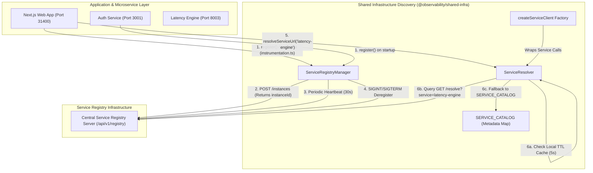
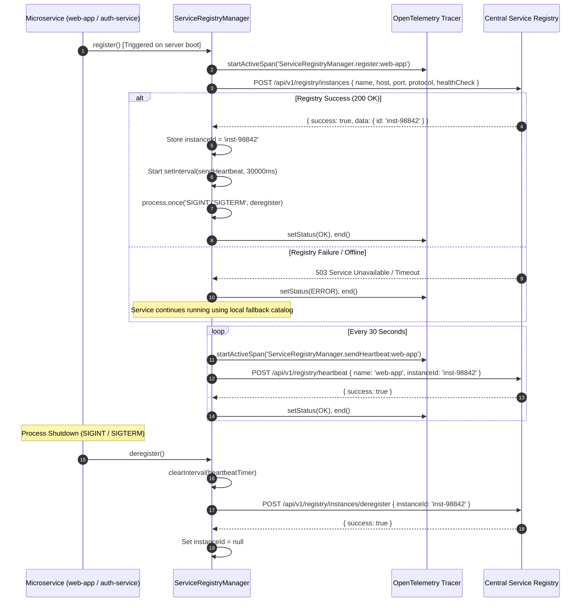
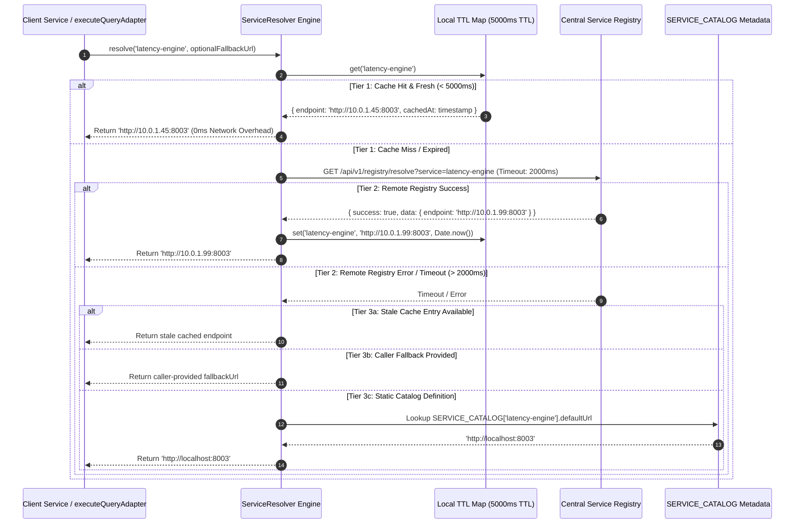
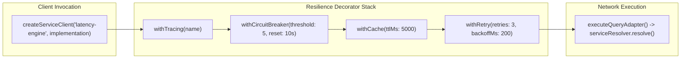

# ADR 0003: Dynamic Service Discovery, Registration Lifecycle, and Resilient Service Resolution Architecture

* **Status**: Accepted
* **Deciders**: Architecture Team, Core Infrastructure Working Group
* **Date**: 2026-09-04
* **Scope**: `@observability/shared-infra` (`packages/node/shared-infra/src/discovery`)

---

## 1. Context and Problem Statement

The LLM Observability Platform operates as a distributed multi-language microservice environment consisting of Next.js web applications, Node.js authentication services, Python analytics and latency engines, ClickHouse analytics nodes, and infrastructure components (Kafka, Redis, OpenTelemetry Collector).

Prior to this architectural enhancement, service-to-service communication suffered from systemic operational vulnerabilities:
1. **Static Hardcoded Endpoints**: Services relied on hardcoded URL strings (`http://localhost:8003`, `http://localhost:3001`), causing failures when services were deployed across dynamic container topologies, Kubernetes clusters, or non-default local ports.
2. **Brittle Failover & Zero Heartbeat Monitoring**: Services had no standardized mechanism to announce their presence, verify health, or dynamically unregister upon shutdown (`SIGINT`/`SIGTERM`), resulting in callers attempting HTTP RPCs against dead instances.
3. **High Resolution Latency**: Un-cached remote name resolution introduced unnecessary network overhead on every outbound microservice RPC call.
4. **Lack of Resilient Fallbacks**: If a central service registry or DNS service experienced downtime, all downstream inter-service calls immediately threw unhandled network exceptions, crashing client features.

We require a standardized, zero-dependency, highly resilient Service Discovery and Registration architecture within `@observability/shared-infra` that provides automatic service registration, periodic heartbeats, automated process shutdown unregistration, TTL-bounded in-memory caching, and a deterministic 3-tier fallback resolution cascade.

---

## 2. Decision Drivers & Core Engineering Principles

### 2.1 ASCII Decision Tree for Service Discovery & Registration Evaluation

```text
========================================================================================
       SERVICE DISCOVERY & REGISTRATION ENGINEERING DECISION TREE
========================================================================================

+-- [IF: Initializing Service Startup?]
|   +-- [YES] --> Is process running in Node.js runtime environment?
|   |             +-- [YES] --> EXECUTE: Auto-register instance via `webAppRegistryManager.register()`
|   |             +-- [NO]  --> SKIP: Non-Node execution environment
|   |
|   +-- [NO]  --> Continue evaluation below...
|
+-- [IF: Executing Service Instance Registration?]
|   +-- [YES] --> Does central registry return a valid `instanceId`?
|   |             +-- [YES] --> EXECUTE: Store `instanceId`, start 30s heartbeat interval, attach SIGINT/SIGTERM hooks
|   |             +-- [NO]  --> LOG & WARN: Log OpenTelemetry error span, fall back to default catalog
|   |
|   +-- [NO]  --> Continue evaluation below...
|
+-- [IF: Resolving Downstream Service Target Endpoint?]
|   +-- [YES] --> Is valid un-expired endpoint present in local TTL cache (TTL <= 5000ms)?
|   |             +-- [YES] --> CACHE HIT: Return cached URL immediately (0ms network cost)
|   |             +-- [NO]  --> CACHE MISS: Query central registry endpoint (`/api/v1/registry/resolve`)
|   |
|   +-- [NO]  --> Continue evaluation below...
|
+-- [IF: Remote Registry Query Fails or Times Out (> 2000ms)?]
|   +-- [YES] --> Execute Deterministic 3-Tier Fallback Cascade:
|   |             1. Return stale cached endpoint (if previously stored)
|   |             2. Return caller-provided `fallbackUrl`
|   |             3. Return static catalog default (`SERVICE_CATALOG[serviceName].defaultUrl`)
|   |             4. Return convention default (`http://localhost:<serviceName>`)
|   |
|   +-- [NO]  --> RETURN: Remote registry resolved endpoint URL
```

---

### 2.2 Detailed Principle Definitions & Operational Rationale

#### 1. Zero-Config Fallback Cascade (Graceful Degradation)
* **Definition**: Inter-service communication must never fail solely because the central discovery registry server is offline or unreachable. The system continuously cascades down to caller overrides, static catalog definitions, and local convention defaults.
* **Operational Rationale**: High-availability observability platforms must remain operational during infrastructure blips. If the discovery registry crashes, services must continue serving traffic using local fallback defaults.

#### 2. Non-Blocking Async Background Lifecycle Management
* **Definition**: Instance registration, heartbeat ping execution, and unregistration signals are handled asynchronously without blocking the main event loop or application boot sequence.
* **Operational Rationale**: Blocking service startup waiting for a discovery registry response increases cold-start latency and introduces cascading boot failures across the microservice fleet.

#### 3. TTL-Bounded In-Memory Resolution Caching
* **Definition**: Dynamic endpoint lookups are cached locally in memory for a configurable Time-To-Live (default: `5000ms`).
* **Operational Rationale**: Querying a central registry server on every microservice RPC adds 5–20ms of latency per hop and creates a thundering-herd bottleneck on the registry server. TTL caching achieves microsecond resolution times while picking up IP/port changes within 5 seconds.

#### 4. Fail-Fast Network Timeout Budgeting
* **Definition**: All remote resolution network requests are bound strictly to a 2000ms timeout window using an `AbortController`.
* **Operational Rationale**: Preventing hung network calls ensures that an unreachable registry server fails over to local fallbacks in under 2 seconds rather than hanging requests indefinitely.

#### 5. OpenTelemetry Span Propagation & Observability
* **Definition**: Every registration, heartbeat, unregistration, and resolution lookup is wrapped in a dedicated OpenTelemetry `CLIENT` span enriched with span attributes (`http.method`, `http.url`, `cache.hit`, `cache.key`).
* **Operational Rationale**: Gives platform engineers full visibility into inter-service routing latency, cache hit ratios, and registry health directly inside tracing tools.

---

## 3. Detailed Component Architecture & Specifications

The discovery system is partitioned into four core modules under `@observability/shared-infra/src/discovery`:

```text
packages/node/shared-infra/src/discovery/
├── catalog/
│   └── service-catalog.ts        # Declarative platform service metadata dictionary
├── registry-manager/
│   └── service-registry-manager.ts # Registration lifecycle manager (register, heartbeat, deregister)
├── engine/
│   ├── service-resolver.ts        # 3-tier resolution engine with TTL caching & fallbacks
│   └── service-client-factory.ts  # Resilient higher-order factory (tracing, circuit breaker, cache, retry)
├── requests/                      # DTO type contracts for HTTP registry payloads
└── responses/                     # DTO type contracts for HTTP registry responses
```

---

### 3.1 Declarative Service Catalog Specification

The `SERVICE_CATALOG` object ([`service-catalog.ts`](file:///home/btpl-lap-22/live/llm-observability-platform/packages/node/shared-infra/src/discovery/catalog/service-catalog.ts)) provides an immutable, centralized metadata registry for all platform services:

```typescript
export interface ServiceDefinition {
  name: string;
  defaultPort: number;
  protocol: string;
  defaultUrl: string;
  serviceSub: string;
  healthPath?: string;
}

export const SERVICE_CATALOG: Record<string, ServiceDefinition> = {
  "latency-engine": {
    name: "latency-engine",
    defaultPort: 8003,
    protocol: "http",
    defaultUrl: "http://localhost:8003",
    serviceSub: "latency-engine-service",
    healthPath: "/health",
  },
  "auth-service": {
    name: "auth-service",
    defaultPort: 3001,
    protocol: "http",
    defaultUrl: "http://localhost:3001",
    serviceSub: "auth-service",
    healthPath: "/health",
  },
  "web-app": {
    name: "web-app",
    defaultPort: 31400,
    protocol: "http",
    defaultUrl: "http://localhost:31400",
    serviceSub: "web-app-service",
    healthPath: "/api/health",
  },
  "clickhouse": {
    name: "clickhouse",
    defaultPort: 31421,
    protocol: "http",
    defaultUrl: "http://localhost:31421",
    serviceSub: "clickhouse-service",
    healthPath: "/ping",
  },
  "redis": {
    name: "redis",
    defaultPort: 31413,
    protocol: "tcp",
    defaultUrl: "redis://localhost:31413",
    serviceSub: "redis-service",
  },
  "kafka": {
    name: "kafka",
    defaultPort: 31414,
    protocol: "tcp",
    defaultUrl: "kafka://localhost:31414",
    serviceSub: "kafka-service",
  },
  "otel-collector": {
    name: "otel-collector",
    defaultPort: 31417,
    protocol: "http",
    defaultUrl: "http://localhost:31417",
    serviceSub: "otel-collector-service",
  },
} as const;
```

---

### 3.2 Service Registration Lifecycle Pseudocode Specification

The `ServiceRegistryManager` ([`service-registry-manager.ts`](file:///home/btpl-lap-22/live/llm-observability-platform/packages/node/shared-infra/src/discovery/registry-manager/service-registry-manager.ts)) governs instance registration, heartbeat loops, and graceful deregistration:

```typescript
/**
 * Master Pseudocode: Service Registration & Heartbeat Lifecycle
 */
CLASS ServiceRegistryManager:

  FUNCTION register():
    SPAN = tracer.startSpan("ServiceRegistryManager.register:" + this.name)
    TRY:
      payload = {
        name: this.name,
        host: this.host,
        port: this.port,
        protocol: this.protocol,
        healthCheck: { protocol: "http", path: "/api/health" }
      }

      response = AWAIT fetch(this.registryUrl + "/api/v1/registry/instances", {
        method: "POST",
        headers: this.buildHeaders(),
        body: JSON.stringify(payload)
      })

      IF response.ok AND response.json().success THEN:
        this.instanceId = response.json().data.id
        this.startHeartbeatTimer(intervalMs = 30000)
        this.attachShutdownHooks(["SIGINT", "SIGTERM"])
        SPAN.setStatus("OK")
      ELSE:
        SPAN.setStatus("ERROR", "Registration failed or missing instance ID")
      END IF
    CATCH error:
      SPAN.setStatus("ERROR", error.message)
    FINALLY:
      SPAN.end()
    END TRY

  FUNCTION sendHeartbeat():
    IF this.instanceId IS NULL THEN RETURN
    SPAN = tracer.startSpan("ServiceRegistryManager.sendHeartbeat:" + this.name)
    TRY:
      response = AWAIT fetch(this.registryUrl + "/api/v1/registry/heartbeat", {
        method: "POST",
        headers: this.buildHeaders(),
        body: JSON.stringify({ name: this.name, instanceId: this.instanceId })
      })
      SPAN.setStatus(response.ok ? "OK" : "ERROR")
    CATCH error:
      SPAN.setStatus("ERROR", error.message)
    FINALLY:
      SPAN.end()
    END TRY

  FUNCTION deregister():
    this.stopHeartbeatTimer()
    IF this.instanceId IS NULL THEN RETURN
    SPAN = tracer.startSpan("ServiceRegistryManager.deregister:" + this.name)
    TRY:
      AWAIT fetch(this.registryUrl + "/api/v1/registry/instances/deregister", {
        method: "POST",
        headers: this.buildHeaders(),
        body: JSON.stringify({ name: this.name, instanceId: this.instanceId })
      })
      this.instanceId = NULL
      SPAN.setStatus("OK")
    FINALLY:
      SPAN.end()
    END TRY
```

---

### 3.3 3-Tier Service Resolution Cascade Specification

The `ServiceResolver` ([`service-resolver.ts`](file:///home/btpl-lap-22/live/llm-observability-platform/packages/node/shared-infra/src/discovery/engine/service-resolver.ts)) resolves target service names to physical URLs using a deterministic sequence:

```typescript
/**
 * Master Pseudocode: 3-Tier Fallback Service Endpoint Resolution
 */
CLASS ServiceResolver:

  FUNCTION resolve(serviceName: string, fallbackUrl?: string) -> Promise<string>:
    SPAN = tracer.startSpan("ServiceResolver.resolve:" + serviceName)

    // TIER 1: In-Memory TTL Cache Check
    cachedEntry = this.cache.get(serviceName)
    IF cachedEntry AND (Date.now() - cachedEntry.cachedAt < 5000ms) THEN:
      SPAN.setAttribute("cache.hit", true)
      SPAN.setAttribute("http.url", cachedEntry.endpoint)
      SPAN.setStatus("OK")
      SPAN.end()
      RETURN cachedEntry.endpoint
    END IF

    // TIER 2: Remote Registry HTTP Query (Timeout Budget = 2000ms)
    SPAN.setAttribute("cache.hit", false)
    remoteEndpoint = AWAIT this.fetchRemoteEndpoint(serviceName, timeoutMs = 2000)

    IF remoteEndpoint IS NOT NULL THEN:
      this.cache.set(serviceName, { endpoint: remoteEndpoint, cachedAt: Date.now() })
      SPAN.setAttribute("http.url", remoteEndpoint)
      SPAN.setStatus("OK")
      SPAN.end()
      RETURN remoteEndpoint
    END IF

    // TIER 3: Deterministic Fallback Cascade
    resolvedUrl = cachedEntry?.endpoint 
               ?? fallbackUrl 
               ?? SERVICE_CATALOG[serviceName]?.defaultUrl 
               ?? ("http://localhost:" + serviceName)

    SPAN.setAttribute("http.url", resolvedUrl)
    SPAN.setStatus("OK")
    SPAN.end()
    RETURN resolvedUrl
```

---

## 4. High-Level Architecture (HLA)



---

## 5. Low-Level Architecture & Comprehensive Diagrams

### 5.1 Registration & Heartbeat Sequence Diagram



---

### 5.2 Service Resolution Fallback Cascade Sequence Diagram



---

### 5.3 Resilient Service Client Higher-Order Decorator Pipeline

When service clients are instantiated via `createServiceClient()` ([`service-client-factory.ts`](file:///home/btpl-lap-22/live/llm-observability-platform/packages/node/shared-infra/src/discovery/engine/service-client-factory.ts)), execution passes through a 4-tier higher-order decorator wrapper chain:



#### Resilience Layer Responsibilities:
1. **`withTracing`**: Wraps method invocations in OpenTelemetry spans, capturing trace parent contexts.
2. **`withCircuitBreaker`**: Fast-fails requests if consecutive failures exceed the threshold (default: 5 failures).
3. **`withCache`**: Memoizes idempotent query responses in memory for `5000ms`.
4. **`withRetry`**: Performs full-jitter exponential backoff retries (default: 3 attempts, 200ms initial backoff).

---

## 6. Framework & Application Integration

### 6.1 Next.js Lifecycle Hook Integration

The Next.js `web-app` package automatically registers its instance during Node.js server initialization via [`instrumentation.ts`](file:///home/btpl-lap-22/live/llm-observability-platform/packages/node/web-app/src/instrumentation.ts):

```typescript
// packages/node/web-app/src/instrumentation.ts
import { HTTP_CONSTANTS } from "@observability/shared-infra";
import { webAppRegistryManager } from "@/lib/service-registry/web-app-registration";

export async function register() {
  if (process.env[HTTP_CONSTANTS.ENV_NEXT_RUNTIME] === HTTP_CONSTANTS.RUNTIME_NODEJS) {
    await webAppRegistryManager.register();
  }
}
```

### 6.2 HTTP Client Adapter Integration

The shared HTTP client ([`http-client.ts`](file:///home/btpl-lap-22/live/llm-observability-platform/packages/node/shared-infra/src/http/http-client.ts)) automatically resolves service names via `serviceResolver.resolve()` before executing requests:

```typescript
export async function executeQueryAdapter<T>(
  baseUrlOrServiceName: string,
  endpoint: string,
  params: Record<string, string | number | undefined>,
  serviceSub: string,
  transformOps?: JsonMapOp[]
): Promise<T> {
  let resolvedBaseUrl = baseUrlOrServiceName;

  if (!baseUrlOrServiceName.startsWith("http://") && !baseUrlOrServiceName.startsWith("https://")) {
    resolvedBaseUrl = await serviceResolver.resolve(baseUrlOrServiceName);
  } else {
    const serviceName = serviceSub.replace(/-service$/, "");
    resolvedBaseUrl = await serviceResolver.resolve(serviceName, baseUrlOrServiceName);
  }

  const url = new URL(`${resolvedBaseUrl}${endpoint}`);
  // ... execute HTTP request
}
```

---

## 7. Verification & Test Coverage Matrix

### 7.1 Automated Test Suite & Coverage (100% Passing)

* **`SERVICE_CATALOG` Integrity**: Verified all 7 core platform services (`latency-engine`, `auth-service`, `web-app`, `clickhouse`, `redis`, `kafka`, `otel-collector`) possess default ports, protocols, and fallback URLs.
* **Registration & Heartbeat Execution**: Verified `ServiceRegistryManager.register()` issues valid POST requests, stores `instanceId`, starts `setInterval` heartbeat timers, and registers `SIGINT`/`SIGTERM` hooks.
* **Deregistration Signal Handling**: Verified process termination correctly clears heartbeat intervals and sends unregister POST payloads.
* **Resolver TTL Caching**: Verified memory cache returns target URLs under 1ms on cache hits without triggering remote HTTP queries.
* **3-Tier Fallback Cascade Verification**: Verified that when the remote registry fails or times out, resolution successfully falls back to cached endpoints, caller overrides, catalog defaults, and localhost conventions.
* **Resilience Decorator Integration**: Verified `createServiceClient()` correctly decorates calls with `withTracing`, `withCircuitBreaker`, `withCache`, and `withRetry`.
