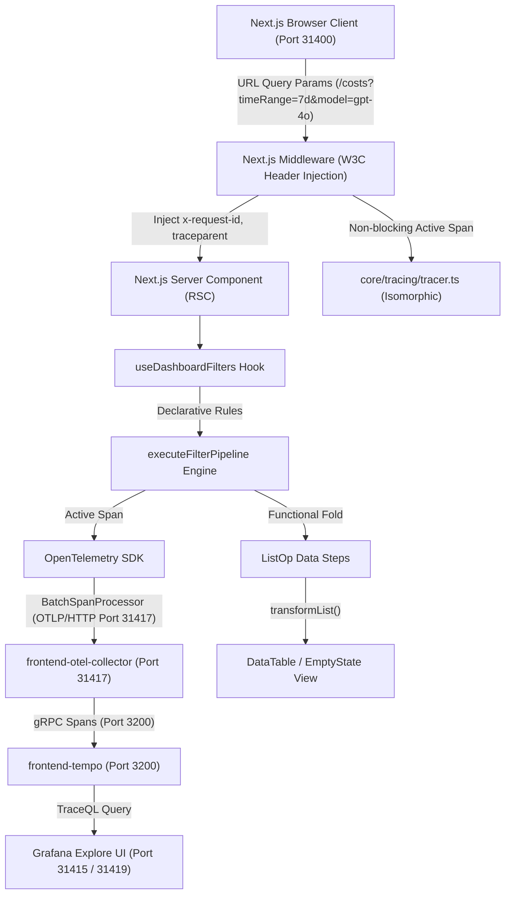
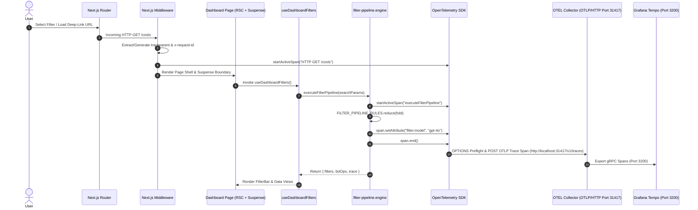

# ADR 0005: Deep-Linkable URL Filter Pipeline Engine & OpenTelemetry Web SDK Tracing

- **Status**: Accepted
- **Date**: 2026-08-23
- **Authors**: Web Architecture Team
- **Feature**: F-11 (Deep-Linkable URL Filters & Observability Tracing)

---

## 1. Context & Problem Statement

Observability dashboards (`/costs`, `/latency`, `/quality`, `/prompts`, `/traces`) require real-time state synchronization with URL query parameters (`timeRange`, `from`, `to`, `model`, `service`, `environment`) to support deep-linking, bookmarking, and team collaboration.

Prior implementations suffered from imperative loops, duplicated state handling across components, and lack of OpenTelemetry span propagation during client-side filter transformations and server-side Next.js route rendering (`/costs`, `/dashboard`, `/latency`).

---

## 2. Decision Drivers

1. **Pure Data-Driven Architecture**: Declarative filter rules table separate from evaluation engine logic.
2. **Functional Pipeline (Zero Loops)**: Use `reduce` (fold), `map`, and `filter` array transformations instead of imperative loops.
3. **Isomorphic OpenTelemetry Tracing**: Consolidated OpenTelemetry initialization inside `packages/node/web-app/src/core/tracing/tracer.ts`.
   - Client-side: WebTracerProvider pushing via `OTLPTraceExporter` to `http://localhost:31417/v1/traces`.
   - Server-side: Dynamically loads `@observability/shared-infra/tracing` Node.js provider for Next.js Server Components and Server Side Rendering (SSR).
4. **W3C Next.js Middleware Context Propagation**: Next.js `middleware.ts` extracts or generates W3C `traceparent`, `x-request-id`, `x-correlation-id`, and `tracestate`, setting headers on both incoming request and outgoing response pipelines.
5. **CORS & Preflight Compliance**: OpenTelemetry Collector configured with `cors.allowed_origins` to allow cross-origin span ingestion from Next.js dashboard origins (`http://localhost:31400`).
6. **Next.js 15 RSC & Suspense Safety**: Wrap `useSearchParams()` consumption inside `<Suspense>` boundaries to ensure server-side rendering (RSC) and client navigation stability.

---

## 3. Architectural Diagrams

### High-Level Architecture Diagram



### Low-Level Execution Sequence Diagram



---

## 4. End-to-End Function Call Stack (ASCII Tree)

```text
URL Query Param Update / Deep-Link Filter Execution Flow
└── User Selects Filter / Navigates to Deep Link (/costs?timeRange=7d&model=gpt-4o)
    └── 1. Next.js middleware.ts [packages/node/web-app/src/middleware.ts]
        ├── Extract or generate W3C header: traceparent: 00-5d9e2938ccbe46e47de4ec815fabe498-39eeb2f8db02fa22-01
        ├── Extract or generate header: x-request-id: req-clean-verify-777
        ├── Extract or generate header: x-correlation-id: corr-clean-verify-777
        ├── Attach headers to request & response pipelines
        └── Non-blocking background span: `HTTP GET /costs` via core/tracing/tracer.ts
            │
            └── 2. Next.js App Router (RSC + Client Boundary) [page.tsx]
                └── <Suspense> Boundary Wrapper [page.tsx]
                    └── DashboardContent Component [page.tsx]
                        └── useDashboardFilters() Hook [useDashboardFilters.ts]
                            │
                            ├── 3. executeFilterPipeline(searchParams) [filter-pipeline.engine.ts]
                            │   ├── OpenTelemetry Tracer.startActiveSpan('executeFilterPipeline') [tracer.ts]
                            │   │   ├── ATTR_SERVICE_NAME: 'web-app' [tracer.ts]
                            │   │   └── ATTR_SERVICE_VERSION: '0.1.0' [tracer.ts]
                            │   │
                            │   ├── FILTER_PIPELINE_RULES.reduce(fold) [filter-pipeline.rules.ts]
                            │   │   ├── processFilterRule('timeRange') -> '7d'
                            │   │   ├── processFilterRule('model') -> 'gpt-4o'
                            │   │   ├── processFilterRule('service') -> 'checkout-service'
                            │   │   └── processFilterRule('environment') -> 'production'
                            │   │
                            │   └── span.end() -> exports FilterPipelineTraceSpan { traceId, durationMs }
                            │
                            ├── 4. buildFilterListOps(filters) [filter-pipeline.engine.ts]
                            │   └── Transforms filters into ListOp[] declarative data steps
                            │
                            ├── 5. transformList(rows, listOps) [core/data-driven/list-transform.ts]
                            │   └── Functional reduce fold filtering rows with zero imperative loops
                            │
                            └── 6. OTLPTraceExporter -> BatchSpanProcessor -> OTEL Collector (http://localhost:31417/v1/traces)
                                └── gRPC -> Tempo:3200 -> Queryable in Grafana Explore via TraceQL
```

---

## 5. Consequences

### Positive
- **Deep-Linkable URL State**: Bookmarkable filter URLs across all dashboard pages.
- **Full End-to-End Tracing**: W3C `traceparent` and `x-request-id` propagated across Next.js SSR, RSC, and client-side filter executions into Grafana Tempo.
- **Clean Architecture**: 100% of tracing logic consolidated in `packages/node/web-app/src/core/tracing/tracer.ts` with zero root file clutter.
- **CORS Compliant**: Preflight OPTIONS requests handled seamlessly across cross-origin ports.
- **Zero Imperative Loops**: Clean functional pipeline using `reduce`, `map`, and `filter`.
- **RSC Stability**: Wrapped in `<Suspense>` boundaries to ensure Next.js 15 streaming support.

### Negative
- Requires client-side hydration for URL search parameter processing.
