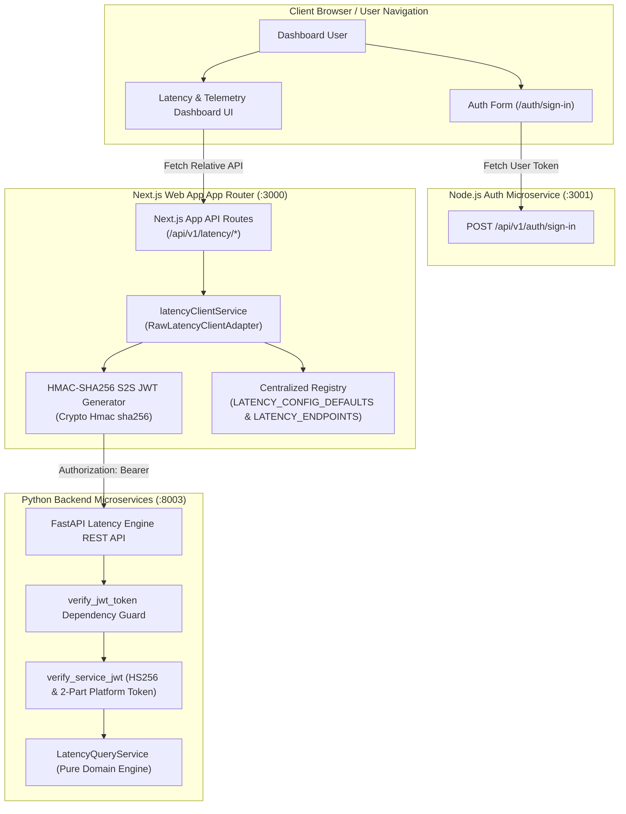
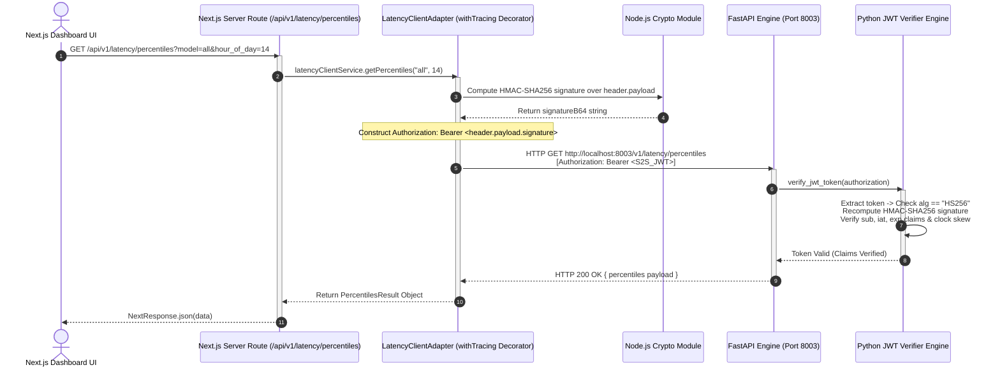
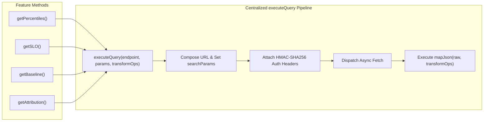

# ADR 0006: Web App Dashboard Integration with Telemetry SDK, Security Pipeline, and Event Cost Engine

| Field | Value |
| --- | --- |
| **ADR ID** | `ADR-NODE-WEB-APP-0006` |
| **Title** | Web App Dashboard Integration with Python Telemetry SDK, HMAC-SHA256 Security Pipeline, and Event Cost Engine |
| **Status** | **Accepted** |
| **Date** | 2026-08-25 (Updated: 2026-08-29) |
| **Scope** | Next.js Web App (`packages/node/web-app`), Telemetry SDK (`instrumentation-sdk`), Cost Engine (`event-cost`), Latency Engine (`latency-engine`) |

---

## 1. Context & Problem Statement

The `web-app` microservice provides the primary user-facing Next.js dashboard (`/costs`, `/traces`, `/latency`, `/quality`, `/prompts`). To render real-time observability metrics, cost breakdowns, and latency percentiles, `web-app` must interface with backend microservices (`latency-engine` on port `8003`, `instrumentation-sdk` on port `8000`, `auth` service on port `3001`).

We require a resilient, security-hardened, and data-driven client pipeline to:
1. Authenticate outgoing HTTP requests to Python microservices via HMAC-SHA256 Service-to-Service (S2S) Bearer JWT tokens.
2. Eliminate code repetition via a centralized, data-driven `executeQuery` pipeline.
3. Protect against microservice failures using decorator chains (`withTracing`, `withCircuitBreaker`, `withCache`, `withRetry`).

---

## 2. High-Level Design (HLD)

### 2.1 High-Level Architecture & Security Topology



---

## 3. Security Architecture & S2S Authentication (How Security Works)

### 3.1 HMAC-SHA256 S2S Token Generation
To prevent unauthorized API access, `latencyClientService` generates a valid standard 3-part HS256 JWT in `getAuthHeaders()` for every outgoing server-side request:

```typescript
private getAuthHeaders(): Record<string, string> {
  const secret = process.env.JWT_SECRET || LATENCY_CONFIG_DEFAULTS.DEFAULT_JWT_SECRET;
  const header = { alg: "HS256", typ: "JWT" };
  const now = Math.floor(Date.now() / 1000);
  const payload = {
    sub: LATENCY_CONFIG_DEFAULTS.DEFAULT_SERVICE_SUB,
    iat: now,
    exp: now + LATENCY_CONFIG_DEFAULTS.DEFAULT_JWT_EXPIRY_SECONDS,
  };

  const headerB64 = Buffer.from(JSON.stringify(header)).toString("base64url");
  const payloadB64 = Buffer.from(JSON.stringify(payload)).toString("base64url");
  const signingInput = `${headerB64}.${payloadB64}`;

  const signatureB64 = crypto
    .createHmac("sha256", secret)
    .update(signingInput)
    .digest("base64url");

  return {
    "Content-Type": "application/json",
    "Authorization": `Bearer ${signingInput}.${signatureB64}`,
  };
}
```

### 3.2 Security Authentication Sequence Diagram



---

## 4. Low-Level Design (LLD)

### 4.1 Data-Driven `executeQuery` Pipeline Flow



---

## 5. Decision Rationale & Consequences

### Positive Consequences
- **Security Hardening**: All service-to-service requests carry HMAC-SHA256 signed Bearer JWTs verified with clock-skew leeway.
- **Code Maintenance**: Code repetition is eliminated by delegating URL composition, header injection, status checking, and `mapJson` transformations to the centralized `executeQuery` pipeline.
- **Data-Driven Consistency**: All default parameters, endpoints, and timeouts are controlled via central registries (`LATENCY_CONFIG_DEFAULTS`, `LATENCY_ENDPOINTS`).

---

## 6. Review Trigger
Review implementation when external identity providers (Auth0 / OIDC) are introduced or when key rotation policies change.
