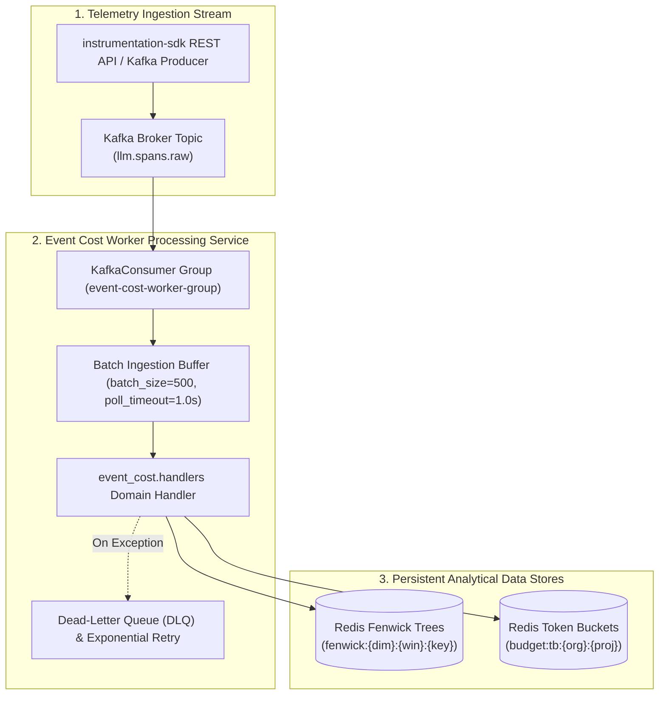
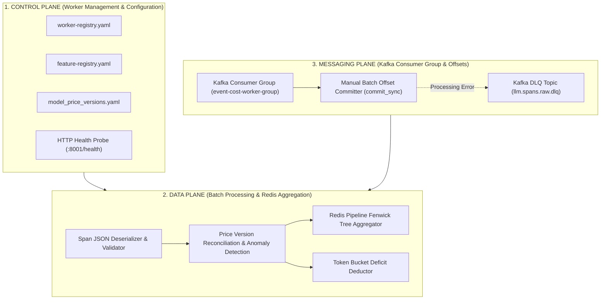
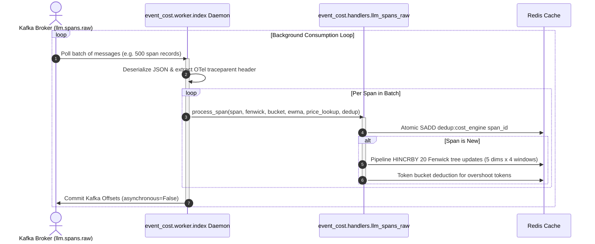

# ADR 0002: Asynchronous Kafka Event Cost Worker Processing and Persistence Pipeline

| Field | Value |
| --- | --- |
| **ADR ID** | `ADR-PYTHON-EVENT-COST-0002` |
| **Title** | Asynchronous Kafka Event Cost Worker Processing and Persistence Pipeline |
| **Status** | **Accepted** |
| **Date** | 2026-08-25 |
| **Scope** | Asynchronous Worker (`event_cost.worker`), Kafka Consumer (`llm.spans.raw`), Redis Fenwick & Token Bucket Aggregation (`event_cost.handlers`) |

---

## 1. Context & Problem Statement

High-volume production environments process thousands of LLM spans per second. Synchronous database writes during span ingestion introduce severe latency overhead to client application LLM calls. 

`event_cost.worker` decouples telemetry ingestion from application runtime by:
1. Consuming span events asynchronously from Kafka topic `llm.spans.raw` in batch groups.
2. Evaluating micro-USD costs and price version compliance via domain handlers (`event_cost.handlers.llm_spans_raw`).
3. Aggregating spend across 5 dimensions and 4 time windows in Redis Fenwick Trees and executing retroactive token bucket deductions.

---

## 2. High-Level Design (HLD)

### 2.1 High-Level Architecture Topology



### 2.2 Three-Plane Architectural Blueprint (Control, Data & Messaging)



---

## 3. Low-Level Design (LLD)

### 3.1 Sequence Diagram: Kafka Batch Ingestion & Redis Aggregation



### 3.2 Key Worker Call Contract (`src/event_cost/worker/index.py`)

```python
import logging
from event_cost.handlers.llm_spans_raw.index import process_batch
from event_cost.worker.config import load_config
from event_cost.worker.registry import build_registry

logger = logging.getLogger(__name__)

def main() -> None:
    config = load_config()
    redis_client = redis_lib.from_url(config.redis_url)
    ...
    build_registry(
        batch_handler=lambda spans: process_batch(
            spans, fenwick, bucket, ewma, price_lookup, dedup, metrics
        )
    )
    ...
```

---

## 4. End-to-End Call Stack Topology

```text
└── [Daemon Startup] event_cost/src/event_cost/worker/index.py :: main()
    ├── 1. Read configuration via event_cost.worker.config :: load_config()
    ├── 2. Initialize Redis adapters (RedisFenwickAdapter, RedisTokenBucketAdapter, RedisDedupAdapter)
    ├── 3. Initialize YamlPriceLookupAdapter(config.price_config_path) & PrometheusAdapter
    │
    └── 4. [Kafka Loop] event_cost/src/event_cost/worker/index.py :: _run_consumer_loop()
        ├── 5. consumer.consume(num_messages=500, timeout=1.0)
        │
        ├── 6. event_cost/src/event_cost/handlers/llm_spans_raw/index.py :: process_batch()
        │   ├── 7. Check idempotency: dedup.is_new(span_id)
        │   ├── 8. Build 20 Fenwick updates: handler.build_fenwick_updates(span)
        │   ├── 9. Pipeline updates to Redis: fenwick.pipeline_update(updates)
        │   ├── 10. Reconcile price version & log burn ratio against EWMA
        │   └── 11. Deduct token bucket overshoot if applicable
        │
        └── 12. consumer.commit(asynchronous=False) -> Acknowledge Kafka message batch
```

---

## 5. Decision Rationale & Consequences

### Positive Consequences
- **Asynchronous Execution**: Ingestion latency is $0\text{ms}$ on client application LLM calls since database writes run out-of-band in worker daemons.
- **Bulk Aggregation Throughput**: Redis pipelines execute 20 Fenwick updates per span concurrently without blocking worker execution.
- **Kafka Offset Safety**: `consumer.commit(asynchronous=False)` is only executed after Redis writes succeed or failed items are pushed to DLQ.
