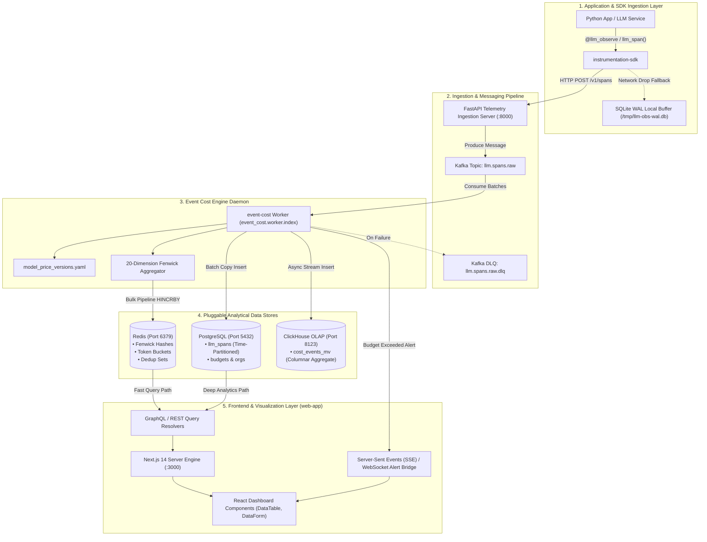
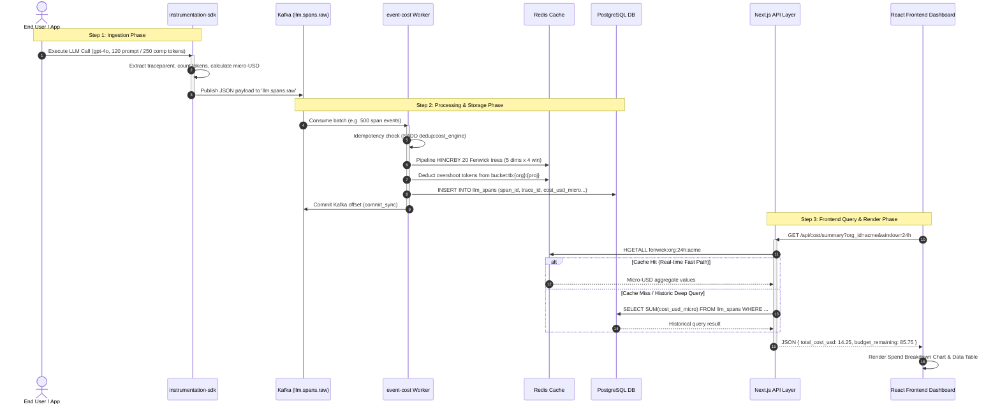

# ADR 0004: SDK Ingestion, Frontend Integration, and Analytical Database Schema Design

| Field | Value |
| --- | --- |
| **ADR ID** | `ADR-PYTHON-EVENT-COST-0004` |
| **Title** | SDK Ingestion, Frontend Integration, and Analytical Database Schema Design |
| **Status** | **Accepted** |
| **Date** | 2026-08-26 |
| **Scope** | Telemetry Ingestion (`instrumentation-sdk`), Frontend Integration (Next.js `web-app`), Analytical Database Schema (`PostgreSQL`, `ClickHouse`, `Redis`) |

---

## 1. Context & Problem Statement

To deliver complete end-to-end LLM cost observability, the `event-cost` engine must act as the central financial bridge between:
1. **Application Runtime (`instrumentation-sdk`)**: Capturing in-flight token usage, model identifiers, PII flags, and trace context with zero user-facing latency.
2. **Analytical Data Persistence Layer**: Storing high-throughput span events and cumulative spend aggregations across relational (`PostgreSQL`), OLAP (`ClickHouse`), and memory-cache (`Redis`) databases.
3. **User-Facing UI (`web-app`)**: Rendering real-time burn-rate dashboards, cost breakdown tables, budget threshold alerts, and anomaly reports.

This ADR defines the end-to-end integration specifications, data propagation topologies, database schemas, and frontend API contracts.

---

## 2. High-Level Design (HLD)

### 2.1 End-to-End System Topology



---

## 3. Low-Level Design (LLD)

### 3.1 Sequence Diagram: SDK Ingestion to Frontend Render



---

## 4. Database Schema Design

### 4.1 Redis Key Layout & Data Structures

Redis acts as the **real-time hot analytical cache** for instant sub-millisecond queries.

| Redis Key Pattern | Data Structure | Purpose / Operations | Expiration / Policy |
|---|---|---|---|
| `dedup:cost_engine` | `SET` | Deduplication set containing active `span_id` entries to guarantee idempotent processing. | `TTL = 3600s` (1 hour) |
| `fenwick:{dimension}:{window}:{key}` | `HASH` | Binary Indexed Tree (Fenwick Tree) cumulative cost sums. <br/>`dimension` $\in$ `{org, project, service, model, user}`<br/>`window` $\in$ `{1h, 24h, 7d, 30d}` | Persistent / Rolling window update |
| `budget:tb:{org_id}:{project_id}` | `STRING` | Atomic Token Bucket remaining balance (in micro-USD or remaining tokens). Evaluated via Lua script `TOKEN_BUCKET_DEDUCT_LUA`. | Persistent |
| `ewma:cost:{service}:{model}:{hour}` | `STRING` | Exponentially Weighted Moving Average baseline cost for anomaly burn-ratio evaluation. | `TTL = 604800s` (7 days) |

#### Fenwick Tree Lua Script (`FENWICK_UPDATE_LUA`)
```lua
local key = KEYS[1]
local delta = tonumber(ARGV[1])
local i = tonumber(ARGV[2])
local n = tonumber(ARGV[3])
while i <= n do
    redis.call('HINCRBY', key, tostring(i), delta)
    i = i + bit.band(i, -i)
end
return 1
```

---

### 4.2 PostgreSQL Relational Database Schema

PostgreSQL serves as the **durable, audit-compliant transactional analytical store**.

```sql
-- 1. Organizations & Projects Master Table
CREATE TABLE IF NOT EXISTS organizations (
    org_id VARCHAR(64) PRIMARY KEY,
    name VARCHAR(255) NOT NULL,
    created_at TIMESTAMPTZ DEFAULT CURRENT_TIMESTAMP
);

CREATE TABLE IF NOT EXISTS projects (
    project_id VARCHAR(64) NOT NULL,
    org_id VARCHAR(64) REFERENCES organizations(org_id) ON DELETE CASCADE,
    name VARCHAR(255) NOT NULL,
    created_at TIMESTAMPTZ DEFAULT CURRENT_TIMESTAMP,
    PRIMARY KEY (org_id, project_id)
);

-- 2. Budgets & Threshold Allocations
CREATE TABLE IF NOT EXISTS budgets (
    org_id VARCHAR(64) NOT NULL,
    project_id VARCHAR(64) NOT NULL DEFAULT '',
    budget_usd_micro BIGINT NOT NULL DEFAULT 0,
    spent_usd_micro BIGINT NOT NULL DEFAULT 0,
    alert_threshold_percent INT DEFAULT 80,
    updated_at TIMESTAMPTZ DEFAULT CURRENT_TIMESTAMP,
    PRIMARY KEY (org_id, project_id)
);

-- 3. Time-Partitioned LLM Spans Store
CREATE TABLE IF NOT EXISTS llm_spans (
    id BIGSERIAL,
    span_id VARCHAR(64) NOT NULL,
    trace_id VARCHAR(64) NOT NULL,
    org_id VARCHAR(64) NOT NULL,
    project_id VARCHAR(64) DEFAULT '',
    service_name VARCHAR(128) NOT NULL,
    model VARCHAR(128) NOT NULL,
    provider VARCHAR(64) NOT NULL,
    user_id VARCHAR(64) DEFAULT '',
    prompt_tokens INT NOT NULL DEFAULT 0,
    completion_tokens INT NOT NULL DEFAULT 0,
    estimated_tokens INT NOT NULL DEFAULT 0,
    cost_usd_micro BIGINT NOT NULL DEFAULT 0,
    price_version VARCHAR(32) NOT NULL DEFAULT 'v1.0',
    recorded_at TIMESTAMPTZ NOT NULL,
    created_at TIMESTAMPTZ DEFAULT CURRENT_TIMESTAMP,
    PRIMARY KEY (id, recorded_at)
) PARTITION BY RANGE (recorded_at);

-- Monthly Partitions
CREATE TABLE llm_spans_y2026m08 PARTITION OF llm_spans
    FOR VALUES FROM ('2026-08-01 00:00:00+00') TO ('2026-09-01 00:00:00+00');

-- Performance Indexes
CREATE UNIQUE INDEX idx_spans_id_time ON llm_spans(span_id, recorded_at);
CREATE INDEX idx_spans_org_project_time ON llm_spans(org_id, project_id, recorded_at DESC);
CREATE INDEX idx_spans_service_model ON llm_spans(service_name, model, recorded_at DESC);
```

---

### 4.3 ClickHouse OLAP Columnar Schema (High-Scale Analytics)

For environments processing over $10,000$ spans/sec, ClickHouse provides instant aggregation:

```sql
CREATE TABLE IF NOT EXISTS llm_spans_analytics (
    recorded_at DateTime64(3, 'UTC'),
    span_id String,
    trace_id String,
    org_id LowCardinality(String),
    project_id LowCardinality(String),
    service_name LowCardinality(String),
    model LowCardinality(String),
    provider LowCardinality(String),
    user_id String,
    prompt_tokens UInt32,
    completion_tokens UInt32,
    cost_usd_micro UInt64
) ENGINE = MergeTree()
PARTITION BY toYYYYMM(recorded_at)
ORDER BY (org_id, project_id, service_name, model, recorded_at);
```

---

## 5. Frontend Integration & API Specifications

The Next.js dashboard ([packages/node/web-app](file:///home/btpl-lap-22/live/llm-observability-platform/packages/node/web-app)) interacts with `event-cost` via server-side API routes and GraphQL resolvers.

### 5.1 Rest API Contracts

#### `GET /api/v1/cost/summary`
Returns real-time cumulative cost breakdown for a specific organization across dimensions.

**Query Parameters:**
* `org_id` (string, required)
* `window` (string: `1h`, `24h`, `7d`, `30d`)
* `group_by` (string: `model`, `service`, `project`)

**Response Payload (`200 OK`):**
```json
{
  "org_id": "acme-corp",
  "window": "24h",
  "total_cost_usd": 42.158,
  "total_cost_micro": 42158000,
  "budget_remaining_usd": 157.842,
  "budget_utilization_percent": 21.07,
  "breakdown": [
    {
      "dimension_key": "gpt-4o",
      "cost_usd": 28.100,
      "tokens": 2810000,
      "span_count": 1420
    },
    {
      "dimension_key": "claude-3-5-sonnet-20241022",
      "cost_usd": 14.058,
      "tokens": 937200,
      "span_count": 510
    }
  ]
}
```

#### `POST /api/v1/budgets`
Configures token/cost budget limits for an organization or project.

**Request Payload:**
```json
{
  "org_id": "acme-corp",
  "project_id": "recommendations-prod",
  "budget_usd": 500.00,
  "alert_threshold_percent": 85
}
```

---

### 5.2 Next.js Dashboard React Component Integration

The dashboard consumes `event-cost` data using schema-driven data tables and metric cards:

```tsx
// packages/node/web-app/app/(protected)/cost/page.tsx
import { useEffect, useState } from "react";
import { DataTable } from "@shared/ui/DataTable";

export default function CostAnalyticsDashboard() {
  const [summary, setSummary] = useState<any>(null);

  useEffect(() => {
    fetch("/api/v1/cost/summary?org_id=acme-corp&window=24h")
      .then((res) => res.json())
      .then((data) => setSummary(data));
  }, []);

  if (!summary) return <div>Loading cost analytics...</div>;

  return (
    <div className="p-6 space-y-6">
      <h1 className="text-2xl font-bold">LLM Cost & Budget Engine</h1>
      
      {/* Metric Cards */}
      <div className="grid grid-cols-3 gap-4">
        <div className="card">
          <h3>24h Total Spend</h3>
          <p className="text-xl font-mono">${summary.total_cost_usd.toFixed(3)}</p>
        </div>
        <div className="card">
          <h3>Budget Remaining</h3>
          <p className="text-xl font-mono">${summary.budget_remaining_usd.toFixed(2)}</p>
        </div>
        <div className="card">
          <h3>Utilization</h3>
          <p className="text-xl font-mono">{summary.budget_utilization_percent}%</p>
        </div>
      </div>

      {/* Model Breakdown Table */}
      <DataTable
        rows={summary.breakdown}
        schema={{
          name: "cost_breakdown",
          endpoint: "/api/v1/cost/summary",
          fields: [
            { key: "dimension_key", label: "Model / Dimension", kind: "text" },
            { key: "cost_usd", label: "Cost (USD)", kind: "number" },
            { key: "tokens", label: "Total Tokens", kind: "number" },
            { key: "span_count", label: "Spans", kind: "number" },
          ],
          validate: null as any,
        }}
      />
    </div>
  );
}
```

---

## 6. End-to-End Call Stack Topology

```text
└── [User Action / Browser] Navigates to Next.js /cost dashboard
    ├── 1. app/(protected)/cost/page.tsx :: useEffect() fetch("/api/v1/cost/summary")
    │   ├── 2. app/api/v1/cost/summary/route.ts :: GET()
    │   │   ├── 3. Redis Query: redis.hgetall("fenwick:org:24h:acme-corp")
    │   │   └── 4. Read token bucket: redis.get("budget:tb:acme-corp:")
    │   └── 5. Return JSON payload to React UI
    │
    └── [Background Streaming Pipeline] Client LLM Call -> Dashboard Sync
        ├── 6. Python App executing LLM call -> instrumentation-sdk @llm_observe
        ├── 7. SDK emits JSON span event -> Kafka topic `llm.spans.raw`
        ├── 8. event-cost worker (src/worker/index.py) consumes batch
        ├── 9. Redis Fenwick pipeline update + PostgreSQL time-partitioned insert
        └── 10. Real-time updates reflected on next dashboard poll / SSE trigger
```

---

## 7. Decision Rationale & Consequences

### Positive Consequences
- **Ultra-Fast UI Rendering**: Redis Fenwick Trees allow the frontend to render rolling spend totals for millions of spans in $<5\text{ms}$.
- **Complete Audit Trail**: Time-partitioned PostgreSQL storage preserves raw span records for compliance and historical breakdown.
- **Zero-Downtime Resilience**: Local SQLite WAL buffering ensures client SDK span emission never loses data even during Kafka or API server outages.
