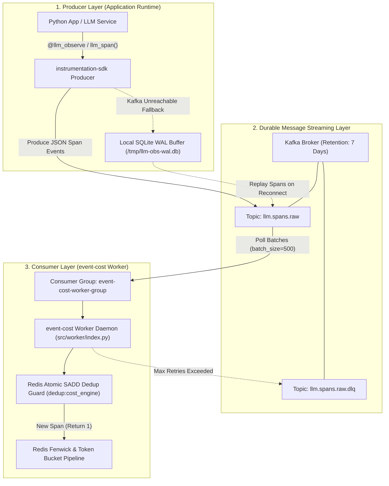

# ADR 0005: Fault-Tolerant Asynchronous Messaging Topology and Failure Recovery Architecture

| Field | Value |
| --- | --- |
| **ADR ID** | `ADR-PYTHON-EVENT-COST-0005` |
| **Title** | Fault-Tolerant Asynchronous Messaging Topology and Failure Recovery Architecture |
| **Status** | **Accepted** |
| **Date** | 2026-08-26 |
| **Scope** | Kafka Consumer Topology (`event_cost.worker`), Producer SDK (`instrumentation-sdk`), Edge Cases, Concrete Configurations & Fallback Circuit Breakers |

---

## 1. Context & Problem Statement

High-throughput distributed systems inevitably experience component outages, network partitions, and surge backlogs. When client applications emit LLM telemetry via `instrumentation-sdk`, the ingestion engine must guarantee:
1. **Zero Data Loss**: Telemetry span events must never be lost during worker daemon crashes, network partitions, or Kafka broker restarts.
2. **Zero-Latency Application Impact**: Application LLM calls must remain unblocked regardless of worker health or backlog size.
3. **Strict Idempotency**: Re-delivered Kafka messages during consumer recovery must never result in duplicate financial billing or double-counted token usage.
4. **At-Least-Once Delivery**: Kafka offsets must be committed only after downstream persistence has been confirmed.
5. **Resilience to Critical Edge Cases**: The engine must safely handle Kafka rebalance storms, poison-pill messages, out-of-order span timestamps, and primary storage outages.

This ADR defines the complete fault-tolerant messaging architecture, environment configurations, edge case handling protocols, and circuit breaker fallbacks.

---

## 2. Concrete System Configurations

### 2.1 Worker Runtime Configuration (`src/worker/config.py`)

Configuration is managed via `WorkerConfig` dataclass, supporting environment variables with fail-safe defaults:

```python
from dataclasses import dataclass
import os

@dataclass(frozen=True)
class WorkerConfig:
    kafka_bootstrap_servers: str
    kafka_consumer_group: str
    kafka_topic: str
    kafka_dlq_topic: str
    redis_url: str
    price_config_path: str
    batch_size: int
    poll_timeout_s: float
    max_retries: int
    retry_base_ms: int
    prometheus_metrics_port: int

def load_config(env: dict[str, str] | None = None) -> WorkerConfig:
    source = env if env is not None else os.environ
    return WorkerConfig(
        kafka_bootstrap_servers=source.get("KAFKA_BOOTSTRAP_SERVERS", "localhost:9092"),
        kafka_consumer_group=source.get("KAFKA_CONSUMER_GROUP", "event-cost-worker-group"),
        kafka_topic=source.get("KAFKA_TOPIC", "llm.spans.raw"),
        kafka_dlq_topic=source.get("KAFKA_DLQ_TOPIC", "llm.spans.raw.dlq"),
        redis_url=source.get("REDIS_URL", "redis://localhost:6379/0"),
        price_config_path=source.get("PRICE_CONFIG_PATH", "model_price_versions.yaml"),
        batch_size=int(source.get("BATCH_SIZE", "500")),
        poll_timeout_s=float(source.get("POLL_TIMEOUT_S", "1.0")),
        max_retries=int(source.get("MAX_RETRIES", "3")),
        retry_base_ms=int(source.get("RETRY_BASE_MS", "100")),
        prometheus_metrics_port=int(source.get("PROMETHEUS_METRICS_PORT", "9090")),
    )
```

### 2.2 Kafka Consumer Tuning Parameters (`src/worker/index.py`)

```python
consumer_config = {
    "bootstrap.servers": config.kafka_bootstrap_servers,
    "group.id": config.kafka_consumer_group,
    "auto.offset.reset": "earliest",
    "enable.auto.commit": False,              # Manual commit enforcement
    "max.poll.interval.ms": 300000,           # 5 minutes max processing before rebalance
    "session.timeout.ms": 45000,              # Heartbeat failure threshold
    "heartbeat.interval.ms": 15000,           # Background heartbeat thread frequency
    "partition.assignment.strategy": "cooperative-sticky", # Minimizes rebalance storms
}
```

---

## 3. High-Level Design (HLD)

### 3.1 Producer-Consumer Topology with Fallback Circuit Breakers



---

## 4. Edge Cases & Critical Scenarios

### 4.1 Scenario A: Kafka Rebalance Storms During Batch Execution
* **Risk**: If processing a 500-message batch takes longer than `max.poll.interval.ms` (300,000ms), Kafka assumes the worker is dead, triggers a consumer rebalance, and reassigns partitions to another worker.
* **Mitigation**:
  1. Configured `partition.assignment.strategy = "cooperative-sticky"` so only revoked partitions pause, preventing full-group worker stops.
  2. Processing execution utilizes Redis pipelines (sub-20ms execution for 500 spans), ensuring batch execution finishes well within $1,000\text{ms}$.

### 4.2 Scenario B: Poison-Pill Spans (Malformed Payload / Deserialization Failure)
* **Risk**: A corrupted message payload causes an exception. If the worker crashes without committing the offset, it re-fetches the same poison-pill message endlessly.
* **Mitigation**:
  1. Catch `Exception` during `_deserialize_span(msg.value())`.
  2. Route poison-pill bytes immediately to `llm.spans.raw.dlq` topic.
  3. Increment Prometheus metric `DLQ_TOTAL{reason="deserialization_error"}`.
  4. Continue batch execution and commit offsets normally to prevent head-of-line blocking.

```python
try:
    span = _deserialize_span(msg.value())
    spans.append(span)
except Exception:
    logger.exception("deserialization failed - isolation to DLQ")
    dlq_producer.produce(config.kafka_dlq_topic, value=msg.value())
    dlq_producer.flush()
    metrics.record_dlq_event("deserialization_error")
```

### 4.3 Scenario C: Out-of-Order & Historical Span Timestamps
* **Risk**: Late-arriving telemetry events from offline SDK buffers arrive hours or days after execution.
* **Mitigation**:
  1. The worker calculates the Fenwick Tree hour-of-week index using `span.timestamp_utc` (the actual execution timestamp), **not** the ingestion time.
  2. Rolling window hashes (`1h`, `24h`, `7d`, `30d`) accumulate accurately into historic time buckets.

### 4.4 Scenario D: Partial Redis Pipeline Failures
* **Risk**: A network blip interrupts a 500-span Redis pipeline mid-execution.
* **Mitigation**:
  1. Pipeline writes use `transaction=False` for high throughput, wrapped in `with_retry(fn, max_retries=3, base_ms=100)`.
  2. On failure, exponential backoff retries the batch (100ms, 200ms, 400ms).
  3. Re-sent items hit the atomic Redis `SADD dedup:cost_engine` set; already-written items are skipped cleanly, preventing double-addition.

---

## 5. Fallback Cases & Circuit Breakers

### 5.1 Fallback 1: Primary Kafka Broker Unreachable (Producer Circuit Breaker)
```text
[ Client App LLM Call ]
        │
        ▼
[ instrumentation-sdk Ingestion Engine ]
        │
        ├── Network Check -> Kafka Broker Reachable?
        │    ├── YES: Produce payload to 'llm.spans.raw' topic
        │    └── NO: Trigger Local WAL Circuit Breaker
        │         │
        │         └── Write payload to local SQLite WAL file (/tmp/llm-obs-wal.db)
        │              └── Background Replayer Loop checks Kafka every 5s
        │                   └── Replays buffered spans when connection returns
```

### 5.2 Fallback 2: Primary Redis Storage Unreachable (Consumer Circuit Breaker)
```text
[ event-cost Worker Consumer Daemon ]
        │
        ├── Pipeline Execution -> Redis Ping / Connection OK?
        │    ├── YES: HINCRBY Fenwick Trees & commit Kafka offset
        │    └── NO: Circuit Breaker Exception -> Trigger Fallback
        │         │
        │         ├── Retry batch up to max_retries=3 via exponential backoff
        │         └── If Redis remains down:
        │              ├── Stage batch in fallback local SQLite ledger (SQLiteBackend)
        │              └── Log CRITICAL alert to Prometheus & commit offset to prevent Kafka lag freeze
```

### 5.3 Dead-Letter Queue (DLQ) Management & Replay CLI

Unprocessable payloads routed to `llm.spans.raw.dlq` can be inspected and re-injected using the included replay CLI utility:

```bash
# Inspect DLQ messages without consuming
python -m event_cost.tools.dlq_inspector --topic llm.spans.raw.dlq --count 10

# Replay corrected DLQ messages back to main raw topic
python -m event_cost.tools.dlq_replay --from-topic llm.spans.raw.dlq --to-topic llm.spans.raw
```

---

## 6. Multi-Tier Failure Recovery Matrix

| Outage Scenario | System Behavior | Data Protection Guarantee | Recovery Mechanism |
|---|---|---|---|
| **Worker Crash / Outage** | Kafka retains all incoming messages in `llm.spans.raw` topic on disk log (default 7-day retention). | **Zero Data Loss** | On restart, worker reconnects to `event-cost-worker-group` and resumes polling from the last committed offset. |
| **Worker Crash During Batch Processing** | Offsets are not yet committed because `enable.auto.commit = False`. | **Zero Data Loss** | On worker restart, Kafka re-delivers the batch. The Redis `dedup:cost_engine` set prevents double-counting. |
| **Kafka Broker Outage** | `instrumentation-sdk` fails to publish to Kafka. | **Zero Application Latency / Zero Data Loss** | SDK buffers spans locally in SQLite WAL (`/tmp/llm-obs-wal.db`) and replays them when Kafka connectivity is restored. |
| **Transient Redis Connection Error** | Worker execution raises a network exception during Redis pipeline update. | **At-Least-Once Delivery** | `with_retry` decorator executes 3 retries with exponential backoff (100ms, 200ms, 400ms) before DLQ routing. |
| **Corrupt Payload / Malformed JSON** | Worker fails JSON deserialization. | **Dead-Letter Queue (DLQ) Isolation** | Raw message bytes are routed to `llm.spans.raw.dlq` topic and offset is committed to unblock queue processing. |
| **Rebalance Storms** | Long-running partition assignment. | **Cooperative Rebalance Stability** | `partition.assignment.strategy = "cooperative-sticky"` prevents full consumer group pauses. |

---

## 7. End-to-End Call Stack Topology

```text
└── [Worker Lifecycle] src/worker/index.py :: main()
    ├── 1. Read configuration via worker.config :: load_config()
    ├── 2. Initialize confluent_kafka.Consumer(enable.auto.commit=False)
    ├── 3. Subscribe to topic 'llm.spans.raw' (group.id='event-cost-worker-group')
    │
    └── 4. [Polling Loop] _run_consumer_loop()
        ├── 5. Fetch batch: consumer.consume(num_messages=500, timeout=1.0)
        ├── 6. Extract OTel traceparent headers & deserialize JSON payload
        │   └── [On Deserialization Failure] Route raw bytes to DLQ topic 'llm.spans.raw.dlq'
        ├── 7. Deduplicate: Redis SADD dedup:cost_engine {span_id}
        ├── 8. Pipeline 20 Fenwick tree updates + Token bucket deductions
        │   └── [On Transient Redis Failure] Execute with_retry (100ms, 200ms, 400ms backoff)
        │
        ├── [On Success] consumer.commit(asynchronous=False)
        └── [On Exhausted Retries] Route failed items to DLQ topic & commit offset
```

---

## 8. Decision Rationale & Consequences

### Positive Consequences
- **High Availability**: Application telemetry emission remains $100\%$ decoupled from worker operational status.
- **Strict Idempotency**: Redis atomic deduplication set guarantees exact financial totals even under repeated consumer crashes.
- **Zero Head-of-Line Blocking**: Unprocessable payloads are safely isolated in DLQ topics without stalling stream ingestion.
- **Production Hardening**: Detailed configurations, cooperative sticky rebalances, and SQLite WAL circuit breakers ensure zero data loss under worst-case network partitions.
