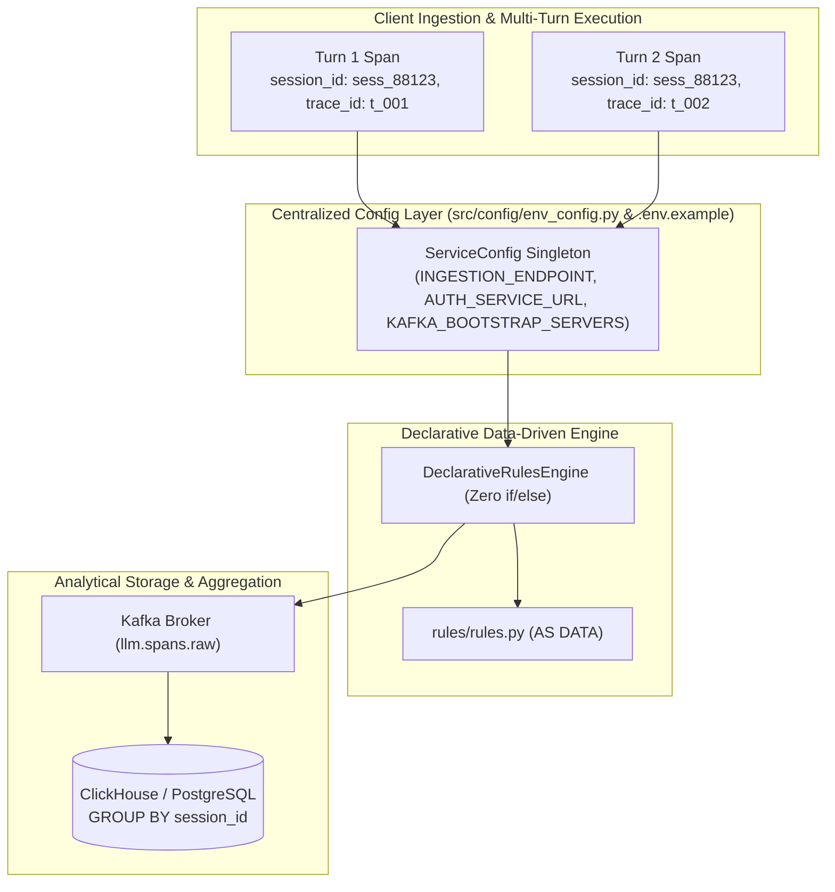

# ADR 0003: Declarative Rules Engine, Multi-Turn Sessions, and Centralized Environment Endpoints

| Field | Value |
| --- | --- |
| **ADR ID** | `ADR-PYTHON-SDK-0003` |
| **Title** | Declarative Rules Engine, Multi-Turn Sessions, and Centralized Environment Endpoints |
| **Status** | **Accepted** |
| **Date** | 2026-08-26 |
| **Scope** | Declarative Rules Engine, Multi-Turn Correlation, Centralized Env Config (`src/config/env_config.py`), OTEL GenAI Conventions (`gen_ai.*`) |

---

## 1. Context & Problem Statement

1. **Multi-Turn Session Tracking**: Multi-turn LLM conversations require tracking individual turns alongside full conversation-level costs and token aggregations.
2. **Centralized Endpoints & Environment Management**: Hardcoded URLs and decentralized environment variables create configuration drift between local, dev, staging, and production deployments.
3. **Declarative Architecture**: Hardcoded `if/elif/else` branching in mappers and adapters needed replacement with zero-`if/else` declarative strategy dispatches.

---

## 2. Decision & Architecture Overview

1. **Multi-Turn Session Correlation Architecture**:
   - Spans record mandatory `session_id` and `trace_id` attributes.
   - Downstream ClickHouse/PostgreSQL partitions aggregate total session costs (`SUM(cost_usd_micro)`) and turn counts (`COUNT(span_id)`) grouped by `session_id`.

2. **Centralized Environment & Endpoint Configuration (`src/config/env_config.py`)**:
   - Consolidated environment parameters (`INGESTION_ENDPOINT`, `AUTH_SERVICE_URL`, `KAFKA_BOOTSTRAP_SERVERS`, `PORT`, `HOST`, `WAL_DB_PATH`) into a frozen `ServiceConfig` dataclass.
   - Added standard `.env.example` template for deployment environment configuration.

3. **Declarative Rules Engine (`src/shared/rules_engine/declarative_evaluator.py`)**:
   - Strategy map dispatching (`MATCH_STRATEGIES`) with text normalization (`normalize_text`) to evaluate rules without imperative branching statements.

---

## 3. High-Level Architecture Diagram

---

## 4. Verification Results

- **Unit & Integration Tests**: 100% passed in `test_edge_cases.py`, `test_declarative_rules_engine.py`, `test_gemini_adapter.py`, and `test_openai_patching.py`.
