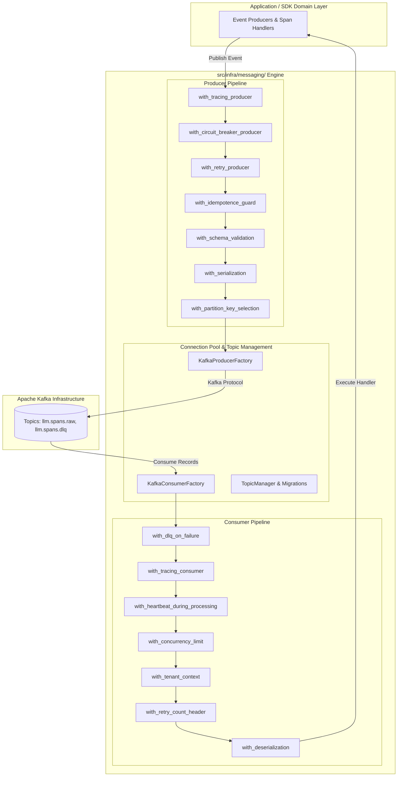
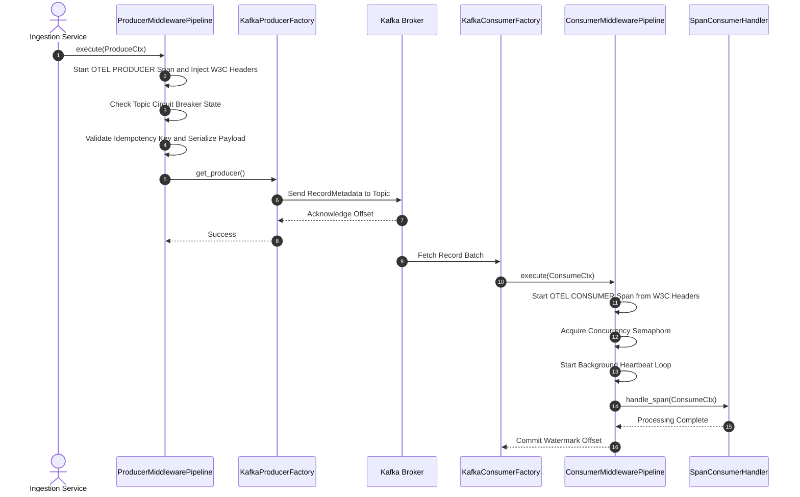

# ADR 0004: Consolidated Kafka Messaging Infrastructure, Middleware Pipeline Architecture, and CQRS Event Stream

| Field | Value |
| --- | --- |
| **ADR ID** | `ADR-PYTHON-SDK-0004` |
| **Title** | Consolidated Kafka Messaging Infrastructure, Middleware Pipeline Architecture, and CQRS Event Stream |
| **Status** | **Accepted** |
| **Date** | 2026-08-26 |
| **Scope** | `src/infra/messaging/` (`broker`, `producer`, `consumer`, `middleware`, `topics`, `migrations`, `reporters`, `tracing`), W3C Context Propagation, DLQ Routing, CQRS Projections, and Package Structure Policy |

---

## 1. Context & Problem Statement

1. **Decentralized Messaging Components**: Previously, Kafka connection creation, producer/consumer factories, and topic configuration were scattered across separate modules, risking connection pool leaks and uncoordinated broker settings.
2. **Lack of Standardized Middleware Pipelines**: Outbound event publishes and inbound message processing lacked unified resilience decorators (tracing, circuit breaking, deadline retries, idempotency deduplication, DLQ error routing, worker concurrency limits, and rebalance heartbeats).
3. **DRY Architecture Enforcement**: Features needed a centralized, pre-built messaging engine so that no individual feature duplicates broker configuration, serialization, or error handling.

---

## 2. Decision & Architecture Overview

1. **Consolidated Messaging Hierarchy (`src/infra/messaging/`)**:
   - **`broker/`**: `KafkaBrokerConfig` singleton managing bootstrap servers, SASL/SSL credentials, acks, linger, compression, and retries.
   - **`producer/`**: Thread-safe `KafkaProducerFactory` (singleton connection pool) and `KafkaProducerClient`.
   - **`consumer/`**: `KafkaConsumerFactory`, `KafkaConsumerClient`, `SpanConsumerHandler`, and `CQRS` append-only projections & query selectors (`consumer/cqrs/`).
   - **`middleware/`**: Generic, language-agnostic pipeline execution engine (`pipeline.py`, `producer_middleware.py`, `consumer_middleware.py`, `tracing_middleware.py`).
   - **`topics/`**: Declarative topic provisioner (`topic_provisioner.py`) and central manager (`topic_manager.py`).
   - **`migrations/`**: Topic schema and partition migration manager (`kafka_topic_migration.py`).
   - **`reporters/`**: `KafkaSpanReporter` for telemetry span exporting.
   - **`tracing/`**: `MessagingTracer` for W3C `traceparent` context injection/extraction and OpenTelemetry `PRODUCER`/`CONSUMER` spans.

2. **Producer & Consumer Middleware Execution Engine**:
   - **Producer Chain**: `with_tracing_producer` $\rightarrow$ `with_circuit_breaker_producer` $\rightarrow$ `with_retry_producer` $\rightarrow$ `with_idempotence_guard` $\rightarrow$ `with_schema_validation` $\rightarrow$ `with_serialization` $\rightarrow$ `with_partition_key_selection`.
   - **Consumer Chain**: `with_dlq_on_failure` $\rightarrow$ `with_tracing_consumer` $\rightarrow$ `with_heartbeat_during_processing` $\rightarrow$ `with_concurrency_limit` $\rightarrow$ `with_tenant_context` $\rightarrow$ `with_retry_count_header` $\rightarrow$ `with_deserialization` $\rightarrow$ Domain Handler Execution.

3. **Policy Alignment**:
   - Updated universal package structure policy in `policies/rules/folderStructure/package-structure.md` with Core Rule #2 (DRY Guardrail) enforcing zero code repetition across messaging components.

---

## 3. High-Level Architecture Diagram

---

## 4. End-to-End Sequence Diagram

---

## 5. Verification Results

- **Unit Tests**: Passed 100% in `tests/unit/infra/messaging/test_messaging_middleware.py`.
- **Pipeline Integrity**: Verified circuit breaker trip recovery, DLQ routing on poison payloads, and W3C traceparent propagation.
