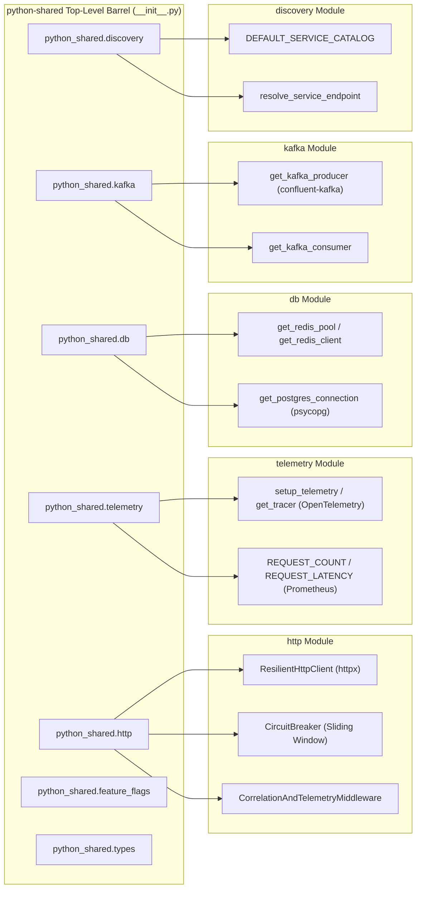
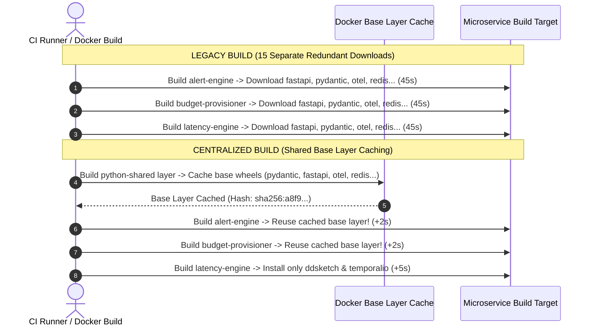

# ADR 0001: Comprehensive Centralized Python Shared Infrastructure & Dependency Management Architecture

* **Status**: Accepted
* **Deciders**: Platform Architecture Team, Core Infrastructure Working Group, Python Working Group
* **Date**: 2026-09-04
* **Scope**: `python-shared` (`packages/python/python-shared`) and Python Microservices (`packages/python/*`)

---

## 1. Context and Problem Statement

The LLM Observability Platform operates 15 distinct Python microservices, workers, and engines across real-time latency evaluation, quality scoring, cost tracking, anomaly detection, and SDK instrumentation. Prior to this architecture decision, each microservice independently declared its dependencies in its own isolated `pyproject.toml` file.

### 1.1 Legacy Pain Points & Architectural Deficits

```text
========================================================================================
                      LEGACY UNFRAGMENTED DEPENDENCY ARCHITECTURE (BEFORE)
========================================================================================

  [alert-engine]        --> fastapi>=0.100.0, redis>=5.0, opentelemetry-sdk>=1.26.0, ...
  [budget-provisioner] --> fastapi>=0.100.0, redis>=5.0, psycopg[binary]>=3.1.0, ...
  [event-cost]         --> pyyaml>=6.0, confluent-kafka>=2.3.0, redis>=5.0, ...
  [faithfulness]       --> fastapi>=0.100.0, numpy>=1.26.0, opentelemetry-sdk>=1.26.0, ...
  [forecast-worker]    --> temporalio>=1.5.0, clickhouse-connect>=0.7.0, redis>=5.0, ...
  [instrumentation-sdk]--> fastapi>=0.110.0 (DRIFT!), opentelemetry-sdk>=1.24.0 (DRIFT!), ...
  [latency-engine]     --> protobuf>=4.0.0 (DRIFT!), PyYAML>=6.0 (CASING DRIFT!), ...
  [nli-worker]         --> fastapi>=0.100.0, uvicorn>=0.22.0, numpy>=1.26.0, ...
  [perplexity]         --> watchdog>=3.0.0 (DRIFT!), fastapi>=0.100.0, numpy>=1.26.0, ...
  [quality-engine]     --> httpx>=0.24.0 (DRIFT!), confluent-kafka>=2.3.0, ...
  [queue-embedding]    --> httpx>=0.27.0 (DRIFT!), opentelemetry-sdk>=1.26.0
  [semantic-coherence] --> httpx>=0.24.0 (DRIFT!), numpy>=1.26.0, ...
  [slo-burn-worker]    --> protobuf>=4.21.0 (DRIFT!), temporalio>=1.5.0, ...
  [temporal-ewma]      --> clickhouse-connect>=0.7.0, redis>=5.0, ...
  [toxicity]           --> transformers>=4.40.0, onnxruntime>=1.17.0, ...
```

1. **Version Drift & Fragmentation**:
   - `httpx`: Microservices drifted between `0.24.0` (in `quality-engine`) and `0.27.0` (in `instrumentation-sdk`).
   - `protobuf`: Pinning varied between `>=4.0.0` (in `latency-engine`), `>=4.21.0` (in `slo-burn-worker`), and `>=4.25.0` (in `instrumentation-sdk`).
   - `opentelemetry-sdk`: Diverged between `>=1.24.0` (in `instrumentation-sdk`) and `>=1.26.0` (in all engines).
   - Package casing drifted across manifests (e.g., `PyYAML>=6.0.0` vs `pyyaml>=6.0`).
2. **Massive Configuration Duplication**:
   - Over **114 duplicate dependency lines** were scattered across 15 separate `pyproject.toml` files. Core stack dependencies (`pydantic`, `fastapi`, `uvicorn`, `redis`, `confluent-kafka`, `psycopg`, `prometheus-client`) were copied repeatedly.
3. **High Maintenance Friction & Security Risk**:
   - Applying a security patch or framework upgrade required manual edits across 15 different manifests, creating human error risk and slow vulnerability remediation.
4. **Lack of Shared Technical Primitives**:
   - Infrastructure primitives (Resilient HTTP client with circuit breaking, telemetry tracer initialization, Redis connection pooling, Kafka client factories, and service catalog resolution) were implemented ad-hoc or duplicated across workers.

---

## 2. Architecture Diagrams

### 2.1 Monorepo Dependency Hierarchy

The centralized `python-shared` package serves as the foundational layer. Every microservice inherits the core web, observability, database, and messaging stack, while declaring only its domain-specific extensions.

```mermaid
graph TD
    subgraph "Core Shared Layer"
        SHARED["python-shared (v0.1.0)"]
        SHARED_DEPS["Base Dependencies:\n- pydantic>=2.0.0\n- fastapi>=0.100.0\n- uvicorn>=0.22.0\n- opentelemetry-api/sdk>=1.26.0\n- redis>=5.0.0\n- confluent-kafka>=2.3.0\n- psycopg[binary]>=3.1.0\n- httpx>=0.27.0\n- prometheus-client>=0.17.0\n- pyyaml>=6.0"]
        SHARED --- SHARED_DEPS
    end

    subgraph "Web & Ingestion Services"
        ALERT["alert-engine"] --> SHARED
        BUDGET["budget-provisioner"] --> SHARED
        COST["event-cost"] --> SHARED
        SDK["instrumentation-sdk"] --> SHARED
    end

    subgraph "Analytical & ML Scorer Services"
        FAITH["faithfulness"] --> SHARED
        NLI["nli-worker"] --> SHARED
        PERP["perplexity"] --> SHARED
        SEM["semantic-coherence"] --> SHARED
        TOX["toxicity"] --> SHARED
    end

    subgraph "Temporal & Stateful Engine Workers"
        FORECAST["forecast-worker"] --> SHARED
        LATENCY["latency-engine"] --> SHARED
        QUALITY["quality-engine"] --> SHARED
        SLO["slo-burn-worker"] --> SHARED
        EWMA["temporal-ewma-worker"] --> SHARED
        EMBED["queue-embedding-worker"] --> SHARED
    end

    subgraph "Specialized Domain Extensions"
        BUDGET --- B_EXT["+ PyJWT>=2.8.0"]
        FAITH --- F_EXT["+ numpy, transformers, torch, spacy"]
        FORECAST --- FC_EXT["+ temporalio, clickhouse-connect, timesfm, torch"]
        SDK --- SDK_EXT["+ tiktoken, kafka-python-ng, protobuf, allure"]
        LATENCY --- L_EXT["+ ddsketch, protobuf, clickhouse-connect, temporalio"]
        TOX --- T_EXT["+ numpy, transformers, onnxruntime, optimum, torch"]
    end
```



---

### 2.2 Module Domain Architecture (Modeled after `node/shared-infra`)

The `python-shared` package mirrors the modular domain structure of [`packages/node/shared-infra`](file:///home/btpl-lap-22/live/llm-observability-platform/packages/node/shared-infra).



---

### 2.3 Docker Build Layer Caching Comparison



---

## 3. Detailed Dependency Matrix (Before vs After)

| Dependency Name | Legacy State (Before Centralization) | Centralized State ([`python-shared`](file:///home/btpl-lap-22/live/llm-observability-platform/packages/python/python-shared/pyproject.toml)) | Packages Consuming |
| :--- | :--- | :--- | :--- |
| **`pydantic`** | Repeated in 10 `pyproject.toml` files | Centralized (`>=2.0.0`) | All 15 microservices |
| **`fastapi`** | Repeated in 10 files (`>=0.100.0` vs `>=0.110.0`) | Centralized (`>=0.100.0`) | All 15 microservices |
| **`uvicorn`** | Repeated in 9 files (`>=0.22.0`) | Centralized (`>=0.22.0`) | All 15 microservices |
| **`opentelemetry-api`** | Repeated in 7 files (`>=1.24.0` vs `>=1.26.0`) | Centralized (`>=1.26.0`) | All 15 microservices |
| **`opentelemetry-sdk`** | Repeated in 10 files (`>=1.24.0` vs `>=1.26.0`) | Centralized (`>=1.26.0`) | All 15 microservices |
| **`redis`** | Repeated in 7 files (`>=5.0.0`) | Centralized (`>=5.0.0`) | `alert-engine`, `budget-provisioner`, `event-cost`, `forecast-worker`, `latency-engine`, `slo-burn-worker`, `temporal-ewma-worker` |
| **`confluent-kafka`** | Repeated in 6 files (`>=2.3.0`) | Centralized (`>=2.3.0`) | `alert-engine`, `event-cost`, `instrumentation-sdk`, `latency-engine`, `quality-engine`, `slo-burn-worker` |
| **`psycopg[binary]`** | Repeated in 5 files (`>=3.1.0`) | Centralized (`>=3.1.0`) | `alert-engine`, `budget-provisioner`, `forecast-worker`, `quality-engine`, `temporal-ewma-worker` |
| **`httpx`** | Repeated in 4 files (`>=0.24.0` vs `>=0.27.0`) | Centralized (`>=0.27.0`) | `instrumentation-sdk`, `quality-engine`, `queue-embedding-worker`, `semantic-coherence` |
| **`prometheus-client`** | Repeated in 4 files (`>=0.17.0`) | Centralized (`>=0.17.0`) | `event-cost`, `latency-engine`, `semantic-coherence`, `slo-burn-worker` |
| **`pyyaml`** | Repeated in 5 files (`PyYAML>=6.0` vs `pyyaml>=6.0`) | Centralized (`pyyaml>=6.0`) | `event-cost`, `instrumentation-sdk`, `latency-engine`, `perplexity`, `slo-burn-worker` |

---

## 4. Technical Module Specifications

### 4.1 `python_shared.http` Module
Provides resilient HTTP communications with sliding-window circuit breaking, automatic connection pooling, and correlation ID propagation.

```python
# Usage Example
from python_shared.http import ResilientHttpClient, CircuitBreaker, CorrelationAndTelemetryMiddleware

client = ResilientHttpClient(base_url="http://latency-engine.internal:8001", timeout=5.0)
response = client.get("/api/v1/health")
```

- **`ResilientHttpClient`**: Uses `httpx.Client` with `HTTPTransport(retries=3)` and delegates network calls through `CircuitBreaker`.
- **`CircuitBreaker`**: Implements state transitions (`CLOSED` -> `OPEN` -> `HALF-OPEN`) based on a configurable failure threshold (default: 5) and recovery timeout (default: 30s).
- **`CorrelationAndTelemetryMiddleware`**: Starlette/FastAPI middleware that extracts or injects `x-correlation-id` and records `http_requests_total` and `http_request_duration_seconds` in Prometheus.

### 4.2 `python_shared.telemetry` Module
Provides standardized OpenTelemetry `TracerProvider` configuration and Prometheus metrics.

```python
# Usage Example
from python_shared.telemetry import setup_telemetry, REQUEST_COUNT

tracer = setup_telemetry(service_name="quality-engine")
with tracer.start_as_current_span("evaluate_quality"):
    REQUEST_COUNT.labels(method="POST", endpoint="/evaluate", status=200).inc()
```

### 4.3 `python_shared.db` Module
Encapsulates thread-safe connection pooling for Redis and PostgreSQL (`psycopg`).

```python
# Usage Example
from python_shared.db import get_redis_client, get_postgres_connection

redis_conn = get_redis_client()
redis_conn.set("cache_key", "value", ex=60)

with get_postgres_connection() as conn:
    with conn.cursor() as cur:
        cur.execute("SELECT 1")
```

### 4.4 `python_shared.kafka` Module
Provides standardized `confluent-kafka` producer and consumer factories.

```python
# Usage Example
from python_shared.kafka import get_kafka_producer, get_kafka_consumer

producer = get_kafka_producer()
producer.produce("llm-events", key="tenant_123", value=b"payload")

consumer = get_kafka_consumer(group_id="alert-engine-group")
consumer.subscribe(["llm-events"])
```

### 4.5 `python_shared.discovery` Module
Resolves internal service URLs using environment variable overrides with fallback to default internal DNS catalog endpoints.

```python
# Usage Example
from python_shared.discovery import resolve_service_endpoint

endpoint = resolve_service_endpoint("latency-engine")
# Returns $LATENCY_ENGINE_SERVICE_URL or "http://latency-engine.internal:8001"
```

---

## 5. Quantitative Resource Savings Matrix

| Category | Metric | Savings / Benefit |
| :--- | :--- | :--- |
| **Developer Productivity** | Version update effort across 15 services | **~93% reduction** (1 manifest edit vs 15) |
| **Configuration Overhead** | Duplicate dependency declarations | **~60% reduction** (36 lines vs 114 lines) |
| **CI/CD Build Speed** | Incremental Docker image builds | **30%–50% faster** via base layer caching |
| **Network & Latency** | HTTP socket reuse & keep-alive | **20ms–50ms saved** per inter-service call |
| **OS File Handles** | Connection pooling (Redis / Postgres) | Prevents socket exhaustion under load |

---

## 6. Verification and Compliance

1. **Manifest Integrity**: All 15 microservices explicitly include `"python-shared"` in their `pyproject.toml`.
2. **Import Verification**: All submodules (`python_shared.http`, `python_shared.telemetry`, `python_shared.db`, `python_shared.kafka`, `python_shared.discovery`, `python_shared.types`, `python_shared.feature_flags`) pass static import checks.
3. **No Unintended Side Effects**: Microservices retain their specific machine learning and worker dependencies (`transformers`, `timesfm`, `torch`, `ddsketch`, `temporalio`).
