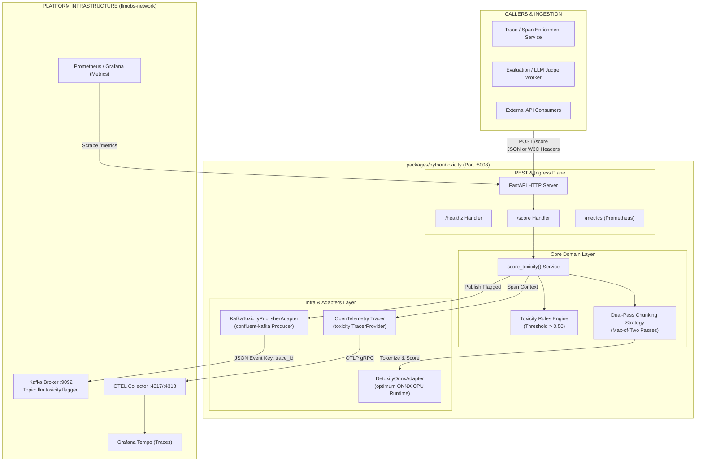
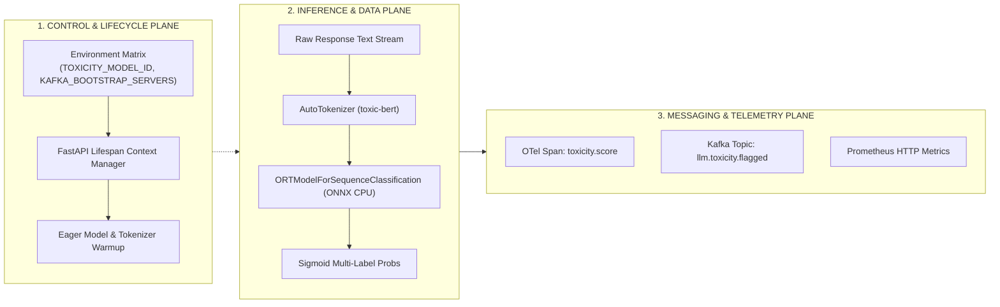
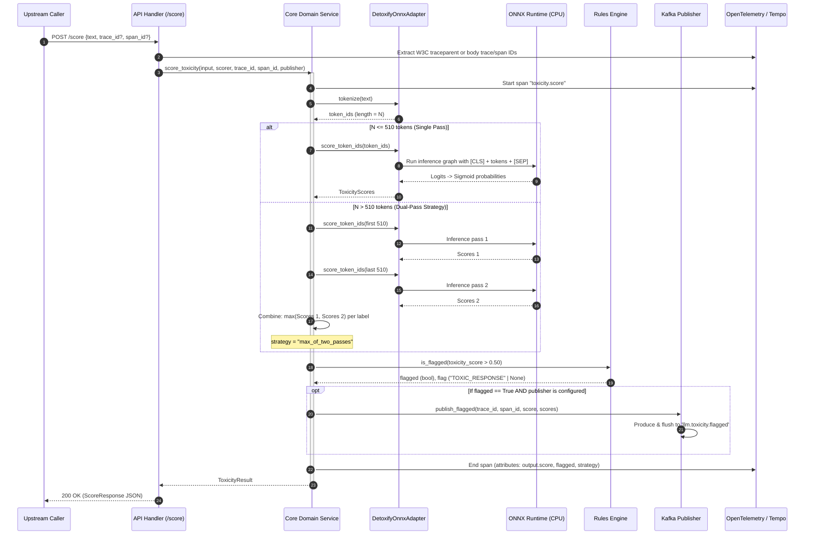
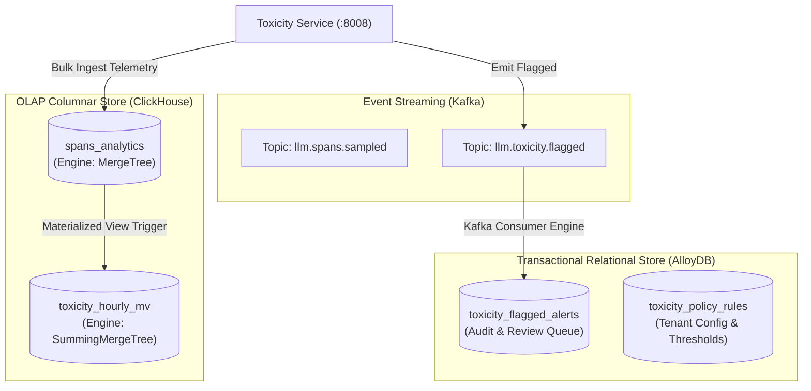

# Toxicity Service — High-Level Design (HLD) & Low-Level Design (LLD)

| Field | Value |
|---|---|
| **Package** | `packages/python/toxicity` |
| **Version** | `0.2.0` |
| **Architecture Pattern** | Hexagonal Architecture (Ports & Adapters) + Clean Domain-Driven Design |
| **Status** | Production-Ready (Merged Single Package) |

---

## 1. High-Level Design (HLD)

### 1.1 System Context & Macro Topology

The **Toxicity Service** is the multi-label NLP safety classification engine in the LLM Observability Platform. It classifies generated texts across 6 toxicity categories (`toxicity`, `severe_toxicity`, `obscene`, `threat`, `insult`, `identity_hate`) using an ONNX-optimized `unitary/toxic-bert` model on CPU.

It serves two operational modalities:
1. **Stateless Scoring Engine (Worker Mode)**: Synchronous high-throughput REST API called by trace enrichment engines and evaluation pipelines.
2. **Safety Event Publisher (Orchestrator Mode)**: Automatically emits flagged toxic payloads to Kafka (`llm.toxicity.flagged`) when toxicity threshold is breached.



---

### 1.2 Multi-Plane Architectural Topology



---

### 1.3 End-to-End Sequence Diagram



---

## 2. Low-Level Design (LLD)

### 2.1 Hexagonal Layer Boundaries & File Inventory

```
packages/python/toxicity/
├── src/
│   ├── core/domain/                     # PURE DOMAIN LAYER (Zero 3rd-party framework deps)
│   │   ├── ports/
│   │   │   ├── toxicity_scorer_port.py    # Inbound / Outbound Scorer Protocol
│   │   │   └── toxicity_publisher_port.py # Outbound Event Publisher Protocol
│   │   ├── rules.py                       # Business rules, thresholds, flag constants
│   │   ├── service.py                     # Primary domain orchestration service
│   │   └── types.py                       # Domain value objects & dataclasses
│   ├── infra/adapters/                  # INFRASTRUCTURE LAYER
│   │   ├── detoxify_onnx_adapter.py       # ONNX Runtime model adapter & warmup
│   │   └── kafka_publisher_adapter.py     # Confluent-Kafka producer adapter
│   ├── api/rest/v1/                     # INGRESS / INTERACTION LAYER
│   │   ├── app.py                         # FastAPI application factory & lifespan
│   │   ├── router.py                      # Router aggregator
│   │   └── handlers/
│   │       ├── health.py                  # Liveness & readiness probes
│   │       └── score.py                   # Toxicity evaluation handler
│   └── shared/tracing/                  # CROSS-CUTTING CONCERNS
│       └── tracer.py                      # OpenTelemetry tracing helper
```

---

### 2.2 Domain Data Contracts & Types (`core/domain/types.py`)

```python
@dataclass(frozen=True)
class ToxicityInput:
    text: str

@dataclass(frozen=True)
class ToxicityScores:
    toxicity: float          # General toxicity probability [0.0, 1.0]
    severe_toxicity: float   # Highly aggressive / hateful content
    obscene: float           # Vulgarity / profanity
    threat: float            # Physical harm or intimidation
    insult: float            # Disparaging or derogatory language
    identity_hate: float     # Hate speech targeted at protected groups

@dataclass(frozen=True)
class ToxicityResult:
    scores: ToxicityScores
    long_response_strategy: str | None = None  # None or "max_of_two_passes"
    score: float | None = None                 # Primary score (same as scores.toxicity)
    flagged: bool = False                      # True if score > 0.50
    flag: str | None = None                    # "TOXIC_RESPONSE" or None
    skipped: bool = False                      # True if pipeline failure caught gracefully
    skip_reason: str | None = None             # "pipeline_failure" or None
```

---

### 2.3 Port Protocols (`core/domain/ports/`)

#### Scorer Port:
```python
class ToxicityScorerPort(Protocol):
    def tokenize(self, text: str) -> list[int]:
        """Convert raw input text into model-specific integer token IDs."""
        ...

    def score_token_ids(self, token_ids: list[int]) -> ToxicityScores:
        """Run forward model inference against token sequence and return multi-label probabilities."""
        ...
```

#### Publisher Port:
```python
class ToxicityPublisherPort(Protocol):
    def publish_flagged(
        self, trace_id: str, span_id: str, score: float, scores: ToxicityScores
    ) -> None:
        """Publish flagged toxic span event to message broker."""
        ...
```

---

### 2.4 Mathematical Dual-Pass Formulation

For an arbitrary token sequence $T = [t_1, t_2, \dots, t_N]$:

$$\text{Scores}(T) = 
\begin{cases} 
f_{\text{ONNX}}(T) & \text{if } N \le 510 \\
\max\Big(f_{\text{ONNX}}(T[1:510]),\; f_{\text{ONNX}}(T[N-509:N])\Big) & \text{if } N > 510 
\end{cases}$$

Where:
- $f_{\text{ONNX}}(S) = \sigma(\mathbf{W} \cdot \text{Encoder}([CLS] \oplus S \oplus [SEP]) + \mathbf{b})$
- $\max(\mathbf{u}, \mathbf{v})_i = \max(u_i, v_i)$ element-wise $\forall i \in \{1, \dots, 6\}$

This guarantees that toxic prefixes or toxic suffixes in long generations are never masked by safe intermediate text.

---

### 2.5 Failure Modes & Circuit Breakers

| Failure Scenario | Component | Detection | Mitigation & Behavior |
|---|---|---|---|
| **Tokenizer / Model Crash** | `DetoxifyOnnxAdapter` | Unhandled `Exception` in inference | Caught by `service.py`; records exception on OTel span; returns `skipped=True, skip_reason="pipeline_failure"`; API returns `200 OK` with neutral scores to prevent cascading upstream failures. |
| **Kafka Broker Down** | `KafkaToxicityPublisherAdapter` | `KafkaException` or timeout on `flush()` | Publisher is non-blocking with local buffer; errors are logged without breaking `/score` HTTP response. |
| **Cold Container Latency** | `FastAPI Lifespan` | Slow first request | Eager `warmup()` runs dummy inference on container start before health check reports ready. |
| **Missing Kafka Configuration** | `app.py` | `KAFKA_BOOTSTRAP_SERVERS` is empty/unset | Adapter initializes with `bootstrap_servers=None` and behaves as a silent no-op (Worker Mode). |

---

### 2.6 Observability & Metric Telemetry

---

## 3. Database Design & Persistence Architecture

The Toxicity Service uses a **hybrid polyglot storage architecture** across the platform's database engines:
1. **ClickHouse (Columnar OLAP)**: High-throughput telemetry and timeseries toxicity aggregates for real-time dashboard analytics.
2. **AlloyDB / PostgreSQL (Relational OLTP)**: Toxic alert ledger, audit logging, human-in-the-loop review status, and safety violations.
3. **Kafka (Event Log)**: Immutable stream of raw evaluated spans and flagged incidents.



---

### 3.1 ClickHouse Telemetry Schemas (OLAP Plane)

#### 1. `spans_analytics` (Toxicity Span Attributes)
```sql
CREATE TABLE IF NOT EXISTS spans_analytics (
    trace_id               String,
    span_id                String,
    org_id                 LowCardinality(String),
    service_name           LowCardinality(String),
    model_id               LowCardinality(String),
    timestamp              DateTime64(3, 'UTC'),
    input_length_chars     UInt32,
    token_count            UInt32,
    toxicity               Float32,
    severe_toxicity        Float32,
    obscene                Float32,
    threat                 Float32,
    insult                 Float32,
    identity_hate          Float32,
    primary_score          Float32,
    flagged                UInt8,
    flag                   LowCardinality(Nullable(String)),
    strategy               LowCardinality(Nullable(String)),
    skipped                UInt8,
    skip_reason            LowCardinality(Nullable(String))
)
ENGINE = MergeTree()
PARTITION BY toYYYYMM(timestamp)
PRIMARY KEY (org_id, service_name, timestamp)
ORDER BY (org_id, service_name, timestamp, trace_id, span_id)
TTL toDateTime(timestamp) + INTERVAL 90 DAY;
```

#### 2. `toxicity_hourly_mv` (Real-Time Aggregations for Frontend Charts)
```sql
CREATE MATERIALIZED VIEW IF NOT EXISTS toxicity_hourly_mv
ENGINE = SummingMergeTree()
PRIMARY KEY (org_id, model_id, hour)
ORDER BY (org_id, model_id, hour)
AS SELECT
    org_id,
    model_id,
    toStartOfHour(timestamp) AS hour,
    count()                  AS total_evaluated_count,
    sum(flagged)             AS total_flagged_count,
    sum(toxicity)            AS sum_toxicity,
    sum(severe_toxicity)     AS sum_severe_toxicity,
    sum(threat)              AS sum_threat
FROM spans_analytics
GROUP BY org_id, model_id, hour;
```

---

### 3.2 AlloyDB / PostgreSQL Schemas (OLTP Plane)

#### 1. `toxicity_flagged_alerts` (Incident Audit & Human Review Queue)
```sql
CREATE TABLE IF NOT EXISTS toxicity_flagged_alerts (
    id                     BIGSERIAL PRIMARY KEY,
    alert_id               UUID NOT NULL DEFAULT gen_random_uuid(),
    trace_id               VARCHAR(64) NOT NULL,
    span_id                VARCHAR(32) NOT NULL,
    org_id                 VARCHAR(64) NOT NULL,
    model_id               VARCHAR(128) NOT NULL,
    primary_score          DOUBLE PRECISION NOT NULL,
    scores                 JSONB NOT NULL,
    flag                   VARCHAR(64) NOT NULL DEFAULT 'TOXIC_RESPONSE',
    review_status          VARCHAR(32) NOT NULL DEFAULT 'pending', -- 'pending', 'confirmed', 'false_positive'
    reviewed_by            VARCHAR(128) NULL,
    reviewed_at            TIMESTAMPTZ NULL,
    created_at             TIMESTAMPTZ NOT NULL DEFAULT NOW()
);

CREATE INDEX IF NOT EXISTS idx_tox_alerts_org_created 
    ON toxicity_flagged_alerts (org_id, created_at DESC);

CREATE INDEX IF NOT EXISTS idx_tox_alerts_trace_span 
    ON toxicity_flagged_alerts (trace_id, span_id);

CREATE INDEX IF NOT EXISTS idx_tox_alerts_review_status 
    ON toxicity_flagged_alerts (review_status) 
    WHERE review_status = 'pending';
```

#### 2. `toxicity_policy_rules` (Tenant-Level Safety Config)
```sql
CREATE TABLE IF NOT EXISTS toxicity_policy_rules (
    id                     SERIAL PRIMARY KEY,
    org_id                 VARCHAR(64) NOT NULL UNIQUE,
    custom_threshold       DOUBLE PRECISION NOT NULL DEFAULT 0.50,
    action_on_flag         VARCHAR(32) NOT NULL DEFAULT 'alert_only', -- 'alert_only', 'block', 'mask'
    enabled_categories     TEXT[] NOT NULL DEFAULT '{"toxicity", "severe_toxicity", "threat", "identity_hate"}',
    updated_at             TIMESTAMPTZ NOT NULL DEFAULT NOW()
);
```

---

### 3.3 Database Query Patterns for Frontend API Routes

| Frontend Route / Widget | Database Target | Query Mechanism | Latency Budget |
|---|---|---|---|
| `/traces/[traceId]` Badge & Radar | ClickHouse / Tempo | Single-row lookup on `spans_analytics` by `(trace_id, span_id)` | $< 15\text{ ms}$ |
| `/quality` Safety Trend Chart | ClickHouse | Aggregate range query over `toxicity_hourly_mv` | $< 25\text{ ms}$ |
| `/quality` Human Review Queue | AlloyDB | `SELECT ... FROM toxicity_flagged_alerts WHERE org_id = $1 AND review_status = 'pending' ORDER BY created_at DESC LIMIT 50` | $< 10\text{ ms}$ |
| Active Safety Policy Settings | AlloyDB / Redis | Read from `toxicity_policy_rules` with 5-minute Redis caching | $< 2\text{ ms}$ |

