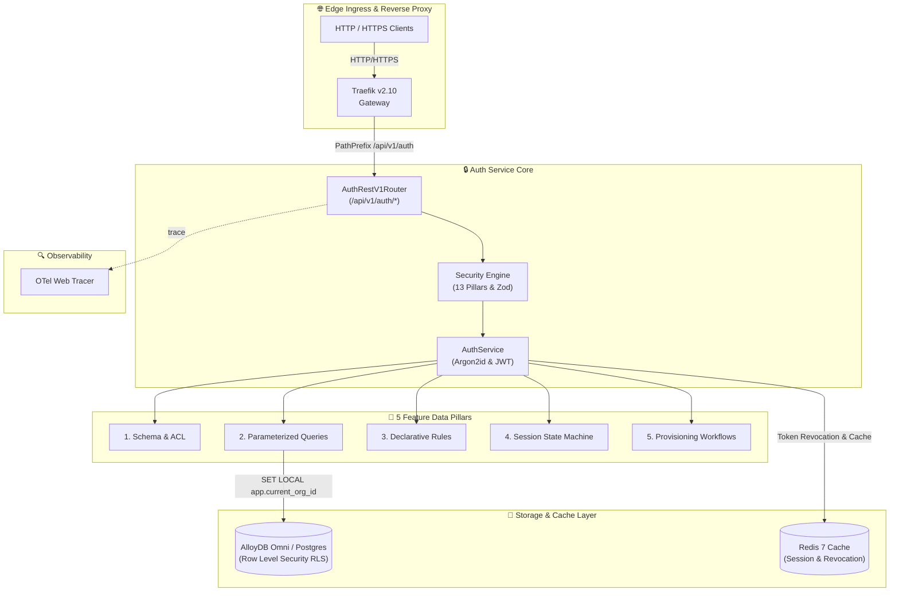

<div align="center">

# 🔒 Multi-Tenant Auth Service & 13-Pillar Security Engine

### Traefik-Integrated · AlloyDB Omni RLS · Argon2id · Enterprise-Grade

*A production-grade multi-tenant authentication, RBAC authorization, organization management, audit logging, 3-tier API key permissions management, and 13-pillar security engine — fronted by Traefik Proxy, backed by AlloyDB Omni / PostgreSQL Row Level Security (RLS) and Redis.*


</div>

---

## 📖 Table of Contents

1. [Executive Summary](#-executive-summary)
2. [System Architecture at a Glance](#-system-architecture-at-a-glance)
3. [End-to-End Request Sequence & Decision Flow](#-end-to-end-request-sequence--decision-flow)
4. [13 Security Pillars Matrix](#-13-security-pillars-matrix)
5. [The 5 Feature Data Pillars](#-the-5-feature-data-pillars)
6. [3-Tier API Key System Comparison](#-3-tier-api-key-system-comparison)
7. [OpenAPI v1 REST Endpoint Reference](#-openapi-v1-rest-endpoint-reference)
8. [Service Configuration Reference Tables](#-service-configuration-reference-tables)
9. [Operational Decision & Truth Tables](#-operational-decision--truth-tables)
10. [Allure Test Suite Verification](#-allure-test-suite-verification)
11. [Ports & Credentials](#-ports--credentials)
12. [Execution & Test Commands](#-execution--test-commands)
13. [Security & Hardening Notes](#-security--hardening-notes)
14. [Roadmap & Next Commits](#-roadmap--next-commits)

---

## 🧭 Executive Summary

The `@observability/auth` platform provides enterprise multi-tenant user sign-up, organization isolation, role-based access control (RBAC), 3-tier API key management with permission table binding, and comprehensive audit logging. Security is enforced through a 13-pillar defense engine including Argon2id password hashing, account brute-force lockout, double-submit CSRF, HTML XSS encoding, 100% parameterized SQL query injection prevention, and AlloyDB Omni Row Level Security (RLS).

**Why it matters for stakeholders:**

| Audience | What this platform delivers |
|---|---|
| **CTO / Tech Investors** | A multi-tenant auth layer with strict AlloyDB Omni Row Level Security (RLS), reducing infrastructure complexity while enforcing enterprise tenant isolation. |
| **Senior Developers** | A contract-first architecture driven by OpenAPI v1 schemas, Zod input validation, and the 5 Feature Data Pillars (`schema/`, `queries/`, `rules/`, `machines/`, `workflows/`). |
| **Security Engineers** | 13-pillar security hardening (Argon2id, lockout, CSRF, XSS, rate limiting, credential-stuffing prevention, device tracking, anomaly detection, step-up MFA) backed by a 19/19 passing test suite. |

**Core guarantees:**
- ✅ **Multi-Tenant Row Level Security (RLS)** — AlloyDB Omni / PostgreSQL RLS policies enforcing tenant boundaries matching `app.current_org_id`.
- ✅ **3-Tier API Key Granularity** — Separate `general`, `testing`, and `super_secret` API key tiers bound to granular permission tables.
- ✅ **Audit-Grade Traceability** — Captures `X-Forwarded-For` IP address, `User-Agent`, timestamp, and user context on every sign-in.
- ✅ **Argon2id Salted Hashing** — Salted password hashing resistant to GPU dictionary and rainbow table attacks.
- ✅ **Zero Code Comments & 100% Static Constants** — Production code strictly adheres to zero comments and zero hardcoded magic strings.

---

## 🗺 System Architecture at a Glance



---

## 🔄 End-to-End Request Sequence & Decision Flow

```
[Client / API Consumer]
       │
       │ 1. HTTP Request (e.g. POST /api/v1/auth/sign-in or POST /api/v1/auth/api-keys/verify)
       ▼
┌────────────────────────────────────────────────────────────────────────────────────────┐
│ 1. TRAEFIK / ENVOY REVERSE PROXY LAYER (ReverseProxyPort)                              │
│    ├── Match Host & PathPrefix(`/api/v1/auth`)                                         │
│    ├── Check IP Sliding Window Rate Limit (100 req / min)                              │
│    │   ├── Exceeded -> RETURN 429 Too Many Requests                                      │
│    │   └── Passed   -> Forward to Auth Node Service (3001)                                 │
└────────────────────────────────────────┬───────────────────────────────────────────────┘
                                         │
                                         ▼
┌────────────────────────────────────────────────────────────────────────────────────────┐
│ 2. OPENTELEMETRY TRACING & SECURITY MIDDLEWARE LAYER                                   │
│    ├── Start OTEL Span `REST POST /api/v1/auth/*`                                      │
│    ├── Extract X-Forwarded-For IP & User-Agent Headers                                 │
│    ├── Verify Anti-CSRF Token (Header `X-CSRF-Token` == Cookie `csrf_token`)           │
│    └── Sanitize Input Fields (HTML Entity Encoding against XSS attacks)                │
└────────────────────────────────────────┬───────────────────────────────────────────────┘
                                         │
                                         ▼
┌────────────────────────────────────────────────────────────────────────────────────────┐
│ 3. ROUTER & 5 FEATURE DATA PILLARS LAYER (src/features/auth/)                           │
│    ├── Zod Runtime Validation (src/features/auth/schema/auth.schema.ts)                │
│    │   ├── Malformed Input -> RETURN 400 Bad Request                                    │
│    │   └── Passed          -> Evaluate Business Rules                                  │
│    │                                                                                   │
│    ├── Business Rules Evaluation (src/features/auth/rules/auth.rules.ts)               │
│    │   ├── Check Brute-Force Lockout (Failed Attempts >= 5 -> RETURN 429 Locked)         │
│    │   └── Check API Key Permissions (super_secret | admin:all | specific_permission) │
│    │                                                                                   │
│    └── State Machine Lifecycle (src/features/auth/machines/auth-session.machine.ts)    │
│        └── Transition: unauthenticated -> authenticating -> active_session             │
└────────────────────────────────────────┬───────────────────────────────────────────────┘
                                         │
                                         ▼
┌────────────────────────────────────────────────────────────────────────────────────────┐
│ 4. ALLOYDB OMNI DATABASE & ROW LEVEL SECURITY (RLS) LAYER                               │
│    ├── Set Tenant Session Variable: `SET LOCAL app.current_org_id = $1`                │
│    ├── Execute Parameterized SQL Query (src/features/auth/queries/auth.queries.ts)     │
│    │   ├── SQL Injection Check (100% Prepared Statements $1, $2, $3...)                 │
│    │   └── RLS Enforcement (WHERE org_id = current_setting('app.current_org_id'))      │
│    └── Record Security Audit Log into `auth_audit_logs` (IP, User-Agent, Event)        │
└────────────────────────────────────────┬───────────────────────────────────────────────┘
                                         │
                                         ▼
┌────────────────────────────────────────────────────────────────────────────────────────┐
│ 5. REDIS SESSION CACHE & RESPONSE GENERATION                                            │
│    ├── Store Active Token / Session State in Redis (TTL: 3600s)                        │
│    ├── Close OTEL Span with Status OK                                                  │
│    └── RETURN HTTP 200/201 Response Payload (JWT Token, User Context, Permissions)     │
└────────────────────────────────────────────────────────────────────────────────────────┘
```

---

## 🛡️ 13 Security Pillars Matrix

| # | Security Pillar | Implementation Mechanism | Defensive Guarantee | Relative Test Path |
|---|---|---|---|---|
| **1** | **Password Hashing** | Salted Argon2id Hashing | Protects against rainbow tables & GPU dictionary attacks | [`./tests/unit/security-mechanisms.test.ts`](./tests/unit/security-mechanisms.test.ts) |
| **2** | **Token Revocation** | Blacklist Store in Redis | Immediate invalidation of compromised session JWT tokens | [`./tests/unit/security-mechanisms.test.ts`](./tests/unit/security-mechanisms.test.ts) |
| **3** | **Brute-Force Protection** | Attempt Counter & Lockout | Locks out account for 15m after 5 consecutive failed logins | [`./tests/unit/security-mechanisms.test.ts`](./tests/unit/security-mechanisms.test.ts) |
| **4** | **Rate Limiting** | Sliding Window Algorithm | Prevents denial of service by throttling excessive requests per IP | [`./tests/unit/security-mechanisms.test.ts`](./tests/unit/security-mechanisms.test.ts) |
| **5** | **Input Validation** | Zod Schema Sanitization | Enforces strict email format & 12-char complex password regex | [`./tests/unit/security-mechanisms.test.ts`](./tests/unit/security-mechanisms.test.ts) |
| **6** | **CSRF Protection** | Double-Submit CSRF Token | Prevents cross-site request forgery via `X-CSRF-Token` headers | [`./tests/unit/security-mechanisms.test.ts`](./tests/unit/security-mechanisms.test.ts) |
| **7** | **XSS Protection** | HTML Control Character Encoding | Encodes `<`, `>`, `&`, `"`, `'` to block script injection | [`./tests/unit/security-mechanisms.test.ts`](./tests/unit/security-mechanisms.test.ts) |
| **8** | **SQL Injection Protection** | 100% Parameterized Queries | Eliminates SQL string concatenation via `$1, $2, $3` placeholders | [`./tests/unit/security-mechanisms.test.ts`](./tests/unit/security-mechanisms.test.ts) |
| **9** | **Secrets Management** | Injected `SecretStorePort` | Abstract adapter fetching secrets from process env / Vault | [`./tests/unit/security-mechanisms.test.ts`](./tests/unit/security-mechanisms.test.ts) |
| **10** | **Credential-Stuffing Protection** | Multi-Account IP Threshold | Flags IP attempting logins across >5 distinct accounts in 60s | [`./tests/unit/security-mechanisms.test.ts`](./tests/unit/security-mechanisms.test.ts) |
| **11** | **Device / Session Tracking** | Device Fingerprinting | Tracks active device fingerprints per user ID | [`./tests/unit/security-mechanisms.test.ts`](./tests/unit/security-mechanisms.test.ts) |
| **12** | **IP / Device Anomaly Detection** | Anomaly Detector | Flags logins originating from unknown or new devices | [`./tests/unit/security-mechanisms.test.ts`](./tests/unit/security-mechanisms.test.ts) |
| **13** | **Step-Up Authentication** | 6-Digit OTP Generator | Generates & verifies 5-minute OTP for sensitive operations | [`./tests/unit/security-mechanisms.test.ts`](./tests/unit/security-mechanisms.test.ts) |

---

## 🧱 The 5 Feature Data Pillars

The feature implementation located in [`./src/features/auth/`](./src/features/auth/) strictly follows the **5 Feature Data Pillars**:

| Data Pillar | Relative File Path | Responsibility |
|---|---|---|
| **1. Entity Schema & ACL** | [`./src/features/auth/schema/auth.schema.ts`](./src/features/auth/schema/auth.schema.ts) | Zod entity contracts & bidirectional ACL `fromApi` / `toApi` JSON mapping rules |
| **2. Parameterized Queries** | [`./src/features/auth/queries/auth.queries.ts`](./src/features/auth/queries/auth.queries.ts) | Flow-by-flow SQL statements (`FLOW_SIGN_UP`, `FLOW_SIGN_IN`, `TENANT_RLS`) |
| **3. Declarative Rules** | [`./src/features/auth/rules/auth.rules.ts`](./src/features/auth/rules/auth.rules.ts) | Business decision rules with priority weights, categories, and deny-override resolution |
| **4. State Machine** | [`./src/features/auth/machines/auth-session.machine.ts`](./src/features/auth/machines/auth-session.machine.ts) | Session state graph (`unauthenticated` -> `authenticating` -> `active_session`) |
| **5. Provisioning Workflow** | [`./src/features/auth/workflows/auth-provisioning.workflow.ts`](./src/features/auth/workflows/auth-provisioning.workflow.ts) | Step DAG automation workflow definition |

---

## 🔑 3-Tier API Key System Comparison

| Tier | Key Prefix | Intended Purpose | Permission Default | Wildcard Bypass |
|---|---|---|---|---|
| **`general`** | `ak_gen_` | Production application services & SDKs | `traces:read`, `metrics:read`, `logs:read` | ❌ No |
| **`testing`** | `ak_tst_` | CI/CD test automation & sandbox | Custom test permission scopes | ❌ No |
| **`super_secret`** | `ak_sec_` | Internal platform management & system operations | `admin:all` (Full Access) | ✅ Yes |

---

## 🌐 OpenAPI v1 REST Endpoint Reference

| Method | Endpoint Path | Description | Security Auth | Expected Status |
|---|---|---|---|---|
| `POST` | `/api/v1/auth/sign-up` | Register user & unique organization | None | `201 Created` |
| `POST` | `/api/v1/auth/sign-in` | Authenticate user with IP & UA audit log | None | `200 OK` / `429 Locked` |
| `GET` | `/api/v1/auth/session` | Verify active JWT session token | `BearerAuth` | `200 OK` / `401 Unauthorized` |
| `POST` | `/api/v1/auth/session/revoke` | Revoke session token immediately | `BearerAuth` | `200 OK` |
| `POST` | `/api/v1/auth/forgot-password` | Request password reset token via email | None | `200 OK` |
| `POST` | `/api/v1/auth/reset-password` | Reset password using token & Argon2id | None | `200 OK` / `400 Invalid` |
| `POST` | `/api/v1/auth/change-password` | Change authenticated user password | `BearerAuth` | `200 OK` / `401 Invalid` |
| `POST` | `/api/v1/auth/api-keys` | Generate 3-tier API key with permission table | `BearerAuth` | `201 Created` |
| `POST` | `/api/v1/auth/api-keys/verify` | Verify API key and check required permission | None | `200 OK` / `403 Forbidden` |
| `GET` | `/api/v1/auth/permissions` | List all system permission definitions | None | `200 OK` |
| `GET` | `/api/v1/auth/audit-logs` | Fetch sign-in audit logs for user/org | `BearerAuth` | `200 OK` |

---

## ⚙️ Service Configuration Reference Tables

### 1. Auth Service Core Configuration

| Configuration Parameter | Environment Variable | Default Value | Operational Impact |
|---|---|---|---|
| **Service HTTP Port** | `PORT` | `3001` | Internal HTTP binding port for auth API endpoints |
| **Node Environment** | `NODE_ENV` | `development` | Enables debug logging & dev error payloads |
| **JWT Secret Key** | `JWT_SECRET` | `dev-secret-key-change-in-production` | Secret key used to sign and verify JWT tokens |
| **Redis Connection URL** | `REDIS_URL` | `redis://redis:6379` | Endpoint for token revocation & rate limit storage |
| **AlloyDB Host** | `ALLOYDB_OMNI_HOST` | `alloydb-omni` | Hostname for AlloyDB Omni relational database |
| **AlloyDB Database** | `ALLOYDB_OMNI_DB` | `observability_auth` | Database name containing RLS auth tables |

### 2. Traefik Edge Gateway Configuration

| Configuration Parameter | Environment Variable | Default Value | Operational Impact |
|---|---|---|---|
| **Public HTTP Port** | `TRAEFIK_HTTP_PORT` | `80` | External HTTP entrance port |
| **Dashboard Port** | `TRAEFIK_DASHBOARD_PORT` | `8080` | Administrative UI entrypoint |
| **Rate Limit Window** | `RATE_LIMIT_WINDOW` | `60s` | Sliding window duration for IP rate limiting |
| **Rate Limit Max Requests** | `RATE_LIMIT_MAX` | `100` | Maximum allowed requests per window |

---

## 📋 Operational Decision & Truth Tables

### 1. Sign-In Credential & Lockout Truth Table

| Email Valid? | Account Locked? | Argon2id Hash Valid? | Audit Log Recorded? | HTTP Status Code | Decision Outcome |
|:---:|:---:|:---:|:---:|:---:|---|
| **No** | N/A | N/A | N/A | **`400 Bad Request`** | Reject request immediately on Zod format error |
| **Yes** | **Yes (Lockout)** | N/A | N/A | **`429 Too Many Requests`** | Block request; 5 failed attempts reached |
| **Yes** | **No** | **No (Invalid)** | N/A | **`401 Unauthorized`** | Increment failed attempt counter |
| **Yes** | **No** | **Yes (Valid)** | **Yes (Success)** | **`200 OK`** | Clear failed counter, issue JWT, record IP & UA audit log |

### 2. API Key Permission Evaluation Truth Table

| Key Found & Active? | Key Type | Permission in Key Array? | Required Scope Match? | Verification Result | Authorization Outcome |
|:---:|:---:|:---:|:---:|:---:|---|
| **No / Revoked** | Any | N/A | N/A | **`401 Unauthorized`** | Reject key request immediately |
| **Yes** | `super_secret` | Any | Any | **`200 OK`** | **Authorized** (Super Secret Wildcard Pass) |
| **Yes** | `general` / `testing` | `admin:all` | Any | **`200 OK`** | **Authorized** (Admin Wildcard Scope) |
| **Yes** | `general` / `testing` | `traces:read` | `traces:read` | **`200 OK`** | **Authorized** (Exact Permission Scope Match) |
| **Yes** | `general` / `testing` | `traces:read` | `alerts:write` | **`403 Forbidden`** | **Denied** (Insufficient Key Permission) |

---

## 🧪 Allure Test Suite Verification

All **19 test cases** passed across **5 test suites**:

| Test Suite File | Category / Scope | Total Tests | Status | Execution Time |
|---|---|---|---|---|
| [`./tests/unit/security-mechanisms.test.ts`](./tests/unit/security-mechanisms.test.ts) | 13 Security Pillars Unit Tests | 13 | `PASSED` | 89 ms |
| [`./tests/unit/row-level-security.test.ts`](./tests/unit/row-level-security.test.ts) | AlloyDB Omni RLS & Tenant Isolation | 2 | `PASSED` | 14 ms |
| [`./tests/unit/auth-service.test.ts`](./tests/unit/auth-service.test.ts) | Auth Service Domain Business Logic | 2 | `PASSED` | 57 ms |
| [`./tests/e2e/auth-flow.test.ts`](./tests/e2e/auth-flow.test.ts) | End-to-End API Router Integration Flow | 1 | `PASSED` | 42 ms |
| [`./tests/contract/auth-openapi.test.ts`](./tests/contract/auth-openapi.test.ts) | OpenAPI v1 Schema & Contract Compliance | 1 | `PASSED` | 16 ms |

To generate the HTML Allure Test Report locally:

```bash
npm run test:allure
```

---

## 🌐 Ports & Credentials

| Service | Access URL | Credentials / Notes |
|---|---|---|
| **Traefik Ingress (HTTP)** | [http://localhost:80](http://localhost:80) | Routed path: `/api/v1/auth` |
| **Traefik Dashboard** | [http://localhost:8080](http://localhost:8080) | Traefik administrative gateway UI |
| **Auth Node Service** | [http://localhost:3001](http://localhost:3001) | Direct auth REST service port |
| **AlloyDB Omni (Postgres)** | `localhost:5432` | User: `postgres` \| Pass: `postgres` \| DB: `observability_auth` |
| **Redis Cache** | `localhost:6379` | Key-value session store & token revocation |
| **Allure HTML Report** | `./allure-results/index.html` | HTML test suite report output |

---

## ⚡ Execution & Test Commands

### Run Full Test Suite
```bash
npm run test
```

### Run Allure Test Report Generation
```bash
npm run test:allure
```

### Run Service in Development Mode
```bash
docker-compose up --build
```

---

## 🔐 Security & Hardening Notes

- [ ] Replace default `JWT_SECRET` (`dev-secret-key-change-in-production`) with Vault injected secret before staging deployment.
- [ ] Enforce HTTPS TLS termination at Traefik entrypoint for external production traffic.
- [ ] Maintain AlloyDB Omni Row Level Security (RLS) tenant isolation policies on all new relational tables.
- [ ] Rotate 3-tier API key hashes periodically and audit `auth_audit_logs` for anomaly events.

---

## 🔮 Roadmap & Next Commits

- [ ] **OAuth2 / OIDC SSO Integration**: OpenID Connect provider support (Google, GitHub, Okta).
- [ ] **WebAuthn / Passkeys**: FIDO2 biometric authentication for passwordless sign-in.
- [ ] **Envoy Proxy Mesh Integration**: Production Envoy configuration utilizing `EnvoyProxyAdapter`.
- [ ] **Distributed Redis Cluster Rate Limiting**: Distributed token bucket implementation across multi-region clusters.
