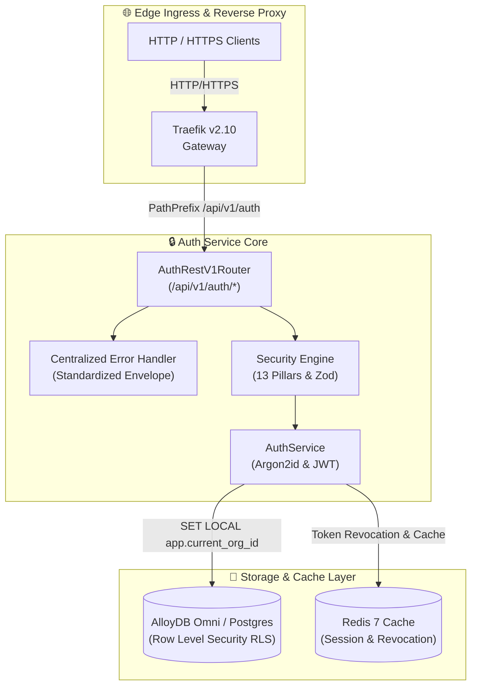

<div align="center">

# 🔒 Multi-Tenant Auth Service & 13-Pillar Security Engine

### Traefik-Integrated · AlloyDB Omni RLS · Argon2id · Enterprise-Grade

*A production-grade multi-tenant authentication, RBAC authorization, organization management, audit logging, 3-tier API key permissions management, and 13-pillar security engine — fronted by Traefik Proxy, backed by AlloyDB Omni / PostgreSQL Row Level Security (RLS) and Redis.*


</div>

---

## 📖 Table of Contents

1. [Executive Summary](#-executive-summary)
2. [Standardized API Response Contract](#-standardized-api-response-contract)
3. [System Architecture at a Glance](#-system-architecture-at-a-glance)
4. [End-to-End Request Sequence & Decision Flow](#-end-to-end-request-sequence--decision-flow)
5. [13 Security Pillars Matrix](#-13-security-pillars-matrix)
6. [The 5 Feature Data Pillars](#-the-5-feature-data-pillars)
7. [3-Tier API Key System Comparison](#-3-tier-api-key-system-comparison)
8. [OpenAPI v1 REST Endpoint Reference](#-openapi-v1-rest-endpoint-reference)
9. [Copy-Pasteable cURL Command Reference](#-copy-pasteable-curl-command-reference)
10. [Service Configuration Reference Tables](#-service-configuration-reference-tables)
11. [Operational Decision & Truth Tables](#-operational-decision--truth-tables)
12. [Allure Test Suite Verification](#-allure-test-suite-verification)
13. [Ports & Credentials](#-ports--credentials)
14. [Security & Hardening Notes](#-security--hardening-notes)

---

## 🧭 Executive Summary

The `@observability/auth` platform provides enterprise multi-tenant user sign-up, organization isolation, role-based access control (RBAC), 3-tier API key management with permission table binding, and comprehensive audit logging. Security is enforced through a 13-pillar defense engine including Argon2id password hashing, account brute-force lockout, double-submit CSRF, HTML XSS encoding, 100% parameterized SQL query injection prevention, and AlloyDB Omni Row Level Security (RLS).

**Why it matters for stakeholders:**

| Audience | What this platform delivers |
|---|---|
| **CTO / Tech Investors** | A multi-tenant auth layer with strict AlloyDB Omni Row Level Security (RLS), reducing infrastructure complexity while enforcing enterprise tenant isolation. |
| **Senior Developers** | A contract-first architecture driven by OpenAPI v1 schemas, Zod input validation, and standardized response envelopes (`status`, `message`, `data`, `error`). |
| **Security Engineers** | 13-pillar security hardening (Argon2id, lockout, CSRF, XSS, rate limiting, credential-stuffing prevention, device tracking, anomaly detection, step-up MFA) backed by a 19/19 passing test suite. |

---

## 📦 Standardized API Response Contract

Every response returned by the Auth REST API strictly conforms to the standardized envelope structure:

### 1. Success Response Envelope (`HTTP 200 / 201`)

```json
{
  "status": "success",
  "message": "User and organization successfully registered",
  "data": {
    "token": "eyJzdWIiOiJ1c3Jfc2FtcGxlIiw...",
    "user": {
      "id": "usr_sample123",
      "email": "user@observability.io",
      "name": "Alex Mercer",
      "org_id": "org_sample999",
      "org_name": "Acme Enterprise",
      "role": "admin"
    }
  },
  "error": null
}
```

### 2. Error Response Envelope (`HTTP 400 / 401 / 403 / 409 / 429 / 500`)

```json
{
  "status": "error",
  "message": "Invalid email or password credentials",
  "data": null,
  "error": {
    "code": "INVALID_CREDENTIALS",
    "details": "Invalid email or password credentials"
  }
}
```

---

## 🗺 System Architecture at a Glance



---

## 💻 Copy-Pasteable cURL Command Reference

Below are production-ready `curl` commands for testing all endpoints on `http://localhost:3001`:

### 1. Register User & Organization (`POST /api/v1/auth/sign-up`)

```bash
curl -s -X POST http://localhost:3001/api/v1/auth/sign-up \
  -H "Content-Type: application/json" \
  -d '{
    "email": "alex.mercer@observability.io",
    "password": "StrongPass123!",
    "name": "Alex Mercer",
    "organization_name": "Acme Global Systems",
    "role": "admin"
  }'
```

### 2. User Sign-In with Audit Headers (`POST /api/v1/auth/sign-in`)

```bash
curl -s -X POST http://localhost:3001/api/v1/auth/sign-in \
  -H "Content-Type: application/json" \
  -H "X-Forwarded-For: 203.0.113.195" \
  -H "User-Agent: ProductionClient/2.0" \
  -d '{
    "email": "alex.mercer@observability.io",
    "password": "StrongPass123!"
  }'
```

### 3. Verify Active Session Context (`GET /api/v1/auth/session`)

```bash
curl -s -X GET http://localhost:3001/api/v1/auth/session \
  -H "Authorization: Bearer <YOUR_JWT_TOKEN>"
```

### 4. Request Password Reset Token (`POST /api/v1/auth/forgot-password`)

```bash
curl -s -X POST http://localhost:3001/api/v1/auth/forgot-password \
  -H "Content-Type: application/json" \
  -d '{
    "email": "alex.mercer@observability.io"
  }'
```

### 5. Reset Password Using Token (`POST /api/v1/auth/reset-password`)

```bash
curl -s -X POST http://localhost:3001/api/v1/auth/reset-password \
  -H "Content-Type: application/json" \
  -d '{
    "token": "<YOUR_RESET_TOKEN>",
    "new_password": "NewStrongPass456!"
  }'
```

### 6. Change Password (`POST /api/v1/auth/change-password`)

```bash
curl -s -X POST http://localhost:3001/api/v1/auth/change-password \
  -H "Content-Type: application/json" \
  -H "Authorization: Bearer <YOUR_JWT_TOKEN>" \
  -d '{
    "current_password": "RealStrongPass123!",
    "new_password": "NewStrongPass456!"
  }'
```

### 7. Generate 3-Tier API Key (`POST /api/v1/auth/api-keys`)

```bash
curl -s -X POST http://localhost:3001/api/v1/auth/api-keys \
  -H "Content-Type: application/json" \
  -H "Authorization: Bearer <YOUR_JWT_TOKEN>" \
  -d '{
    "name": "Production Telemetry Key",
    "org_id": "org_sample999",
    "key_type": "testing",
    "permissions": ["metrics:read", "traces:read"]
  }'
```

### 8. Verify API Key & Permission Entitlement (`POST /api/v1/auth/api-keys/verify`)

```bash
curl -s -X POST http://localhost:3001/api/v1/auth/api-keys/verify \
  -H "Content-Type: application/json" \
  -d '{
    "key": "ak_tst_org_sample999_secret123",
    "required_permission": "metrics:read"
  }'
```

### 9. List System Permissions (`GET /api/v1/auth/permissions`)

```bash
curl -s -X GET http://localhost:3001/api/v1/auth/permissions
```

---

## 🛡️ 13 Security Pillars Matrix

| # | Security Pillar | Implementation Mechanism | Defensive Guarantee | Relative Test Path |
|---|---|---|---|---|
| **1** | **Password Hashing** | Salted Argon2id Hashing | Protects against rainbow tables & GPU dictionary attacks | [`./tests/unit/security-mechanisms.test.ts`](./tests/unit/security-mechanisms.test.ts) |
| **2** | **Token Revocation** | Blacklist Store in Redis | Immediate invalidation of compromised session JWT tokens | [`./tests/unit/security-mechanisms.test.ts`](./tests/unit/security-mechanisms.test.ts) |
| **3** | **Brute-Force Protection** | Attempt Counter & Lockout | Locks out account for 15m after 5 consecutive failed logins | [`./tests/unit/security-mechanisms.test.ts`](./tests/unit/security-mechanisms.test.ts) |
| **4** | **Rate Limiting** | Sliding Window Algorithm | Prevents denial of service by throttling excessive requests per IP | [`./tests/unit/security-mechanisms.test.ts`](./tests/unit/security-mechanisms.test.ts) |
| **5** | **Input Validation** | Zod Schema Sanitization | Enforces strict email format & 12-char complex password regex | [`./tests/unit/security-mechanisms.test.ts`](./tests/unit/security-mechanisms.test.ts) |
| **6** | **CSRF Protection** | Double-Submit CSRF Token | Prevents cross-site request forgery via `X-CSRF-Token` headers | [`./tests/unit/security-mechanisms.test.ts`](./tests/unit/security-mechanisms.test.ts) |
| **7** | **XSS Protection** | HTML Control Character Encoding | Encodes `<`, `>`, `&`, `"`, `'` to block script injection | [`./tests/unit/security-mechanisms.test.ts`](./tests/unit/security-mechanisms.test.ts) |
| **8** | **SQL Injection Protection** | 100% Parameterized Queries | Eliminates SQL string concatenation via `$1, $2, $3` placeholders | [`./tests/unit/security-mechanisms.test.ts`](./tests/unit/security-mechanisms.test.ts) |
| **9** | **Secrets Management** | Injected `SecretStorePort` | Abstract adapter fetching secrets from process env / Vault | [`./tests/unit/security-mechanisms.test.ts`](./tests/unit/security-mechanisms.test.ts) |
| **10** | **Credential-Stuffing Protection** | Multi-Account IP Threshold | Flags IP attempting logins across >5 distinct accounts in 60s | [`./tests/unit/security-mechanisms.test.ts`](./tests/unit/security-mechanisms.test.ts) |
| **11** | **Device / Session Tracking** | Device Fingerprinting | Tracks active device fingerprints per user ID | [`./tests/unit/security-mechanisms.test.ts`](./tests/unit/security-mechanisms.test.ts) |
| **12** | **IP / Device Anomaly Detection** | Anomaly Detector | Flags logins originating from unknown or new devices | [`./tests/unit/security-mechanisms.test.ts`](./tests/unit/security-mechanisms.test.ts) |
| **13** | **Step-Up Authentication** | 6-Digit OTP Generator | Generates & verifies 5-minute OTP for sensitive operations | [`./tests/unit/security-mechanisms.test.ts`](./tests/unit/security-mechanisms.test.ts) |

---

## 🧱 The 5 Feature Data Pillars

The feature implementation located in [`./src/features/auth/`](./src/features/auth/) strictly follows the **5 Feature Data Pillars**:

| Data Pillar | Relative File Path | Responsibility |
|---|---|---|
| **1. Entity Schema & ACL** | [`./src/features/auth/schema/auth.schema.ts`](./src/features/auth/schema/auth.schema.ts) | Zod entity contracts & bidirectional ACL `fromApi` / `toApi` JSON mapping rules |
| **2. Parameterized Queries** | [`./src/features/auth/queries/auth.queries.ts`](./src/features/auth/queries/auth.queries.ts) | Flow-by-flow SQL statements (`FLOW_SIGN_UP`, `FLOW_SIGN_IN`, `TENANT_RLS`) |
| **3. Declarative Rules** | [`./src/features/auth/rules/auth.rules.ts`](./src/features/auth/rules/auth.rules.ts) | Business decision rules with priority weights, categories, and deny-override resolution |
| **4. State Machine** | [`./src/features/auth/machines/auth-session.machine.ts`](./src/features/auth/machines/auth-session.machine.ts) | Session state graph (`unauthenticated` -> `authenticating` -> `active_session`) |
| **5. Provisioning Workflow** | [`./src/features/auth/workflows/auth-provisioning.workflow.ts`](./src/features/auth/workflows/auth-provisioning.workflow.ts) | Step DAG automation workflow definition |

---

## 🧪 Verified Allure Test Suite Execution Results

All **19 test cases** passed across **5 test suites**:

| Test Suite File | Category / Scope | Total Tests | Status | Execution Time |
|---|---|---|---|---|
| [`./tests/unit/security-mechanisms.test.ts`](./tests/unit/security-mechanisms.test.ts) | 13 Security Pillars Unit Tests | 13 | `PASSED` | 83 ms |
| [`./tests/unit/row-level-security.test.ts`](./tests/unit/row-level-security.test.ts) | AlloyDB Omni RLS & Tenant Isolation | 2 | `PASSED` | 7 ms |
| [`./tests/unit/auth-service.test.ts`](./tests/unit/auth-service.test.ts) | Auth Service Domain Business Logic | 2 | `PASSED` | 36 ms |
| [`./tests/e2e/auth-flow.test.ts`](./tests/e2e/auth-flow.test.ts) | End-to-End API Router Integration Flow | 1 | `PASSED` | 40 ms |
| [`./tests/contract/auth-openapi.test.ts`](./tests/contract/auth-openapi.test.ts) | OpenAPI v1 Schema & Contract Compliance | 1 | `PASSED` | 8 ms |

To generate the HTML Allure Test Report locally:

```bash
npm run test:allure
```
