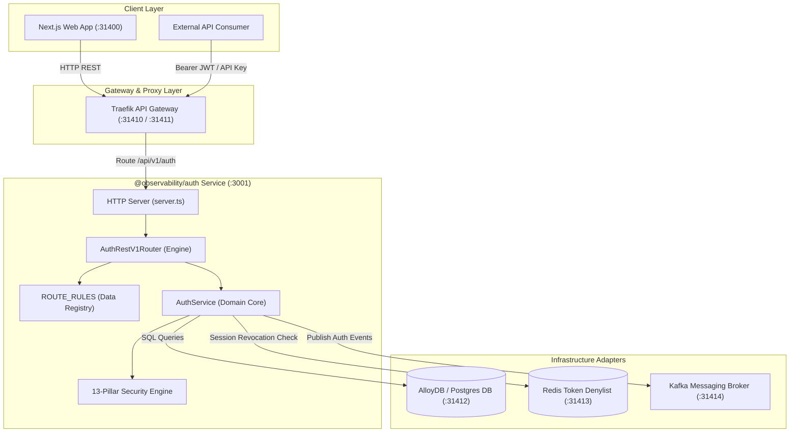
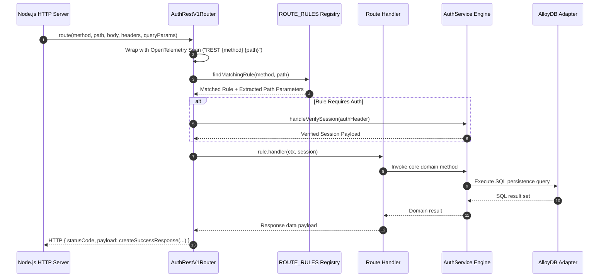

# ADR 0001: Hexagonal Architecture & Declarative Rule Engine Router

- **Status**: Accepted
- **Date**: 2026-08-23
- **Context**: The `@observability/auth` service requires strict separation of concerns between HTTP delivery, core domain rules, security mechanisms, and database persistence, as well as an extensible route matcher that eliminates repetitive conditional statements.

---

## 🏛 High-Level Design (HLD)

---

## 🔬 Low-Level Design (LLD)

---

## 📋 Architectural Decisions & Trade-Offs

1. **Separation of Router Data vs Engine Logic**:
   - `route.rules.ts` contains strictly declarative data configuration mapping HTTP methods and path patterns to handler functions.
   - `router.ts` contains strictly executable engine logic (regex path matching, trace span wrapping, central session validation, error handling).

2. **Compiled Regex Path Matcher**:
   - Route path patterns like `/api/v1/auth/organizations/:id/switch` are pre-compiled into regular expressions at router instantiation for high-performance matching.
