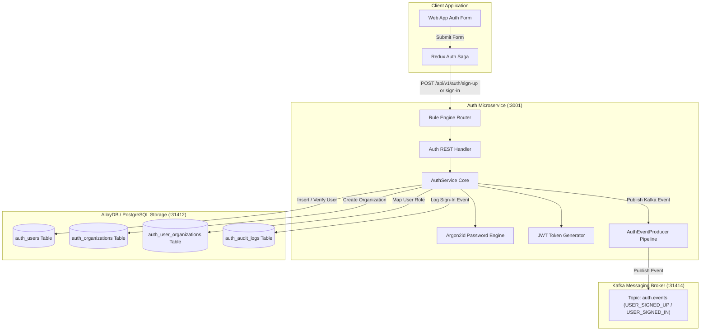
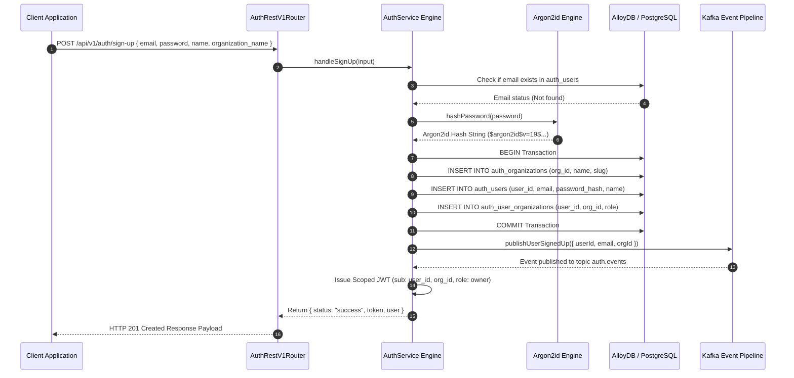
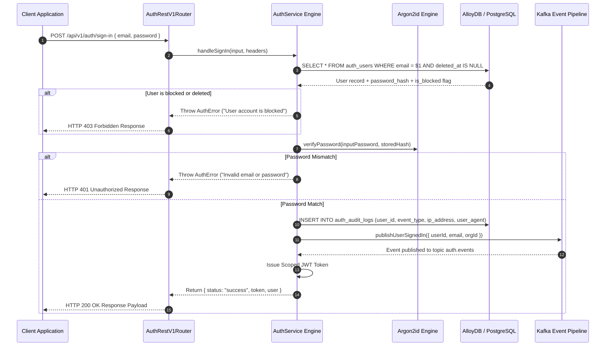

# ADR 0002: Sign-Up, Sign-In, Argon2id Hashing, Kafka Event Pipeline & Audit Logging

- **Status**: Accepted
- **Date**: 2026-08-23
- **Context**: User registration (Sign-Up) and authentication (Sign-In) must provide secure password hashing using Argon2id, atomic user & organization creation, structured audit logging, JWT session token generation, and asynchronous Kafka event publishing.

---

## 🏛 High-Level Design (HLD)



---

## 🔬 Low-Level Design (LLD)

### 1. Sign-Up Sequence Flow



---

### 2. Sign-In Sequence Flow



---

## 🌳 End-to-End Function Call Stacks (ASCII Trees)

### 1. User Sign-In Call Stack (Frontend + Backend)

```tree
User clicks "Sign In" button (Frontend User Action)
└── SignUpForm / SignInForm.tsx [src/features/auth/ui/SignInForm.tsx]
    └── handleSubmit(e) [Form Event Handler]
        └── onSubmit({ email, password }) [Prop Callback]
            └── SignInPage.handleSubmit() [src/app/auth/sign-in/page.tsx]
                └── dispatch(authActions.signInSubmitted({ email, password })) [Redux Action Dispatch]
                    │
                    ├── 1. authSlice.reducers.signInSubmitted() [src/features/auth/auth.slice.ts]
                    │   └── Updates Redux State -> state.auth.status = 'loading'
                    │
                    └── 2. rootSaga -> authSaga Watcher [src/features/auth/auth.saga.ts]
                        └── takeEvery(authActions.signInSubmitted.type, handleSignIn)
                            └── handleSignIn(action) [Redux-Saga Generator]
                                └── authApiClient.signIn(payload) [src/lib/auth-client.ts]
                                    │
                                    ├── 3. Resilient Adapter Decorator Chain [src/core/data-driven/adapter-decorators.ts]
                                    │   └── withTracing -> withCircuitBreaker -> withCache -> withRetry
                                    │
                                    └── 4. RawAuthApiClient.execute('signIn', { body }) [src/lib/auth-client.ts]
                                        └── fetch('http://localhost:3001/api/v1/auth/sign-in', { method: 'POST', body })
                                            │
                                            ├── [HTTP Network Request Wire] ──> [Backend Auth Service :3001]
                                            │   └── http.createServer [server.ts]
                                            │       └── req.on('end') [server.ts]
                                            │           └── AuthRestV1Router.route() [router.ts]
                                            │               └── handleSignIn() [route.rules.ts]
                                            │                   └── AuthService.signIn() [service.ts] (Facade)
                                            │                       └── UserAuthDomainService.signIn() [services/user-auth.service.ts] (SRP Engine)
                                            │                           │
                                            │                           ├── a. SignInInputSchema.parse(input) [schema/auth.schema.ts]
                                            │                           ├── b. RealPostgresAuthAdapter.findUserByEmail() [real-postgres-auth.adapter.ts]
                                            │                           │   ├── pool.connect() [pg Pool]
                                            │                           │   ├── client.query(AUTH_QUERIES.FLOW_SIGN_IN.FIND_USER_BY_EMAIL) [auth.queries.ts]
                                            │                           │   └── client.release() [pg Pool]
                                            │                           ├── c. verifyPassword(password, user.password_hash) [shared/utils/argon2.util.ts]
                                            │                           ├── d. RealPostgresAuthAdapter.recordAuditLog() [real-postgres-auth.adapter.ts]
                                            │                           │   ├── pool.connect() [pg Pool]
                                            │                           │   ├── client.query(AUTH_QUERIES.TENANT_RLS.SET_LOCAL_TENANT_CONTEXT) [RLS Context]
                                            │                           │   ├── client.query(AUTH_QUERIES.FLOW_SIGN_IN.RECORD_AUDIT_LOG) [Insert Log]
                                            │                           │   └── client.release() [pg Pool]
                                            │                           ├── e. createToken(userId, email, orgDetails) [shared/utils/jwt.util.ts]
                                            │                           ├── f. verifyToken(token) [shared/utils/jwt.util.ts]
                                            │                           └── g. AuthEventProducer.publishUserSignedIn() [auth-event.producer.ts]
                                            │                               └── ProducerMiddlewarePipeline.execute() [messaging-middleware.ts]
                                            │                                   ├── loggingProducerMiddleware() [Logger]
                                            │                                   ├── tracingProducerMiddleware() [OpenTelemetry Spans]
                                            │                                   └── CentralizedKafkaClient.publishToTopic('auth.events') [Kafka :31414]
                                            │
                                            └── ON RESPONSE SUCCESS (200 OK):
                                                ├── setAuthCookies(token, role) [document.cookie: authjs.session-token]
                                                ├── put(authActions.authSuccess({ user, organization })) [Redux State -> status: 'success']
                                                ├── eventBus.emit('auth.signInSuccess', response) [Cross-Feature Event Bus]
                                                └── useEffect() Status Watcher [src/app/auth/sign-in/page.tsx]
                                                    ├── router.push('/dashboard') [Next.js Router Navigation]
                                                    └── router.refresh() [Next.js Page Cache Refresh]
```

---

### 2. User Sign-Up Call Stack (Frontend + Backend)

```tree
User clicks "Create Account" button (Frontend User Action)
└── SignUpForm.tsx [src/features/auth/ui/SignUpForm.tsx]
    └── handleSubmit(e) [Form Event Handler]
        └── onSubmit({ email, password, name, organization_name }) [Prop Callback]
            └── SignUpPage.handleSubmit() [src/app/auth/sign-up/page.tsx]
                └── dispatch(authActions.signUpSubmitted(payload)) [Redux Action Dispatch]
                    │
                    ├── 1. authSlice.reducers.signUpSubmitted() [src/features/auth/auth.slice.ts]
                    │   └── Updates Redux State -> state.auth.status = 'loading'
                    │
                    └── 2. rootSaga -> authSaga Watcher [src/features/auth/auth.saga.ts]
                        └── takeEvery(authActions.signUpSubmitted.type, handleSignUp)
                            └── handleSignUp(action) [Redux-Saga Generator]
                                └── authApiClient.signUp(payload) [src/lib/auth-client.ts]
                                    │
                                    └── 3. RawAuthApiClient.execute('signUp', { body }) [src/lib/auth-client.ts]
                                        └── fetch('http://localhost:3001/api/v1/auth/sign-up', { method: 'POST', body })
                                            │
                                            ├── [HTTP Network Request Wire] ──> [Backend Auth Service :3001]
                                            │   └── http.createServer [server.ts]
                                            │       └── req.on('end') [server.ts]
                                            │           └── AuthRestV1Router.route() [router.ts]
                                            │               └── handleSignUp() [route.rules.ts]
                                            │                   └── AuthService.signUp() [service.ts] (Facade)
                                            │                       └── UserAuthDomainService.signUp() [services/user-auth.service.ts] (SRP Engine)
                                            │                           │
                                            │                           ├── a. SignUpInputSchema.parse(input) [schema/auth.schema.ts]
                                            │                           ├── b. RealPostgresAuthAdapter.findUserByEmail() [real-postgres-auth.adapter.ts]
                                            │                           ├── c. hashPassword(password) [shared/utils/argon2.util.ts] (Argon2id Hash)
                                            │                           ├── d. RealPostgresAuthAdapter.createOrganizationAndUser() [real-postgres-auth.adapter.ts]
                                            │                           │   ├── pool.connect() [pg Pool]
                                            │                           │   ├── client.query('BEGIN') [Atomic DB Transaction]
                                            │                           │   ├── client.query(AUTH_QUERIES.FLOW_SIGN_UP.INSERT_ORG) [auth.queries.ts]
                                            │                           │   ├── client.query(AUTH_QUERIES.FLOW_SIGN_UP.INSERT_USER) [auth.queries.ts]
                                            │                           │   ├── client.query(AUTH_QUERIES.FLOW_SIGN_UP.INSERT_USER_ORG) [auth.queries.ts]
                                            │                           │   ├── client.query('COMMIT') [Commit Transaction]
                                            │                           │   └── client.release() [pg Pool]
                                            │                           ├── e. createToken(userId, email, orgDetails) [shared/utils/jwt.util.ts]
                                            │                           └── f. AuthEventProducer.publishUserSignedUp() [auth-event.producer.ts]
                                            │                               └── CentralizedKafkaClient.publishToTopic('auth.events') [Kafka :31414]
                                            │
                                            └── ON RESPONSE SUCCESS (201 Created):
                                                ├── setAuthCookies(token, role) [document.cookie: authjs.session-token]
                                                ├── put(authActions.authSuccess({ user, organization })) [Redux State -> status: 'success']
                                                └── router.push('/dashboard') [Next.js Navigation]
```

---

## 📋 Architectural Principles & Guarantees

1. **Argon2id Standard**: Password verification enforces Argon2id with memory cost and time cost parameters to prevent GPU brute-force attacks.
2. **Atomic Multi-Entity Transactions**: Sign-up executes user creation, organization initialization, and N-to-N membership mapping inside an atomic PostgreSQL database transaction.
3. **Structured Audit Trail & Kafka Events**: Every sign-in attempt captures IP address and user-agent string into `auth_audit_logs` and emits real-time `USER_SIGNED_IN` / `USER_SIGNED_UP` events over Kafka.
