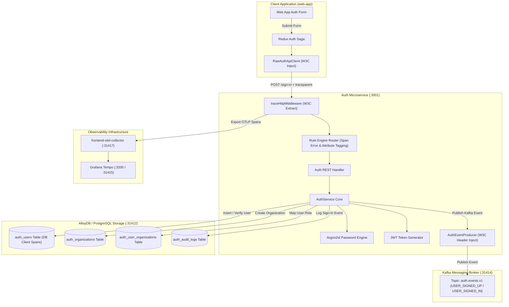
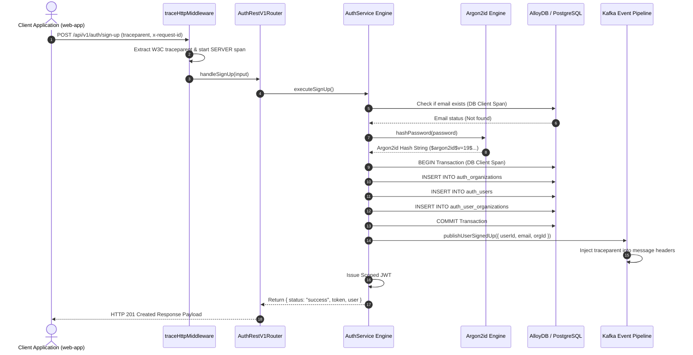
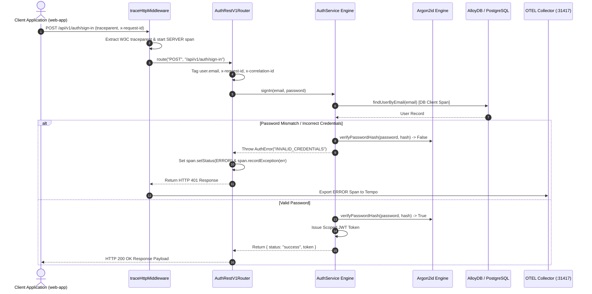

# ADR 0002: Sign-Up, Sign-In, Argon2id Hashing, OpenTelemetry Tracing & Audit Logging

- **Status**: Accepted
- **Date**: 2026-08-23
- **Context**: User registration (Sign-Up) and authentication (Sign-In) must provide secure password hashing using Argon2id, atomic user & organization creation, structured audit logging, JWT session token generation, end-to-end W3C trace context propagation, and asynchronous Kafka event publishing.

---

## 🏛 High-Level Design (HLD)



---

## 🔬 Low-Level Design (LLD)

### 1. Sign-Up Sequence Flow



---

### 2. Sign-In Sequence Flow (With Error Span Handling)



---

## 🌳 End-to-End Function Call Stack (ASCII Tree)

```tree
User Clicks "Sign In" Button / Executes API Request
└── 1. RawAuthApiClient.execute('signIn', payload) [src/lib/auth-client.ts]
    ├── Injects W3C Header: traceparent: 00-4bf92f3577b34da6a3ce929d0e0e4736-00f067aa0ba902b7-01
    ├── Injects Header: x-request-id: req-1787491177230-g4lb89
    └── Injects Header: x-correlation-id: req-1787491177230-g4lb89
        │
        ├── [HTTP Network Boundary: POST http://localhost:3001/api/v1/auth/sign-in] ──>
        │
        └── 2. server.ts :: http.createServer handler
            └── 3. middleware.ts :: traceHttpMiddleware(req, res)
                ├── Extract incoming `traceparent` via propagation.extract(ROOT_CONTEXT, headers)
                └── Start Active SERVER Span: `HTTP POST /api/v1/auth/sign-in`
                    │
                    └── 4. router.ts :: AuthRestV1Router.route("POST", "/api/v1/auth/sign-in")
                        └── withSpan("REST POST /api/v1/auth/sign-in")
                            ├── Tag Attribute: `user.email = jaydeep@gmail.com`
                            ├── Tag Attribute: `x-request-id = req-1787491177230-g4lb89`
                            ├── Tag Attribute: `x-correlation-id = req-1787491177230-g4lb89`
                            │
                            └── 5. service.ts :: AuthService.signIn(email, password)
                                ├── 6. real-postgres-auth.adapter.ts :: findUserByEmail(email)
                                │   └── withSpan("DB SELECT findUserByEmail", kind: CLIENT)
                                │       └── Execute PostgreSQL SQL Query (Port 31412)
                                │
                                ├── 7. argon2id.ts :: verifyPasswordHash(password, hash)
                                │   └── [Failure Mode] If mismatch: Set SpanStatus.ERROR & recordException
                                │
                                └── 8. auth-event.producer.ts :: publishUserSignedIn()
                                    ├── Inject traceparent into Kafka message headers
                                    └── Publish to Kafka Topic `auth.events.v1` (Port 31414)
```
