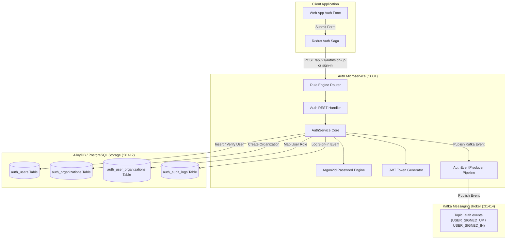
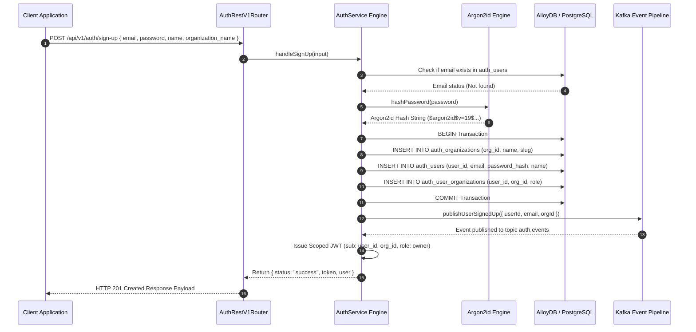
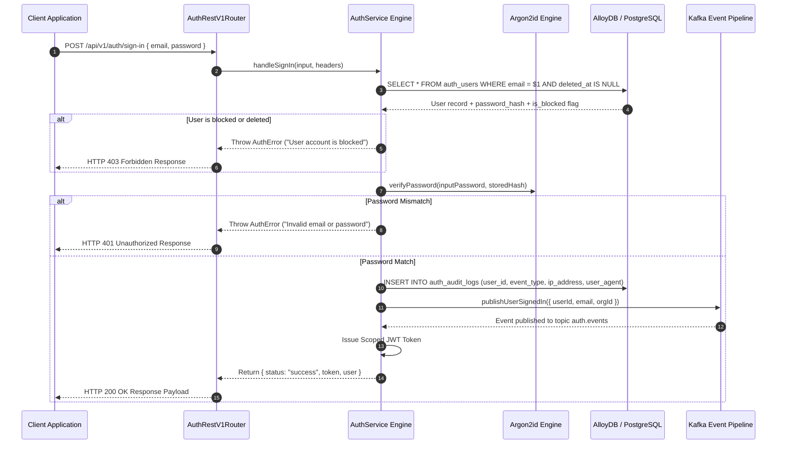

# ADR 0002: Sign-Up, Sign-In, Argon2id Hashing, Kafka Event Pipeline & Audit Logging

- **Status**: Accepted
- **Date**: 2026-08-23
- **Context**: User registration (Sign-Up) and authentication (Sign-In) must provide secure password hashing using Argon2id, atomic user & organization creation, structured audit logging, JWT session token generation, and asynchronous Kafka event publishing.

---

## 🏛 High-Level Design (HLD)

---

## 🔬 Low-Level Design (LLD)

### 1. Sign-Up Sequence Flow

---

### 2. Sign-In & Verification Sequence Flow

---

## 📋 Architectural Principles & Guarantees

1. **Argon2id Standard**: Password verification enforces Argon2id with memory cost and time cost parameters to prevent GPU brute-force attacks.
2. **Atomic Multi-Entity Transactions**: Sign-up executes user creation, organization initialization, and N-to-N membership mapping inside an atomic PostgreSQL database transaction.
3. **Structured Audit Trail & Kafka Events**: Every sign-in attempt captures IP address and user-agent string into `auth_audit_logs` and emits real-time `USER_SIGNED_IN` / `USER_SIGNED_UP` events over Kafka.
