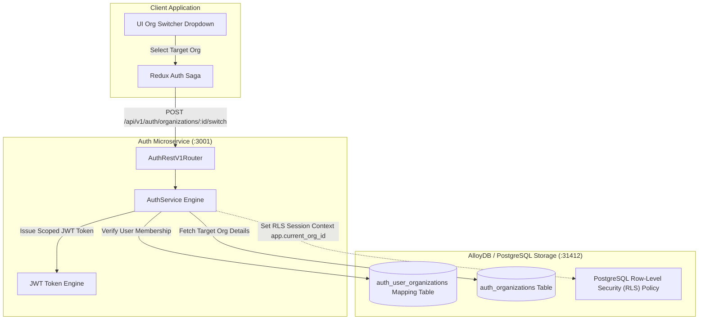
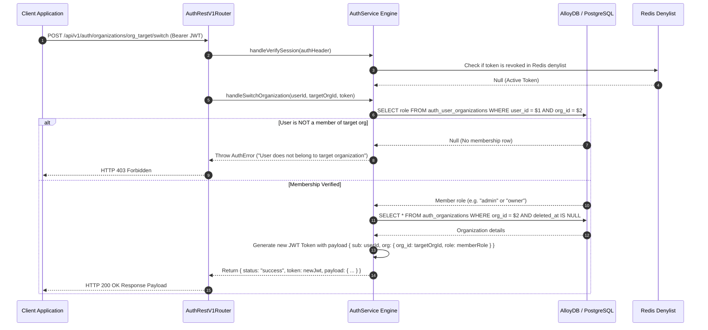

# ADR 0003: N-to-N Multi-Tenant Organization Context Switching & RLS

- **Status**: Accepted
- **Date**: 2026-08-23
- **Context**: Users can belong to multiple organizations. Switching organization context must issue a updated JWT token scoped to the target organization while enforcing Row Level Security (RLS) policies at the database layer.

---

## 🏛 High-Level Design (HLD)

---

## 🔬 Low-Level Design (LLD)

---

## 📋 Multi-Tenant Isolation Principles

1. **N-to-N Mapping**: User and Organization relationships are decoupled via `auth_user_organizations` table.
2. **Context Switching**: Switching active organization generates a fresh, signed JWT token with updated scope without forcing full re-authentication.
3. **Database RLS**: Database queries set `SET LOCAL app.current_org_id = 'org_xxx'` to guarantee multi-tenant row isolation.
