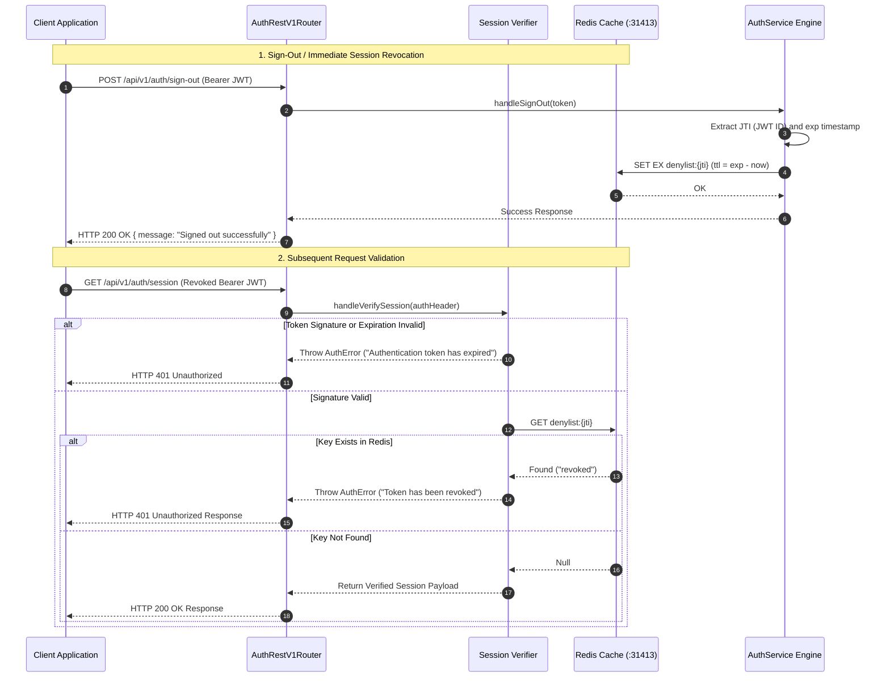

# ADR 0004: Redis Token Denylist & Session Lifetime Management

- **Status**: Accepted
- **Date**: 2026-08-23
- **Context**: State-less JWT tokens cannot be invalidated natively before expiration. Immediate sign-out and session revocation must be guaranteed via a fast, distributed Redis Token Denylist.

---

## 🏛 High-Level Design (HLD)

```mermaid
flowchart TD
    subgraph Client["Client Application"]
        UI["Web App / Consumer"]
        Saga["Auth Redux Saga"]
    end

    subgraph Service["Auth Microservice (:3001)"]
        Router["AuthRestV1Router"]
        ServiceCore["AuthService Engine"]
        SessionManager["Session Verification Engine"]
    end

    subgraph MemoryStore["Redis Token Denylist (:31413)"]
        DenylistSet[("Key: denylist:{token_id} | TTL: Remaining Token Lifetime")]
    end

    UI -->|Sign Out Action| Saga
    Saga -->|POST /api/v1/auth/sign-out| Router
    Router --> ServiceCore
    ServiceCore -->|SET denylist:jti EX ttl| DenylistSet

    UI -->|Protected Request| Router
    Router --> SessionManager
    SessionManager -->|O(1) GET denylist:jti| DenylistSet
    DenylistSet -- Revoked / Active Status --> SessionManager
```

---

## 🔬 Low-Level Design (LLD)



---

## 📋 Architectural Principles & Performance

1. **O(1) Redis Lookup**: Session validation performs an instant `O(1)` key lookup against Redis before allowing requests to proceed.
2. **Automatic Key Expiration**: Redis entries are set with `TTL = remaining_jwt_seconds` so memory is auto-reclaimed once the JWT naturally expires.
3. **Frontend Auto-Logout Handling**: When client receives 401 (`TOKEN_EXPIRED` / `UNAUTHORIZED`), stale cookies are purged automatically, prompting the user to re-authenticate.
