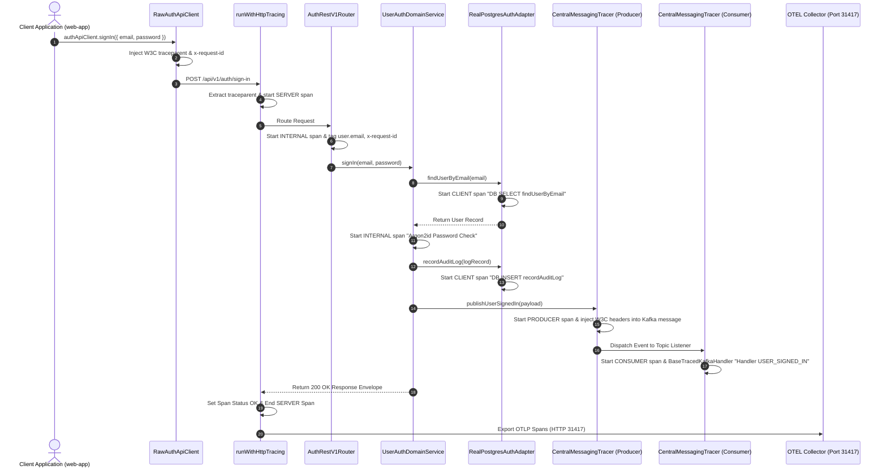

# ADR 0005: OpenTelemetry Centralized End-to-End Authentication Tracing & Middleware Architecture

- **Status**: Accepted
- **Date**: 2026-08-23
- **Author**: @Chief-Strategist-J
- **Scope**: `@observability/core/tracing` centralized engine, `@observability/auth` tracing infrastructure, HTTP middleware, AsyncLocalStorage context propagation, W3C trace propagation, CORS wildcard handling, and Grafana Tempo ingestion

---

## 1. Context & Problem Statement

The `@observability/auth` service executes critical authentication operations including user sign-in, user registration, Argon2id password verification, audit logging, and session revocation. Previously:
1. Tracing logic was implemented ad-hoc inside `@observability/auth`, duplicating boilerplate code across microservices.
2. Async/await boundaries lost active span context because `AsyncLocalStorageContextManager` was not registered globally.
3. Importing server-only OpenTelemetry modules (`async_hooks`, `NodeTracerProvider`) into isomorphic packages caused Next.js browser build failures (`Module not found: Can't resolve 'async_hooks'`).
4. Internal operations (Argon2id hashing, DB audit log inserts) and downstream Kafka events were missing explicit child spans in Tempo.

---

## 2. Decision & Architecture Overview

1. **Centralized Engine in `@observability/core/tracing`**:
   - Extracted all OpenTelemetry provider initialization (`initNodeTracing`), tracer factory (`getTracer`), span execution wrappers (`withSpan`), HTTP server middleware (`runWithHttpTracing`), messaging tracer (`CentralMessagingTracer`), and base handler abstractions (`BaseTracedKafkaHandler`) into `@observability/core/tracing`.
   - Separated server-only tracing exports from the isomorphic browser bundle in `packages/node/core/package.json` (`"./tracing": "./src/tracing/index.ts"`).

2. **AsyncLocalStorage Context Propagation**:
   - Registered `AsyncLocalStorageContextManager` globally inside `initNodeTracing()` to ensure active spans seamlessly propagate across Node.js `async/await` microtasks.

3. **HTTP JSON OTLP Serialization**:
   - Configured `process.env.OTEL_EXPORTER_OTLP_PROTOCOL = 'http/json'` and `SimpleSpanProcessor(OTLPTraceExporter)` pushing directly to OpenTelemetry Collector (`http://localhost:31417/v1/traces`).

4. **Complete 7-Span End-to-End Trace Waterfall**:
   - `HTTP POST /api/v1/auth/sign-in` (SERVER)
     └── `REST POST /api/v1/auth/sign-in` (INTERNAL)
          ├── `DB SELECT findUserByEmail` (CLIENT)
          ├── `Argon2id Password Check` (INTERNAL)
          ├── `DB INSERT recordAuditLog` (CLIENT)
          ├── `Kafka PRODUCE USER_SIGNED_IN` (PRODUCER)
          └── `Handler USER_SIGNED_IN` (INTERNAL)

---

## 3. High-Level Architecture Diagram

```mermaid
graph TD
    Client["Client App / Web-App Browser (Port 31400)"] -->|HTTP POST /sign-in (traceparent, x-request-id)| AuthServer["Auth HTTP Server (Port 3001)"]
    
    subgraph Central Core Tracing Engine (@observability/core/tracing)
        TracerEngine["initNodeTracing & getTracer"]
        AsyncHooks["AsyncLocalStorageContextManager"]
        HttpTracing["runWithHttpTracing Middleware"]
        MessagingTracing["CentralMessagingTracer (Producer & Consumer)"]
        BaseHandler["BaseTracedKafkaHandler"]
    end

    subgraph Auth Microservice Engine
        AuthServer --> HttpTracing
        HttpTracing --> Router["AuthRestV1Router (Attributes Tagging)"]
        Router --> Service["UserAuthDomainService (Argon2id & Service Spans)"]
        Service --> DB["RealPostgresAuthAdapter (DB Client Child Spans)"]
        Service --> Kafka["AuthEventProducer (W3C Header Injection)"]
        Kafka --> Consumer["AuthEventConsumer (BaseTracedKafkaHandler Dispatch)"]
    end
    
    HttpTracing -->|OTLP HTTP Spans (JSON)| OTELCollector["frontend-otel-collector (Port 31417)"]
    OTELCollector -->|gRPC Spans| Tempo["frontend-tempo (Port 3200)"]
    Tempo -->|TraceQL Search| Grafana["Grafana Explore UI (Port 31415 / 31419)"]
```

---

## 4. Low-Level Sequence Diagram



---

## 5. Verification & TraceQL Reference

### Tested TraceQL Queries:
```traceql
# Search by Request ID
{ .x-request-id = "req-full-consumer-100" }

# Search by Service & Target Route
{ .service.name = "auth-service" && .http.target = "/api/v1/auth/sign-in" }

# Search by Kafka Event Name
{ .messaging.system = "kafka" && .messaging.kafka.event_name = "USER_SIGNED_IN" }
```
