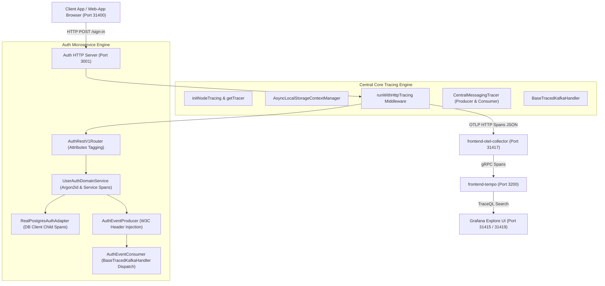
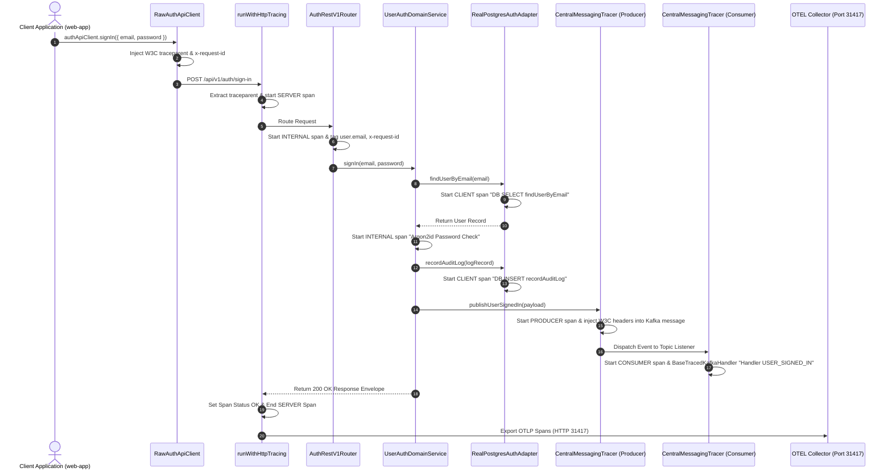

# ADR 0005: OpenTelemetry Centralized End-to-End Authentication Tracing & Middleware Architecture

- **Status**: Accepted
- **Date**: 2026-08-23
- **Author**: @Chief-Strategist-J
- **Scope**: `@observability/core/tracing` centralized engine, `@observability/auth` tracing infrastructure, HTTP middleware, AsyncLocalStorage context propagation, W3C trace propagation, CORS wildcard handling, and Grafana Tempo ingestion

---

## 1. Context & Problem Statement

The `@observability/auth` service executes critical authentication operations including user sign-in, user registration, Argon2id password verification, audit logging, and session revocation. Previously:
1. Tracing logic was implemented ad-hoc inside `@observability/auth`, duplicating boilerplate code across microservices.
2. Async/await boundaries lost active span context because `AsyncLocalStorageContextManager` was not registered globally.
3. Importing server-only OpenTelemetry modules (`async_hooks`, `NodeTracerProvider`) into isomorphic packages caused Next.js browser build failures (`Module not found: Can't resolve 'async_hooks'`).
4. Internal operations (Argon2id hashing, DB audit log inserts) and downstream Kafka events were missing explicit child spans in Tempo.

---

## 2. Decision & Architecture Overview

1. **Centralized Engine in `@observability/core/tracing`**:
   - Extracted all OpenTelemetry provider initialization (`initNodeTracing`), tracer factory (`getTracer`), span execution wrappers (`withSpan`), HTTP server middleware (`runWithHttpTracing`), messaging tracer (`CentralMessagingTracer`), and base handler abstractions (`BaseTracedKafkaHandler`) into `@observability/core/tracing`.
   - Separated server-only tracing exports from the isomorphic browser bundle in `packages/node/core/package.json` (`"./tracing": "./src/tracing/index.ts"`).

2. **AsyncLocalStorage Context Propagation**:
   - Registered `AsyncLocalStorageContextManager` globally inside `initNodeTracing()` to ensure active spans seamlessly propagate across Node.js `async/await` microtasks.

3. **HTTP JSON OTLP Serialization**:
   - Configured `process.env.OTEL_EXPORTER_OTLP_PROTOCOL = 'http/json'` and `SimpleSpanProcessor(OTLPTraceExporter)` pushing directly to OpenTelemetry Collector (`http://localhost:31417/v1/traces`).

4. **Complete 7-Span End-to-End Trace Waterfall**:
   - `HTTP POST /api/v1/auth/sign-in` (SERVER)
     └── `REST POST /api/v1/auth/sign-in` (INTERNAL)
          ├── `DB SELECT findUserByEmail` (CLIENT)
          ├── `Argon2id Password Check` (INTERNAL)
          ├── `DB INSERT recordAuditLog` (CLIENT)
          ├── `Kafka PRODUCE USER_SIGNED_IN` (PRODUCER)
          └── `Handler USER_SIGNED_IN` (INTERNAL)

---

## 3. High-Level Architecture Diagram



---

## 4. Low-Level Sequence Diagram



---

## 5. End-to-End Function Call Stack Topology

```text
User Clicks "Sign In" / Executes API Request
└── 1. RawAuthApiClient.execute('signIn', payload) [packages/node/web-app/src/lib/auth-client.ts]
    ├── Injects W3C Header: traceparent: 00-02abb00eeddd037c15b61bf5c996aa63-df045a9e6e1d0593-01
    ├── Injects Header: x-request-id: req-full-consumer-100
    └── Injects Header: x-correlation-id: corr-full-consumer-100
        │
        ├── [HTTP Network Boundary: POST http://localhost:3001/api/v1/auth/sign-in] ──>
        │
        └── 2. server.ts :: http.createServer handler [packages/node/auth/src/server.ts]
            └── 3. runWithHttpTracing(req, res) [@observability/core/tracing/http-middleware.ts]
                ├── Extract incoming `traceparent` via propagation.extract(ROOT_CONTEXT, headers)
                └── Start Active SERVER Span: `HTTP POST /api/v1/auth/sign-in`
                    │
                    └── 4. router.ts :: AuthRestV1Router.route("POST", "/api/v1/auth/sign-in") [packages/node/auth/src/api/rest/v1/router.ts]
                        └── withSpan("REST POST /api/v1/auth/sign-in") [@observability/core/tracing/tracer.ts]
                            ├── Tag Attribute: `user.email = jaydeep@gmail.com`
                            ├── Tag Attribute: `x-request-id = req-full-consumer-100`
                            ├── Tag Attribute: `x-correlation-id = corr-full-consumer-100`
                            │
                            └── 5. user-auth.service.ts :: UserAuthDomainService.signIn(input) [packages/node/auth/src/features/auth/services/user-auth.service.ts]
                                ├── 6. real-postgres-auth.adapter.ts :: findUserByEmail(email) [packages/node/auth/src/infra/adapters/postgres/real-postgres-auth.adapter.ts]
                                │   └── withSpan("DB SELECT findUserByEmail", kind: CLIENT) [@observability/core/tracing/tracer.ts]
                                │       └── Execute PostgreSQL SQL Query (Port 31412)
                                │
                                ├── 7. argon2.util.ts :: verifyPassword(password, hash) [packages/node/auth/src/shared/utils/argon2.util.ts]
                                │   └── withSpan("Argon2id Password Check") [@observability/core/tracing/tracer.ts]
                                │
                                ├── 8. real-postgres-auth.adapter.ts :: recordAuditLog(logRecord) [packages/node/auth/src/infra/adapters/postgres/real-postgres-auth.adapter.ts]
                                │   └── withSpan("DB INSERT recordAuditLog", kind: CLIENT) [@observability/core/tracing/tracer.ts]
                                │       └── Execute PostgreSQL SQL Insert (Port 31412)
                                │
                                └── 9. auth-event.producer.ts :: publishUserSignedIn(payload) [packages/node/auth/src/shared/messaging/producers/auth-event.producer.ts]
                                    └── CentralMessagingTracer.createProducerSpan("auth.events.v1", "USER_SIGNED_IN") [@observability/core/tracing/messaging-tracer.ts]
                                        ├── Start PRODUCER Span: `Kafka PRODUCE USER_SIGNED_IN`
                                        ├── Inject traceparent into Kafka message headers
                                        └── Publish to Kafka Topic `auth.events.v1` (Port 31414)
                                            │
                                            └── 10. auth-event.consumer.ts :: subscribeToTopic('auth.events.v1') [packages/node/auth/src/shared/messaging/consumers/auth-event.consumer.ts]
                                                ├── CentralMessagingTracer.createConsumerSpan(event) [@observability/core/tracing/messaging-tracer.ts]
                                                │   └── Start CONSUMER Span: `Kafka CONSUMER USER_SIGNED_IN`
                                                │
                                                └── 11. UserSignedInHandler extends BaseTracedKafkaHandler [@observability/core/tracing/traced-handler.ts]
                                                    ├── Start INTERNAL Span: `Handler USER_SIGNED_IN`
                                                    └── AuthReadProjectionStore.getInstance().applyUserSignedIn() [packages/node/auth/src/shared/messaging/cqrs/projection.store.ts]

    └── 12. SimpleSpanProcessor -> OTLPTraceExporter [@observability/core/tracing/tracer.ts]
        ├── POST http://localhost:31417/v1/traces (frontend-otel-collector)
        └── Export gRPC -> frontend-tempo:3200 (Queryable via TraceQL)
```

---

## 6. Verification & TraceQL Reference

### Tested TraceQL Queries:
```traceql
# Search by Request ID
{ .x-request-id = "req-full-consumer-100" }

# Search by Service & Target Route
{ .service.name = "auth-service" && .http.target = "/api/v1/auth/sign-in" }

# Search by Kafka Event Name
{ .messaging.system = "kafka" && .messaging.kafka.event_name = "USER_SIGNED_IN" }
```
