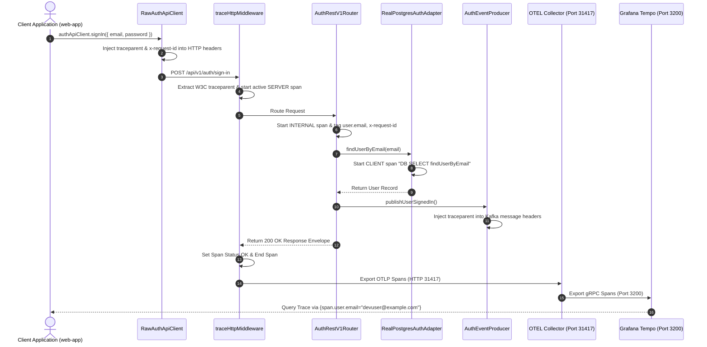

# ADR 0005: OpenTelemetry End-to-End Authentication Tracing & Middleware Architecture

- **Status**: Accepted
- **Date**: 2026-08-23
- **Author**: @Chief-Strategist-J
- **Scope**: `@observability/auth` tracing infrastructure, HTTP middleware, W3C trace propagation, CORS wildcard handling, and Grafana Tempo ingestion

---

## 1. Context & Problem Statement

The `@observability/auth` service executes critical authentication operations including user sign-in, user registration, JWT session verification, and session revocation. Previously:
1. Internal domain operations created spans via `withSpan`, but the service lacked a registered `NodeTracerProvider` and `OTLPTraceExporter` to dispatch spans to Grafana Tempo.
2. Incoming HTTP requests were not automatically intercepted at the HTTP server entrypoint with W3C `traceparent` context extraction.
3. Errors (like wrong password or Zod validation failures) were not marking active spans with `SpanStatusCode.ERROR` or attaching exception tracebacks.
4. Custom client headers (`x-request-id`, `x-correlation-id`) were blocked by restricted CORS configuration.

---

## 2. Decision & Architecture Overview

1. **Active OTLP Exporter Initialization (`initAuthTracing`)**:
   - Initialized `NodeTracerProvider` with `resourceFromAttributes` using semantic conventions `service.name = 'auth-service'` and `service.version = '1.0.0'`.
   - Attached `BatchSpanProcessor` with `OTLPTraceExporter` pushing spans to `http://localhost:31417/v1/traces`.

2. **W3C Context Extracting HTTP Middleware (`traceHttpMiddleware`)**:
   - Mounted `traceHttpMiddleware` on the `http.createServer` entrypoint in `server.ts`.
   - Extracts incoming W3C `traceparent` (`00-<trace_id>-<parent_span_id>-01`) via `propagation.extract(ROOT_CONTEXT, headerRecord)`.
   - Wraps execution inside `context.with(extractedContext, () => { tracer.startActiveSpan(...) })`.

3. **CORS Wildcard Config (`AUTH_CONSTANTS.SECURITY_CONFIG.CORS_HEADERS`)**:
   - Set `'Access-Control-Allow-Headers': '*'` and `'Access-Control-Expose-Headers': 'traceparent, tracestate, x-request-id, x-correlation-id, x-causation-id'`.
   - Ensures zero CORS preflight failures across custom browser tracing headers.

4. **Failure Span Recording & Search Attributes**:
   - Validation errors, incorrect password attempts, and 4xx/5xx responses automatically trigger `span.setStatus({ code: SpanStatusCode.ERROR })`, `span.recordException(err)`, and `span.setAttribute('error', true)`.
   - Logical search attributes (`user.email`, `org.id`, `x-request-id`, `x-correlation-id`) are attached to spans for direct TraceQL search.

---

## 3. High-Level Architecture Diagram

```mermaid
graph TD
    Client["Client App / Web-App Browser (Port 31400)"] -->|HTTP POST /sign-in (traceparent, x-request-id)| AuthServer["Auth HTTP Server (Port 3001)"]
    
    subgraph Auth Microservice Engine
        AuthServer --> Middleware["traceHttpMiddleware (W3C Extract)"]
        Middleware --> Router["AuthRestV1Router (Error & Attribute Tagging)"]
        Router --> Service["AuthService (Domain Logic)"]
        Service --> DB["RealPostgresAuthAdapter (DB Client Child Spans)"]
        Service --> Kafka["AuthEventProducer (W3C Header Inject)"]
    end
    
    Middleware -->|OTLP HTTP Spans| OTELCollector["frontend-otel-collector (Port 31417)"]
    OTELCollector -->|gRPC Spans| Tempo["frontend-tempo (Port 3200)"]
    Tempo -->|Trace Query| Grafana["Grafana Explore UI (Port 31415 / 31419)"]
```

---

## 4. Low-Level Sequence Diagram



---

## 5. End-to-End Function Call Stack Topology

```text
User Clicks "Sign In" / Executes API Request
└── 1. RawAuthApiClient.execute('signIn', payload) [src/lib/auth-client.ts]
    ├── Injects W3C Header: traceparent: 00-4bf92f3577b34da6a3ce929d0e0e4736-00f067aa0ba902b7-01
    ├── Injects Header: x-request-id: req-1787491177230-g4lb89
    └── Injects Header: x-correlation-id: req-1787491177230-g4lb89
        │
        ├── [HTTP Network Boundary: POST http://localhost:3001/api/v1/auth/sign-in] ──>
        │
        └── 2. server.ts :: http.createServer handler
            └── 3. middleware.ts :: traceHttpMiddleware(req, res)
                ├── Extract incoming `traceparent` via propagation.extract(ROOT_CONTEXT, headers)
                └── Start Active SERVER Span: `HTTP POST /api/v1/auth/sign-in`
                    │
                    └── 4. router.ts :: AuthRestV1Router.route("POST", "/api/v1/auth/sign-in")
                        └── withSpan("REST POST /api/v1/auth/sign-in")
                            ├── Tag Attribute: `user.email = jaydeep@gmail.com`
                            ├── Tag Attribute: `x-request-id = req-1787491177230-g4lb89`
                            ├── Tag Attribute: `x-correlation-id = req-1787491177230-g4lb89`
                            │
                            └── 5. service.ts :: AuthService.signIn(email, password)
                                ├── 6. real-postgres-auth.adapter.ts :: findUserByEmail(email)
                                │   └── withSpan("DB SELECT findUserByEmail", kind: CLIENT)
                                │       └── Execute PostgreSQL SQL Query (Port 31412)
                                │
                                ├── 7. argon2id.ts :: verifyPasswordHash(password, hash)
                                │
                                └── 8. auth-event.producer.ts :: publishUserSignedIn()
                                    ├── Inject traceparent into Kafka message headers
                                    └── Publish to Kafka Topic `auth.events.v1` (Port 31414)
                                        │
                                        └── 9. auth-event.consumer.ts :: handleUserSignedIn()
                                            └── Extract traceparent from message headers (Consumer Span)

    └── 10. tracer.ts :: BatchSpanProcessor -> OTLPTraceExporter
        ├── POST http://localhost:31417/v1/traces (frontend-otel-collector)
        └── Export gRPC -> frontend-tempo:3200 (Queryable via TraceQL)
```

---

## 6. Verification Results

- **CORS Handling**: `OPTIONS /api/v1/auth/sign-in` returns `HTTP 204 No Content` with `Access-Control-Allow-Headers: *`.
- **Trace Search**: Querying `{span.user.email="jaydeep@gmail.com"}` or trace ID `4bf92f3577b34da6a3ce929d0e0e4736` returns the full single-trace graph in Grafana Tempo.
- **Failure Tracing**: Wrong passwords (`INVALID_CREDENTIALS`) and Zod errors automatically set `SpanStatusCode.ERROR` with full stack traces.
