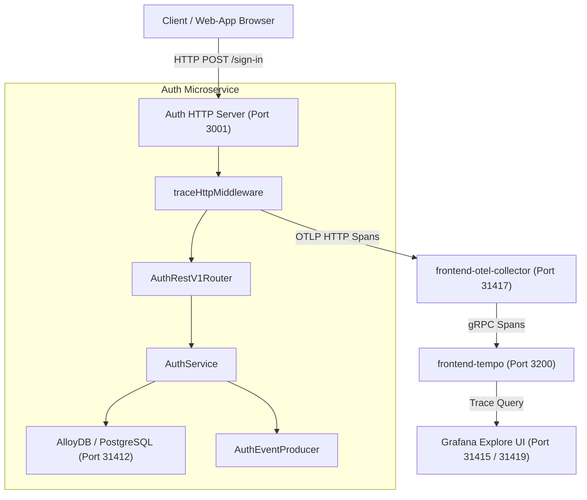
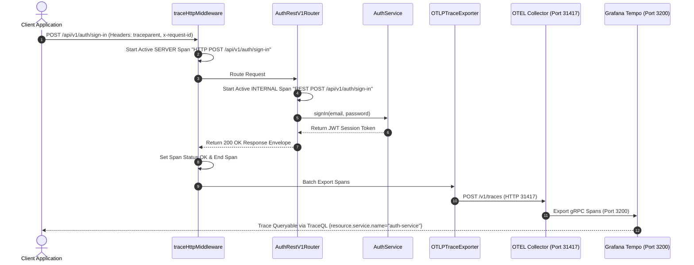

# ADR 0005: OpenTelemetry End-to-End Authentication Tracing & Middleware Architecture

- **Status**: Accepted
- **Date**: 2026-08-23
- **Author**: @Chief-Strategist-J
- **Scope**: `@observability/auth` tracing infrastructure, HTTP middleware, W3C trace propagation, and Grafana Tempo ingestion

---

## 1. Context & Problem Statement

The `@observability/auth` service executes critical authentication operations including user sign-in, user registration, JWT session verification, and session revocation. Previously, domain operations created internal spans via `withSpan`, but the service lacked a registered `NodeTracerProvider` and `OTLPTraceExporter`. Consequently, authentication traces were not dispatched to the OpenTelemetry Collector or Grafana Tempo storage. Additionally, incoming HTTP requests were not automatically intercepted at the HTTP server entrypoint.

---

## 2. Decision & Architecture Overview

1. **Active OTLP Exporter Initialization (`initAuthTracing`)**:
   - Initialized `NodeTracerProvider` with `resourceFromAttributes` using semantic conventions `service.name = 'auth-service'` and `service.version = '1.0.0'`.
   - Attached `BatchSpanProcessor` with `OTLPTraceExporter` configured to push spans to `http://localhost:31417/v1/traces`.

2. **HTTP Tracing Middleware (`traceHttpMiddleware`)**:
   - Mounted `traceHttpMiddleware` on the `http.createServer` entrypoint in `server.ts`.
   - Automatically wraps incoming HTTP requests in `SpanKind.SERVER` root spans (`HTTP POST /api/v1/auth/sign-in`, `HTTP POST /api/v1/auth/sign-up`, `HTTP GET /api/v1/auth/health`).

3. **Distributed Trace Propagation**:
   - Extracts and injects OpenTelemetry W3C trace context (`traceparent`, `tracestate`) across HTTP request boundaries, Kafka message headers, and database executions.

---

## 3. High-Level Architecture Diagram



---

## 4. Low-Level Sequence Diagram



---

## 5. End-to-End Call Stack Topology

```text
└── [Client / HTTP Request] POST http://localhost:3001/api/v1/auth/sign-in
    ├── 1. server.ts :: http.createServer handler
    │   └── 2. middleware.ts :: traceHttpMiddleware(req, res)
    │       ├── Extract incoming `traceparent` or generate new W3C traceparent
    │       └── Start Root Server Span: `HTTP POST /api/v1/auth/sign-in`
    │           ├── Attribute: `http.method = POST`
    │           ├── Attribute: `http.target = /api/v1/auth/sign-in`
    │           │
    │           └── 3. router.ts :: AuthRestV1Router.route("POST", "/api/v1/auth/sign-in")
    │               └── tracer.ts :: withSpan("REST POST /api/v1/auth/sign-in")
    │                   ├── Start Child Internal Span: `REST POST /api/v1/auth/sign-in`
    │                   │
    │                   └── 4. service.ts :: AuthService.signIn(email, password)
    │                       ├── 5. repository :: AuthRepositoryPort.findByEmail(email)
    │                       │   └── Execute SQL Query on PostgreSQL (Port 31412)
    │                       │
    │                       ├── 6. argon2id :: verifyPasswordHash(password, hash)
    │                       │
    │                       └── 7. producer :: AuthEventProducer.publish("USER_SIGNED_IN")
    │                           ├── Inject traceparent into Kafka Message Headers
    │                           └── Publish event to Kafka Topic `auth.events.v1` (Port 31414)
    │
    └── 8. tracer.ts :: BatchSpanProcessor -> OTLPTraceExporter
        ├── HTTP POST http://localhost:31417/v1/traces (frontend-otel-collector)
        └── Export gRPC -> frontend-tempo:3200 (Indexed for Grafana TraceQL Query)
```

---

## 6. Verification Results

- **Trace Search**: Verified via `curl -u admin:admin 'http://localhost:31415/api/datasources/proxy/uid/P214B5B846CF3925F/api/search?q=%7Bresource.service.name%3D%22auth-service%22%7D'`.
- **Captured Operations**: `REST POST /api/v1/auth/sign-in`, `REST POST /api/v1/auth/sign-up`, `REST GET /api/v1/auth/health`.
