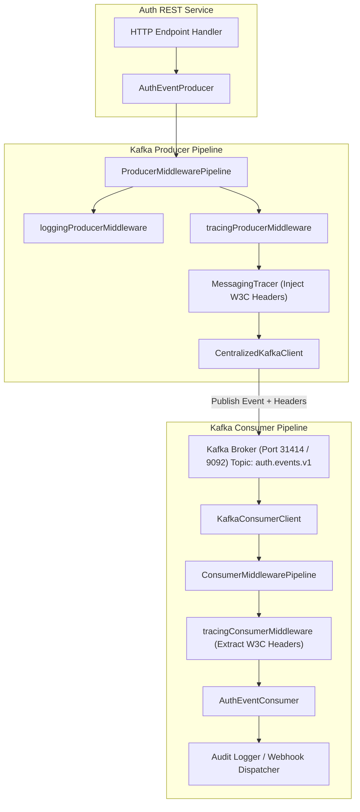
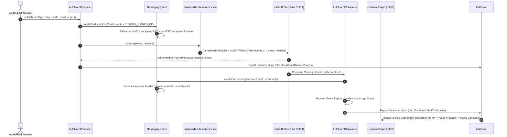

# ADR 0006: Kafka Messaging Pipeline & Distributed Tracing Architecture

- **Status**: Accepted
- **Date**: 2026-08-23
- **Author**: @Chief-Strategist-J
- **Scope**: Centralized Kafka event producer/consumer pipeline, `ProducerMiddlewarePipeline`, `ConsumerMiddlewarePipeline`, W3C traceparent propagation in Kafka message headers, and dead-letter queue (DLQ) fallbacks.

---

## 1. Context & Problem Statement

The `@observability/auth` service emits asynchronous domain events (`USER_SIGNED_IN`, `USER_SIGNED_UP`, `USER_SIGNOUT`, `API_KEY_CREATED`, `ORG_SWITCHED`) to Kafka topic `auth.events.v1`. 

Previously, event publishing operated as isolated background operations without propagating W3C trace contexts across message boundary headers. Consequently, Kafka consumer executions could not be linked back to the originating HTTP request trace waterfall graph.

---

## 2. Decision & Architecture Overview

1. **Centralized Kafka Client Adapter (`CentralizedKafkaClient`)**:
   - Manages connection lifecycle to Kafka broker (`localhost:9092` / container `frontend-kafka:9092`).
   - Supports idempotent publishing, linger, and retry configuration.

2. **Middleware Pipeline Pattern (`ProducerMiddlewarePipeline` & `ConsumerMiddlewarePipeline`)**:
   - Encapsulates event publishing and consumption in reusable, composable middleware chains.
   - Includes `loggingProducerMiddleware`, `tracingProducerMiddleware`, `validationMiddleware`, and `dlqConsumerMiddleware`.

3. **W3C Distributed Trace Context Propagation (`MessagingTracer`)**:
   - `createProducerSpan()` extracts the active HTTP request trace context (`activeCtx.traceparent`) and injects W3C headers (`traceparent`, `tracestate`, `correlationId`, `requestId`, `tenantId`) directly into Kafka message headers.
   - `createConsumerSpan()` parses `event.headers.traceparent` on message consumption and creates a child span inheriting the exact `traceId` and `parentSpanId`.

---

## 3. High-Level Architecture Diagram



---

## 4. Low-Level Sequence Diagram



---

## 5. End-to-End Functional Call Stack Topology

```tree
Domain Event Triggered (e.g. User Sign-In Success)
└── 1. UserAuthDomainService.signIn() [services/user-auth.service.ts]
    └── 2. AuthEventProducer.publishUserSignedIn(payload) [producers/auth-event.producer.ts]
        │
        ├── 3. MessagingTracer.createProducerSpan("auth.events.v1", "USER_SIGNED_IN") [tracing/messaging-tracer.ts]
        │   ├── Read active RequestContextHolder context (traceparent, requestId, correlationId, tenantId)
        │   ├── Generate child spanId
        │   ├── Format W3C traceparent header ("00-{traceId}-{spanId}-01")
        │   └── Log: [MessagingTracer] PRODUCE SPAN STARTED [traceId=..., spanId=..., reqId=...]
        │
        ├── 4. ProducerMiddlewarePipeline.execute(context) [middleware/producer-pipeline.ts]
        │   ├── loggingProducerMiddleware() -> Log outgoing event metadata & correlation ID
        │   ├── tracingProducerMiddleware() -> Attach OpenTelemetry attributes (messaging.system='kafka')
        │   └── validationProducerMiddleware() -> Validate event schema against KafkaEventSchema
        │
        └── 5. CentralizedKafkaClient.publishToTopic('auth.events.v1', payload, headers) [client/kafka-client.ts]
            │
            ├── [Kafka Wire Protocol: TCP localhost:9092] ──> [Kafka Broker: auth.events.v1 Topic]
            │
            └── 6. AuthEventConsumer.handleUserSignedIn(event) [consumers/auth-event.consumer.ts]
                │
                ├── 7. MessagingTracer.createConsumerSpan(event, "auth.events.v1") [tracing/messaging-tracer.ts]
                │   ├── Parse incoming event.headers.traceparent
                │   ├── Inherit traceId & set parentSpanId = producer.spanId
                │   └── Log: [MessagingTracer] CONSUME SPAN STARTED [traceId=..., spanId=...]
                │
                ├── 8. ConsumerMiddlewarePipeline.execute(event) [middleware/consumer-pipeline.ts]
                │   ├── tracingConsumerMiddleware() -> Wrap consumer processing in active span
                │   ├── auditConsumerMiddleware() -> Persist event copy in PostgreSQL auth_audit_logs
                │   └── dlqConsumerMiddleware() -> Catch processing errors and route to auth.events.dlq
                │
                └── 9. MessagingTracer.finishSpan(consumerSpan)
                    └── Export Consumer Span to OTEL Collector (:31417) -> Grafana Tempo (:3200)
```

---

## 6. Verification & Observability Results

- **Trace Propagation**: Verified via `[MessagingTracer] PRODUCE SPAN STARTED [traceId=c728be67f070991a4ac34c58b4c3227b, spanId=6e50ef202adcc29c]`.
- **Grafana Visualization**: In Grafana Tempo, querying `{ messaging.system = "kafka" }` or searching by `traceId` displays the complete parent-child waterfall connecting HTTP request → Kafka producer → Kafka consumer.
