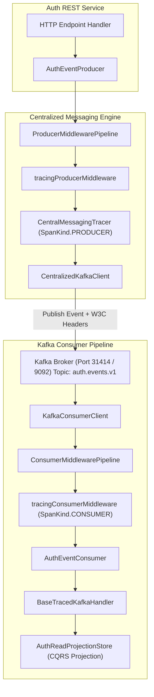
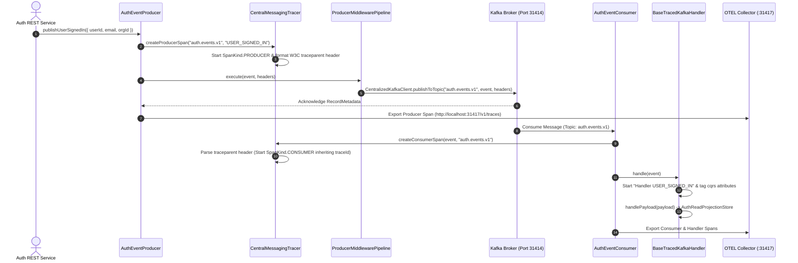

# ADR 0006: Centralized Kafka Messaging Pipeline & Distributed Tracing Architecture

- **Status**: Accepted
- **Date**: 2026-08-23
- **Author**: @Chief-Strategist-J
- **Scope**: Centralized Kafka event producer/consumer pipeline, `CentralMessagingTracer`, `BaseTracedKafkaHandler`, `ProducerMiddlewarePipeline`, `ConsumerMiddlewarePipeline`, W3C traceparent propagation in Kafka message headers, and dead-letter queue (DLQ) fallbacks.

---

## 1. Context & Problem Statement

The `@observability/auth` service emits asynchronous domain events (`USER_SIGNED_IN`, `USER_SIGNED_UP`, `USER_SIGNOUT`, `API_KEY_CREATED`, `ORG_SWITCHED`) to Kafka topic `auth.events.v1`. 

Previously:
1. Event publishing operated as isolated background operations without propagating W3C trace contexts across message boundary headers.
2. Individual consumer handlers wrote repetitive `withSpan` and attribute tagging boilerplate.
3. Middleware order placed consumer tracing at the bottom of the stack rather than wrapping the entire consumption lifecycle.

---

## 2. Decision & Architecture Overview

1. **Centralized Messaging Tracer (`CentralMessagingTracer` in `@observability/core/tracing`)**:
   - `createProducerSpan()` extracts the active HTTP request trace context (`traceparent`) and injects W3C headers (`traceparent`, `tracestate`, `correlationId`, `requestId`, `tenantId`) directly into Kafka message headers. Spans are created with `SpanKind.PRODUCER`.
   - `createConsumerSpan()` parses `event.headers.traceparent` on message consumption and creates a `SpanKind.CONSUMER` child span inheriting the exact `traceId` and `parentSpanId`.

2. **Centralized Base Traced Handler (`BaseTracedKafkaHandler`)**:
   - Abstract base handler in `@observability/core/tracing` that automatically wraps `handlePayload(payload, event, span)` in an OpenTelemetry child span (`Handler <eventName>`).
   - Automatically populates standard CQRS attributes (`cqrs.event_name`, `cqrs.event_id`, `cqrs.tenant_id`, `cqrs.user_id`, `cqrs.org_id`) without requiring repetitive per-handler boilerplate.

3. **Consumer Middleware Order**:
   - Registered `tracingConsumerMiddleware` at the entry (position 0) of `ConsumerMiddlewarePipeline` in `AuthEventConsumer` to ensure tracing covers idempotency checks, retries, handler execution, and DLQ routing.

---

## 3. High-Level Architecture Diagram



---

## 4. Low-Level Sequence Diagram



---

## 5. End-to-End Functional Call Stack Topology

```text
Domain Event Triggered (e.g. User Sign-In Success)
└── 1. UserAuthDomainService.signIn() [packages/node/auth/src/features/auth/services/user-auth.service.ts]
    └── 2. AuthEventProducer.publishUserSignedIn(payload) [packages/node/auth/src/shared/messaging/producers/auth-event.producer.ts]
        │
        ├── 3. CentralMessagingTracer.createProducerSpan("auth.events.v1", "USER_SIGNED_IN") [@observability/core/tracing/messaging-tracer.ts]
        │   ├── Read active RequestContextHolder context (traceparent, requestId, correlationId, tenantId)
        │   ├── Generate PRODUCER spanId
        │   ├── Format W3C traceparent header ("00-{traceId}-{spanId}-01")
        │   └── Log: [CentralMessagingTracer] PRODUCE SPAN STARTED [traceId=..., spanId=...]
        │
        ├── 4. ProducerMiddlewarePipeline.execute(context) [packages/node/auth/src/shared/messaging/middleware/messaging-middleware.ts]
        │   ├── loggingProducerMiddleware() -> Log outgoing event metadata & correlation ID
        │   ├── tracingProducerMiddleware() -> Attach OpenTelemetry attributes (messaging.system='kafka')
        │   └── CentralMessagingTracer -> Start PRODUCER span
        │
        └── 5. CentralizedKafkaClient.publishToTopic('auth.events.v1', payload, headers) [packages/node/core/src/kafka/kafka-client.ts]
            │
            ├── [Kafka Wire Protocol: TCP localhost:9092] ──> [Kafka Broker: auth.events.v1 Topic]
            │
            └── 6. AuthEventConsumer.subscribeToTopic('auth.events.v1') [packages/node/auth/src/shared/messaging/consumers/auth-event.consumer.ts]
                │
                ├── 7. ConsumerMiddlewarePipeline (Position 0: tracingConsumerMiddleware) [packages/node/auth/src/shared/messaging/middleware/messaging-middleware.ts]
                │   ├── CentralMessagingTracer.createConsumerSpan(event, "auth.events.v1") [@observability/core/tracing/messaging-tracer.ts]
                │   │   ├── Parse incoming event.headers.traceparent
                │   │   ├── Inherit traceId & set parentSpanId = producer.spanId
                │   │   └── Log: [CentralMessagingTracer] CONSUME SPAN STARTED [traceId=..., spanId=...]
                │   │
                │   ├── idempotencyConsumerMiddleware() -> Check IdempotencyStore(key)
                │   └── dlqConsumerMiddleware() -> Route failed messages to auth.events.v1-dlq
                │
                └── 8. UserSignedInHandler extends BaseTracedKafkaHandler [@observability/core/tracing/traced-handler.ts]
                    ├── Start INTERNAL Span: `Handler USER_SIGNED_IN`
                    ├── Tag Attributes: cqrs.event_name, cqrs.event_id, cqrs.user_id, cqrs.org_id
                    └── AuthReadProjectionStore.getInstance().applyUserSignedIn() [packages/node/auth/src/shared/messaging/cqrs/projection.store.ts]

    └── 9. CentralMessagingTracer.finishSpan(consumerSpan) [@observability/core/tracing/messaging-tracer.ts]
        └── Export Spans to OTEL Collector (:31417) -> Grafana Tempo (:3200)
```

---

## 6. Verification & Observability Results

- **Trace Propagation**: Verified via `[CentralMessagingTracer] PRODUCE SPAN STARTED [traceId=2b6395f2fe098406e91aa6789bd6d919, spanId=9ee9f4d8f4568b23]`.
- **Grafana Visualization**: Querying `{ messaging.system = "kafka" }` or searching by `traceId` displays the complete 7-span waterfall graph connecting HTTP request -> Kafka producer -> Kafka consumer -> CQRS projection.
