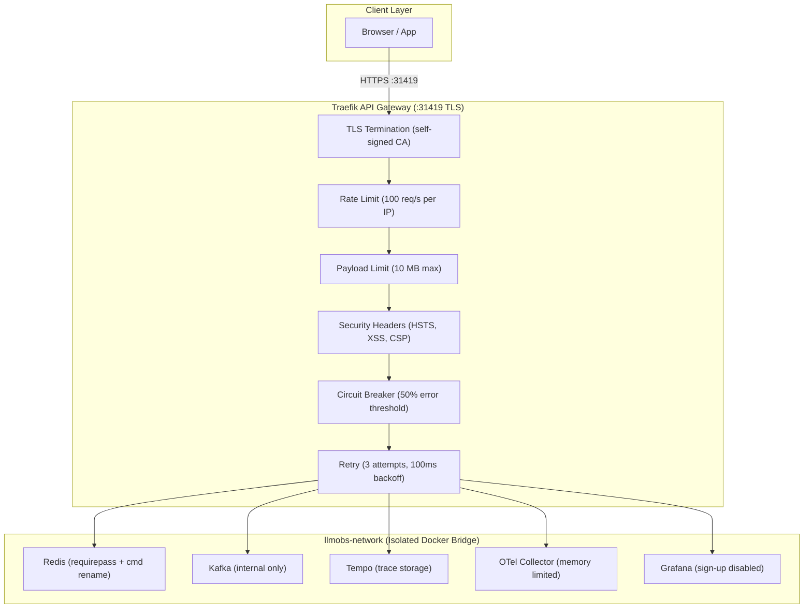
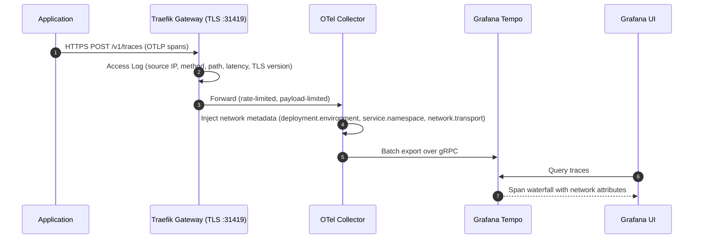

# `@observability/frontend-deployment`

Unified deployment, observability & security package for the LLMObs Platform. Provides Traefik API Gateway with TLS termination, request-level security (rate limiting, payload limits, circuit breaker), Redis cache with auth, Kafka messaging, and OpenTelemetry trace visualization via Grafana & Tempo.

---

## 🌐 Custom Gateway Domain Links

All services are fronted by **Traefik API Gateway** with TLS termination on `:31419`.

| Service | Custom Gateway URL | Routing Rule |
| :--- | :--- | :--- |
| **API Gateway Dashboard** | [https://llmobs.gateway:31419](https://llmobs.gateway:31419) | `Host(llmobs.gateway)` |
| **Grafana UI Dashboard** | [https://llmobs.grafana:31419](https://llmobs.grafana:31419) | `Host(llmobs.grafana)` |
| **Grafana Tempo (Traces)** | [https://llmobs.tempo:31419](https://llmobs.tempo:31419) | `Host(llmobs.tempo)` |
| **OTel Collector (Ingest)** | [https://llmobs.otel:31419](https://llmobs.otel:31419) | `Host(llmobs.otel)` |
| **Auth Microservice** | [https://llmobs.gateway:31419/api/v1/auth](https://llmobs.gateway:31419/api/v1/auth) | `PathPrefix(/api/v1/auth)` |
| **Kafka Event Broker** | `llmobs.kafka:31414` | Direct TCP |
| **Redis Cache** | `llmobs.redis:31413` | Direct TCP (auth required) |

**Quick /etc/hosts setup:**
```
127.0.0.1  llmobs.gateway llmobs.grafana llmobs.tempo llmobs.otel llmobs.kafka llmobs.redis
```

---

## 🔐 Security Architecture



---

## 🛡 Request-Level Security (Traefik Middlewares)

All middleware is centrally defined ONCE in `config/traefik/dynamic.yml` and referenced by name.

| Middleware | Purpose | Default | Applied To |
| :--- | :--- | :--- | :--- |
| **rate-limit** | Per-IP request throttle | 100 req/s avg, 200 burst | All gateway routes |
| **rate-limit-ingest** | Higher limit for telemetry ingestion | 500 req/s avg, 1000 burst | OTel Collector |
| **payload-limit** | Max request/response body size | 10 MB request, 10 MB response | OTel Collector |
| **payload-limit-small** | Stricter limit for API routes | 1 MB request, 5 MB response | Auth API |
| **security-headers** | HSTS, X-Frame, XSS, Referrer-Policy | See table below | All routes |
| **circuit-breaker** | Auto-disable unhealthy backends | 50% error → 30s fallback | Auth API |
| **retry-middleware** | Retry failed requests | 3 attempts, 100ms interval | Auth API |
| **https-redirect** | HTTP → HTTPS redirect | Permanent (301) | HTTP entrypoint |

### Security Headers Applied

| Header | Value |
| :--- | :--- |
| `Strict-Transport-Security` | `max-age=31536000; includeSubDomains; preload` |
| `X-Content-Type-Options` | `nosniff` |
| `X-Frame-Options` | `DENY` |
| `X-XSS-Protection` | `1; mode=block` |
| `Referrer-Policy` | `strict-origin-when-cross-origin` |
| `Permissions-Policy` | `camera=(), microphone=(), geolocation=()` |
| `Server` | _(removed)_ |
| `X-Powered-By` | _(removed)_ |

---

## 🔬 Telemetry Pipeline (Network-Level Tracing)



---

## 📊 Port Allocation Matrix

| Port | Protocol | Service | Security |
| :--- | :--- | :--- | :--- |
| `31410` | HTTP | Traefik (→ HTTPS redirect) | Redirect to :31419 |
| `31411` | HTTP | Traefik Dashboard | Internal use |
| `31413` | TCP | Redis | `requirepass` auth |
| `31414` | TCP | Kafka | Network-isolated |
| `31415` | HTTP | Grafana UI | Admin auth |
| `31416` | HTTP | Grafana Tempo | Network-isolated |
| `31417` | HTTP | OTel Collector OTLP | Rate/payload limited |
| `31418` | gRPC | OTel Collector OTLP | Rate/payload limited |
| `31419` | HTTPS | Traefik TLS Gateway | Self-signed CA + security headers |

---

## 🛠 Usage Commands

```bash
npm run setup       # Full setup for new machine (prereqs, certs, /etc/hosts, images)
npm run up          # Start all containers with auto-health check
npm run health      # Run 5-section health & security diagnostic
npm run restart     # Restart all containers
npm run down        # Stop all containers
npm run status      # Show container status
npm run logs        # Tail container logs
npm run certs       # Generate/regenerate TLS certificates
npm run free-ports  # Kill processes on stack ports
npm run test        # Run TypeScript integration tests (8 test groups)
```

---

## 📋 Requirements

See [REQUIREMENTS.md](./REQUIREMENTS.md) for full system prerequisites, dependencies, and security configuration reference.
