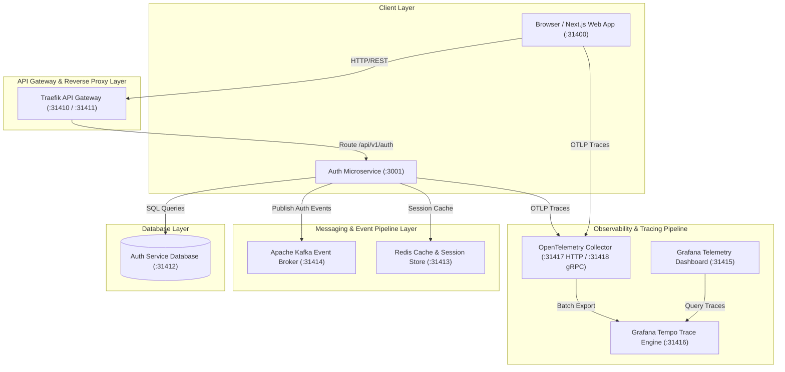
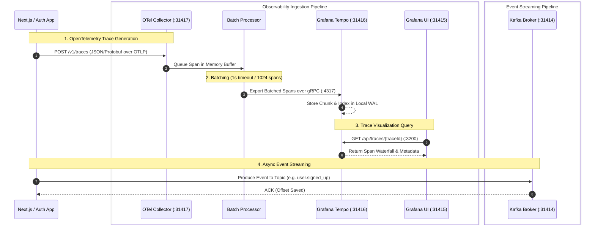

# `@observability/frontend-deployment`

Unified deployment & observability package for the Observability Platform providing network routing, messaging queues, event streaming pipelines, and OpenTelemetry trace visualization.

---

## 🏛 High-Level System Architecture (HLD)

The high-level design separates client-facing HTTP/WebSocket traffic from background telemetry ingestion pipelines and event streaming queues.



---

## 🔬 Low-Level System Design (LLD) — Telemetry & Messaging Pipeline

The low-level design details the exact data processing flow for telemetry events and message queue pipeline handling.



---

## 🚀 Services & Unique Port Allocation Matrix

To prevent port collisions with system or local development services, all services in this stack use unique dedicated host ports:

| Service | Host Port | Internal Port | Protocol / Description |
| :--- | :--- | :--- | :--- |
| **Traefik API Gateway** | `31410` | `80` | Entrypoint router |
| **Traefik Dashboard** | `31411` | `8080` | Gateway Web UI |
| **Redis** | `31413` | `6379` | Cache & Session Store |
| **Kafka Broker** | `31414` | `9092` | Event Streaming Broker |
| **Grafana UI** | `31415` | `3000` | Telemetry Dashboard (`admin` / `admin`) |
| **Grafana Tempo** | `31416` | `3200` | Trace Backend Store |
| **OTel Collector HTTP** | `31417` | `4318` | OpenTelemetry OTLP HTTP Ingestion |
| **OTel Collector gRPC** | `31418` | `4317` | OpenTelemetry OTLP gRPC Ingestion |

---

## 🛠 Usage Commands

From inside this package (`packages/node/frontend-deployment`):

```bash
# Start all infrastructure containers
npm run up

# Check health and status of containers
npm run status

# View live container logs
npm run logs

# Run integration & health test suite
npm run test

# Free stack ports if needed
npm run free-ports

# Stop all infrastructure containers
npm run down
```
