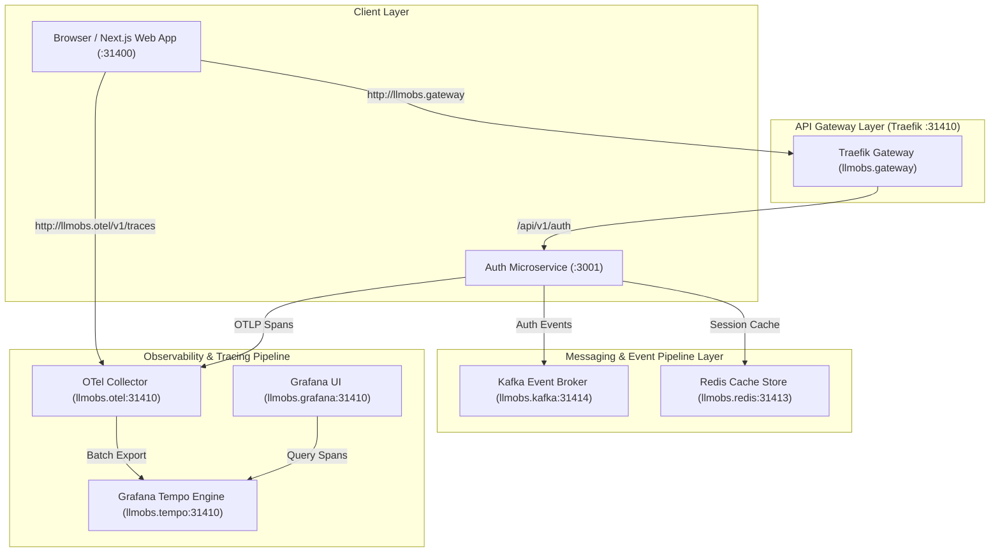
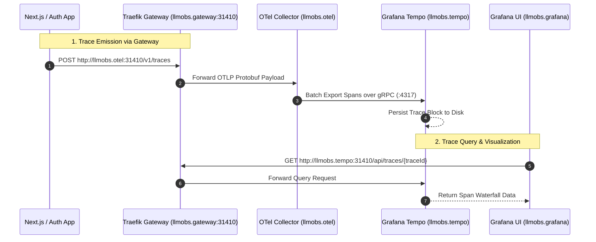

# `@observability/frontend-deployment`

Unified deployment & observability package for the Observability Platform providing Traefik API Gateway routing, custom domain aliases, Kafka messaging queues, and OpenTelemetry trace visualization via Grafana & Tempo.

---

## 🌐 Custom Gateway Domain Links & Gateway Mapping

All services are fronted by **Traefik API Gateway** (`:31410`). You can access services using human-readable custom gateway URLs via local domain mapping (`/etc/hosts`):

### Custom Gateway URLs

| Service / Module | Custom Gateway URL | Gateway Path / Host | Target Service Port |
| :--- | :--- | :--- | :--- |
| **API Gateway Dashboard** | [http://llmobs.gateway:31410](http://llmobs.gateway:31410) | `Host(llmobs.gateway)` | `:8080` (Traefik) |
| **Grafana UI Dashboard** | [http://llmobs.grafana:31410](http://llmobs.grafana:31410) | `Host(llmobs.grafana)` | `:3000` (Grafana) |
| **Grafana Tempo (Traces)** | [http://llmobs.tempo:31410](http://llmobs.tempo:31410) | `Host(llmobs.tempo)` | `:3200` (Tempo) |
| **OTel Collector (Ingest)** | [http://llmobs.otel:31410/v1/traces](http://llmobs.otel:31410/v1/traces) | `Host(llmobs.otel)` | `:4318` (OTel Ingest) |
| **Auth Microservice API** | [http://llmobs.gateway:31410/api/v1/auth](http://llmobs.gateway:31410/api/v1/auth) | `PathPrefix(/api/v1/auth)` | `:3001` (Auth) |
| **Kafka Event Broker** | `llmobs.kafka:31414` | Direct TCP Endpoint | `:9092` (Kafka) |
| **Redis Cache Store** | `llmobs.redis:31413` | Direct TCP Endpoint | `:6379` (Redis) |

> 💡 **Quick Setup for Custom Domains:**
> Add the following line to your `/etc/hosts` file:
> ```bash
> 127.0.0.1  llmobs.gateway llmobs.grafana llmobs.tempo llmobs.otel llmobs.kafka llmobs.redis
> ```

---

## 🏛 High-Level System Architecture (HLD)



---

## 🔬 Low-Level Design & Telemetry Pipeline (LLD)



---

## 🚀 Dedicated Port Allocation Matrix

| Service | Dedicated Port | Protocol / Path | Custom Gateway Alias |
| :--- | :--- | :--- | :--- |
| **Traefik Gateway** | `31410` | HTTP / Proxy | `llmobs.gateway` |
| **Traefik Dashboard** | `31411` | HTTP / Dashboard | `llmobs.gateway:31411` |
| **Redis** | `31413` | TCP | `llmobs.redis:31413` |
| **Kafka Broker** | `31414` | TCP | `llmobs.kafka:31414` |
| **Grafana UI** | `31415` | HTTP (`admin`/`admin`) | `llmobs.grafana:31410` |
| **Grafana Tempo** | `31416` | HTTP / OTLP | `llmobs.tempo:31410` |
| **OTel Collector HTTP** | `31417` | HTTP (`/v1/traces`) | `llmobs.otel:31410` |
| **OTel Collector gRPC** | `31418` | gRPC | `llmobs.otel:31418` |

---

## 🛠 Usage Commands

From inside this package (`packages/node/frontend-deployment`):

```bash
# Start all infrastructure containers with auto-recreate & port cleaning
npm run up

# Run container & service health diagnostic (14/14 checks)
npm run health

# Restart all infrastructure containers
npm run restart

# View live container logs
npm run logs

# Stop all infrastructure containers
npm run down
```
