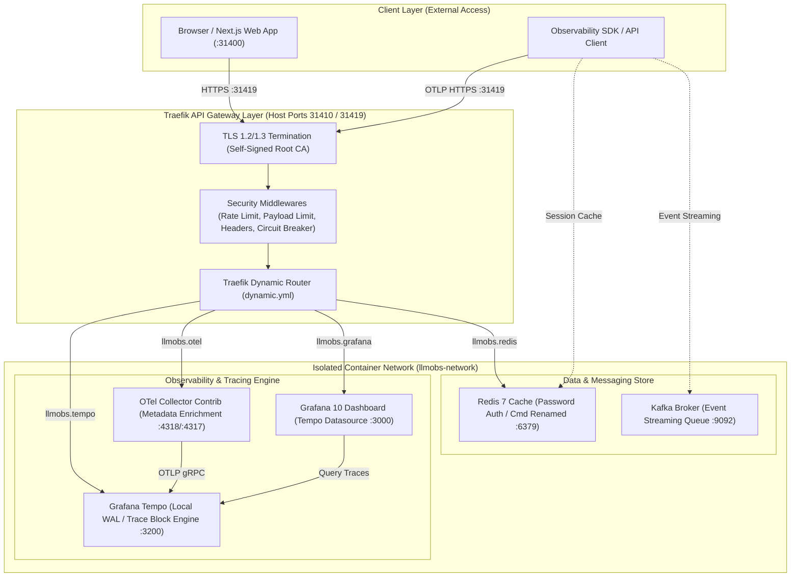
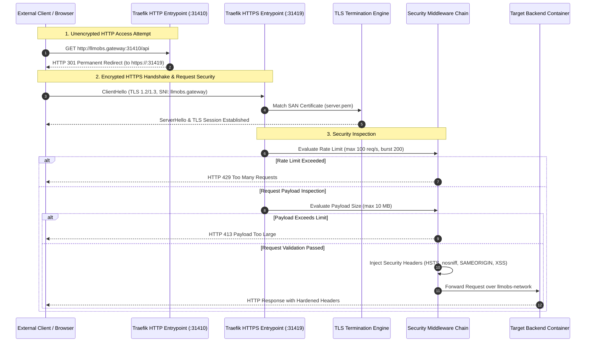
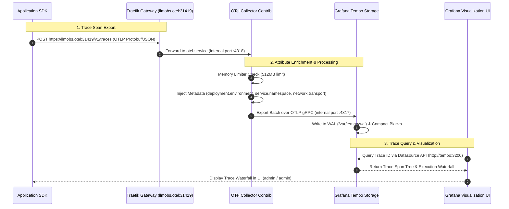
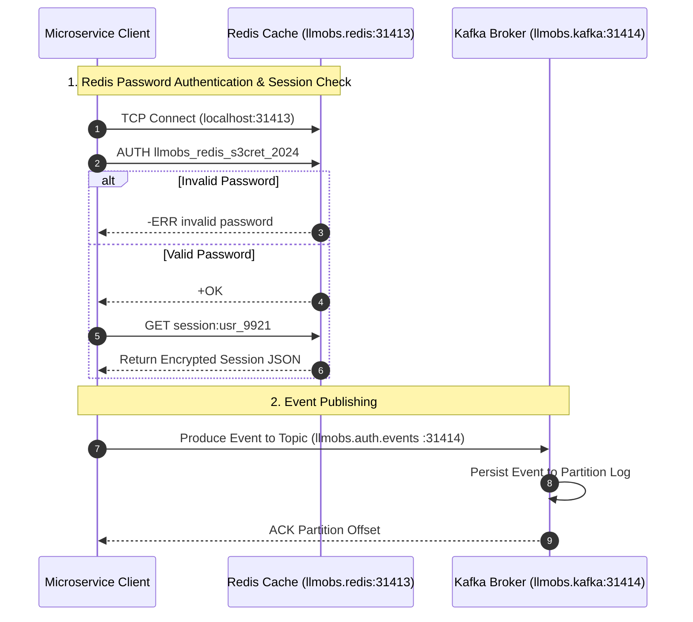

# `@observability/frontend-deployment`

Unified deployment, observability & security package for the LLMObs Platform. Provides Traefik API Gateway with TLS termination, request-level security (rate limiting, payload limits, circuit breaker), Redis cache with authentication, Kafka messaging, and OpenTelemetry trace visualization via Grafana & Tempo.

---

## 🌐 Custom Gateway Domain Links & Service Access Matrix

All web services are fronted by **Traefik API Gateway** with TLS termination on `:31419`.

| Service | Custom Gateway URL | Port | Auth Type | Username / Password |
| :--- | :--- | :--- | :--- | :--- |
| **Grafana UI Dashboard** | [https://llmobs.grafana:31419](https://llmobs.grafana:31419) | `31419` / `31415` | Basic Auth | `admin` / `llmobs_grafana_s3cret_2024` |
| **API Gateway Dashboard** | [https://llmobs.gateway:31419](https://llmobs.gateway:31419) | `31419` / `31411` | Insecure (Dev) | None (Admin Dashboard) |
| **Grafana Tempo (Traces)** | [https://llmobs.tempo:31419](https://llmobs.tempo:31419) | `31419` / `31416` | Network Isolated | None (Internal API) |
| **OTel Collector (Ingest)** | [https://llmobs.otel:31419](https://llmobs.otel:31419) | `31419` / `31417` | Ingestion | None (OTLP Ingestion) |
| **Auth Microservice** | [https://llmobs.gateway:31419/api/v1/auth](https://llmobs.gateway:31419/api/v1/auth) | `31419` | Bearer JWT | Application Tokens |
| **Redis Cache** | `llmobs.redis:31413` | `31413` | Password (`requirepass`) | `llmobs_redis_s3cret_2024` |
| **Kafka Event Broker** | `llmobs.kafka:31414` | `31414` | Plaintext | None |

> 💡 **Required 1-Line Setup for Custom Domains (`llmobs.*`):**
> Run this command once in your terminal to enable DNS resolution for all custom domain URLs:
> ```bash
> echo "127.0.0.1  llmobs.gateway llmobs.grafana llmobs.tempo llmobs.otel llmobs.kafka llmobs.redis" | sudo tee -a /etc/hosts
> ```

---

## 🏛 High-Level System Architecture (HLD)



---

## 🔬 Low-Level System Design (LLD)

### 1. Network & Request Security Pipeline



### 2. Distributed Tracing & Telemetry Pipeline



### 3. Session Security & Messaging Pipeline



---

## 🛡 Security Middleware Reference Matrix

All request security rules are centrally declared in [`config/traefik/dynamic.yml`](file:///home/btpl-lap-22/live/llm-observability-platform/packages/node/frontend-deployment/config/traefik/dynamic.yml):

| Middleware | Description | Limit / Value | Target Service |
| :--- | :--- | :--- | :--- |
| `rate-limit` | Per-IP request throttle | `100 req/s` (burst `200`) | Gateway, Grafana, Tempo |
| `rate-limit-ingest` | High-throughput telemetry throttle | `500 req/s` (burst `1000`) | OTel Collector |
| `payload-limit` | Maximum body size limit | `10 MB` Request/Response | OTel Collector |
| `payload-limit-small` | Strict API body size limit | `1 MB` Request / `5 MB` Response | Auth Microservice |
| `security-headers` | Response header hardening | `HSTS`, `nosniff`, `SAMEORIGIN`, `XSS` | All Gateway Routes |
| `circuit-breaker` | Automatic fault isolation | `>50%` Error Ratio → `30s` Trip | Auth Microservice |
| `retry-middleware` | Automatic retry on transient failure | `3 Attempts` (100ms backoff) | Auth Microservice |

---

## 📊 Port Allocation Matrix

| Port | Protocol | Service | Host Access | Security Enforcement |
| :--- | :--- | :--- | :--- | :--- |
| `31410` | HTTP | Traefik HTTP Gateway | Exposed | 301 Redirect to HTTPS `:31419` |
| `31411` | HTTP | Traefik Web Dashboard | Exposed | Insecure mode for local dev |
| `31413` | TCP | Redis Cache | Exposed | `requirepass` password authentication |
| `31414` | TCP | Kafka Event Broker | Exposed | Isolated bridge network |
| `31415` | HTTP | Grafana UI | Exposed | Admin authentication (`admin` / password) |
| `31416` | HTTP | Grafana Tempo API | Exposed | Network isolated |
| `31417` | HTTP | OTel Collector HTTP | Exposed | Rate & Payload size limited |
| `31418` | gRPC | OTel Collector gRPC | Exposed | Rate & Payload size limited |
| `31419` | HTTPS | Traefik TLS Gateway | Exposed | TLS 1.2/1.3 + SAN Certs + Security Headers |

---

## 🛠 Usage Commands

```bash
# Setup fresh machine (dependencies check, cert generation, /etc/hosts setup)
npm run setup

# Start infrastructure with auto-health diagnostic
npm run up

# Run 30-point container health & security diagnostic
npm run health

# Run TypeScript automated integration test suite (29 tests)
npm run test

# Regenerate TLS certificates
npm run certs

# Restart infrastructure stack
npm run restart

# Stop infrastructure stack
npm run down
```

---

## 📋 Requirements & Verification

See [REQUIREMENTS.md](./REQUIREMENTS.md) for complete hardware, software dependency, and firewall specifications.
