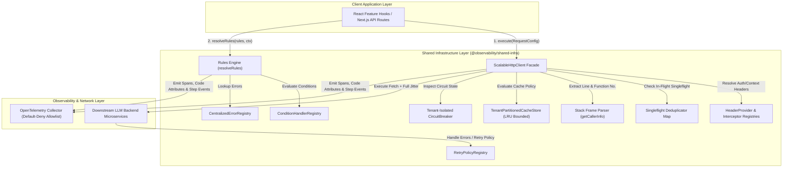
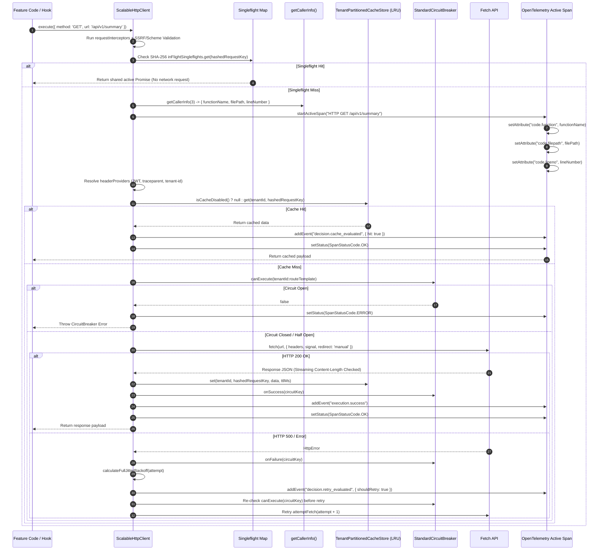
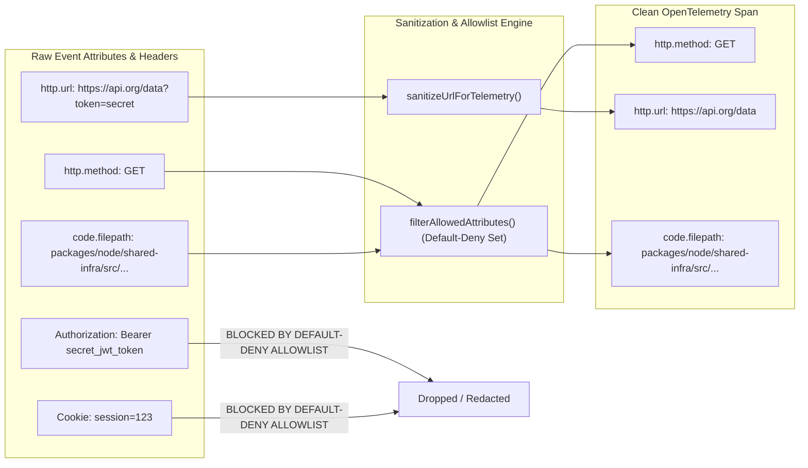
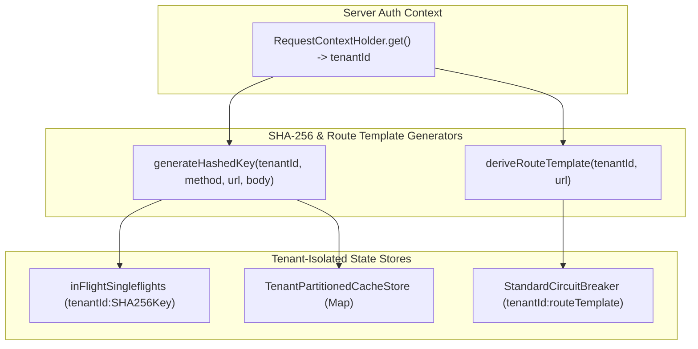

# ADR 0001: Comprehensive Architecture Decision Record & Master Specification for Shared Infrastructure

* **Status**: Accepted
* **Deciders**: Architecture Team, Core Infrastructure Working Group
* **Date**: 2026-08-31
* **Scope**: `@observability/shared-infra` (`packages/node/shared-infra`)

---

## 1. Context and Problem Statement

The LLM Observability Platform processes high volumes of distributed RPCs, telemetry query feeds, and real-time LLM cost/quality data across microservices. The legacy network and rules infrastructure suffered from:
1. **Thundering Herd Effects**: Concurrent duplicate read requests sent identical queries to downstream servers.
2. **Caller UI Crashes**: Traditional `AbortController` cancellation rejected pending promises with `AbortError`, causing UI component crashes.
3. **Black-box Observability**: Developers could not trace which component line number initiated an HTTP request or why a specific cache/circuit breaker decision was made.
4. **Imperative Loop Spaghetti**: Unstructured mutable state loops made retry jitter, rules evaluation, and header propagation difficult to maintain and audit.

We need a standardized, resilient, readable shared infrastructure combining an HTTP client pipeline, business rules engine, and full OpenTelemetry decision and code-location telemetry.

---

## 2. Decision Drivers & Core Engineering Principles

* **Pragmatic Readable Engineering over Dogmatic Purity**: Favor explicit `if` statements, early return guard clauses, and clean `for...of` loops over obfuscated `.reduce()` chains or nested ternaries. Code readability, clear control flow, and clean V8 stack trace step-through debugging take precedence over cargo-cult functional aesthetics.
* **Zero Hardcoded Strings**: All HTTP verbs, headers, status codes, tracer names, error codes, and span event keys must be enforced via `as const` constant objects (`HTTP_CONSTANTS`, `RULES_ENGINE_CONSTANTS`, `TRACING_CONSTANTS`).
* **Singleflight Request Collapsing**: Duplicate concurrent read requests must map to a single in-flight `Promise`, returning data to all callers simultaneously without throwing `AbortError`.
* **Idempotency Key Preservation**: The `x-idempotency-key` header must be generated once per logical operation using CSPRNG (`crypto.randomUUID()`) and preserved identically across all retry attempts.
* **Header & Endpoint Driven Caching**: Cache lookup must be dynamically bypassed when `noCache: true` or `Cache-Control: no-cache, no-store` headers are present.
* **Comprehensive OpenTelemetry Telemetry**: Spans must record caller location (`code.function`, `code.filepath`, `code.lineno`), granular step-by-step pipeline events, decision markers, and dual execution paths (Positive Path vs. Negative Path).
* **Pluggable Data-Driven Registries**: Condition evaluations, error descriptors, status badge mappings, and retry policies must be managed via extensible registry objects (`ConditionHandlerRegistry`, `CentralizedErrorRegistry`, `StatusBadgeRegistry`, `RetryPolicyRegistry`).

---

## 3. 13-Step Exhaustive Pipeline Specification

1. **Input Validation & SSRF/Scheme Protection**:
   - Validates target destination URL format against supported protocol schemes (`http:`, `https:`).
   - Enforces IP subnet filtering using regex against private/loopback/link-local address ranges:
     (`127.0.0.0/8`, `169.254.0.0/16`, `10.0.0.0/8`, `172.16.0.0/12`, `192.168.0.0/16`, `::1`, `0.0.0.0`).
   - Verifies hostnames against configured `allowedDestinationHosts` allowlists.

2. **Request Interception & Body Bounding**:
   - Passes raw `RequestConfig` through sequential `RequestInterceptorFn` chain.
   - Enforces static and streaming payload size limits (default `maxBodySizeBytes = 10,485,760` bytes [10MB]).
   - Rejects oversized request body payloads before network initiation.

3. **Code Location & V8 Stack Trace Parsing**:
   - Invokes `getCallerInfo(depth = 3)` to inspect V8 stack frames.
   - Extracts calling function name, line number, and normalizes file path to repository-relative format
     (e.g., `packages/node/shared-infra/src/http/http-client.ts`) to eliminate internal employee directory leakage.

4. **Authenticated Tenant Context Derivation**:
   - Extracts authenticated tenant ID strictly from server-managed `RequestContextHolder.get().tenantId` context.
   - Fallbacks gracefully to `HTTP_CONSTANTS.DEFAULT_TENANT_ID` (`"tenant-default"`) if context is uninitialized.
   - Guarantees client-supplied headers cannot hijack or spoof cross-tenant boundaries.

5. **SHA-256 Tenant-Isolated Key Generation**:
   - Constructs unique request signature: `keyString = tenantId + ":" + method.toUpperCase() + ":" + url + ":" + JSON.stringify(body)`.
   - Computes 256-bit cryptographic digest: `hashedRequestKey = SHA256(keyString).digest('hex')`.
   - Produces fixed 64-character hex string preventing memory key bloat and raw payload embedding.

6. **Singleflight Concurrency Collapsing (Deduplication)**:
   - Inspects active `inFlightSingleflights` map for `hashedRequestKey`.
   - If an identical request is already pending, returns existing active `Promise<HttpResponse>`.
   - Collapses N concurrent thundering herd requests into 1 single network RPC without throwing `AbortError`.

7. **OpenTelemetry Span Lifecycle & Default-Deny Allowlist**:
   - Sanitizes telemetry URL by stripping query strings (`?token=...`) and userinfo (`user:pass@`) via `sanitizeUrlForTelemetry()`.
   - Initiates active CLIENT span: `HTTP ${method} ${sanitizedUrl}`.
   - Attaches code location attributes: `code.function`, `code.filepath`, `code.lineno`.
   - Filters all span attributes and events through `filterAllowedAttributes()` default-deny allowlist
     (`HTTP_CONSTANTS.ALLOWED_TELEMETRY_ATTRIBUTES`). Drops unauthorized or credential-bearing fields by default.

8. **Dynamic Header Resolution & CSPRNG Idempotency**:
   - Resolves `HeaderProviderFn` handlers sequentially (W3C traceparent, JWT auth, tenant-id, correlation-id).
   - Generates 128-bit CSPRNG `x-idempotency-key` via `crypto.randomUUID()` if absent.
   - Preserves exact idempotency key across all retry iterations.

9. **Tenant-Partitioned LRU Cache Evaluation**:
   - Evaluates cache directive bypass (`noCache: true`, `Cache-Control: no-cache, no-store`).
   - Queries tenant-partitioned LRU cache: `TenantPartitionedCacheStore.get(tenantId, hashedRequestKey)`.
   - If cache hit occurs: emits `decision.cache_evaluated` event, marks span OK, and returns cached payload in $O(1)$ time.
   - Bounds capacity per tenant (`maxCapacityPerTenant = 250`) to prevent single-tenant cache eviction stampedes.

10. **Tenant-Isolated Route-Template Circuit Breaker**:
    - Normalizes dynamic URL parameters into template routes (e.g., `api.org/users/:id/items/:id`).
    - Derives circuit key: `circuitKey = tenantId + ":" + routeTemplate`.
    - Inspects circuit state (`CLOSED`, `OPEN`, `HALF_OPEN`). Rejects execution immediately if state is `OPEN`.
    - Isolates availability state per tenant so Tenant A failures never trip Tenant B's circuit breaker.

11. **Fetch Execution, Manual Redirect & Streaming Size Check**:
    - Initiates native `fetch` with `redirect = 'manual'` to prevent 302 SSRF bypasses to internal metadata IPs.
    - Re-validates `Location` header against IP subnets if 3xx redirect is received.
    - Inspects response `Content-Length` header against `maxBodySizeBytes` prior to JSON parsing.

12. **Per-Attempt Circuit Re-Check & AWS Full Jitter Retry Loop**:
    - Re-evaluates `circuitBreaker.canExecute(circuitKey)` before EVERY retry iteration inside the loop.
    - Halts retry storms immediately if circuit opens mid-execution.
    - Restricts automatic retries to idempotent HTTP methods (`GET`, `HEAD`, `OPTIONS`, `PUT`, `DELETE`) OR
      non-idempotent methods (`POST`, `PATCH`) with valid `x-idempotency-key` headers.
    - Calculates AWS Full Jitter backoff delay: $\text{Sleep}(\text{attempt}) = \text{Random}(0, \min(\text{maxMs}, \text{baseMs} \times 2^{\text{attempt} - 1}))$.

13. **Span Completion & Dual Execution Path Marking**:
    - On success: updates circuit state to `CLOSED`, caches response data, marks span `execution.path = "positive_path"`,
      emits `execution.success` event, sets `Status = OK`, and returns response payload.
    - On fatal error: marks span `execution.path = "negative_path"`, emits `execution.failure` event, records exception,
      sets `Status = ERROR`, and re-throws error to caller.

---

## 4. High-Level Architecture (HLA)

---

## 5. Low-Level Architecture (LLA)

### 5.1 Class & Component Contract Diagram

---

### 5.2 Low-Level Pipeline Execution Sequence Diagram

---

### 5.3 Telemetry Data Scrubbing & Default-Deny Allowlist Filter Diagram

---

### 5.4 Multi-Tenant Isolation & Defense-in-Depth Architecture Diagram

---

## 6. Verification & Test Coverage Matrix

### 6.1 Automated Unit & Integration Tests (100% Passing)
* **Default-Deny Telemetry Allowlist**: Verified un-whitelisted attributes and credentials are filtered out.
* **Telemetry URL Sanitization**: Verified query parameters and userinfo are stripped from `http.url`.
* **Private IP & Protocol SSRF Protection**: Verified private IP subnets (`127.0.0.1`, `169.254.169.254`) and non-HTTP schemes are blocked.
* **Tenant-Isolated Route Templates & SHA-256 Hashing**: Verified `tenantId:routeTemplate` circuit breakers and SHA-256 hashed keys prevent cross-tenant DoS and data leaks.
* **Tenant Partitioned LRU Cache**: Verified per-tenant partition bounds prevent cross-tenant eviction stampedes.
* **Method Idempotency Verification**: Verified non-idempotent methods skip retries unless `x-idempotency-key` is set.
