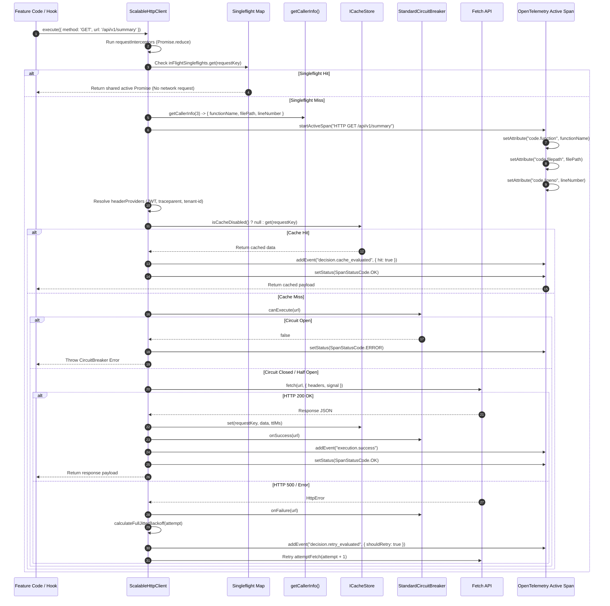

# ADR 0001: Comprehensive Architecture Decision Record & Master Specification for Shared Infrastructure

* **Status**: Accepted
* **Deciders**: Architecture Team, Core Infrastructure Working Group
* **Date**: 2026-08-31
* **Scope**: `@observability/shared-infra` (`packages/node/shared-infra`)

---

## 1. Context and Problem Statement

The LLM Observability Platform processes high volumes of distributed RPCs, telemetry query feeds, and real-time LLM cost/quality data across microservices. The legacy network and rules infrastructure suffered from:
1. **Thundering Herd Effects**: Concurrent duplicate read requests sent identical queries to downstream servers.
2. **Caller UI Crashes**: Traditional `AbortController` cancellation rejected pending promises with `AbortError`, causing UI component crashes.
3. **Black-box Observability**: Developers could not trace which component line number initiated an HTTP request or why a specific cache/circuit breaker decision was made.
4. **Imperative Loop Spaghetti**: Mutable state loops and `if/else` branching made retry jitter, rules evaluation, and header propagation difficult to maintain and audit.

We need a standardized, resilient, pure functional shared infrastructure combining an HTTP client pipeline, business rules engine, and full OpenTelemetry decision and code-location telemetry.

---

## 2. Decision Drivers & Core Principles

* **Pure Functional Architecture**: Zero `if` statements and zero `for/while` loops allowed. Pipeline execution and rules resolution must be composed using `.reduce()`, `.map()`, and pure ternary expressions.
* **Zero Hardcoded Strings**: All HTTP verbs, headers, status codes, tracer names, error codes, and span event keys must be enforced via `as const` constant objects (`HTTP_CONSTANTS`, `RULES_ENGINE_CONSTANTS`, `TRACING_CONSTANTS`).
* **Singleflight Request Collapsing**: Duplicate concurrent read requests must map to a single in-flight `Promise`, returning data to all callers simultaneously without throwing `AbortError`.
* **Idempotency Key Preservation**: The `x-idempotency-key` header must be generated once per logical operation and preserved identically across all retry attempts.
* **Header & Endpoint Driven Caching**: Cache lookup must be dynamically bypassed when `noCache: true` or `Cache-Control: no-cache, no-store` headers are present.
* **Comprehensive OpenTelemetry Telemetry**: Spans must record caller location (`code.function`, `code.filepath`, `code.lineno`), granular step-by-step pipeline events, decision markers, and dual execution paths (Positive Path vs. Negative Path).
* **Pluggable Data-Driven Registries**: Condition evaluations, error descriptors, status badge mappings, and retry policies must be managed via extensible registry objects (`ConditionHandlerRegistry`, `CentralizedErrorRegistry`, `StatusBadgeRegistry`, `RetryPolicyRegistry`).

---

## 3. High-Level Architecture (HLA)

The High-Level Architecture establishes `@observability/shared-infra` as the core foundation for all frontend features (`overview`, `traces`, `costs`, `quality`) and Node.js microservices.

```mermaid
graph TD
  subgraph Client Application Layer
    FE["React Feature Hooks / Next.js API Routes"]
  end

  subgraph Shared Infrastructure Layer [@observability/shared-infra]
    HTTP["ScalableHttpClient Facade"]
    RE["Rules Engine (resolveRules)"]
    REG["HeaderProvider & Interceptor Registries"]
    SF["Singleflight Deduplicator Map"]
    CB["StandardCircuitBreaker"]
    CACHE["InMemoryCacheStore"]
    RETRY["RetryPolicyRegistry"]
    COND["ConditionHandlerRegistry"]
    ERR["CentralizedErrorRegistry"]
    CALLER["Stack Frame Parser (getCallerInfo)"]
  end

  subgraph Observability & Network Layer
    OTEL["OpenTelemetry Collector / Span Processor"]
    NET["Downstream LLM Backend Microservices"]
  end

  FE -->|"1. execute(RequestConfig)"| HTTP
  FE -->|"2. resolveRules(rules, ctx)"| RE
  HTTP -->|"Resolve Auth/Context Headers"| REG
  HTTP -->|"Check In-Flight Singleflight"| SF
  HTTP -->|"Extract Line & Function No."| CALLER
  HTTP -->|"Evaluate Cache Policy"| CACHE
  HTTP -->|"Inspect Circuit State"| CB
  HTTP -->|"Execute Fetch + Full Jitter"| NET
  NET -->|"Handle Errors / Retry Policy"| RETRY
  RE -->|"Evaluate Conditions"| COND
  RE -->|"Lookup Errors"| ERR
  HTTP & RE -->|"Emit Spans, Code Attributes & Step Events"| OTEL
```

---

## 4. Low-Level Architecture (LLA)

### 4.1 Class & Component Contract Diagram


---

### 4.2 Low-Level Pipeline Execution Sequence Diagram



---

## 5. Complete OpenTelemetry Telemetry Specification

### 5.1 Standard Span Attributes

| Attribute Key | Type | Description |
|---|---|---|
| `http.method` | `string` | HTTP verb (`"GET"`, `"POST"`, `"PATCH"`, etc.) |
| `http.url` | `string` | Full destination URL endpoint |
| `http.status_code` | `number` | HTTP status code (`200`, `400`, `500`, etc.) |
| `http.cache_hit` | `boolean` | `true` (Cache Hit) \| `false` (Cache Miss / Bypassed) |
| `http.circuit_state` | `string` | `"CLOSED"` \| `"OPEN"` \| `"HALF_OPEN"` |
| `http.idempotency_key` | `string` | Preserved UUID/hex idempotency key |
| `tenant.id` | `string` | Tenant identifier |
| `execution.path` | `string` | `"positive_path"` \| `"negative_path"` |
| `code.function` | `string` | Function or method name initiating the span |
| `code.filepath` | `string` | Exact file path of caller |
| `code.lineno` | `number` | Exact line number of caller |

### 5.2 Granular Step & Decision Events Timeline

1. `step.request_interceptors_executed` (`interceptors.count`)
2. `step.header_providers_resolved` (`headers.provider_count`)
3. `decision.cache_evaluated` (`cache.bypassed`, `cache.hit`, `cache.key`)
4. `decision.circuit_breaker_evaluated` (`circuit.state`, `circuit.can_execute`, `circuit.failures`)
5. `step.fetch_attempt_initiated` (`retry.attempt`)
6. `step.response_interceptors_executed` (`interceptors.count`)
7. `step.error_interceptors_handled` (`interceptors.count`)
8. `decision.retry_evaluated` (`retry.attempt`, `retry.should_retry`, `retry.error_message`)
9. `decision.rule_evaluated` (`rule.id`, `rule.name`, `rule.conditions_passed`, `rule.priority`)
10. `decision.async_check_evaluated` (`rule.id`, `rule.async_passed`)
11. `execution.success` (`execution.status = "success"`)
12. `execution.failure` (`execution.status = "failure"`, `execution.error_detail`)

---

## 6. Full OpenTelemetry Span Samples

### 6.1 Positive Path Span Sample
```json
{
  "traceId": "4bf92f3577b34da6a3ce929d0e0e4736",
  "spanId": "00f067aa0ba902b7",
  "name": "HTTP GET http://localhost:3000/api/v1/overview/summary",
  "kind": 2,
  "status": { "code": 1 },
  "attributes": {
    "http.method": "GET",
    "http.url": "http://localhost:3000/api/v1/overview/summary",
    "http.status_code": 200,
    "http.cache_hit": false,
    "http.circuit_state": "CLOSED",
    "http.idempotency_key": "3f9a12bc890e4f5a8b9c0d1e2f3a4b5c",
    "tenant.id": "tenant-default",
    "execution.path": "positive_path",
    "code.function": "executePipeline",
    "code.filepath": "/home/btpl-lap-22/live/llm-observability-platform/packages/node/shared-infra/src/http/http-client.ts",
    "code.lineno": 242
  },
  "events": [
    { "name": "step.request_interceptors_executed", "attributes": { "interceptors.count": 1 } },
    { "name": "step.header_providers_resolved", "attributes": { "headers.provider_count": 2 } },
    { "name": "decision.cache_evaluated", "attributes": { "cache.bypassed": false, "cache.hit": false } },
    { "name": "decision.circuit_breaker_evaluated", "attributes": { "circuit.state": "CLOSED", "circuit.can_execute": true } },
    { "name": "step.fetch_attempt_initiated", "attributes": { "retry.attempt": 0 } },
    { "name": "step.response_interceptors_executed", "attributes": { "interceptors.count": 1 } },
    { "name": "execution.success", "attributes": { "execution.status": "success" } }
  ]
}
```

### 6.2 Negative Path Span Sample
```json
{
  "traceId": "4bf92f3577b34da6a3ce929d0e0e4736",
  "spanId": "9b8a7c6d5e4f3a21",
  "name": "HTTP POST http://localhost:3000/api/v1/overview/metrics",
  "kind": 2,
  "status": { "code": 2, "message": "HTTP POST failed with status 503" },
  "attributes": {
    "http.method": "POST",
    "http.url": "http://localhost:3000/api/v1/overview/metrics",
    "http.status_code": 503,
    "execution.path": "negative_path",
    "code.function": "executePipeline",
    "code.filepath": "/home/btpl-lap-22/live/llm-observability-platform/packages/node/shared-infra/src/http/http-client.ts",
    "code.lineno": 242
  },
  "events": [
    { "name": "step.fetch_attempt_initiated", "attributes": { "retry.attempt": 0 } },
    { "name": "decision.retry_evaluated", "attributes": { "retry.attempt": 0, "retry.should_retry": true } },
    { "name": "execution.failure", "attributes": { "execution.status": "failure", "execution.error_detail": "HTTP POST failed with status 503" } }
  ]
}
```

---

## 7. Package Directory Structure (ASCII Tree)

```
packages/node/shared-infra/
├── docs/
│   └── adr/
│       └── 0001-scalable-resilient-telemetry-http-pipeline.md  # Master Architecture Specification
├── src/
│   ├── http/
│   │   ├── constants.ts                    # HTTP_CONSTANTS (as const)
│   │   ├── http-client.ts                  # ScalableHttpClient (pure functional pipeline)
│   │   ├── middleware.ts                   # HttpMiddleware composition facade
│   │   ├── retry-policy.ts                 # RetryPolicyRegistry
│   │   ├── status-badge-registry.ts        # StatusBadgeRegistry
│   │   └── tests/
│   │       └── http-client.test.ts         # Vitest test suite
│   │
│   ├── rules-engine/
│   │   ├── condition-registry.ts           # ConditionHandlerRegistry
│   │   ├── constants.ts                    # RULES_ENGINE_CONSTANTS
│   │   ├── error-registry.ts               # CentralizedErrorRegistry
│   │   ├── evaluate.ts                     # resolveRules (functional reduce + OTEL events)
│   │   ├── rule-registry.ts                # CentralizedRuleRegistry
│   │   └── rule.types.ts                   # Rule TypeScript contracts
│   │
│   ├── tracing/
│   │   ├── caller-info.ts                  # getCallerInfo (V8 stack frame location parser)
│   │   ├── constants.ts                    # TRACING_CONSTANTS
│   │   ├── request-context.ts              # RequestContextHolder
│   │   ├── traced-handler.ts               # withTracedValidation & BaseTracedKafkaHandler
│   │   └── tracer.ts                       # OpenTelemetry Tracer facade
│   │
│   └── index.ts                            # Centralized package barrel export
```

---

## 8. Verification and Compliance

* **Unit Test Suite**: Verified by Vitest test suite in [`packages/node/shared-infra/src/http/tests/http-client.test.ts`](file:///home/btpl-lap-22/live/llm-observability-platform/packages/node/shared-infra/src/http/tests/http-client.test.ts).
* **Feature Test Suites**: Passes 100% across all feature test suites (`overview`, `traces`, `costs`, `quality`).
