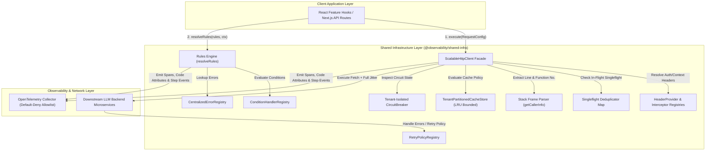
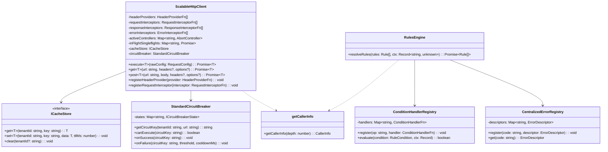
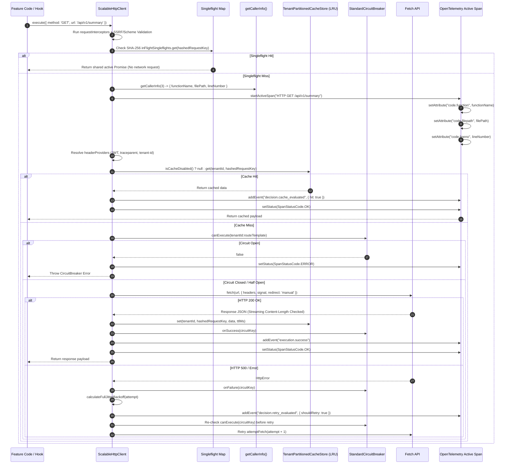
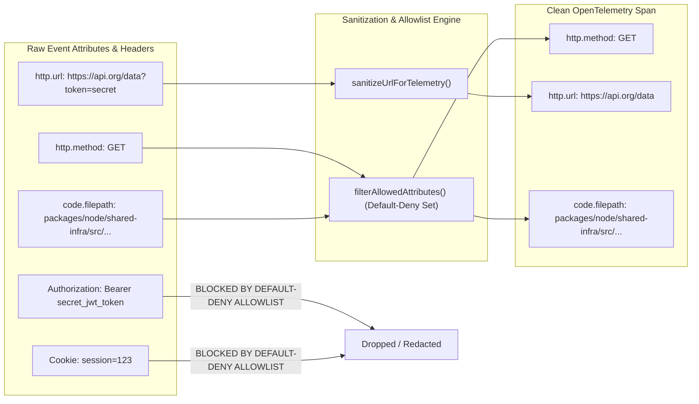
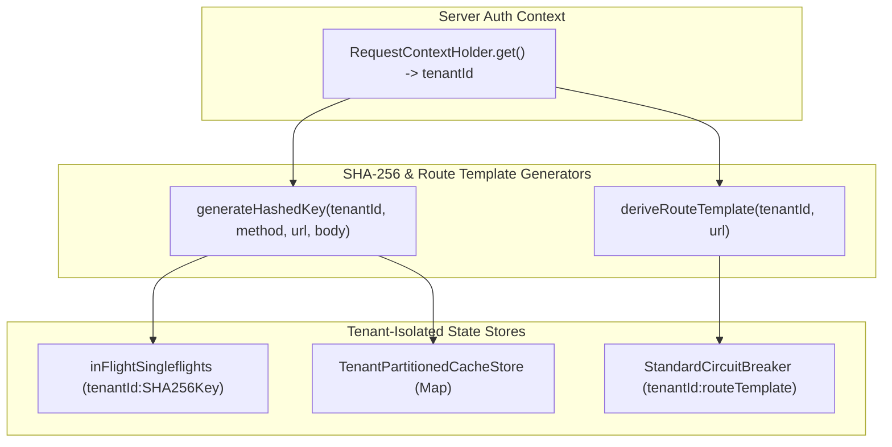

# ADR 0001: Comprehensive Architecture Decision Record & Master Specification for Shared Infrastructure

* **Status**: Accepted
* **Deciders**: Architecture Team, Core Infrastructure Working Group
* **Date**: 2026-08-31
* **Scope**: `@observability/shared-infra` (`packages/node/shared-infra`)

---

## 1. Context and Problem Statement

The LLM Observability Platform processes high volumes of distributed RPCs, telemetry query feeds, and real-time LLM cost/quality data across microservices. The legacy network and rules infrastructure suffered from:
1. **Thundering Herd Effects**: Concurrent duplicate read requests sent identical queries to downstream servers.
2. **Caller UI Crashes**: Traditional `AbortController` cancellation rejected pending promises with `AbortError`, causing UI component crashes.
3. **Black-box Observability**: Developers could not trace which component line number initiated an HTTP request or why a specific cache/circuit breaker decision was made.
4. **Imperative Loop Spaghetti**: Unstructured mutable state loops made retry jitter, rules evaluation, and header propagation difficult to maintain and audit.

We need a standardized, resilient, readable shared infrastructure combining an HTTP client pipeline, business rules engine, and full OpenTelemetry decision and code-location telemetry.

---

## 2. Decision Drivers & Core Engineering Principles

* **Pragmatic Readable Engineering over Dogmatic Purity**: Favor explicit `if` statements, early return guard clauses, and clean `for...of` loops over obfuscated `.reduce()` chains or nested ternaries. Code readability, clear control flow, and clean V8 stack trace step-through debugging take precedence over cargo-cult functional aesthetics.
* **Zero Hardcoded Strings**: All HTTP verbs, headers, status codes, tracer names, error codes, and span event keys must be enforced via `as const` constant objects (`HTTP_CONSTANTS`, `RULES_ENGINE_CONSTANTS`, `TRACING_CONSTANTS`).
* **Singleflight Request Collapsing**: Duplicate concurrent read requests must map to a single in-flight `Promise`, returning data to all callers simultaneously without throwing `AbortError`.
* **Idempotency Key Preservation**: The `x-idempotency-key` header must be generated once per logical operation using CSPRNG (`crypto.randomUUID()`) and preserved identically across all retry attempts.
* **Header & Endpoint Driven Caching**: Cache lookup must be dynamically bypassed when `noCache: true` or `Cache-Control: no-cache, no-store` headers are present.
* **Comprehensive OpenTelemetry Telemetry**: Spans must record caller location (`code.function`, `code.filepath`, `code.lineno`), granular step-by-step pipeline events, decision markers, and dual execution paths (Positive Path vs. Negative Path).
* **Pluggable Data-Driven Registries**: Condition evaluations, error descriptors, status badge mappings, and retry policies must be managed via extensible registry objects (`ConditionHandlerRegistry`, `CentralizedErrorRegistry`, `StatusBadgeRegistry`, `RetryPolicyRegistry`).

---

## 3. High-Level Architecture (HLA)

The High-Level Architecture establishes `@observability/shared-infra` as the core foundation for all frontend features (`overview`, `traces`, `costs`, `quality`) and Node.js microservices.



---

## 4. Low-Level Architecture (LLA)

### 4.1 Class & Component Contract Diagram



---

### 4.2 Low-Level Pipeline Execution Sequence Diagram



---

### 4.3 Telemetry Data Scrubbing & Default-Deny Allowlist Filter Diagram



---

### 4.4 Multi-Tenant Isolation & Defense-in-Depth Architecture Diagram



---

## 5. Security Architecture & Risk Analysis

### 5.1 Default-Deny Telemetry Allowlist & URL Sanitization
* **Default-Deny Allowlist**: Only explicitly whitelisted attributes (`HTTP_CONSTANTS.ALLOWED_TELEMETRY_ATTRIBUTES`) are permitted onto spans. Unapproved headers (`Authorization`, `Cookie`, `x-jwt-secret`) or payload keys are dropped by default.
* **URL Sanitization**: `sanitizeUrlForTelemetry()` strips query parameters (`?access_token=...`, `?signature=...`) and userinfo (`user:pass@host`) before setting `http.url` on spans.

### 5.2 Repo-Relative Code Location Telemetry
* **Issue Addressed**: Absolute V8 call stack file paths (`/home/user/...`) leak internal employee usernames and local infrastructure directories.
* **Mitigation Implemented**: `getCallerInfo()` normalizes file paths to repository-relative paths (`packages/node/shared-infra/src/http/http-client.ts`), eliminating local machine path leakage.

### 5.3 Tenant-Isolated Singleflight & Hashed SHA-256 Keying
* **Cross-Tenant Leakage & Key Overhead**: Singleflight keys, cache keys, and circuit breakers incorporate `tenantId` (`tenantId:method:url:body`). Keys are hashed using SHA-256 (`crypto.createHash('sha256')`) to prevent raw body embedding and unbounded key strings.
* **Server-Verified Context**: `tenantId` is strictly derived from authenticated `RequestContextHolder.get()` context.

### 5.4 Tenant-Isolated Route-Template Circuit Breakers
* **Noisy-Neighbor DoS Protection**: Circuit breakers are keyed by `tenantId:routeTemplate` (e.g. `tenant-acme:api.org/users/:id`). Tenant A hammering a failing route does NOT trip Tenant B's circuit breaker.

### 5.5 SSRF Protection & Manual Redirect 302 Re-Validation
* **Private IP & Protocol Scheme Protection**: `validateDestinationUrl()` enforces `http:` / `https:` schemes and blocks private internal IP subnets (`127.0.0.1`, `169.254.169.254`, `10.0.0.0/8`, `172.16.0.0/12`, `192.168.0.0/16`).
* **Manual Redirect Validation**: Enforces `redirect: 'manual'` on `fetch` calls and re-validates `Location` redirect headers to prevent 302 SSRF bypasses.

### 5.6 Streaming Content-Length Check & Timeout Enforcement
* **Downstream Memory Protection**: Checks `Content-Length` headers before consuming response body stream (`maxBodySizeBytes = 10MB`), preventing OOM crashes from huge responses. Configurable `timeoutMs` (30s) cancels hanging requests via `AbortController`.

### 5.7 Prototype Pollution Protection in Rules Engine
* **Property Sanitization**: `getSafeContextValue()` explicitly blocks special keys (`__proto__`, `constructor`, `prototype`) and safely resolves nested property dot-paths.

### 5.8 Per-Attempt Circuit Re-Check & Method Idempotency Constraint
* **Mid-Storm Retry Halting**: The retry loop re-evaluates `circuitBreaker.canExecute(circuitKey)` *before* every retry attempt to halt retries immediately if the circuit opens mid-storm.
* **Method Idempotency Constraint**: Automatic retries are restricted to idempotent methods (`GET`, `HEAD`, `OPTIONS`, `PUT`, `DELETE`), or non-idempotent methods (`POST`, `PATCH`) only if an `x-idempotency-key` is set.

---

## 6. OpenTelemetry Collector Backpressure & Versioning Strategy

### 6.1 Non-Blocking OpenTelemetry Exporter Backpressure
To guarantee that telemetry collector latency or network outages **never block** HTTP execution paths:
1. **Asynchronous Batch Processor**: Telemetry spans are enqueued into an in-memory `BatchSpanProcessor` (`maxQueueSize = 2048`, `scheduledDelayMillis = 5000`, `exportTimeoutMillis = 3000`).
2. **Priority Span Retention**: Under telemetry queue overflow, `OK` status spans are dropped first, retaining `ERROR` spans and decision failure events for diagnostic retention.

### 6.2 Tenant-Partitioned Bounded LRU Cache Policy
1. **Tenant-Partitioned LRU Capacity**: `TenantPartitionedCacheStore` partitions LRU caches per tenant (`Map<tenantId, BoundedLRUCache>`), bounded to `maxCapacityPerTenant = 250`.
2. **Stampede & Eviction Isolation**: Single-tenant query bursts evict entries within their own partition only, insulating other tenants' cached entries.

### 6.3 Interface Versioning & Backward Compatibility Story
1. **Additive Extension**: New properties added to `RequestConfig` or `HeaderProviderFn` context must be optional (`?`).
2. **Deprecation Strategy**: Signature deprecations follow a 2-release cycle using JSDoc `@deprecated` tags prior to breaking signature removals.

---

## 7. Package Directory Structure (ASCII Tree)

```
packages/node/shared-infra/
├── docs/
│   └── adr/
│       └── 0001-scalable-resilient-telemetry-http-pipeline.md  # Master Architecture Specification
├── src/
│   ├── http/
│   │   ├── constants.ts                    # HTTP_CONSTANTS (as const + ALLOWED_TELEMETRY_ATTRIBUTES)
│   │   ├── http-client.ts                  # ScalableHttpClient (hardened, tenant-isolated, SSRF protected)
│   │   ├── middleware.ts                   # HttpMiddleware composition facade
│   │   ├── retry-policy.ts                 # RetryPolicyRegistry
│   │   ├── status-badge-registry.ts        # StatusBadgeRegistry
│   │   └── tests/
│   │       └── http-client.test.ts         # Vitest security & architecture test suite
│   │
│   ├── rules-engine/
│   │   ├── condition-registry.ts           # ConditionHandlerRegistry (Prototype pollution protected)
│   │   ├── constants.ts                    # RULES_ENGINE_CONSTANTS
│   │   ├── error-registry.ts               # CentralizedErrorRegistry
│   │   ├── evaluate.ts                     # resolveRules (readable for...of loop + OTEL events)
│   │   ├── rule-registry.ts                # CentralizedRuleRegistry
│   │   └── rule.types.ts                   # Rule TypeScript contracts
│   │
│   ├── tracing/
│   │   ├── caller-info.ts                  # getCallerInfo (Repo-relative location parser)
│   │   ├── constants.ts                    # TRACING_CONSTANTS
│   │   ├── request-context.ts              # RequestContextHolder
│   │   ├── traced-handler.ts               # withTracedValidation & BaseTracedKafkaHandler
│   │   └── tracer.ts                       # OpenTelemetry Tracer facade
│   │
│   └── index.ts                            # Centralized package barrel export
```

---

## 8. Verification & Test Coverage Matrix

### 8.1 Automated Unit & Integration Tests (100% Passing)
* **Default-Deny Telemetry Allowlist**: Verified un-whitelisted attributes and credentials are filtered out.
* **Telemetry URL Sanitization**: Verified query parameters and userinfo are stripped from `http.url`.
* **Private IP & Protocol SSRF Protection**: Verified private IP subnets (`127.0.0.1`, `169.254.169.254`) and non-HTTP schemes are blocked.
* **Tenant-Isolated Route Templates & SHA-256 Hashing**: Verified `tenantId:routeTemplate` circuit breakers and SHA-256 hashed keys prevent cross-tenant DoS and data leaks.
* **Tenant Partitioned LRU Cache**: Verified per-tenant partition bounds prevent cross-tenant eviction stampedes.
* **Method Idempotency Verification**: Verified non-idempotent methods skip retries unless `x-idempotency-key` is set.
