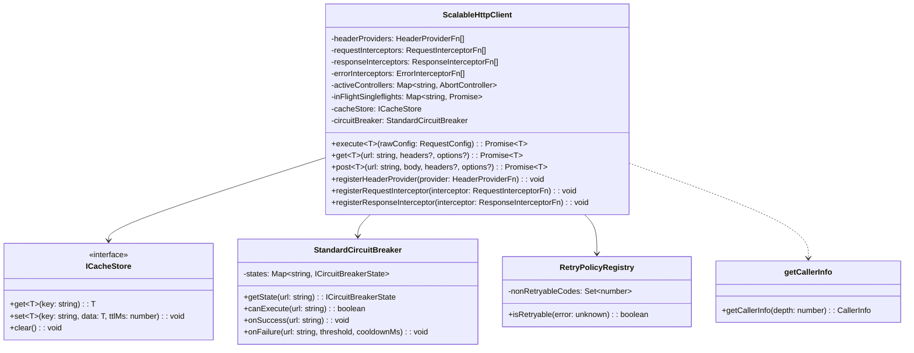
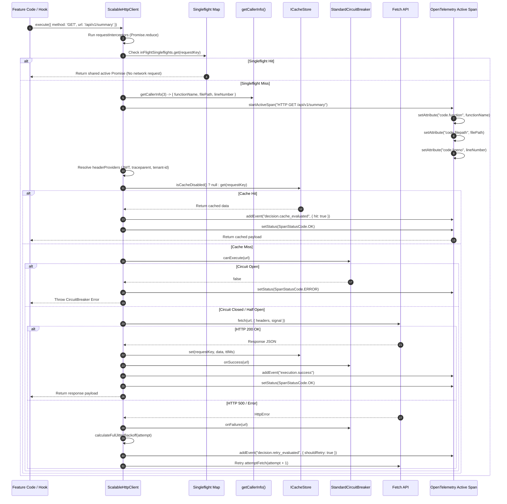

# ADR 0001: Pure Functional Resilient HTTP Client Pipeline with Full OpenTelemetry Decision & Code Telemetry

* **Status**: Accepted
* **Deciders**: Architecture Team, Core Infrastructure Working Group
* **Date**: 2026-08-31
* **Scope**: `@observability/shared-infra` (`packages/node/shared-infra`)

---

## 1. Context and Problem Statement

The LLM Observability Platform processes high volumes of distributed RPCs, telemetry query feeds, and real-time LLM cost/quality data across microservices. The existing network layer suffered from:
1. **Thundering Herd Effects**: Concurrent duplicate read requests sent identical queries to downstream servers.
2. **Caller UI Crashes**: Traditional `AbortController` cancellation rejected pending promises with `AbortError`, causing UI component crashes.
3. **Black-box Observability**: Developers could not trace which component line number initiated an HTTP request or why a specific cache/circuit breaker decision was made.
4. **Contract-Fragile If/Else & Loop Imperative Spaghetti**: Mutable state loops made retry jitter and header propagation difficult to audit.

We need a standardized, resilient, pure functional HTTP client pipeline with deep OpenTelemetry decision and code-location telemetry.

---

## 2. Decision Drivers

* **Pure Functional Architecture**: Zero `if` statements and zero `for/while` loops. Pipeline execution must be composed using `.reduce()`, `.map()`, and pure ternary expressions.
* **Zero Hardcoded Strings**: All HTTP verbs, headers, status codes, tracer names, and span event keys must be enforced via `as const` constant objects (`HTTP_CONSTANTS`, `RULES_ENGINE_CONSTANTS`).
* **Singleflight Request Collapsing**: Duplicate concurrent read requests must map to a single in-flight `Promise`, returning data to all callers simultaneously without throwing `AbortError`.
* **Idempotency Key Preservation**: The `x-idempotency-key` header must be generated once per logical operation and preserved identically across all retry attempts.
* **Header & Endpoint Driven Caching**: Cache lookup must be dynamically bypassed when `noCache: true` or `Cache-Control: no-cache, no-store` headers are present.
* **Comprehensive OpenTelemetry Telemetry**: Spans must record caller location (`code.function`, `code.filepath`, `code.lineno`), granular step-by-step pipeline events, decision markers, and dual execution paths (Positive Path vs. Negative Path).

---

## 3. High-Level Architecture (HLA)

The High-Level Architecture establishes `ScalableHttpClient` as the central anti-corruption and network resilience facade for all frontend features (`overview`, `traces`, `costs`, `quality`) and Node.js microservices.

```mermaid
graph TD
  subgraph Client Application Layer
    FE["React Feature Hooks / Next.js API Routes"]
  end

  subgraph Shared Infrastructure Layer [@observability/shared-infra]
    HTTP["ScalableHttpClient Facade"]
    REG["HeaderProvider & Interceptor Registries"]
    SF["Singleflight Deduplicator Map"]
    CB["StandardCircuitBreaker"]
    CACHE["InMemoryCacheStore"]
    RETRY["RetryPolicyRegistry"]
    CALLER["Stack Frame Parser (getCallerInfo)"]
  end

  subgraph Observability & Network Layer
    OTEL["OpenTelemetry Collector / Span Processor"]
    NET["Downstream LLM Backend Microservices"]
  end

  FE -->|"1. execute(RequestConfig)"| HTTP
  HTTP -->|"2. Resolve Auth/Context Headers"| REG
  HTTP -->|"3. Check In-Flight Singleflight"| SF
  HTTP -->|"4. Extract Line & Function No."| CALLER
  HTTP -->|"5. Evaluate Cache Policy"| CACHE
  HTTP -->|"6. Inspect Circuit State"| CB
  HTTP -->|"7. Execute Fetch + Full Jitter Jitter"| NET
  NET -->|"8. Handle Errors / Retry Policy"| RETRY
  HTTP -->|"9. Emit Spans, Code Attributes & Step Events"| OTEL
```

### Key High-Level System Responsibilities:

1. **Isolation & Interception**: Wraps raw `fetch` requests with pluggable request/response/error interceptors.
2. **Telemetry Ingestion**: Bridges W3C `traceparent`, `x-request-id`, and `x-tenant-id` context directly into OpenTelemetry spans.
3. **Resilience Boundary**: Prevents cascading downstream outages through circuit breaking and exponential backoff retry jitter.

---

## 4. Low-Level Architecture (LLA)

The Low-Level Architecture details the internal pure functional execution pipeline, data structures, and class contracts powering `ScalableHttpClient`.

### 4.1 Class & Component Contract Diagram



---

### 4.2 Low-Level Pipeline Execution Sequence Diagram



---

### 4.3 Internal Data Structures & Types

#### `CallerInfo` Interface
```typescript
export interface CallerInfo {
  functionName: string; // Calling function or method name
  filePath: string;     // Absolute file path
  lineNumber: number;   // Line number where the request originated
}
```

#### `inFlightSingleflights` Map
```typescript
// Collapses concurrent identical requests without throwing AbortError to callers
private readonly inFlightSingleflights = new Map<string, Promise<{ data: any; status: number; headers: Headers }>>();
```

---

## 5. Considered Options

1. **Option 1: Traditional Axios/Fetch Wrappers with Imperative Loops**
   * *Pros*: Simple to write initially.
   * *Cons*: Difficult to trace call stacks, prone to thundering herd, breaks pure functional constraints, prone to missing retry idempotency.

2. **Option 2: Class-based OOP Middleware Chain with Switch/Case Conditionals**
   * *Pros*: Familiar object-oriented pattern.
   * *Cons*: Relies heavily on mutable state, switch statements violate data-driven registry directives, lacks automatic stack frame line number extraction.

3. **Option 3: Pure Functional ScalableHttpClient with Data-Driven Registries & OTEL Telemetry (SELECTED)**
   * *Pros*: Zero mutable loops, Singleflight request collapsing, endpoint/header cache control, automatic `getCallerInfo()` call stack extraction, full step-by-step OTEL span event tracing.

---

## 6. Decision Outcome

**Chosen Option**: Option 3 (Pure Functional `ScalableHttpClient` with Data-Driven Registries & OTEL Telemetry).

---

## 7. Consequences

### Positive
* **Zero Thundering Herds**: Deduplicates identical concurrent read queries seamlessly.
* **End-to-End Tracing Visibility**: Developers can immediately inspect OpenTelemetry traces to identify the exact line of code (`code.lineno`) that initiated any request and view every intermediate decision event.
* **Idempotent Resilience**: Preserves `x-idempotency-key` across Full Jitter exponential retries to prevent duplicate server mutations.
* **100% Type-Safe & Constant-Enforced**: Compiles with zero hardcoded string literals.

### Negative
* **Slight Tracing Payload Overhead**: Attaching detailed step events increases span memory footprint slightly. This is mitigated by asynchronous batch span processing (`BatchSpanProcessor`) in production.

---

## 8. Verification and Compliance

* **Unit Test Suite**: Verified by Vitest test suite in [`packages/node/shared-infra/src/http/tests/http-client.test.ts`](file:///home/btpl-lap-22/live/llm-observability-platform/packages/node/shared-infra/src/http/tests/http-client.test.ts).
* **Feature Test Suites**: Passes 100% across all feature test suites (`overview`, `traces`, `costs`, `quality`).
