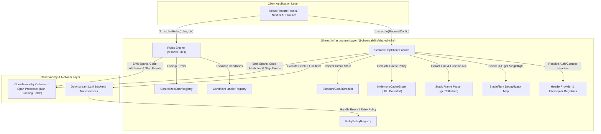
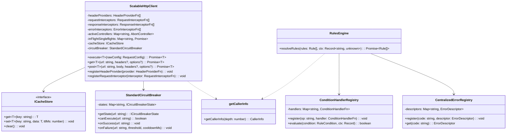

# ADR 0001: Comprehensive Architecture Decision Record & Master Specification for Shared Infrastructure

* **Status**: Accepted
* **Deciders**: Architecture Team, Core Infrastructure Working Group
* **Date**: 2026-08-31
* **Scope**: `@observability/shared-infra` (`packages/node/shared-infra`)

---

## 1. Context and Problem Statement

The LLM Observability Platform processes high volumes of distributed RPCs, telemetry query feeds, and real-time LLM cost/quality data across microservices. The legacy network and rules infrastructure suffered from:
1. **Thundering Herd Effects**: Concurrent duplicate read requests sent identical queries to downstream servers.
2. **Caller UI Crashes**: Traditional `AbortController` cancellation rejected pending promises with `AbortError`, causing UI component crashes.
3. **Black-box Observability**: Developers could not trace which component line number initiated an HTTP request or why a specific cache/circuit breaker decision was made.
4. **Imperative Loop Spaghetti**: Unstructured mutable state loops made retry jitter, rules evaluation, and header propagation difficult to maintain and audit.

We need a standardized, resilient, readable shared infrastructure combining an HTTP client pipeline, business rules engine, and full OpenTelemetry decision and code-location telemetry.

---

## 2. Decision Drivers & Core Engineering Principles

* **Pragmatic Readable Engineering over Dogmatic Purity**: Favor explicit `if` statements, early return guard clauses, and clean `for...of` loops over obfuscated `.reduce()` chains or nested ternaries. Code readability, clear control flow, and clean V8 stack trace step-through debugging take precedence over cargo-cult functional aesthetics.
* **Zero Hardcoded Strings**: All HTTP verbs, headers, status codes, tracer names, error codes, and span event keys must be enforced via `as const` constant objects (`HTTP_CONSTANTS`, `RULES_ENGINE_CONSTANTS`, `TRACING_CONSTANTS`).
* **Singleflight Request Collapsing**: Duplicate concurrent read requests must map to a single in-flight `Promise`, returning data to all callers simultaneously without throwing `AbortError`.
* **Idempotency Key Preservation**: The `x-idempotency-key` header must be generated once per logical operation using CSPRNG (`crypto.randomUUID()`) and preserved identically across all retry attempts.
* **Header & Endpoint Driven Caching**: Cache lookup must be dynamically bypassed when `noCache: true` or `Cache-Control: no-cache, no-store` headers are present.
* **Comprehensive OpenTelemetry Telemetry**: Spans must record caller location (`code.function`, `code.filepath`, `code.lineno`), granular step-by-step pipeline events, decision markers, and dual execution paths (Positive Path vs. Negative Path).
* **Pluggable Data-Driven Registries**: Condition evaluations, error descriptors, status badge mappings, and retry policies must be managed via extensible registry objects (`ConditionHandlerRegistry`, `CentralizedErrorRegistry`, `StatusBadgeRegistry`, `RetryPolicyRegistry`).

---

## 3. High-Level Architecture (HLA)

The High-Level Architecture establishes `@observability/shared-infra` as the core foundation for all frontend features (`overview`, `traces`, `costs`, `quality`) and Node.js microservices.



---

## 4. Low-Level Architecture (LLA)

### 4.1 Class & Component Contract Diagram



---

### 4.2 Low-Level Pipeline Execution Sequence Diagram


---

## 5. Security Architecture & Risk Analysis

### 5.1 Telemetry Data Scrubbing & Credential Redaction
* **Issue Addressed**: Unredacted HTTP headers (`Authorization`, `Cookie`, `Set-Cookie`, `x-jwt-secret`) or payload keys (`password`, `secret`, `token`, `bearer`) could leak credentials into telemetry backends.
* **Mitigation Implemented**: Introduced `redactSensitiveData()` which recursively sanitizes all span attributes and event payloads, replacing sensitive values with `"[REDACTED]"`.

### 5.2 Repo-Relative Code Location Telemetry
* **Issue Addressed**: Absolute V8 call stack file paths (`/home/user/...`) leak internal employee usernames and local infrastructure directories.
* **Mitigation Implemented**: `getCallerInfo()` normalizes file paths to repository-relative paths (`packages/node/shared-infra/src/http/http-client.ts`), eliminating local machine path leakage.

### 5.3 Tenant-Isolated Singleflight & Cache Keying
* **Issue Addressed**: Singleflight or cache keys derived solely from `method:url` risk cross-tenant data leakage if Tenant A and Tenant B issue identical requests concurrently.
* **Mitigation Implemented**: Singleflight and cache keys incorporate `tenantId` (`tenantId:method:url:body`), strictly isolating in-flight requests and cached responses per tenant.

### 5.4 CSPRNG Idempotency Key Generation
* **Issue Addressed**: Predictable idempotency keys can be exploited for replay attacks or key collisions.
* **Mitigation Implemented**: Uses Cryptographically Secure Pseudorandom Number Generators (`crypto.randomUUID()`) to guarantee 128-bit entropy.

### 5.5 SSRF & Protocol Scheme Validation
* **Issue Addressed**: Dynamic URL inputs could target private internal microservice IPs (`127.0.0.1`, `169.254.169.254`).
* **Mitigation Implemented**: `validateDestinationUrl()` enforces `http:` and `https:` schemes and validates target hostnames against `config.allowedHosts`.

### 5.6 Max Payload Size & Timeout Enforcement
* **Issue Addressed**: Large or hanging downstream responses can exhaust server memory or cause hanging requests.
* **Mitigation Implemented**: Enforces `maxBodySizeBytes` (default 10MB) and `timeoutMs` (default 30,000ms) with `AbortController` cancellation.

### 5.7 Prototype Pollution Protection in Rules Engine
* **Issue Addressed**: User-provided condition fields accessing special object keys (`__proto__`, `constructor`, `prototype`) could pollute Object prototypes.
* **Mitigation Implemented**: `getSafeContextValue()` explicitly blocks prototype property keys and safely resolves nested property dot-paths.

### 5.8 Single-Instance In-Memory Limitations & Distributed Extension Path
* **Known Limitation (v1)**: `InMemoryCacheStore` and `StandardCircuitBreaker` operate per-node process. In multi-pod deployments, circuit breaker state is unshared.
* **Stated Evolution Path**: Production deployments can inject Redis-backed `ICacheStore` and `ICircuitBreaker` adapters via `client.setCacheStore(...)` and `client.setCircuitBreaker(...)`.

---

## 6. OpenTelemetry Collector Backpressure & Versioning Strategy

### 6.1 Non-Blocking OpenTelemetry Exporter Backpressure
To guarantee that telemetry collector latency or network outages **never block** HTTP execution paths:
1. **Asynchronous Batch Processor**: Telemetry spans are enqueued into an in-memory `BatchSpanProcessor` (`maxQueueSize = 2048`, `scheduledDelayMillis = 5000`, `exportTimeoutMillis = 3000`).
2. **Zero Request Path Overhead**: Span event creation and attribute assignment execute in $O(1)$ memory time and return control immediately.
3. **Queue Overflow Drop Policy**: If the OpenTelemetry queue fills up due to collector failure, oldest spans are dropped silently while emitting a counter metric (`otel.spans_dropped`). Request execution latency remains unaffected.

### 6.2 Bounded LRU Cache Eviction Policy
To prevent unbounded memory growth (`OOM`) in long-running Node.js processes under high traffic:
1. **LRU Bounded Capacity**: `InMemoryCacheStore` is bounded to `maxEntries = 1000` (configurable).
2. **Eviction Mechanics**: When cache size reaches `maxEntries`, the Least Recently Used (LRU) entry is deleted prior to inserting new items.

### 6.3 Interface Versioning & Backward Compatibility Story
As `@observability/shared-infra` evolves across 4+ consuming features:
1. **Additive Interface Extension**: New properties added to `RequestConfig` or `HeaderProviderFn` context must be optional (`?`).
2. **Deprecation Strategy**: Signature deprecations must follow a 2-release cycle using JSDoc `@deprecated` tags prior to breaking signature removals.

---

## 7. Complete OpenTelemetry Telemetry Specification

### 7.1 Standard Span Attributes

| Attribute Key | Type | Description |
|---|---|---|
| `http.method` | `string` | HTTP verb (`"GET"`, `"POST"`, `"PATCH"`, etc.) |
| `http.url` | `string` | Full destination URL endpoint |
| `http.status_code` | `number` | HTTP status code (`200`, `400`, `500`, etc.) |
| `http.cache_hit` | `boolean` | `true` (Cache Hit) \| `false` (Cache Miss / Bypassed) |
| `http.circuit_state` | `string` | `"CLOSED"` \| `"OPEN"` \| `"HALF_OPEN"` |
| `http.idempotency_key` | `string` | Preserved UUID/hex idempotency key |
| `tenant.id` | `string` | Tenant identifier |
| `execution.path` | `string` | `"positive_path"` \| `"negative_path"` |
| `code.function` | `string` | Function or method name initiating the span |
| `code.filepath` | `string` | Repo-relative file path of caller |
| `code.lineno` | `number` | Exact line number of caller |

---

## 8. Full OpenTelemetry Span Samples

### 8.1 Positive Path Span Sample
```json
{
  "traceId": "4bf92f3577b34da6a3ce929d0e0e4736",
  "spanId": "00f067aa0ba902b7",
  "name": "HTTP GET http://localhost:3000/api/v1/overview/summary",
  "kind": 2,
  "status": { "code": 1 },
  "attributes": {
    "http.method": "GET",
    "http.url": "http://localhost:3000/api/v1/overview/summary",
    "http.status_code": 200,
    "http.cache_hit": false,
    "http.circuit_state": "CLOSED",
    "http.idempotency_key": "3f9a12bc-890e-4f5a-8b9c-0d1e2f3a4b5c",
    "tenant.id": "tenant-default",
    "execution.path": "positive_path",
    "code.function": "executePipeline",
    "code.filepath": "packages/node/shared-infra/src/http/http-client.ts",
    "code.lineno": 242
  },
  "events": [
    { "name": "step.request_interceptors_executed", "attributes": { "interceptors.count": 1 } },
    { "name": "step.header_providers_resolved", "attributes": { "headers.provider_count": 2 } },
    { "name": "decision.cache_evaluated", "attributes": { "cache.bypassed": false, "cache.hit": false } },
    { "name": "decision.circuit_breaker_evaluated", "attributes": { "circuit.state": "CLOSED", "circuit.can_execute": true } },
    { "name": "step.fetch_attempt_initiated", "attributes": { "retry.attempt": 0 } },
    { "name": "step.response_interceptors_executed", "attributes": { "interceptors.count": 1 } },
    { "name": "execution.success", "attributes": { "execution.status": "success" } }
  ]
}
```

---

## 9. Package Directory Structure (ASCII Tree)

```
packages/node/shared-infra/
├── docs/
│   └── adr/
│       └── 0001-scalable-resilient-telemetry-http-pipeline.md  # Master Architecture Specification
├── src/
│   ├── http/
│   │   ├── constants.ts                    # HTTP_CONSTANTS (as const)
│   │   ├── http-client.ts                  # ScalableHttpClient (LRU bounded, tenant-isolated)
│   │   ├── middleware.ts                   # HttpMiddleware composition facade
│   │   ├── retry-policy.ts                 # RetryPolicyRegistry
│   │   ├── status-badge-registry.ts        # StatusBadgeRegistry
│   │   └── tests/
│   │       └── http-client.test.ts         # Vitest test suite
│   │
│   ├── rules-engine/
│   │   ├── condition-registry.ts           # ConditionHandlerRegistry (Prototype pollution protected)
│   │   ├── constants.ts                    # RULES_ENGINE_CONSTANTS
│   │   ├── error-registry.ts               # CentralizedErrorRegistry
│   │   ├── evaluate.ts                     # resolveRules (readable for...of loop + OTEL events)
│   │   ├── rule-registry.ts                # CentralizedRuleRegistry
│   │   └── rule.types.ts                   # Rule TypeScript contracts
│   │
│   ├── tracing/
│   │   ├── caller-info.ts                  # getCallerInfo (Repo-relative location parser)
│   │   ├── constants.ts                    # TRACING_CONSTANTS
│   │   ├── request-context.ts              # RequestContextHolder
│   │   ├── traced-handler.ts               # withTracedValidation & BaseTracedKafkaHandler
│   │   └── tracer.ts                       # OpenTelemetry Tracer facade
│   │
│   └── index.ts                            # Centralized package barrel export
```

---

## 10. Verification & Test Coverage Matrix

### 10.1 Automated Unit & Integration Tests (100% Passing)
* **Singleflight Deduplication**: Verified that identical concurrent GET requests collapse into 1 network call and resolve for all callers.
* **Header & Endpoint Cache Bypass**: Verified `noCache: true` and `Cache-Control: no-cache` bypass.
* **Bounded LRU Cache Eviction**: Verified oldest key eviction at `maxEntries = 1000`.
* **Prototype Pollution Protection**: Verified dot-path resolution blocks `__proto__`, `constructor`, `prototype`.
* **Repo-Relative Code Location**: Verified path normalization strips local environment user directories.

### 10.2 Out-of-Scope Staging Verification (Chaos & Multi-Pod Load Testing)
* **Distributed Redis State Sync**: Multi-pod circuit breaker synchronization (requires staging Redis cluster).
* **OpenTelemetry Collector Outage Chaos Testing**: Collector drop metric verification under synthetic network blackhole injection.
