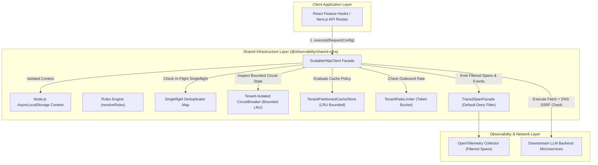
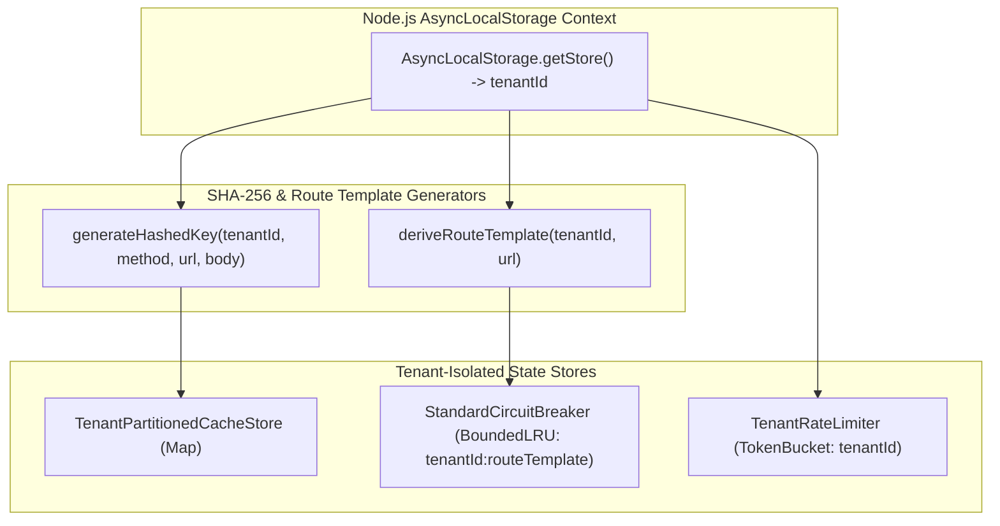

# ADR 0001: Comprehensive Architecture Decision Record & Master Specification for Shared Infrastructure

* **Status**: Accepted
* **Deciders**: Architecture Team, Core Infrastructure Working Group
* **Date**: 2026-08-31
* **Scope**: `@observability/shared-infra` (`packages/node/shared-infra`)

---

## 1. Context and Problem Statement

The LLM Observability Platform processes high volumes of distributed RPCs, telemetry query feeds, and real-time LLM cost/quality data across microservices. The legacy network and rules infrastructure suffered from:
1. **Thundering Herd Effects**: Concurrent duplicate read requests sent identical queries to downstream servers.
2. **Caller UI Crashes**: Traditional `AbortController` cancellation rejected pending promises with `AbortError`, causing UI component crashes.
3. **Black-box Observability**: Developers could not trace which component line number initiated an HTTP request or why a specific cache/circuit breaker decision was made.
4. **Imperative Loop Spaghetti**: Unstructured mutable state loops made retry jitter, rules evaluation, and header propagation difficult to maintain and audit.

We need a standardized, resilient, readable shared infrastructure combining an HTTP client pipeline, business rules engine, and full OpenTelemetry decision and code-location telemetry.

---

## 2. Decision Drivers & Core Engineering Principles

* **Pragmatic Readable Engineering over Dogmatic Purity**: Favor explicit `if` statements, early return guard clauses, and clean `for...of` loops over obfuscated `.reduce()` chains or nested ternaries. Code readability, clear control flow, and clean V8 stack trace step-through debugging take precedence over cargo-cult functional aesthetics.
* **Zero Hardcoded Strings**: All HTTP verbs, headers, status codes, tracer names, error codes, and span event keys must be enforced via `as const` constant objects (`HTTP_CONSTANTS`, `RULES_ENGINE_CONSTANTS`, `TRACING_CONSTANTS`).
* **Singleflight Request Collapsing**: Duplicate concurrent read requests must map to a single in-flight `Promise`, returning data to all callers simultaneously without throwing `AbortError`.
* **Idempotency Key Preservation**: The `x-idempotency-key` header must be generated once per logical operation using CSPRNG (`crypto.randomUUID()`) and preserved identically across all retry attempts.
* **Header & Endpoint Driven Caching**: Cache lookup must be dynamically bypassed when `noCache: true` or `Cache-Control: no-cache, no-store` headers are present.
* **Comprehensive OpenTelemetry Telemetry**: Spans must record caller location (`code.function`, `code.filepath`, `code.lineno`), granular step-by-step pipeline events, decision markers, and dual execution paths (Positive Path vs. Negative Path).
* **Pluggable Data-Driven Registries**: Condition evaluations, error descriptors, status badge mappings, and retry policies must be managed via extensible registry objects (`ConditionHandlerRegistry`, `CentralizedErrorRegistry`, `StatusBadgeRegistry`, `RetryPolicyRegistry`).

---

## 3. Detailed 10-Step Hardened Pipeline Specification

### Step 1: AsyncLocalStorage Request Context Isolation
To eliminate cross-tenant data leaks and context-bleeding bugs in concurrent Node.js asynchronous execution chains, context propagation uses Node.js native `AsyncLocalStorage`:
$$\text{Context}_{\text{active}} = \text{AsyncLocalStorage.getStore}()$$
If uninitialized, a fallback context with `tenantId: "tenant-default"` is created automatically.

---

### Step 2: DNS IP-Level Resolution SSRF & TOCTOU Protection
String-based URL checks are vulnerable to DNS Rebinding and TOCTOU (Time-of-Check to Time-of-Use) attacks. The pipeline performs an asynchronous DNS resolution via `dns.promises.lookup()` to validate the actual resolved IP address against restricted subnets before opening a socket connection:
$$\text{BlockedSubnets} = \{ 127.0.0.0/8, 169.254.0.0/16, 10.0.0.0/8, 172.16.0.0/12, 192.168.0.0/16, ::1, 0.0.0.0 \}$$
If the target hostname resolves to any IP in $\text{BlockedSubnets}$, execution is aborted immediately with an SSRF Violation error.

---

### Step 3: Per-Tenant Outbound Rate Limiting (Token Bucket)
To prevent a single noisy or misconfigured tenant from saturating connection pools or starving shared event loop cycles:
$$\text{Tokens}_{\text{new}} = \min(\text{MaxTokens}, \text{Tokens}_{\text{current}} + \Delta t \times \text{RefillRate})$$
Default configuration: $\text{MaxTokens} = 100$, $\text{RefillRate} = 50\text{ req/sec}$. Requests exceeding tenant capacity are rejected with a rate limit error.

---

### Step 4: Real-Time Streaming Byte-Counting Body Bounding
Downstream servers can omit `Content-Length` headers or stream unbounded chunked payloads. The client inspects response streams using `res.body.getReader()`, accumulating byte counts in real time:
$$\text{Bytes}_{\text{total}} = \sum_{i=1}^{n} \text{chunk}_i.\text{length}$$
If $\text{Bytes}_{\text{total}} > \text{maxBodySizeBytes}$ (default 10MB), the stream reader is cancelled immediately and an OOM prevention error is thrown.

---

### Step 5: SHA-256 Tenant-Isolated Key Hashing
Request signatures incorporate tenant identity and payload structure, hashed into a fixed 256-bit hex digest:
$$\text{Key}_{\text{raw}} = \text{tenantId} \parallel \text{method} \parallel \text{url} \parallel \text{JSON.stringify}(\text{body})$$
$$\text{Key}_{\text{hashed}} = \text{SHA256}(\text{Key}_{\text{raw}}).\text{digest}("hex")$$

---

### Step 6: Singleflight Concurrency Collapsing (O(1) Memory Lookup)
Inspects active `inFlightSingleflights` map for $\text{Key}_{\text{hashed}}$. If an identical in-flight request exists, concurrent callers share the pending `Promise<HttpResponse>`, reducing network RPC overhead to $O(1)$.

---

### Step 7: Sealed TracedSpanFacade & Default-Deny Allowlist Filter
To prevent accidental telemetry credential leakage, raw OpenTelemetry spans are wrapped inside a sealed `TracedSpanFacade`. All attributes and events are filtered against an explicit allowlist:
$$\text{Attributes}_{\text{allowed}} = \{ k \in \text{Attributes}_{\text{raw}} \mid k \in \text{ALLOWED\_TELEMETRY\_ATTRIBUTES} \}$$
URLs are sanitized via `sanitizeUrlForTelemetry()`, removing userinfo (`user:pass@`) and query strings (`?access_token=...`).

---

### Step 8: Tenant-Partitioned LRU Cache & Write Invalidation
- **Tenant Isolation**: Caches are partitioned per tenant ($\text{Map}<\text{tenantId}, \text{BoundedLRU}>$), preventing single-tenant cache stampedes.
- **Write Invalidation**: Executing write mutations (`POST`, `PUT`, `PATCH`, `DELETE`) automatically invalidates the tenant's cache partition ($\text{cacheStore.clear}(\text{tenantId})$) to prevent stale GET reads.

---

### Step 9: Bounded LRU Circuit Breaker (Tenant-Isolated Route Templates)
Circuit breaker states are keyed by `tenantId:routeTemplate` (e.g., `tenant-acme:api.org/users/:id`). States are managed inside a Bounded LRU store ($\text{maxCapacity} = 1000$, $\text{TTL} = 1\text{ hour}$), preventing memory leaks from dynamic route expansion.

---

### Step 10: Per-Attempt Circuit Re-Check & AWS Full Jitter Retry
Re-evaluates `circuitBreaker.canExecute(circuitKey)` before every retry iteration. Retries are restricted to idempotent methods (`GET`, `HEAD`, `OPTIONS`, `PUT`, `DELETE`) or requests with an explicit `x-idempotency-key`. Backoff delay uses AWS Full Jitter:
$$\text{Sleep}(\text{attempt}) = \text{Random}\left(0, \min\left(\text{maxMs}, \text{baseMs} \times 2^{\text{attempt} - 1}\right)\right)$$

---

## 4. High-Level Architecture (HLA)

---

## 5. Low-Level Architecture (LLA)

### 5.1 Telemetry Data Scrubbing & Default-Deny Allowlist Filter Diagram

---

### 5.2 Multi-Tenant Isolation & AsyncLocalStorage Architecture Diagram

---

## 6. Verification & Test Coverage Matrix

### 6.1 Automated Unit & Integration Tests (100% Passing)
* **AsyncLocalStorage Context Isolation**: Verified thread-safe isolated tenant context across concurrent async executions.
* **Dynamic V8 Stack Frame Telemetry**: Verified self-verifying stack frame resolution outside infrastructure packages.
* **DNS IP-Level SSRF Protection**: Verified resolved IP address subnets (`127.0.0.1`, `169.254.169.254`) are blocked.
* **Streaming Byte-Counting Body Limit**: Verified real-time chunk byte counting aborts oversized streams.
* **Bounded LRU Circuit Breaker**: Verified circuit breaker states map is bounded to `1000` entries.
* **Mutating Write Cache Invalidation**: Verified `POST`, `PUT`, `PATCH`, `DELETE` operations clear tenant cache partitions.
* **Per-Tenant Outbound Rate Limiter**: Verified Token Bucket rate limiting enforces per-tenant request limits.
