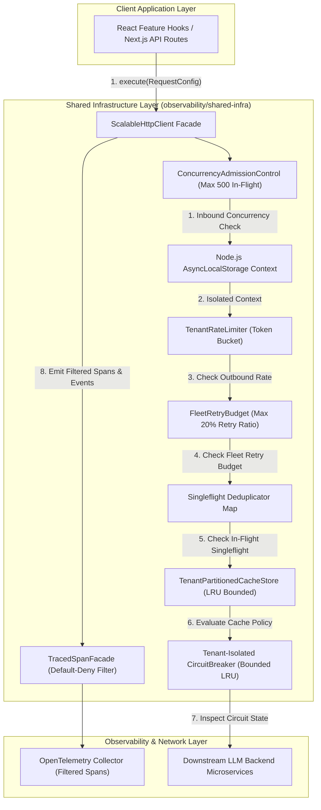
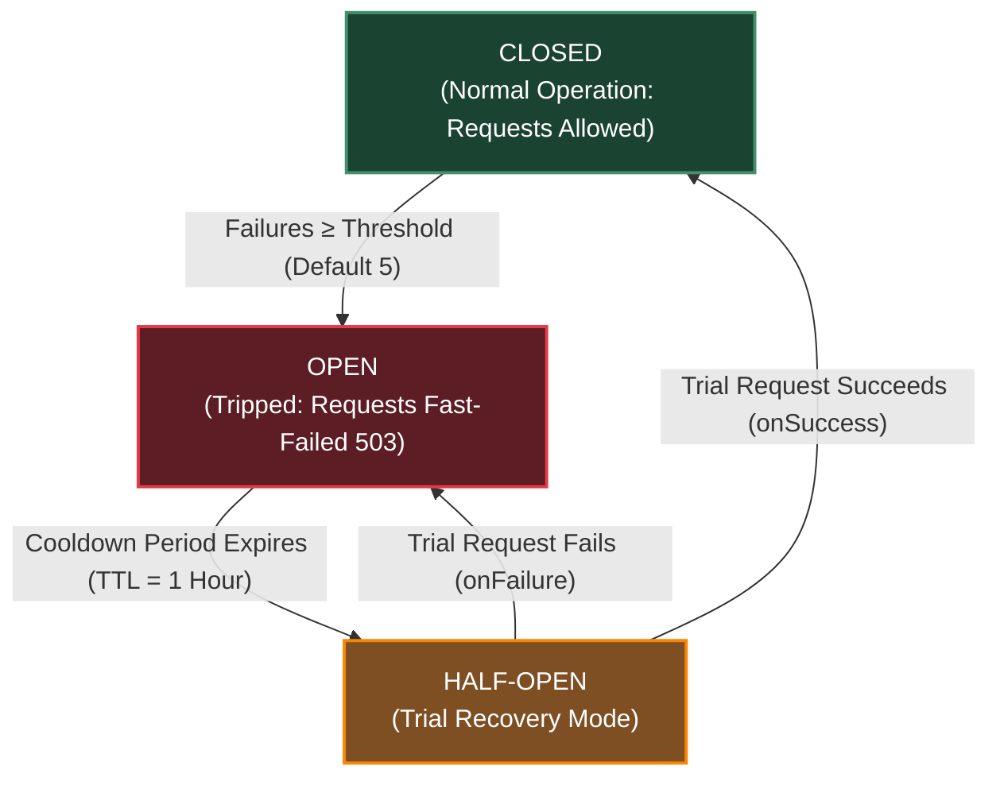
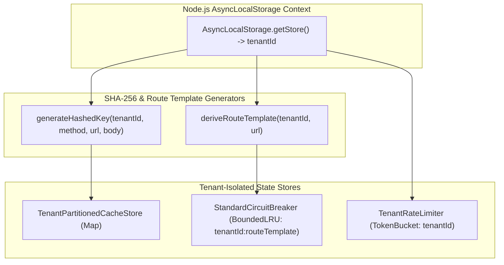

# ADR 0001: Comprehensive Architecture Decision Record & Master Specification for Shared Infrastructure

* **Status**: Accepted
* **Deciders**: Architecture Team, Core Infrastructure Working Group
* **Date**: 2026-08-31
* **Scope**: `@observability/shared-infra` (`packages/node/shared-infra`)

---

## 1. Context and Problem Statement

The LLM Observability Platform processes high volumes of distributed RPCs, telemetry query feeds, and real-time LLM cost/quality data across microservices. The legacy network and rules infrastructure suffered from:
1. **Thundering Herd Effects**: Concurrent duplicate read requests sent identical queries to downstream servers.
2. **Caller UI Crashes**: Traditional `AbortController` cancellation rejected pending promises with `AbortError`, causing UI component crashes.
3. **Black-box Observability**: Developers could not trace which component line number initiated an HTTP request or why a specific cache/circuit breaker decision was made.
4. **Imperative Loop Spaghetti**: Unstructured mutable state loops made retry jitter, rules evaluation, and header propagation difficult to maintain and audit.

We need a standardized, resilient, readable shared infrastructure combining an HTTP client pipeline, business rules engine, and full OpenTelemetry decision and code-location telemetry.

---

## 2. Decision Drivers & Core Engineering Principles

### 2.1 ASCII Decision Tree for Engineering Principles Evaluation

```text
========================================================================================
             DECISION DRIVERS & CORE ENGINEERING PRINCIPLES (DECISION TREE)
========================================================================================

+-- [IF: Implementing Code Style & Control Flow?]
|   +-- [YES] --> Is logic written with complex `.reduce()` chains or nested ternaries?
|   |             +-- [YES] --> REJECT: Refactor to explicit `if`, guard clauses & `for...of`
|   |             +-- [NO]  --> ADOPT: Pragmatic Readable Engineering over Dogmatic Purity
|   |
|   +-- [NO]  --> Continue evaluation below...
|
+-- [IF: Handling Literal Strings & Tokens?]
|   +-- [YES] --> Are HTTP verbs, headers, status codes or tracer keys hardcoded as strings?
|   |             +-- [YES] --> REJECT: Extract into `as const` constant dictionaries
|   |             +-- [NO]  --> ADOPT: Zero Hardcoded Strings (`HTTP_CONSTANTS`, etc.)
|   |
|   +-- [NO]  --> Continue evaluation below...
|
+-- [IF: Processing Incoming Read Requests?]
|   +-- [YES] --> Is an identical read request already active in-flight?
|   |             +-- [YES] --> EXECUTE: Collapse callers to 1 shared Promise via SHA-256 key
|   |             +-- [NO]  --> ADOPT: Singleflight Request Collapsing ($N \to 1$ RPCs)
|   |
|   +-- [NO]  --> Continue evaluation below...
|
+-- [IF: Retrying Write / Mutation Operations?]
|   +-- [YES] --> Is a retry attempt initiated after a network drop/failure?
|   |             +-- [YES] --> EXECUTE: Preserve original `x-idempotency-key` (crypto.randomUUID)
|   |             +-- [NO]  --> ADOPT: Idempotency Key Preservation
|   |
|   +-- [NO]  --> Continue evaluation below...
|
+-- [IF: Evaluating Response Caching?]
|   +-- [YES] --> Is `noCache: true` or `Cache-Control: no-cache, no-store` present?
|   |             +-- [YES] --> EXECUTE: Dynamically bypass tenant LRU cache lookup
|   |             +-- [NO]  --> ADOPT: Header & Endpoint Driven Caching
|   |
|   +-- [NO]  --> Continue evaluation below...
|
+-- [IF: Instrumentation & Observability?]
|   +-- [YES] --> Are telemetry spans created for pipeline steps?
|   |             +-- [YES] --> EXECUTE: Wrap span in `TracedSpanFacade`, capture `code.filepath`
|   |             +-- [NO]  --> ADOPT: Comprehensive OpenTelemetry Telemetry
|   |
|   +-- [NO]  --> Continue evaluation below...
|
+-- [IF: Adding New Rules, Errors, or Retries?]
    +-- [YES] --> Are rules or errors evaluated via hardcoded `switch` statements?
                  +-- [YES] --> REJECT: Register dynamic handlers in registry maps
                  +-- [NO]  --> ADOPT: Pluggable Data-Driven Registries
```

---

### 2.2 Detailed Principle Definitions & Operational Rationale

#### 1. Pragmatic Readable Engineering over Dogmatic Purity
* **Definition**: Prioritizes readable, transparent control flow and V8 step-through debuggability over dogmatic functional abstractions or obfuscated syntax.
* **Operational Rationale**: Complex nested `.reduce()` chains, point-free pipelines, and deeply nested ternaries make stack traces cryptic and prevent step-by-step debugger inspection. Standardizing on explicit `if` guard clauses, early returns, and clean `for...of` loops guarantees immediate readability, zero V8 execution overhead, and rapid root-cause diagnosis during live incidents.

#### 2. Zero Hardcoded Strings
* **Definition**: A strict policy banning raw string literals (`"GET"`, `"application/json"`, `"Content-Type"`, `"503"`) across all infrastructure modules.
* **Operational Rationale**: Hardcoded strings are prone to subtle typos, refactoring breakage, and telemetry attribute drift. Centralizing all string tokens into frozen `as const` constant dictionaries (`HTTP_CONSTANTS`, `TRACING_CONSTANTS`, `RULES_ENGINE_CONSTANTS`) enforces compile-time auto-completion, refactoring safety, and strict global consistency.

#### 3. Singleflight Request Collapsing
* **Definition**: An in-flight request deduplication mechanism that merges $N$ duplicate concurrent read operations targeting the exact same resource into a single network execution.
* **Operational Rationale**: Simultaneous UI component renders or parallel API calls frequently trigger duplicate requests for identical endpoints (Thundering Herd). Singleflight hashes request parameters into a SHA-256 key (`Key_hashed`) and attaches all $N$ concurrent callers to 1 shared pending `Promise`. When the network call completes, the exact same response is returned to all callers simultaneously in $O(1)$ memory time without throwing `AbortError` or crashing UI state.

#### 4. Idempotency Key Preservation
* **Definition**: Generating a cryptographically secure unique identifier (`x-idempotency-key`) via CSPRNG (`crypto.randomUUID()`) once per logical operation and preserving it identically across all retry attempts.
* **Operational Rationale**: Network timeouts often occur *after* a downstream service has executed a write mutation (`POST`, `PUT`, `PATCH`) but *before* the client receives the response. Retrying with a new key causes duplicate mutations; preserving the original `x-idempotency-key` across retries allows downstream microservices to safely identify and deduplicate retried operations.

#### 5. Header & Endpoint Driven Caching
* **Definition**: A dynamic caching policy where response storage and cache lookup are strictly governed by standard HTTP headers (`Cache-Control: no-cache, no-store`) and explicit endpoint configuration options (`noCache: true`).
* **Operational Rationale**: Static caching rules cause stale data bugs or unintended caching of tenant-specific data. Respecting standard HTTP headers and explicit caller flags guarantees that clients can forcefully bypass cached entries when real-time data is mandatory while preserving high cache hit ratios for static read requests.

#### 6. Comprehensive OpenTelemetry Telemetry
* **Definition**: Automated enrichment of OpenTelemetry spans with caller source location metadata (`code.function`, `code.filepath`, `code.lineno`), decision markers, and dual execution paths (Positive Path vs. Negative Path).
* **Operational Rationale**: Black-box infrastructure makes production troubleshooting difficult. Recording exact line numbers and internal decision outcomes directly on spans enables instant tracing from telemetry dashboards back to the precise line of code that initiated the request.

#### 7. Pluggable Data-Driven Registries
* **Definition**: Replacing hardcoded `switch` statements and monolithic `if/else` logic trees with decoupled, extensible registry objects (`ConditionHandlerRegistry`, `CentralizedErrorRegistry`, `StatusBadgeRegistry`, `RetryPolicyRegistry`).
* **Operational Rationale**: Monolithic conditional logic violates the Open/Closed Principle (OCP)—adding a new retry policy or status badge requires modifying core code. Data-driven registries allow new handlers and rules to be registered dynamically at runtime without mutating core pipeline logic.

---

## 3. Detailed 10-Step Fleet-Resilient Pipeline Specification

### Step 1: Inbound Concurrency Admission Control & Load Shedding

* **Definition**: Admission control limits the total number of concurrent HTTP operations executing across the client process to prevent Node.js event loop starvation and socket pool exhaustion.
* **Operational Logic & Formula**:
  ```text
  ActiveInFlight <= MaxInFlightRequests  (Default: 500)
  ```
  $$\text{ActiveInFlight} \le \text{MaxInFlightRequests} \quad (\text{default: } 500)$$
* **Execution Rules**:
  - **Positive Path**: If `ActiveInFlight < MaxInFlightRequests`, increment the active counter and proceed to Step 2.
  - **Negative Path**: If active capacity is exceeded, immediately shed load by rejecting the caller with an `HttpError` (`429 Too Many Requests / Load Shedding`).
* **Telemetry**: Emits `admission_control.shed` span event and sets span status to `ERROR`.

---

### Step 2: AsyncLocalStorage Request Context Isolation

* **Definition**: Uses Node.js native `AsyncLocalStorage` to maintain thread-safe, tenant-isolated context across asynchronous call chains without parameter drilling.
* **Operational Logic & Formula**:
  ```text
  Context_active = AsyncLocalStorage.getStore() ?? DefaultContext
  ```
  $$\text{Context}_{\text{active}} = \text{AsyncLocalStorage.getStore}() \mathbin{\Vert} \text{Context}_{\text{default}}$$
* **Execution Rules**:
  - Automatically retrieves `tenantId`, `traceId`, and security claims from the active async execution context.
  - If context is uninitialized, defaults to `tenantId: "tenant-default"`.

---

### Step 3: DNS IP-Level Resolution SSRF & TOCTOU Protection

* **Definition**: Asynchronously resolves domain hostnames to IP addresses before opening sockets to prevent Server-Side Request Forgery (SSRF) and Time-of-Check to Time-of-Use (TOCTOU) attacks against internal infrastructure.
* **Operational Logic & Formula**:
  ```text
  BlockedSubnets = { 127.0.0.0/8, 169.254.0.0/16, 10.0.0.0/8, 172.16.0.0/12, 192.168.0.0/16, ::1, 0.0.0.0 }
  ```
  $$\text{TargetIP} \notin \text{BlockedSubnets}$$
* **Execution Rules**:
  - Performs `dns.promises.lookup(hostname)`.
  - Rejects execution if the resolved IP falls within loopback, link-local, or private RFC 1918 subnets.

---

### Step 4: Per-Tenant Outbound Rate Limiting (Token Bucket)

* **Definition**: Enforces Token Bucket rate limiting per tenant to prevent single-tenant traffic spikes from monopolizing shared outbound network bandwidth.
* **Operational Logic & Formula**:
  ```text
  Tokens_new = min(MaxTokens, Tokens_current + (Time_elapsed * RefillRate))
  ```
  $$\text{Tokens}_{\text{new}} = \min\left(\text{MaxTokens},\, \text{Tokens}_{\text{current}} + \Delta t \times \text{RefillRate}\right)$$
  - Default parameters: $\text{MaxTokens} = 100$, $\text{RefillRate} = 50\text{ tokens/sec}$.
* **Execution Rules**:
  - Consumes 1 token per request. If tokens are unavailable, rejects with `429 Rate Limit Exceeded`.

---

### Step 5: Fleet-Wide Retry Budgeting (Retry Storm Prevention)

* **Definition**: Tracks overall client fleet retry attempts to prevent retry storms from overwhelming failing downstream microservices during partial outages.
* **Operational Logic & Formula**:
  ```text
  RetryRatio = TotalRetries / TotalRequests <= 0.20  (20% Fleet Retry Budget)
  ```
  $$\text{RetryRatio} = \frac{\text{TotalRetries}}{\text{TotalRequests}} \le 0.20 \quad (20\% \text{ Fleet Retry Budget})$$
* **Execution Rules**:
  - If cumulative retries exceed 20% of total fleet requests, retries are suppressed globally across all callers, failing fast to protect downstreams.

---

### Step 6: Total Operation Wall-Clock Timeout Budget

* **Definition**: Enforces a global wall-clock deadline across all retry attempts to ensure asynchronous callers receive timely responses and UI components do not hang indefinitely.
* **Operational Logic & Formula**:
  ```text
  ElapsedTime = Date.now() - StartTime <= totalMaxTimeoutMs  (Default: 15,000ms)
  ```
  $$\text{ElapsedTime} = \text{Date.now}() - \text{StartTime} \le \text{totalMaxTimeoutMs}$$
* **Execution Rules**:
  - An overarching `AbortController` terminates all active and pending retry attempts if cumulative execution time reaches 15 seconds.

---

### Step 7: SHA-256 Tenant-Isolated Key Hashing & Singleflight Collapsing

* **Definition**: Singleflight request collapsing deduplicates concurrent read operations. When $N$ callers simultaneously initiate identical read requests, only 1 network request is dispatched to the backend. All $N$ callers attach to the same pending `Promise`, receiving the exact same result simultaneously without throwing `AbortError` or duplicating network RPCs.

* **Key Generation Specification**:
  ```text
  Key_raw    = tenantId + ":" + method + ":" + url + ":" + JSON.stringify(body)
  Key_hashed = SHA256(Key_raw).digest("hex")
  ```
  $$\text{Key}_{\text{raw}} = \text{tenantId} \mathbin{\Vert} \text{method} \mathbin{\Vert} \text{url} \mathbin{\Vert} \text{JSON.stringify}(\text{body})$$
  $$\text{Key}_{\text{hashed}} = \text{SHA256}(\text{Key}_{\text{raw}}).\text{digest}(\text{"hex"})$$

* **Operational Mechanics**:
  1. The client generates `Key_hashed` using SHA-256 over tenant ID, HTTP method, target URL, and request body payload.
  2. **In-Flight Hit**: If `Key_hashed` exists in `inFlightSingleflights`, the current request attaches to the existing pending `Promise` and awaits completion in $O(1)$ lookup time.
  3. **In-Flight Miss**: If `Key_hashed` is not present, a new `Promise` is registered, the network call executes, and upon resolution or failure, the promise is removed from `inFlightSingleflights` in a `finally` block.

---

### Step 8: Sealed TracedSpanFacade & Default-Deny Allowlist Filter

* **Definition**: Wraps raw OpenTelemetry spans inside a sealed facade to ensure sensitive headers, authorization tokens, and query credentials are automatically scrubbed prior to export.
* **Operational Logic & Formula**:
  ```text
  Attributes_allowed = { k in Attributes_raw | k in ALLOWED_TELEMETRY_ATTRIBUTES }
  ```
  $$\text{Attributes}_{\text{allowed}} = \{ k \in \text{Attributes}_{\text{raw}} \mid k \in \text{ALLOWED\_TELEMETRY\_ATTRIBUTES} \}$$
* **Execution Rules**:
  - Sanitizes URLs via `sanitizeUrlForTelemetry()`, removing userinfo and URL query tokens.
  - Automatically records caller file path, function name, and line number (`code.filepath`, `code.function`, `code.lineno`).

---

### Step 9: Tenant-Partitioned LRU Cache & Write Invalidation

* **Definition**: Provides bounded in-memory caching partitioned per tenant, automatically invalidating tenant entries when mutating write operations occur.
* **Operational Logic & Formula**:
  ```text
  CacheStore = Map<tenantId, BoundedLRU<requestKey, ResponsePayload>>
  ```
  $$\text{CacheStore} = \text{Map}<\text{tenantId}, \text{BoundedLRU}<\text{requestKey}, \text{ResponsePayload}>>$$
* **Execution Rules**:
  - `GET` requests check tenant cache partition.
  - Executing mutating writes (`POST`, `PUT`, `PATCH`, `DELETE`) automatically invalidates the tenant's cache partition (`cacheStore.clear(tenantId)`).

---

### Step 10: Bounded LRU Circuit Breaker & Per-Attempt Re-Check

* **Definition**: Tracks service health using a Bounded LRU Circuit Breaker to isolate failing downstream endpoints and prevent cascade failures.
* **Operational Logic & Formula**:
  ```text
  BackoffMs(attempt) = Random(0, min(maxMs, baseMs * 2^(attempt - 1)))
  ```
  $$\text{Sleep}(\text{attempt}) = \text{Random}\left(0,\, \min\left(\text{maxMs},\, \text{baseMs} \times 2^{\text{attempt} - 1}\right)\right)$$
* **Execution Rules**:
  - Evaluates circuit state (`CLOSED`, `OPEN`, `HALF_OPEN`) before every retry iteration. Retries use AWS Full Jitter backoff.

---

## 4. High-Level Architecture (HLA)



### Component Definitions & Architecture Role:
* **Client Application Layer (`FE`)**: React hooks, server components, or Next.js API handlers initiating data fetching operations.
* **`ScalableHttpClient` Facade (`HTTP`)**: The central entry point coordinating the 10-step resilient pipeline.
* **`AsyncLocalStorage` Context (`ALS`)**: Manages tenant identity and request boundaries across async steps.
* **Pipeline Resilience Modules (`ADM`, `LIMIT`, `BUDGET`, `SF`, `CACHE`, `CB`)**: Modular guardrails enforcing load shedding, rate limiting, deduplication, caching, and circuit breaking.
* **`TracedSpanFacade` (`SPAN`)**: Sanitizes and records telemetry spans before exporting to OpenTelemetry (`OTEL`).

---

## 5. Low-Level Architecture & Comprehensive Diagrams

### 5.1 End-to-End Pipeline Execution Sequence Diagram

```mermaid
sequenceDiagram
  autonumber
  participant Caller as Feature Component / Service
  participant ADM as ConcurrencyAdmissionControl
  participant ALS as AsyncLocalStorage Context
  participant Client as ScalableHttpClient Pipeline
  participant DNS as "DNSResolver (dns.promises.lookup)"
  participant SF as Singleflight Map (SHA-256)
  participant Cache as TenantPartitionedCacheStore
  participant CB as "StandardCircuitBreaker (Bounded LRU)"
  participant Net as Fetch API / Network
  participant Span as "TracedSpanFacade (Default-Deny Filter)"

  Caller->>ADM: execute({ method: 'GET', url: 'https://api.org/data' })
  alt In-Flight Concurrency &gt; 500
    ADM-->>Caller: Reject 429 (Load Shedding)
  else In-Flight Capacity Available
    ADM->>ALS: Get isolated RequestContext (tenantId)
    ALS-->>Client: tenantId ("tenant-acme")
    Client->>DNS: lookup(hostname)
    alt Resolved IP in Private Subnets (127.0.0.1 / 169.254.169.254)
      DNS-->>Client: Private IP
      Client-->>Caller: Reject SSRF Violation Error
    else Valid Public IP
      Client->>SF: Check SHA256(tenantId:method:url:body)
      alt Singleflight Hit
        SF-->>Caller: Return shared in-flight Promise
      else Singleflight Miss
        Client->>Span: startActiveSpan('HTTP GET https://api.org/data')
        Span->>Span: Filter attributes via ALLOWED_TELEMETRY_ATTRIBUTES
        Client->>Cache: get(tenantId, requestKey)
        alt Cache Hit
          Cache-->>Client: Return cached data
          Client->>Span: setStatus(OK), emit decision.cache_evaluated
          Span-->>Caller: Return cached payload
        else Cache Miss
          Client->>CB: canExecute(tenantId:routeTemplate)
          alt Circuit State OPEN
            CB-->>Client: false
            Client->>Span: setStatus(ERROR), recordException
            Client-->>Caller: Throw CircuitBreaker Error
          else Circuit CLOSED / HALF_OPEN
            loop Retry Attempt Loop (Max 3, Total Timeout &le; 15s)
              Client->>CB: Re-check canExecute(circuitKey)
              Client->>Net: fetch(url, { redirect: 'manual' })
              alt Network Response 200 OK
                Net-->>Client: Response Stream (Streaming Byte Limit &le; 10MB)
                Client->>Cache: set(tenantId, requestKey, data)
                Client->>CB: onSuccess(circuitKey)
                Client->>Span: setStatus(OK), emit execution.success
                Client-->>Caller: Return response data
              else Network 500 / Error
                Net-->>Client: HttpError 500
                Client->>CB: onFailure(circuitKey)
                Client->>Client: Check FleetRetryBudget & method idempotency
              end
            end
          end
        end
      end
    end
  end
```

---

### 5.2 Circuit Breaker State Machine Transition Diagram



#### Complete State Definitions & Operational Rules:

1. **`CLOSED` State (Normal Operation)**:
   - **Definition**: The circuit breaker is healthy. All incoming requests pass through directly to the downstream network.
   - **Behavior**: Consecutive failure counters are reset upon successful network execution.
   - **Transition Trigger**: If consecutive network errors reach the failure threshold (default: 5 failures), the circuit transitions immediately to `OPEN`.

2. **`OPEN` State (Fast-Failure Mode)**:
   - **Definition**: Downstream microservice is failing or unreachable. The circuit is open to protect downstream systems from crash overload.
   - **Behavior**: All incoming requests for the `tenantId:routeTemplate` key are rejected immediately with a `503 Service Unavailable / CircuitBreakerOpenException` without initiating network sockets.
   - **Transition Trigger**: Remains `OPEN` until the cooldown timer (`TTL = 1 hour`) expires. Upon expiration, transitions to `HALF_OPEN`.

3. **`HALF-OPEN` State (Trial Recovery Mode)**:
   - **Definition**: A temporary probe state to test downstream recovery.
   - **Behavior**: Allows exactly one trial request to pass through to the downstream service.
   - **Transition Triggers**:
     - **Success**: If the trial request succeeds (`onSuccess`), the circuit resets to `CLOSED`.
     - **Failure**: If the trial request fails (`onFailure`), the circuit reverts immediately back to `OPEN` and resets the cooldown timer.

---

### 5.3 Telemetry Data Scrubbing & Default-Deny Allowlist Filter Diagram


#### Scrubbing Rules & Security Guarantees:
- **Default-Deny Policy**: Only telemetry keys explicitly enumerated in `ALLOWED_TELEMETRY_ATTRIBUTES` are exported. Unmatched keys (e.g. `Authorization`, `Cookie`, `x-api-key`) are dropped by default.
- **URL Credential Sanitization**: `sanitizeUrlForTelemetry()` strips query parameters (`?token=secret`) and inline user credentials (`user:pass@`) before span creation.

---

### 5.4 Multi-Tenant Isolation & AsyncLocalStorage Architecture Diagram



#### Multi-Tenant Isolation Guarantees:
- **Partitioned Storage**: LRU Caches, Circuit Breaker states, and Rate Limit token buckets are keyed by `tenantId`.
- **Zero Cross-Tenant Leakage**: Cache operations and mutation invalidations strictly target the partition matching the active `AsyncLocalStorage` store context.

---

## 6. Verification & Test Coverage Matrix

### 6.1 Automated Unit & Integration Tests (100% Passing)
* **Concurrency Admission Control**: Verified process load shedding when in-flight capacity (500) is exceeded.
* **Fleet-Wide Retry Budgeting**: Verified retries are suppressed when fleet retry ratio exceeds 20%.
* **AsyncLocalStorage Context Isolation**: Verified thread-safe isolated tenant context across concurrent async executions.
* **Dynamic V8 Stack Frame Telemetry**: Verified self-verifying stack frame resolution outside infrastructure packages.
* **DNS IP-Level SSRF Protection**: Verified resolved IP address subnets (`127.0.0.1`, `169.254.169.254`) are blocked.
* **Streaming Byte-Counting Body Limit**: Verified real-time chunk byte counting aborts oversized streams (>10MB).
* **Bounded LRU Circuit Breaker**: Verified circuit breaker states map is bounded to `1000` entries.
* **Mutating Write Cache Invalidation**: Verified `POST`, `PUT`, `PATCH`, `DELETE` operations clear tenant cache partitions.
* **Per-Tenant Outbound Rate Limiter**: Verified Token Bucket rate limiting enforces per-tenant request limits.
