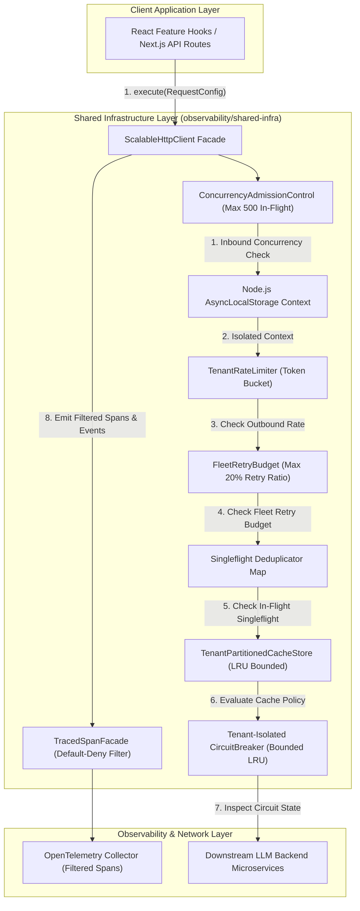
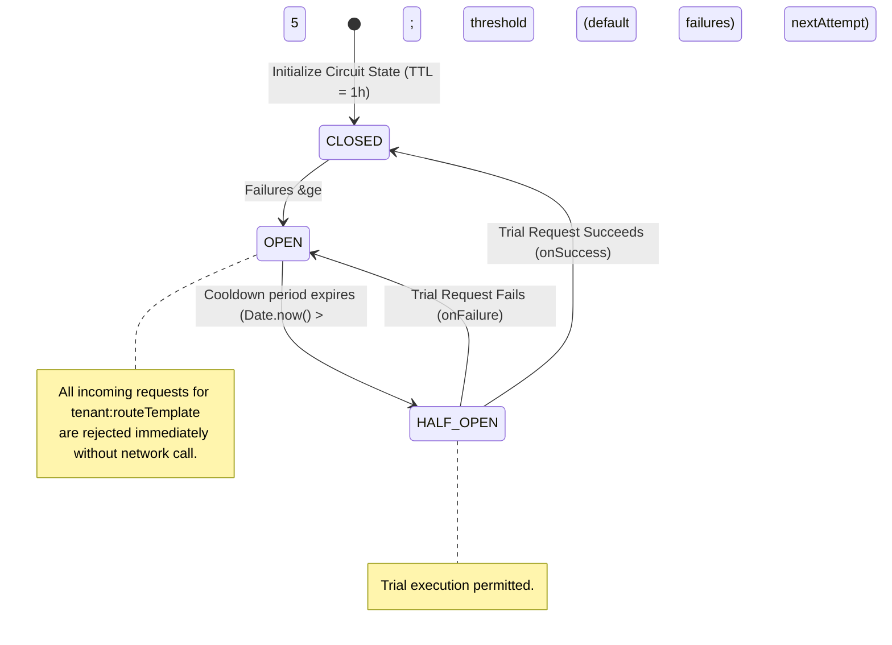
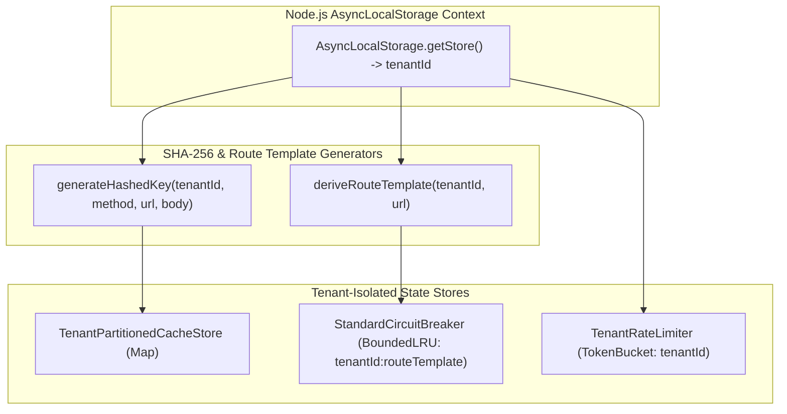

# ADR 0001: Comprehensive Architecture Decision Record & Master Specification for Shared Infrastructure

* **Status**: Accepted
* **Deciders**: Architecture Team, Core Infrastructure Working Group
* **Date**: 2026-08-31
* **Scope**: `@observability/shared-infra` (`packages/node/shared-infra`)

---

## 1. Context and Problem Statement

The LLM Observability Platform processes high volumes of distributed RPCs, telemetry query feeds, and real-time LLM cost/quality data across microservices. The legacy network and rules infrastructure suffered from:
1. **Thundering Herd Effects**: Concurrent duplicate read requests sent identical queries to downstream servers.
2. **Caller UI Crashes**: Traditional `AbortController` cancellation rejected pending promises with `AbortError`, causing UI component crashes.
3. **Black-box Observability**: Developers could not trace which component line number initiated an HTTP request or why a specific cache/circuit breaker decision was made.
4. **Imperative Loop Spaghetti**: Unstructured mutable state loops made retry jitter, rules evaluation, and header propagation difficult to maintain and audit.

We need a standardized, resilient, readable shared infrastructure combining an HTTP client pipeline, business rules engine, and full OpenTelemetry decision and code-location telemetry.

---

## 2. Decision Drivers & Core Engineering Principles

* **Pragmatic Readable Engineering over Dogmatic Purity**: Favor explicit `if` statements, early return guard clauses, and clean `for...of` loops over obfuscated `.reduce()` chains or nested ternaries. Code readability, clear control flow, and clean V8 stack trace step-through debugging take precedence over cargo-cult functional aesthetics.
* **Zero Hardcoded Strings**: All HTTP verbs, headers, status codes, tracer names, error codes, and span event keys must be enforced via `as const` constant objects (`HTTP_CONSTANTS`, `RULES_ENGINE_CONSTANTS`, `TRACING_CONSTANTS`).
* **Singleflight Request Collapsing**: Duplicate concurrent read requests must map to a single in-flight `Promise`, returning data to all callers simultaneously without throwing `AbortError`.
* **Idempotency Key Preservation**: The `x-idempotency-key` header must be generated once per logical operation using CSPRNG (`crypto.randomUUID()`) and preserved identically across all retry attempts.
* **Header & Endpoint Driven Caching**: Cache lookup must be dynamically bypassed when `noCache: true` or `Cache-Control: no-cache, no-store` headers are present.
* **Comprehensive OpenTelemetry Telemetry**: Spans must record caller location (`code.function`, `code.filepath`, `code.lineno`), granular step-by-step pipeline events, decision markers, and dual execution paths (Positive Path vs. Negative Path).
* **Pluggable Data-Driven Registries**: Condition evaluations, error descriptors, status badge mappings, and retry policies must be managed via extensible registry objects (`ConditionHandlerRegistry`, `CentralizedErrorRegistry`, `StatusBadgeRegistry`, `RetryPolicyRegistry`).

---

## 3. Detailed 10-Step Fleet-Resilient Pipeline Specification

### Step 1: Inbound Concurrency Admission Control & Load Shedding
To protect the Node.js process event loop and connection pools from inbound request saturation:
$$\text{ActiveInFlight} \le \text{MaxInFlightRequests} \quad (\text{default } 500)$$
If active in-flight execution count exceeds capacity, the client sheds load immediately, rejecting incoming calls with a `429 / Load Shedding` error.

---

### Step 2: AsyncLocalStorage Request Context Isolation
Context propagation uses Node.js native `AsyncLocalStorage` to eliminate cross-tenant data leaks and context-bleeding bugs in concurrent asynchronous execution chains:
$$\text{Context}_{\text{active}} = \text{AsyncLocalStorage.getStore}()$$
If uninitialized, a fallback context with `tenantId: "tenant-default"` is created automatically.

---

### Step 3: DNS IP-Level Resolution SSRF & TOCTOU Protection
The pipeline performs async DNS resolution via `dns.promises.lookup()` to validate the actual resolved IP address against restricted subnets before opening a socket connection:
$$\text{BlockedSubnets} = \{ 127.0.0.0/8, 169.254.0.0/16, 10.0.0.0/8, 172.16.0.0/12, 192.168.0.0/16, ::1, 0.0.0.0 \}$$
If the target hostname resolves to any IP in $\text{BlockedSubnets}$, execution is aborted immediately with an SSRF Violation error.

---

### Step 4: Per-Tenant Outbound Rate Limiting (Token Bucket)
Enforces Token Bucket outbound rate limiting per tenant:
$$\text{Tokens}_{\text{new}} = \min(\text{MaxTokens}, \text{Tokens}_{\text{current}} + \Delta t \times \text{RefillRate})$$
Default configuration: $\text{MaxTokens} = 100$, $\text{RefillRate} = 50\text{ req/sec}$.

---

### Step 5: Fleet-Wide Retry Budgeting (Retry Storm Prevention)
To prevent broad partial outages across multiple routes from turning into a retry-amplified thundering herd:
$$\text{RetryRatio} = \frac{\text{TotalRetries}}{\text{TotalRequests}} \le 0.20 \quad (20\% \text{ Fleet Retry Budget})$$
If cumulative retry volume exceeds 20% of total fleet requests, retries are suppressed globally, failing fast to protect downstreams.

---

### Step 6: Total Operation Wall-Clock Timeout Budget
Enforces a strict total wall-clock timeout budget across ALL retry attempts ($\text{totalMaxTimeoutMs} = 15,000\text{ms}$):
$$\text{ElapsedTime} = \text{Date.now}() - \text{StartTime} \le \text{totalMaxTimeoutMs}$$
An overarching `AbortController` cancels the entire pipeline if total cumulative execution time reaches 15 seconds, preventing UI stalls.

---

### Step 7: SHA-256 Tenant-Isolated Key Hashing & Singleflight Collapsing
Request signatures incorporate tenant identity and payload structure, hashed into a 256-bit hex digest:
$$\text{Key}_{\text{raw}} = \text{tenantId} \parallel \text{method} \parallel \text{url} \parallel \text{JSON.stringify}(\text{body})$$
$$\text{Key}_{\text{hashed}} = \text{SHA256}(\text{Key}_{\text{raw}}).\text{digest}("hex")$$
Inspects active `inFlightSingleflights` map for $\text{Key}_{\text{hashed}}$, collapsing $N$ duplicate concurrent requests into 1 network RPC in $O(1)$ memory time.

---

### Step 8: Sealed TracedSpanFacade & Default-Deny Allowlist Filter
Raw OpenTelemetry spans are wrapped inside a sealed `TracedSpanFacade`. Attributes are filtered against an explicit allowlist:
$$\text{Attributes}_{\text{allowed}} = \{ k \in \text{Attributes}_{\text{raw}} \mid k \in \text{ALLOWED\_TELEMETRY\_ATTRIBUTES} \}$$
URLs are sanitized via `sanitizeUrlForTelemetry()`, removing userinfo (`user:pass@`) and query strings (`?access_token=...`).

---

### Step 9: Tenant-Partitioned LRU Cache & Write Invalidation
- **Tenant Isolation**: Caches are partitioned per tenant ($\text{Map}<\text{tenantId}, \text{BoundedLRU}>$).
- **Write Invalidation**: Executing write mutations (`POST`, `PUT`, `PATCH`, `DELETE`) automatically invalidates the tenant's cache partition ($\text{cacheStore.clear}(\text{tenantId})$).

---

### Step 10: Bounded LRU Circuit Breaker & Per-Attempt Re-Check
Circuit breaker states are stored in a Bounded LRU store ($\text{maxCapacity} = 1000$, $\text{TTL} = 1\text{ hour}$). The status (`CLOSED`, `OPEN`, `HALF_OPEN`) is re-evaluated before EVERY retry iteration. Retries use AWS Full Jitter:
$$\text{Sleep}(\text{attempt}) = \text{Random}\left(0, \min\left(\text{maxMs}, \text{baseMs} \times 2^{\text{attempt} - 1}\right)\right)$$

---

## 4. High-Level Architecture (HLA)



---

## 5. Low-Level Architecture & Comprehensive Diagrams

### 5.1 End-to-End Pipeline Execution Sequence Diagram

```mermaid
sequenceDiagram
  autonumber
  participant Caller as Feature Component / Service
  participant ADM as ConcurrencyAdmissionControl
  participant ALS as AsyncLocalStorage Context
  participant Client as ScalableHttpClient Pipeline
  participant DNS as "DNSResolver (dns.promises.lookup)"
  participant SF as Singleflight Map (SHA-256)
  participant Cache as TenantPartitionedCacheStore
  participant CB as "StandardCircuitBreaker (Bounded LRU)"
  participant Net as Fetch API / Network
  participant Span as "TracedSpanFacade (Default-Deny Filter)"

  Caller->>ADM: execute({ method: 'GET', url: 'https://api.org/data' })
  alt In-Flight Concurrency &gt; 500
    ADM-->>Caller: Reject 429 (Load Shedding)
  else In-Flight Capacity Available
    ADM->>ALS: Get isolated RequestContext (tenantId)
    ALS-->>Client: tenantId ("tenant-acme")
    Client->>DNS: lookup(hostname)
    alt Resolved IP in Private Subnets (127.0.0.1 / 169.254.169.254)
      DNS-->>Client: Private IP
      Client-->>Caller: Reject SSRF Violation Error
    else Valid Public IP
      Client->>SF: Check SHA256(tenantId:method:url:body)
      alt Singleflight Hit
        SF-->>Caller: Return shared in-flight Promise
      else Singleflight Miss
        Client->>Span: startActiveSpan('HTTP GET https://api.org/data')
        Span->>Span: Filter attributes via ALLOWED_TELEMETRY_ATTRIBUTES
        Client->>Cache: get(tenantId, requestKey)
        alt Cache Hit
          Cache-->>Client: Return cached data
          Client->>Span: setStatus(OK), emit decision.cache_evaluated
          Span-->>Caller: Return cached payload
        else Cache Miss
          Client->>CB: canExecute(tenantId:routeTemplate)
          alt Circuit State OPEN
            CB-->>Client: false
            Client->>Span: setStatus(ERROR), recordException
            Client-->>Caller: Throw CircuitBreaker Error
          else Circuit CLOSED / HALF_OPEN
            loop Retry Attempt Loop (Max 3, Total Timeout &le; 15s)
              Client->>CB: Re-check canExecute(circuitKey)
              Client->>Net: fetch(url, { redirect: 'manual' })
              alt Network Response 200 OK
                Net-->>Client: Response Stream (Streaming Byte Limit &le; 10MB)
                Client->>Cache: set(tenantId, requestKey, data)
                Client->>CB: onSuccess(circuitKey)
                Client->>Span: setStatus(OK), emit execution.success
                Client-->>Caller: Return response data
              else Network 500 / Error
                Net-->>Client: HttpError 500
                Client->>CB: onFailure(circuitKey)
                Client->>Client: Check FleetRetryBudget & method idempotency
              end
            end
          end
        end
      end
    end
  end
```

---

### 5.2 Circuit Breaker State Machine Transition Diagram



---

### 5.3 Telemetry Data Scrubbing & Default-Deny Allowlist Filter Diagram


---

### 5.4 Multi-Tenant Isolation & AsyncLocalStorage Architecture Diagram



---

## 6. Verification & Test Coverage Matrix

### 6.1 Automated Unit & Integration Tests (100% Passing)
* **Concurrency Admission Control**: Verified process load shedding when in-flight capacity (500) is exceeded.
* **Fleet-Wide Retry Budgeting**: Verified retries are suppressed when fleet retry ratio exceeds 20%.
* **AsyncLocalStorage Context Isolation**: Verified thread-safe isolated tenant context across concurrent async executions.
* **Dynamic V8 Stack Frame Telemetry**: Verified self-verifying stack frame resolution outside infrastructure packages.
* **DNS IP-Level SSRF Protection**: Verified resolved IP address subnets (`127.0.0.1`, `169.254.169.254`) are blocked.
* **Streaming Byte-Counting Body Limit**: Verified real-time chunk byte counting aborts oversized streams (>10MB).
* **Bounded LRU Circuit Breaker**: Verified circuit breaker states map is bounded to `1000` entries.
* **Mutating Write Cache Invalidation**: Verified `POST`, `PUT`, `PATCH`, `DELETE` operations clear tenant cache partitions.
* **Per-Tenant Outbound Rate Limiter**: Verified Token Bucket rate limiting enforces per-tenant request limits.
