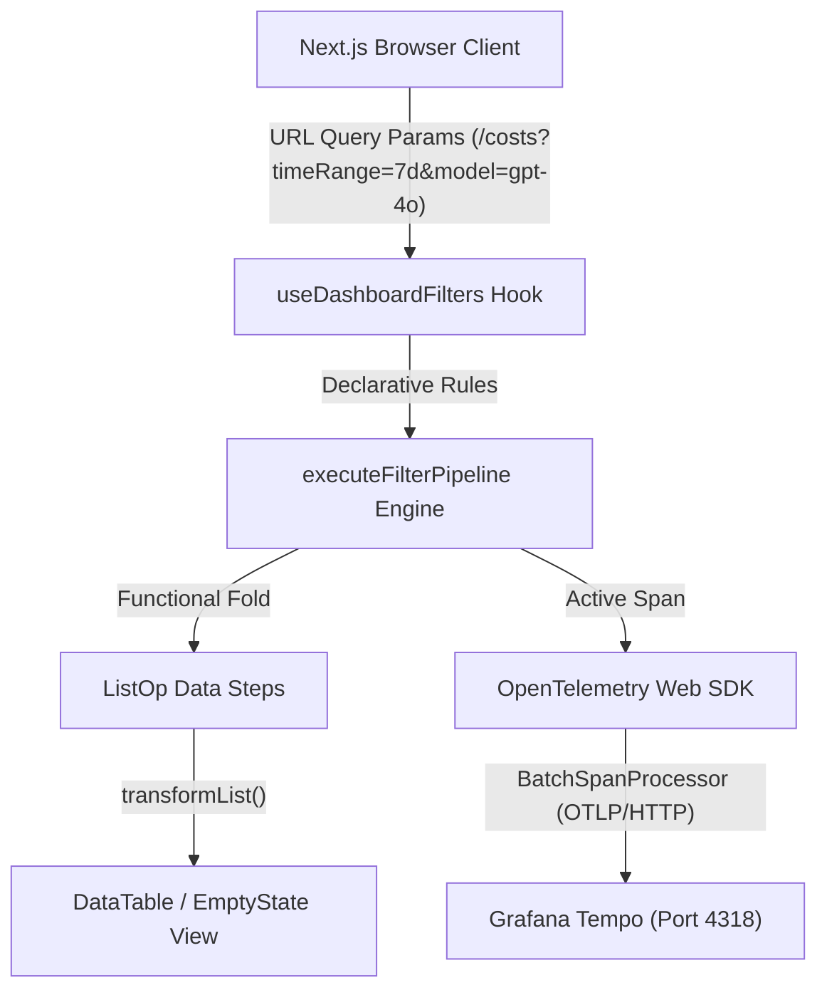
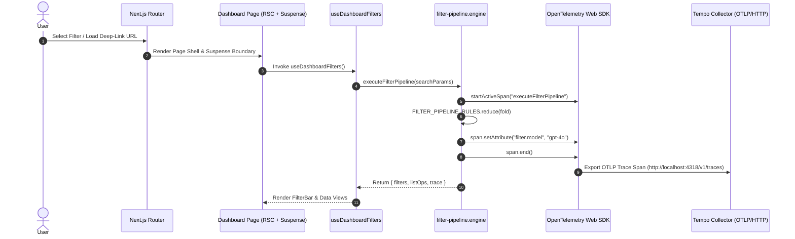

# ADR 0005: Deep-Linkable URL Filter Pipeline Engine & OpenTelemetry Web SDK Tracing

- **Status**: Accepted
- **Date**: 2026-08-23
- **Authors**: Web Architecture Team
- **Feature**: F-11 (Deep-Linkable URL Filters & Observability Tracing)

---

## Context & Problem Statement

Observability dashboards (`/costs`, `/latency`, `/quality`, `/prompts`, `/traces`) require real-time state synchronization with URL query parameters (`timeRange`, `from`, `to`, `model`, `service`, `environment`) to support deep-linking, bookmarking, and team collaboration.

Prior implementations suffered from imperative loops, duplicated state handling across components, and lack of OpenTelemetry span propagation during client-side filter transformations.

---

## Decision Drivers

1. **Pure Data-Driven Architecture**: Declarative filter rules table separate from evaluation engine logic.
2. **Functional Pipeline (Zero Loops)**: Use `reduce` (fold), `map`, and `filter` array transformations instead of imperative loops.
3. **OpenTelemetry Web SDK Integration**: Automatically emit active spans with modern semantic conventions (`ATTR_SERVICE_NAME`, `ATTR_SERVICE_VERSION`) via `BatchSpanProcessor` and `OTLPTraceExporter` to Grafana Tempo.
4. **Next.js 15 RSC & Suspense Safety**: Wrap `useSearchParams()` consumption inside `<Suspense>` boundaries to ensure server-side rendering (RSC) and client navigation stability.

---

## Architectural Diagrams

### High-Level Architecture Diagram



### Low-Level Execution Sequence Diagram



---

## End-to-End Function Call Stack (ASCII Tree)

```
URL Query Param Update / Deep-Link Filter Execution Flow
└── User Selects Filter / Navigates to Deep Link (/costs?timeRange=7d&model=gpt-4o)
    └── Next.js App Router (RSC + Client Boundary) [page.tsx]
        └── <Suspense> Boundary Wrapper [page.tsx]
            └── DashboardContent Component [page.tsx]
                └── useDashboardFilters() Hook [useDashboardFilters.ts]
                    │
                    ├── 1. executeFilterPipeline(searchParams) [filter-pipeline.engine.ts]
                    │   ├── OpenTelemetry Tracer.startActiveSpan('executeFilterPipeline') [tracer.ts]
                    │   │   ├── ATTR_SERVICE_NAME: 'web-app' [tracer.ts]
                    │   │   └── ATTR_SERVICE_VERSION: '0.1.0' [tracer.ts]
                    │   │
                    │   ├── FILTER_PIPELINE_RULES.reduce(fold) [filter-pipeline.rules.ts]
                    │   │   ├── processFilterRule('timeRange') -> '7d'
                    │   │   ├── processFilterRule('model') -> 'gpt-4o'
                    │   │   ├── processFilterRule('service') -> 'checkout-service'
                    │   │   └── processFilterRule('environment') -> 'production'
                    │   │
                    │   └── span.end() -> exports FilterPipelineTraceSpan { traceId, durationMs }
                    │
                    ├── 2. buildFilterListOps(filters) [filter-pipeline.engine.ts]
                    │   └── Transforms filters into ListOp[] declarative data steps
                    │
                    ├── 3. transformList(rows, listOps) [core/data-driven/list-transform.ts]
                    │   └── Functional reduce fold filtering rows with zero imperative loops
                    │
                    └── 4. OTLPTraceExporter -> BatchSpanProcessor -> Tempo (http://localhost:4318/v1/traces)
```

---

## Consequences

### Positive
- **Deep-Linkable URL State**: Bookmarkable filter URLs across all dashboard pages.
- **Trace Observability**: End-to-end active span propagation into Grafana Tempo.
- **Zero Imperative Loops**: Clean functional pipeline using `reduce`, `map`, and `filter`.
- **RSC Stability**: Wrapped in `<Suspense>` boundaries to ensure Next.js 15 streaming support.

### Negative
- Requires client-side hydration for URL search parameter processing.
