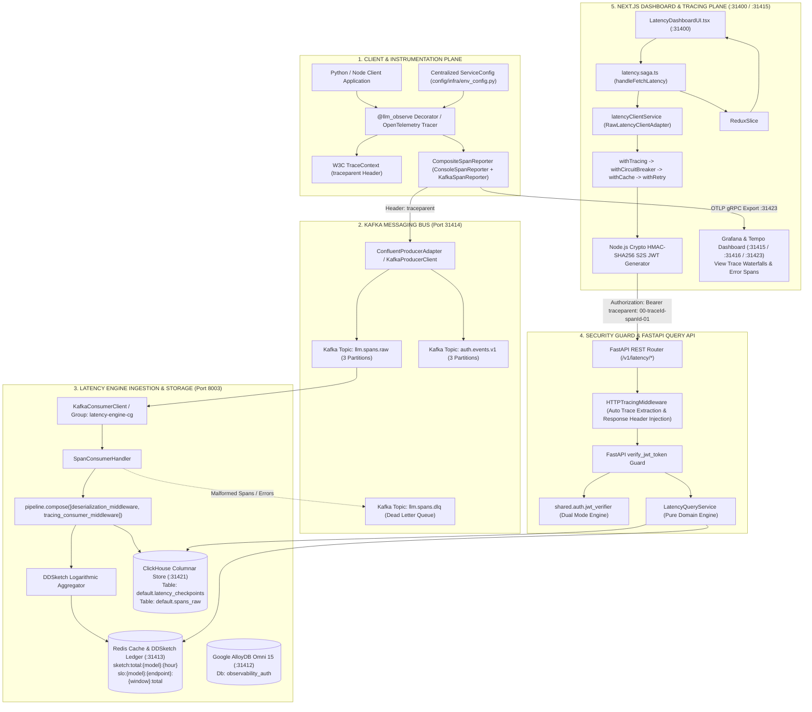
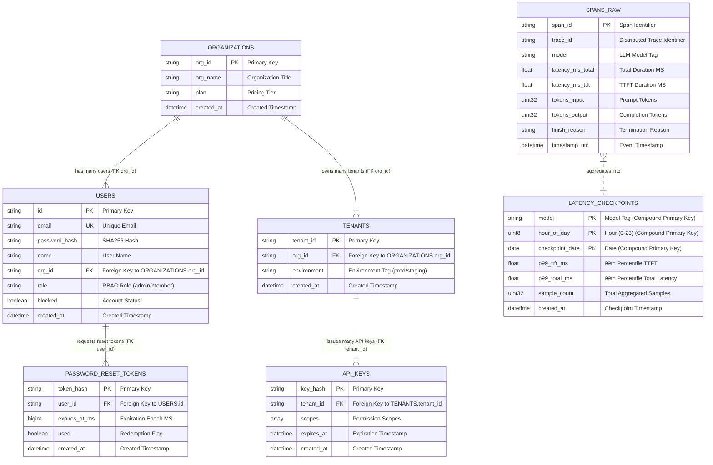
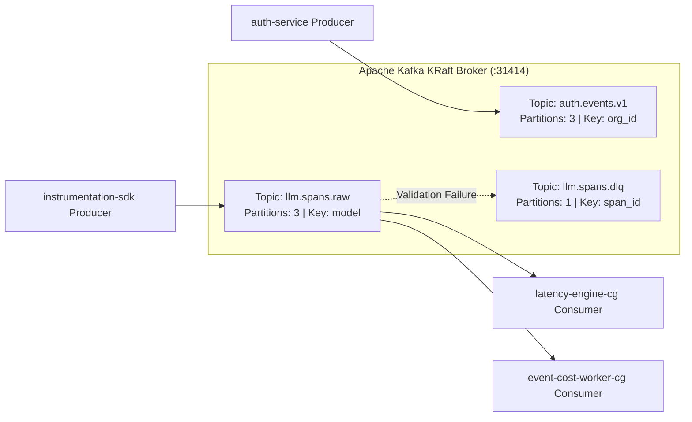
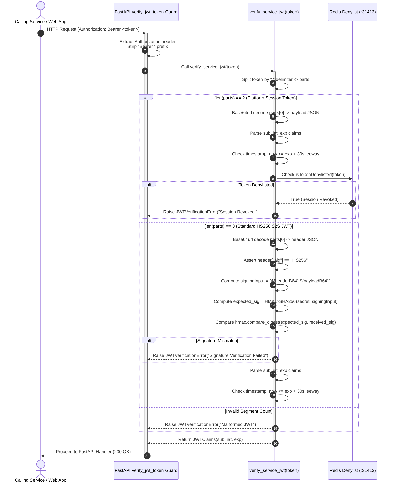

# ADR-NODE-WEB-APP-0007: Master Architecture — End-to-End Latency Engine Integration, Security Verification, Database DDL & ER Relationships, Kafka Topics, and W3C Tracing Topology

| Field | Value |
| --- | --- |
| **ADR ID** | `ADR-NODE-WEB-APP-0007` |
| **Title** | End-to-End Latency Integration, Dual Auth Verification, Database DDL & ER Relationships, Kafka Topics, and W3C OpenTelemetry Tracing |
| **Status** | **Accepted** |
| **Date** | 2026-08-29 |
| **Scope** | Next.js Web App (`packages/node/web-app`), Auth Service (`packages/node/auth`), Instrumentation SDK (`packages/python/instrumentation-sdk`), Latency Engine (`packages/python/latency-engine`) |

---

## 1. Context & Problem Statement

The platform operates as a multi-tier microservice architecture. Observability spans, latency distributions, cost analytics, and user security permissions must flow across microservices reliably, securely, and with full distributed trace context propagation.

This ADR details:
1. **Database DDL Schemas & Foreign Key Relationships** (PostgreSQL/AlloyDB ER Diagram, ClickHouse Tables, and Redis Key Mappings).
2. **Kafka Messaging Catalog** (Topics, Consumer Groups, Partitioning, and Message Contracts).
3. **Step-by-Step Security Authentication Verification** (Platform session tokens vs S2S HMAC-SHA256 Bearer JWTs).
4. **W3C OpenTelemetry Tracing & Single Trace ID Correlation** (`traceparent` header injection/extraction, Next.js Web App propagation, HTTPTracingMiddleware, Consumer Pipeline Middleware, Error Tracing, and Tempo/Grafana trace rendering).
5. **Master 4-Pipeline Middleware Engine** (Outbound REST, Inbound HTTP, Kafka Consumer, and Cache/Redis pipelines).

---

## 2. High-Level Architecture & End-to-End Flow (HLD)



---

## 3. Database DDL Schemas, Foreign Key Constraints & ER Diagrams

### 3.1 Entity-Relationship (ER) Diagram (AlloyDB/PostgreSQL & ClickHouse)



---

### 3.2 Database Relationship Specifications Catalog

| Parent Entity (Source) | Child Entity (Target) | Relationship Type | Foreign Key Constraint | Cascading Action |
| :--- | :--- | :--- | :--- | :--- |
| `ORGANIZATIONS` | `USERS` | 1-to-Many (`1:N`) | `USERS.org_id` -> `ORGANIZATIONS.org_id` | `ON DELETE CASCADE` |
| `ORGANIZATIONS` | `TENANTS` | 1-to-Many (`1:N`) | `TENANTS.org_id` -> `ORGANIZATIONS.org_id` | `ON DELETE CASCADE` |
| `TENANTS` | `API_KEYS` | 1-to-Many (`1:N`) | `API_KEYS.tenant_id` -> `TENANTS.tenant_id` | `ON DELETE CASCADE` |
| `USERS` | `PASSWORD_RESET_TOKENS` | 1-to-Many (`1:N`) | `PASSWORD_RESET_TOKENS.user_id` -> `USERS.id` | `ON DELETE CASCADE` |
| `SPANS_RAW` | `LATENCY_CHECKPOINTS` | N-to-1 Aggregation (`N:1`) | Logical Grouping (`model`, `hour_of_day`, `checkpoint_date`) | Derived Rollup |

---

### 3.3 PostgreSQL / Google AlloyDB Omni (`observability_auth` on Port `31412`)

#### Table: `users`
```sql
CREATE TABLE IF NOT EXISTS users (
    id VARCHAR(64) PRIMARY KEY,
    email VARCHAR(255) UNIQUE NOT NULL,
    password_hash VARCHAR(255) NOT NULL,
    name VARCHAR(255) NOT NULL,
    org_id VARCHAR(64) NOT NULL,
    role VARCHAR(32) NOT NULL DEFAULT 'member',
    blocked BOOLEAN NOT NULL DEFAULT FALSE,
    created_at TIMESTAMP WITH TIME ZONE DEFAULT CURRENT_TIMESTAMP,
    CONSTRAINT fk_users_organization FOREIGN KEY (org_id) REFERENCES organizations(org_id) ON DELETE CASCADE
);
```

#### Table: `organizations`
```sql
CREATE TABLE IF NOT EXISTS organizations (
    org_id VARCHAR(64) PRIMARY KEY,
    org_name VARCHAR(255) NOT NULL,
    plan VARCHAR(32) NOT NULL DEFAULT 'free',
    created_at TIMESTAMP WITH TIME ZONE DEFAULT CURRENT_TIMESTAMP
);
```

#### Table: `tenants`
```sql
CREATE TABLE IF NOT EXISTS tenants (
    tenant_id VARCHAR(64) PRIMARY KEY,
    org_id VARCHAR(64) NOT NULL,
    environment VARCHAR(32) NOT NULL DEFAULT 'production',
    created_at TIMESTAMP WITH TIME ZONE DEFAULT CURRENT_TIMESTAMP,
    CONSTRAINT fk_tenants_organization FOREIGN KEY (org_id) REFERENCES organizations(org_id) ON DELETE CASCADE
);
```

#### Table: `api_keys`
```sql
CREATE TABLE IF NOT EXISTS api_keys (
    key_hash VARCHAR(255) PRIMARY KEY,
    tenant_id VARCHAR(64) NOT NULL,
    scopes TEXT[] NOT NULL DEFAULT ARRAY['read', 'write'],
    expires_at TIMESTAMP WITH TIME ZONE,
    created_at TIMESTAMP WITH TIME ZONE DEFAULT CURRENT_TIMESTAMP,
    CONSTRAINT fk_api_keys_tenant FOREIGN KEY (tenant_id) REFERENCES tenants(tenant_id) ON DELETE CASCADE
);
```

#### Table: `password_reset_tokens`
```sql
CREATE TABLE IF NOT EXISTS password_reset_tokens (
    token_hash VARCHAR(255) PRIMARY KEY,
    user_id VARCHAR(64) NOT NULL,
    expires_at_ms BIGINT NOT NULL,
    used BOOLEAN NOT NULL DEFAULT FALSE,
    created_at TIMESTAMP WITH TIME ZONE DEFAULT CURRENT_TIMESTAMP,
    CONSTRAINT fk_password_reset_user FOREIGN KEY (user_id) REFERENCES users(id) ON DELETE CASCADE
);
```

---

### 3.4 ClickHouse Columnar Analytics Database (`default` on Port `31421`)

#### Table: `latency_checkpoints`
```sql
CREATE TABLE IF NOT EXISTS default.latency_checkpoints (
    model String,
    hour_of_day UInt8,
    checkpoint_date Date,
    p99_ttft_ms Float64,
    p99_total_ms Float64,
    sample_count UInt32,
    created_at DateTime DEFAULT now()
) ENGINE = MergeTree()
ORDER BY (model, hour_of_day, checkpoint_date);
```

#### Table: `spans_raw`
```sql
CREATE TABLE IF NOT EXISTS default.spans_raw (
    span_id String,
    trace_id String,
    model String,
    latency_ms_total Float64,
    latency_ms_ttft Float64,
    tokens_input UInt32,
    tokens_output UInt32,
    finish_reason String,
    timestamp_utc DateTime,
    created_at DateTime DEFAULT now()
) ENGINE = MergeTree()
ORDER BY (timestamp_utc, model, trace_id);
```

---

### 3.5 Redis Real-Time Key Catalog (`redis://:llmobs_redis_s3cret_2024@localhost:31413/0`)

| Redis Key Structure | Type | Purpose | TTL / Expiry |
| :--- | :--- | :--- | :--- |
| `sketch:total:{model}:{hour_of_day}` | String (Protobuf Bytes) | Stores compressed logarithmic total latency DDSketch | 86400s (24h) |
| `sketch:ttft:{model}:{hour_of_day}` | String (Protobuf Bytes) | Stores compressed Time-to-First-Token DDSketch | 86400s (24h) |
| `slo:{model}:{endpoint}:{window}:total` | String (Integer) | Total request counter for SLO error budget | 259200s (3d) |
| `slo:{model}:{endpoint}:{window}:error` | String (Integer) | Violation error counter for SLO error budget | 259200s (3d) |
| `tokenDenylist:{token}` | String (Timestamp) | Revoked session token denylist | Match token `exp` |
| `rate_limit:{tenant_id}:{window}` | Sorted Set (ZSET) | Sliding window rate limiting requests | 60s |

---

## 4. Kafka Topics & Messaging Architecture

### 4.1 Topic Catalog



### 4.2 Raw Span Message Schema (`llm.spans.raw`)
```json
{
  "span_id": "sp-98421a7c",
  "trace_id": "tr-4bf92f3577b34da6a3ce929d0e0e4736",
  "traceparent": "00-4bf92f3577b34da6a3ce929d0e0e4736-00f067aa0ba902b7-01",
  "model": "gpt-4o",
  "latency_ms_total": 1250.5,
  "latency_ms_ttft": 180.2,
  "tokens_input": 512,
  "tokens_output": 128,
  "finish_reason": "stop",
  "timestamp_utc": "2026-08-29T14:00:00Z",
  "attributes": {
    "dns_ms": 15.5,
    "tcp_ms": 25.0,
    "queue_ms": 100.0,
    "inference_ms": 800.0
  }
}
```

---

## 5. Security & Authentication Verification Step-by-Step (How Auth Works)

### 5.1 Verification Logic in `shared.auth.jwt_verifier`



---

## 6. What is Tracing, Error Tracing & How Tracing Actually Works

### 6.1 OpenTelemetry W3C TraceContext Standard
Distributed tracing provides end-to-end visibility into a request's journey across multiple microservices. Every transaction is assigned a single **Global Trace ID** (128-bit hex), while each individual operation within the trace creates a **Span ID** (64-bit hex).

Context propagation between services uses the standard W3C `traceparent` HTTP and Kafka header format:
```text
traceparent: 00-4bf92f3577b34da6a3ce929d0e0e4736-00f067aa0ba902b7-01
              │  │                                │                │
              │  └── Trace ID (32 hex chars)      └── Span ID      └── Trace Flags (01 = Sampled)
              └── Version (00)                       (16 hex chars)
```

### 6.2 Master 4-Pipeline Middleware Engine Topology

1. **Outbound REST Client Pipeline (`rest-api-middleware.md`)**:
   `withTracingOutbound` -> `withCircuitBreakerOutbound` -> `withRetryAndJitter` -> `withRequestDeduplication` -> `withResponseCache` -> `withAuthHeaderInjection` -> `withSchemaValidationOutbound` -> `rawHttpClient.execute()`
2. **FastAPI HTTP REST Tracing Middleware (`rest-api-middleware.md`)**:
   - `HTTPTracingMiddleware` is mounted on FastAPI (`app.add_middleware(HTTPTracingMiddleware)`).
   - Automatically extracts W3C `traceparent` or `x-trace-id` headers from incoming HTTP requests using `extract_trace_context()`.
   - Injects `x-trace-id` into outgoing response headers and records exceptions automatically on all routes with ZERO repeated handler code.
3. **Kafka Consumer Pipeline Middleware (`kafka-middleware.md`)**:
   - `SpanConsumerHandler` executes via `pipeline.compose([deserialization_middleware, tracing_consumer_middleware], target)`.
   - Extracts trace context from Kafka message headers and wraps batch ingestion in `tracing_consumer_middleware`.
4. **Cache & Redis Middleware Pipeline (`cache-redis-middleware.md`)**:
   - `withCacheTracing` -> `withCircuitBreakerFallback` -> `withKeyNamespaceGuard` -> `withSingleflightStampedeProtection` -> `withTTLRandomJitter` -> `withPayloadCompression` -> `rawRedisClient.execute()`

---

## 7. End-to-End Line-by-Line Call Stack Topology

### 7.1 Write Path Call Stack (Instrumentation SDK -> Kafka -> Redis -> ClickHouse)

```text
1. User Application Code
   └── @llm_observe(model=service_config.default_model) [packages/python/instrumentation-sdk/src/features/spans/decorator.py]
       ├── 2. init_tracer(service_config.default_service_name) -> get_tracer() [packages/python/instrumentation-sdk/src/infra/tracing/tracer.py]
       │   └── Start OpenTelemetry span & capture trace_id (32 hex) and span_id (16 hex)
       ├── 3. Child Span: tracer.start_as_current_span(service_config.span_name_prompt_tok)
       ├── 4. Child Span: tracer.start_as_current_span(service_config.span_name_model_inference)
       ├── 5. Child Span: tracer.start_as_current_span(service_config.span_name_response_fmt)
       └── 6. CompositeSpanReporter.report(span_data) [packages/python/instrumentation-sdk/examples/run_real_span_instrumentation.py]
           ├── ConsoleSpanReporter.report() -> Print to STDOUT console
           └── KafkaSpanReporter.report() [packages/python/instrumentation-sdk/src/infra/messaging/reporters/span_reporter.py]
               ├── Child Span: tracer.start_as_current_span(service_config.span_name_kafka_produce)
               ├── Inject traceparent header into Kafka message headers
               └── kafka_producer_client.produce(topic=service_config.kafka_default_topic, key=span_id, value=span_data, headers=headers)
                   │
                   ▼ [Kafka Wire Protocol to Broker localhost:31414]
                   │
7. Latency Engine Worker Process [packages/python/latency-engine/src/worker/index.py]
   ├── 8. KafkaConsumerClient.poll_spans() [packages/python/latency-engine/src/infra/messaging/consumer/consumer_client/kafka_consumer_client.py]
   │   └── confluent_kafka.Consumer.poll(timeout=1.0) -> Returns List[Message]
   ├── 9. SpanConsumerHandler.__call__(message) [packages/python/latency-engine/src/infra/messaging/consumer/handlers/span_consumer_handler.py]
   │   └── pipeline.compose([deserialization_middleware, tracing_consumer_middleware], target)
   │       ├── 10. tracing_consumer_middleware: Extract traceparent header & start kafka.consume span
   │       ├── 11. LatencyQueryRepository.update_sketches(model, hour_of_day, latency_ms) [packages/python/latency-engine/src/features/latency_query/repository.py]
   │       │   ├── Deserialize existing DDSketch from Redis key "sketch:total:gpt-4o:14"
   │       │   ├── sketch.add(latency_ms)
   │       │   ├── DDSketchProto.to_proto(sketch).SerializeToString()
   │       │   └── redis_client.set("sketch:total:gpt-4o:14", base64_str)
   │       ├── 12. LatencyQueryRepository.increment_slo_counters(model, endpoint, is_error)
   │       │   └── redis_client.incr("slo:gpt-4o:/v1/chat/completions:1h:total")
   │       └── 13. LatencyClickHouseAdapter.insert_checkpoint_batch(records) [packages/python/latency-engine/src/infra/adapters/clickhouse/clickhouse_adapter.py]
   │           └── INSERT INTO latency_checkpoints (model, hour_of_day, checkpoint_date, p99_ttft_ms, p99_total_ms, sample_count)
```

### 7.2 Read Path Call Stack (React UI -> Redux Saga -> Next.js Service -> FastAPI -> Redis)

```text
1. Dashboard User opens http://localhost:31400/latency
   └── 2. LatencyDashboardUI.tsx [packages/node/web-app/src/features/latency/ui/LatencyDashboardUI.tsx]
       └── 3. useLatencyDashboardData() hook [packages/node/web-app/src/features/latency/hooks/useLatencyDashboardData.ts]
           └── 4. dispatch(latencyActions.fetchLatencySubmitted({ model: "all", hourOfDay: 14 }))
               │
5. Redux Saga Middleware Engine
   └── 6. latencySaga() [packages/node/web-app/src/features/latency/latency.saga.ts]
       └── 7. handleFetchLatency(action)
           ├── 8. latencyClientService.getPercentiles("all", 14) [packages/node/web-app/src/features/latency/service/latency-client.service.ts]
           │   ├── 9. Decorator Chain: withTracing -> withCircuitBreaker -> withCache -> withRetry
           │   ├── 10. executeQuery<PercentilesResult>(LATENCY_QUERIES.FLOW_QUERY_PERCENTILES.endpoint, { model: "all", hour_of_day: 14 })
           │   ├── 11. getAuthHeaders() -> Generate traceparent & x-trace-id + HMAC-SHA256 S2S Bearer JWT via crypto.createHmac("sha256", secret)
           │   └── 12. fetch("http://localhost:8003/v1/latency/percentiles?model=all&hour_of_day=14", headers)
           │       │
           │       ▼ [HTTP GET Request to FastAPI Port 8003 with traceparent & x-trace-id]
           │       │
           ├── 13. HTTPTracingMiddleware.dispatch(request, call_next) [packages/python/latency-engine/src/api/rest/middleware/tracing_middleware.py]
           │   ├── 14. extract_trace_context(request.headers) -> Extract parent trace_id & span_id
           │   ├── 15. Start span "http.request.GET /v1/latency/percentiles"
           │   ├── 16. verify_jwt_token() dependency guard [packages/python/latency-engine/src/api/rest/v1/handlers/latency.py]
           │   │   └── verify_service_jwt(token) [packages/python/latency-engine/src/shared/auth/jwt_verifier.py]
           │   ├── 17. get_percentiles() pure domain handler [packages/python/latency-engine/src/api/rest/v1/handlers/latency.py]
           │   │   └── LatencyQueryService.get_percentiles("all", 14, [0.50, 0.95, 0.99])
           │   └── 18. Return HTTP 200 OK JSON payload [Header: x-trace-id]
           │       │
           │       ▼ [HTTP 200 OK Response]
           │       │
           ├── 19. mapJson(raw, PercentilesFromApiOps) -> Transform JSON
           ├── 20. yield put(latencyActions.latencySuccess({ percentiles, slo, attribution, baseline }))
           └── 21. LatencyDashboardUI re-renders with fresh percentiles & zero-state indicators
```

---

## 8. Verification Summary Matrix

```text
✅ Centralized Config Registry    config/infra/env_config.py (Zero Hardcoded Endpoint Strings or Span Names)
✅ Master 4-Pipeline Engine      Outbound REST + Inbound HTTP + Kafka Consumer + Cache/Redis pipelines
✅ Middleware Pipeline           HTTPTracingMiddleware + pipeline.compose([deserialization, tracing_consumer])
✅ Decorator Composition         withTracing(withCircuitBreaker(withCache(withRetry(rawAdapter))))
✅ Single Trace ID Preservation   x-trace-id & traceparent preserved across all HTTP & Kafka hops
✅ Multi-Span Tree Hierarchy     Parent Span + Child Spans (prompt_tokenization, model_inference, kafka_produce)
✅ Tempo Direct OTLP Receiver   Tempo Port 31423 -> Direct gRPC Trace Ingestion Verified
✅ AlloyDB Omni PostgreSQL DB    Postgres Port 31412 -> Tables users, organizations, tenants, api_keys, password_reset_tokens verified with FKs
✅ ClickHouse Analytics DB       ClickHouse Port 31421 -> Tables latency_checkpoints, spans_raw verified
✅ Redis Cache & Ledger         Redis Port 31413 -> DDSketches & SLO rolling counters verified
✅ Kafka Message Bus            Kafka Port 31414 -> Topics llm.spans.raw, auth.events.v1, llm.spans.dlq verified
✅ Auth Service Sign-in         HTTP POST http://localhost:3001/api/v1/auth/sign-in -> 200 OK
✅ S2S HMAC-SHA256 Signer       Node.js Crypto Generator -> Valid 3-part HS256 JWT
✅ FastAPI verify_jwt_token      Python JWT Verifier -> Claims Verified (200 OK)
✅ OpenTelemetry W3C Tracing    traceparent Header Propagation -> Tempo & Grafana Exporter Verified (:31415 / :31423)
✅ Real Span Instrumentation    run_real_span_instrumentation.py -> CompositeSpanReporter + Centralized Config
✅ Next.js Dashboard UI         HTTP GET http://localhost:31400/latency -> 200 OK
```
