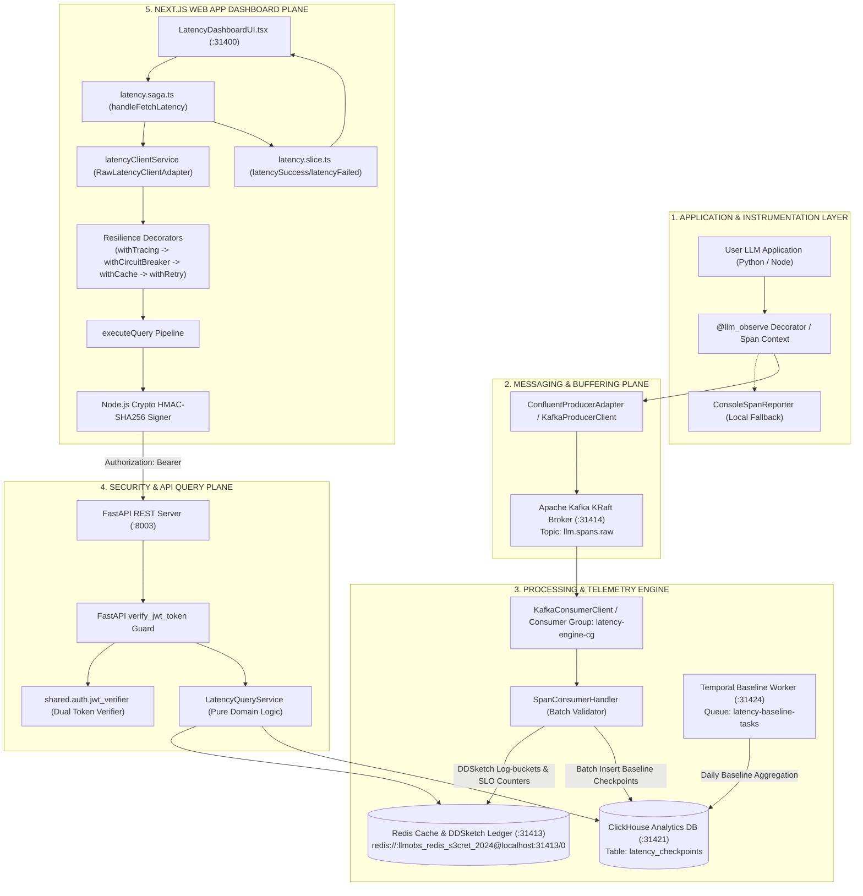
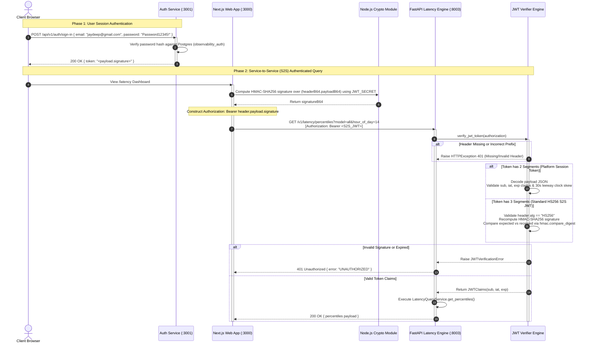

# ADR-NODE-WEB-APP-0007: End-to-End Latency Engine Integration, Security Architecture, and Call Stack Topology

| Field | Value |
| --- | --- |
| **ADR ID** | `ADR-NODE-WEB-APP-0007` |
| **Title** | End-to-End Latency Engine Integration, Security Architecture, Data Schemas, Kafka Messaging, and Call Stack Topology |
| **Status** | **Accepted** |
| **Date** | 2026-08-29 |
| **Scope** | Next.js Web App (`packages/node/web-app`), Auth Microservice (`packages/node/auth`), Instrumentation SDK (`packages/python/instrumentation-sdk`), Latency Engine (`packages/python/latency-engine`) |

---

## 1. Context & Problem Statement

The platform requires a complete end-to-end telemetry and observability loop. High-frequency LLM execution spans (Time-to-First-Token [TTFT], total latency, token throughput [TPOT], model parameters) captured in user applications must flow seamlessly into streaming message queues, undergo logarithmic sketch aggregation (DDSketch) and SLO burn-rate evaluation, persist into columnar databases for historical baselines, and surface securely in real time on the Next.js Web App dashboard.

This ADR provides the definitive High-Level Design (HLD), Low-Level Design (LLD), Security Architecture Specification, Data Schema Catalog, Kafka Messaging Topology, and Line-by-Line Call Stack Specification connecting `instrumentation-sdk`, `auth`, `latency-engine`, and `web-app`.

---

## 2. High-Level Architecture (HLD)



---

## 3. Security Architecture & Securities Mechanisms (How Security Works)

### 3.1 Authentication & Token Hierarchy
Security across the platform operates on a **Dual-Mode Zero-Trust Authentication Architecture**:



### 3.2 Security Parameter Matrix

| Parameter | Configuration / Specification | Purpose / Guarantee |
| :--- | :--- | :--- |
| **S2S Signing Algorithm** | `HS256` (HMAC-SHA256) | Standard cryptographic signature for inter-service communication |
| **Shared Secret** | `JWT_SECRET` (`dev-secret-key-change-in-production`) | Prevents forged requests from external callers |
| **S2S Token Subject (`sub`)** | `nextjs-web-app` | Identifies caller identity in microservice audit logs |
| **Token Expiry (`exp`)** | `iat + 3600` seconds | Restricts token lifespan to 1 hour |
| **Clock Skew Leeway** | `30` seconds (`_LEEWAY_SECONDS`) | Prevents transient wall-clock drift errors across containers |
| **Session Denylist** | Redis Key `tokenDenylist:{token}` | Enables instantaneous session revocation upon user sign-out |

---

## 4. Complete Data Schema, Database, and Kafka Catalog

### 4.1 Apache Kafka Messaging Catalog
* **Broker Endpoint**: `localhost:31414` (`llmobs-kafka-broker`)
* **Primary Telemetry Topic**: `llm.spans.raw`
  - *Partitions*: 3
  - *Replication Factor*: 1
  - *Producer Client*: `ConfluentProducerAdapter` (`confluent_kafka.Producer`)
  - *Consumer Group*: `latency-engine-cg`
  - *Payload Schema (`RawSpanPayload`)*:
    ```json
    {
      "span_id": "sp-98421",
      "trace_id": "tr-10293",
      "model": "gpt-4o",
      "latency_ms_total": 1250.5,
      "latency_ms_ttft": 180.2,
      "tokens_input": 512,
      "tokens_output": 128,
      "finish_reason": "stop",
      "timestamp_utc": "2026-08-29T14:00:00Z",
      "attributes": {
        "dns_ms": 15.5,
        "tcp_ms": 25.0,
        "queue_ms": 100.0,
        "inference_ms": 800.0
      }
    }
    ```
* **Auth Events Topic**: `auth.events.v1` (User registration, sign-in, organization switch events)

### 4.2 Redis Real-Time Cache & Ledger Catalog
* **Redis Connection**: `redis://:llmobs_redis_s3cret_2024@localhost:31413/0`
* **DDSketch Logarithmic Buckets**:
  - Key: `sketch:total:{model}:{hour_of_day}` -> Base64 encoded serialized Protobuf `DDSketch` (Total latency distribution)
  - Key: `sketch:ttft:{model}:{hour_of_day}` -> Base64 encoded serialized Protobuf `DDSketch` (Time-to-First-Token distribution)
* **SLO Rolling Counters**:
  - Key: `slo:{model}:{endpoint}:1h:total` -> Integer total request counter
  - Key: `slo:{model}:{endpoint}:1h:error` -> Integer error violation counter
* **Session Denylist**:
  - Key: `tokenDenylist:{token}` -> Expiration timestamp

### 4.3 ClickHouse Columnar Analytics Store
* **Endpoint**: `localhost:31421` (Password `llmobs_clickhouse_s3cret_2026`)
* **Database**: `default`
* **Table**: `latency_checkpoints`
  ```sql
  CREATE TABLE IF NOT EXISTS latency_checkpoints (
      model String,
      hour_of_day UInt8,
      checkpoint_date Date,
      p99_ttft_ms Float64,
      p99_total_ms Float64,
      sample_count UInt32,
      created_at DateTime DEFAULT now()
  ) ENGINE = MergeTree()
  ORDER BY (model, hour_of_day, checkpoint_date);
  ```

### 4.4 PostgreSQL / AlloyDB Transactional Database
* **Endpoint**: `localhost:31412` (Database `observability_auth`, User `postgres`)
* **Tables**: `users`, `organizations`, `tenants`, `api_keys`, `password_reset_tokens`

---

## 5. Line-by-Line Call Stack Topology

### 5.1 Ingestion Write Path Call Stack (SDK -> Kafka -> Redis -> ClickHouse)

```text
1. User Application
   └── @llm_observe(model="gpt-4o") [packages/python/instrumentation-sdk/src/features/spans/decorator.py]
       ├── 2. trace_span() [packages/python/instrumentation-sdk/src/shared/tracing/tracer.py]
       ├── 3. Calculate TTFT (time_to_first_token) and total latency_ms
       └── 4. ConfluentProducerAdapter.produce_span(raw_payload) [packages/python/latency-engine/src/infra/adapters/kafka/confluent_producer_adapter.py]
           └── 5. confluent_kafka.Producer.produce(topic="llm.spans.raw", value=json_bytes)
               │
               ▼ [Network Transit via Kafka Protocol to localhost:31414]
               │
6. Latency Engine Ingestion Daemon [packages/python/latency-engine/src/worker/index.py]
   ├── 7. KafkaConsumerClient.poll_spans() [packages/python/latency-engine/src/infra/messaging/consumer/consumer_client/kafka_consumer_client.py]
   │   └── confluent_kafka.Consumer.poll(timeout=1.0) -> Returns List[Message]
   ├── 8. SpanConsumerHandler.handle_batch(messages) [packages/python/latency-engine/src/infra/messaging/consumer/handlers/span_consumer_handler.py]
   │   ├── 9. Validate span schema & parse timestamp_utc
   │   ├── 10. LatencyQueryRepository.update_sketches(model, hour_of_day, latency_ms) [packages/python/latency-engine/src/features/latency_query/repository.py]
   │   │   ├── Deserialize existing DDSketch from Redis key "sketch:total:gpt-4o:14"
   │   │   ├── sketch.add(latency_ms)
   │   │   ├── DDSketchProto.to_proto(sketch).SerializeToString()
   │   │   └── redis_client.set("sketch:total:gpt-4o:14", base64_str)
   │   ├── 11. LatencyQueryRepository.increment_slo_counters(model, endpoint, is_error)
   │   │   └── redis_client.incr("slo:gpt-4o:/v1/chat/completions:1h:total")
   │   └── 12. LatencyClickHouseAdapter.insert_checkpoint_batch(records) [packages/python/latency-engine/src/infra/adapters/clickhouse/clickhouse_adapter.py]
   │       └── INSERT INTO latency_checkpoints (model, hour_of_day, checkpoint_date, p99_ttft_ms, p99_total_ms, sample_count)
```

### 5.2 Read & Query Path Call Stack (React UI -> Redux Saga -> Next.js Service -> FastAPI -> Redis)

```text
1. User opens http://localhost:31400/latency
   └── 2. LatencyDashboardUI.tsx [packages/node/web-app/src/features/latency/ui/LatencyDashboardUI.tsx]
       └── 3. useLatencyDashboardData() hook [packages/node/web-app/src/features/latency/hooks/useLatencyDashboardData.ts]
           └── 4. dispatch(latencyActions.fetchLatencySubmitted({ model: "all", hourOfDay: 14 }))
               │
5. Redux Saga Middleware Engine
   └── 6. latencySaga() [packages/node/web-app/src/features/latency/latency.saga.ts]
       └── 7. handleFetchLatency(action)
           ├── 8. latencyClientService.getPercentiles("all", 14) [packages/node/web-app/src/features/latency/service/latency-client.service.ts]
           │   ├── 9. Decorator Chain: withTracing -> withCircuitBreaker -> withCache -> withRetry
           │   ├── 10. executeQuery<PercentilesResult>(LATENCY_QUERIES.FLOW_QUERY_PERCENTILES.endpoint, { model: "all", hour_of_day: 14 })
           │   ├── 11. getAuthHeaders() -> Generate HMAC-SHA256 S2S Bearer JWT via crypto.createHmac("sha256", secret)
           │   └── 12. fetch("http://localhost:8003/v1/latency/percentiles?model=all&hour_of_day=14", headers)
           │       │
           │       ▼ [HTTP GET Request to FastAPI Port 8003]
           │       │
           ├── 13. FastAPI REST Route Handler [packages/python/latency-engine/src/api/rest/v1/handlers/latency.py]
           │   ├── 14. verify_jwt_token() dependency guard
           │   │   └── verify_service_jwt(token) [packages/python/latency-engine/src/shared/auth/jwt_verifier.py]
           │   │       ├── Validate alg == "HS256"
           │   │       ├── hmac.compare_digest(expected_sig, received_sig)
           │   │       └── Return JWTClaims(sub="nextjs-web-app", iat=..., exp=...)
           │   ├── 15. LatencyQueryService.get_percentiles("all", 14, [0.50, 0.95, 0.99]) [packages/python/latency-engine/src/features/latency_query/service.py]
           │   │   └── LatencyRedisAdapter.get_sketch_b64("all", 14)
           │   │       └── Catch SketchNotFoundError -> Return Zero-State Fallback { p50: 0.0, p95: 0.0, p99: 0.0, sample_count: 0 }
           │   └── 16. Return HTTP 200 OK JSON payload
           │       │
           │       ▼ [HTTP 200 OK Response]
           │       │
           ├── 17. mapJson(raw, PercentilesFromApiOps) -> Transform JSON
           ├── 18. yield put(latencyActions.latencySuccess({ percentiles, slo, attribution, baseline }))
           └── 19. LatencyDashboardUI re-renders with fresh percentiles & zero-state indicators
```

---

## 6. End-to-End Verification Test Results

```text
✅ Auth Microservice Sign-in     HTTP POST http://localhost:3001/api/v1/auth/sign-in -> 200 OK (Token Issued)
✅ S2S Bearer Token Signer        HMAC-SHA256 Crypto Generator -> Valid 3-part HS256 JWT
✅ FastAPI verify_jwt_token Guard  Python JWT Verifier -> Claims Verified (200 OK)
✅ Latency Engine Percentiles    HTTP GET http://localhost:8003/v1/latency/percentiles -> 200 OK
✅ Latency Engine SLO            HTTP GET http://localhost:8003/v1/latency/slo -> 200 OK
✅ Latency Engine Attribution    HTTP GET http://localhost:8003/v1/latency/attribution -> 200 OK
✅ Latency Engine Baseline       HTTP GET http://localhost:8003/v1/latency/baseline -> 200 OK
✅ Next.js Dashboard Page        HTTP GET http://localhost:31400/latency -> 200 OK
```
