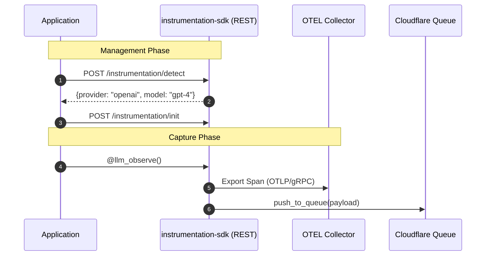

# LLM Observability Platform: Core Python Infrastructure

This guide covers the technical architecture and end-user usage for the Python-based observability components.

## Table of Contents
- [1. System Architecture](#1-system-architecture)
  - [High-Level Data Flow](#high-level-data-flow)
  - [Technical Sequence](#technical-sequence)
- [2. End-User Usage Guide](#2-end-user-usage-guide)
  - [Installation](#installation)
  - [Auto-Instrumentation (Zero-Code Changes)](#auto-instrumentation-zero-code-changes)
  - [Remote Management API (REST)](#remote-management-api-rest)
  - [Basic Usage: Decorators](#basic-usage-decorators)
  - [Advanced Usage: Context Manager](#advanced-usage-context-manager)
  - [Token Counting (Pre-Call Token Counting)](#token-counting-pre-call-token-counting)
  - [Docker Deployment](#docker-deployment)
- [3. Implementation Call Chain](#3-implementation-call-chain)

## 1. System Architecture

### High-Level Data Flow
This diagram illustrates the lifecycle of a span from application capture to background enrichment. The SDK now includes a REST Management API for remote control and discovery.

```text
┌────────────────┐          ┌──────────────────┐          ┌───────────────────┐
│   User App     │ capture  │ instrumentation  │  queue   │  Cloudflare Queue │
│  (Python/JS)   ├─────────>│      -sdk        ├─────────>│ (span-enrichment) │
└────────────────┘          └─────────┬────────┘          └─────────┬─────────┘
                                      │                             │
                                      │ REST API (8000)             │ trigger
                                      v                             v
┌────────────────┐          ┌──────────────────┐          ┌───────────────────┐
│ Analytics DB   │ storage  │  Remote Control  │ response │  queue-embedding  │
│ (ClickHouse)   │<─────────┤  (Init/Detect)   │<─────────┤      -worker      │
└────────────────┘          └──────────────────┘          └─────────┬─────────┘
                                                                    │
                                                                    │ HTTP call
                                                                    v
                                                          ┌───────────────────┐
                                                          │ Cloudflare AI     │
                                                          │ (Workers AI API)  │
                                                          └───────────────────┘
```

### Technical Sequence
The SDK integrates with OpenTelemetry (OTEL) for standardized telemetry collection.



## 2. End-User Usage Guide

The `instrumentation-sdk` is designed to be developer-friendly, requiring minimal code changes to start capturing observability data.

### Installation
```bash
pip install instrumentation-sdk
```

### Auto-Instrumentation (Zero-Code Changes)
The fastest way to get observability is to use auto-instrumentation. This patches the underlying HTTP calls of popular LLM clients transparently.

```python
from instrumentation_sdk import init_auto_instrumentation

# Initialize at the start of your application
init_auto_instrumentation()

# Now any call to OpenAI, Anthropic, LiteLLM, or LangChain is tracked automatically
import openai
client = openai.AsyncOpenAI()
response = await client.chat.completions.create(model="gpt-4o", messages=[...])
```

**Supported Providers:**
- **OpenAI**: `openai.AsyncOpenAI`
- **Anthropic**: `anthropic.AsyncAnthropic`
- **LiteLLM**: `litellm.acompletion`
- **LangChain**: Any model inheriting from `BaseChatModel` (via `ainvoke`)

### Remote Management API (REST)
The SDK provides a built-in FastAPI-based management layer for remote orchestration.

| Endpoint | Method | Description |
| :--- | :--- | :--- |
| `/instrumentation/init` | POST | Remotely initialize auto-instrumentation. |
| `/instrumentation/uninstrument` | POST | Disable all active instrumentation. |
| `/instrumentation/detect` | POST | Discovery: Detect provider/model from a sample request body. |
| `/instrumentation/test-call` | POST | Verification: Trigger a sample LLM call to verify end-to-end tracing. |
| `/streaming/test-stream-call` | POST | Verification: Trigger a mock streaming call to verify streaming/TTFT. |

### Basic Usage: Decorators
Use the `@llm_observe` decorator to manually track functions.

```python
from instrumentation_sdk import llm_observe

# (1) Decorate your LLM-calling functions
@llm_observe(service="payment-bot", endpoint="gpt-4o")
def get_llm_response(prompt: str):
    # Your existing LLM logic here
    # status, latency, and span_ids are captured automatically
    return response

# (2) Support for Async functions
@llm_observe(service="search-agent", endpoint="claude-3")
async def get_async_response(prompt: str):
    return await client.completions.create(...)
```

### Advanced Usage: Context Manager
For callers who need to set metadata mid-call (e.g., after routing to a specific model or determining usage), use the `llm_span` context manager. It supports both synchronous and asynchronous usage.

```python
from instrumentation_sdk import llm_span

async def my_handler(req):
    # (1) Start a span with initial metadata
    async with llm_span(model="gpt-4o", user_id=req.user_id) as span:
        # (2) Perform your LLM call
        response = await client.chat.completions.create(...)
        
        # (3) Update metadata mid-call
        span.set_metadata("actual_model", response.model)
        span.set_metadata("prompt_tokens", response.usage.prompt_tokens)
        
    # Span is automatically reported on exit (even if an error occurs)
```

### Manual Reporting
If you prefer direct control over the span data, you can use the reporter manually.

```python
from instrumentation_sdk import get_reporter

reporter = get_reporter()
reporter.report({
    "span_id": "unique-id",
    "service_name": "my-service",
    "status": "success",
    "text": "The prompt content to be enriched"
})
```

### Docker Deployment
The instrumentation SDK API is available as a production-ready, fully self-contained **All-in-One Standalone Observability Container**. This container bundles the FastAPI application, Grafana, and Tempo into a single image, eliminating the need to set up external databases or visualizers manually.

**Image Name:** `chiefj/instrumentation-sdk-api:unstable` (or `chiefj/instrumentation-sdk-api:latest`)

To pull and run the fully integrated all-in-one container locally:
```bash
# Pull the latest standalone image
docker pull chiefj/instrumentation-sdk-api:unstable

# Run the unified all-in-one telemetry stack
docker run -d \
  -p 8002:8000 \
  -p 3002:3000 \
  --name instrumentation-api-allinone \
  chiefj/instrumentation-sdk-api:unstable
```

Once running:
* **API Endpoints**: Accessible at `http://localhost:8002`
* **Grafana Portal**: Accessible at `http://localhost:3002` (Tempo is automatically provisioned as a read-only datasource and ready to query!)

For development with hot-reloading, use the provided Docker Compose:
```bash
docker compose -f packages/python/instrumentation-sdk/deploy/docker/docker-compose.dev.yaml up instrumentation-api
```

### Token Counting (Pre-Call Token Counting)

The SDK provides automatic pre-call token counting utilizing `tiktoken` with fallback character-based heuristics for non-OpenAI models. It supports plain text strings, complex chat message list schemas, and OpenAI's tile-based vision token calculation.

#### Direct Token Counting

Use `count_tokens` to calculate tokens directly:

```python
from instrumentation_sdk import count_tokens

tokens, method = count_tokens("hello world", "gpt-4")
```

#### Context Manager with Automated Token Tracking

Use `llm_span_with_tokens` to automatically record `prompt_tokens` and `token_count_method` inside manual spans:

```python
from instrumentation_sdk import llm_span_with_tokens

async def handle_request(req):
    async with llm_span_with_tokens(model="gpt-4", provider="openai", prompt="hello world") as span:
        pass
```

#### REST Management API (REST)

The `/v1/token-counting/count` REST API endpoint supports counting prompt tokens:

```bash
curl -X POST http://localhost:8000/v1/token-counting/count \
  -H "Content-Type: application/json" \
  -d '{"prompt": "hello world", "model": "gpt-4"}'
```

### Streaming Observability (TTFT & Token Tracking)

The SDK provides specialized utilities for tracking streaming LLM calls. It wraps generators/iterators to:
- Capture the **Time-to-First-Token (TTFT)** latency when the first chunk is yielded.
- Accumulate the streamed chunks and automatically compute the completion token count (using Tiktoken/heuristics) upon stream completion or cancellation.
- Finalize and report the manual span only when the stream is exhausted, closed, or encounters an exception.

#### Basic Streaming Usage

Use `llm_streaming_span`, `wrap_stream` (for synchronous generators), and `wrap_async_stream` (for asynchronous generators):

```python
from instrumentation_sdk import llm_streaming_span, wrap_stream, wrap_async_stream

# 1. Synchronous Streaming
with llm_streaming_span(model="gpt-4", provider="openai", prompt="Say hello") as span_ctx:
    raw_generator = ["Hello", " world", "!"]
    wrapped_stream = wrap_stream(raw_generator, span_context=span_ctx, model="gpt-4")
    for chunk in wrapped_stream:
        print(chunk)

# 2. Asynchronous Streaming
async with llm_streaming_span(model="gpt-4", provider="openai", prompt="Say hello") as span_ctx:
    async def async_generator():
        yield "Hello"
        yield " world"
    wrapped_stream = wrap_async_stream(async_generator(), span_context=span_ctx, model="gpt-4")
    async for chunk in wrapped_stream:
        print(chunk)
```

#### Mid-Stream Updates & Abort Resilience
- You can dynamically update span metadata using `span_ctx.set_metadata("custom_field", "value")` mid-stream.
- If the stream is closed early (via `wrapped_stream.close()` or `.aclose()`), the SDK captures and reports all completion tokens generated up to that point.

#### REST Verification Endpoint

The `/v1/streaming/test-stream-call` endpoint streams SSE events back to the client while validating end-to-end streaming tracing:

```bash
curl -X POST http://localhost:8000/v1/streaming/test-stream-call \
  -H "Content-Type: application/json" \
  -d '{"provider": "openai", "chunks": ["A", "B", "C"]}'
```

## 3. Implementation Call Chain

| Pipeline Stage | Method Call | Primary File |
| :--- | :--- | :--- |
| **REST API** | `create_app()` | `api/rest/v1/app.py` |
| **Management** | `init_instrumentation()` | `api/rest/v1/handlers/instrumentation.py` |
| **Tracing** | `instrument_app()` | `infra/tracing/middleware.py` |
| **Auto-Capture** | `init_auto_instrumentation()` | `features/auto_instrumentation/index.py` |
| **Decorator** | `@llm_observe` | `features/spans/decorator.py` |
| **Context Manager** | `llm_span()` | `features/manual_instrumentation/service.py` |
| **Orchestration**| `handle_job()` | `worker/index.py` |
| **Logic** | `enrich_span()` | `features/enrich_span/service.py` |
| **Integration** | `create_embedding()` | `infra/clients/cloudflare_embeddings.py` |
| **Identity** | `stable_embedding_key()`| `shared/utils/hash.py` |
| **Token Counting** | `count_tokens()` | `features/token_counting/service.py` |
| **Streaming SDK** | `wrap_async_stream()` | `features/streaming/index.py` |
| **Streaming Logic** | `finalize_stream()` | `features/streaming/service.py` |

