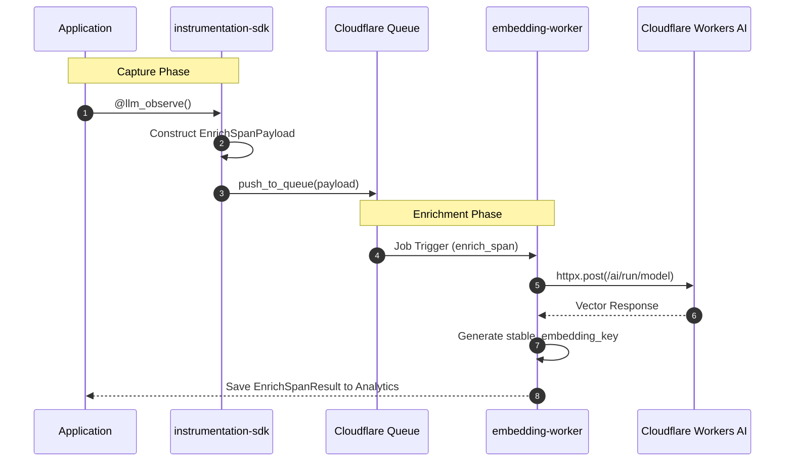

# LLM Observability Platform: Core Python Infrastructure

This guide covers the technical architecture and end-user usage for the Python-based observability components.

## Table of Contents
- [1. System Architecture](#1-system-architecture)
  - [High-Level Data Flow](#high-level-data-flow)
  - [Technical Sequence](#technical-sequence)
- [2. End-User Usage Guide](#2-end-user-usage-guide)
  - [Installation](#installation)
  - [Basic Usage](#basic-usage)
  - [Advanced: Manual Reporting](#advanced-manual-reporting)
- [3. Implementation Call Chain](#3-implementation-call-chain)

## 1. System Architecture

### High-Level Data Flow
This diagram illustrates the lifecycle of a span from application capture to background enrichment.

```text
┌────────────────┐          ┌──────────────────┐          ┌───────────────────┐
│   User App     │ capture  │ instrumentation  │  queue   │  Cloudflare Queue │
│  (Python/JS)   ├─────────>│      -sdk        ├─────────>│ (span-enrichment) │
└────────────────┘          └──────────────────┘          └─────────┬─────────┘
                                                                    │
                                                                    │ trigger
                                                                    v
┌────────────────┐          ┌──────────────────┐          ┌───────────────────┐
│ Analytics DB   │ storage  │ Enrichment Result│ response │  queue-embedding  │
│ (ClickHouse)   │<─────────┤(EnrichSpanResult)│<─────────┤      -worker      │
└────────────────┘          └──────────────────┘          └─────────┬─────────┘
                                                                    │
                                                                    │ HTTP call
                                                                    v
                                                          ┌───────────────────┐
                                                          │ Cloudflare AI     │
                                                          │ (Workers AI API)  │
                                                          └───────────────────┘
```

### Technical Sequence



## 2. End-User Usage Guide

The `instrumentation-sdk` is designed to be developer-friendly, requiring minimal code changes to start capturing observability data.

### Installation
```bash
pip install instrumentation-sdk
```

### Basic Usage
Use the `@llm_observe` decorator to automatically track latency, status, and metadata for any LLM interaction.

```python
from instrumentation_sdk import llm_observe

# (1) Decorate your LLM-calling functions
@llm_observe(service="payment-bot", endpoint="gpt-4o")
def get_llm_response(prompt: str):
    # Your existing LLM logic here
    # status, latency, and span_ids are captured automatically
    return response

# (2) Support for Async functions
@llm_observe(service="search-agent", endpoint="claude-3")
async def get_async_response(prompt: str):
    return await client.completions.create(...)
```

### Advanced: Manual Reporting
If you prefer not to use decorators, you can use the reporter manually.

```python
from instrumentation_sdk import get_reporter

reporter = get_reporter()
reporter.report({
    "span_id": "unique-id",
    "service_name": "my-service",
    "status": "success",
    "text": "The prompt content to be enriched"
})
```

## 3. Implementation Call Chain

| Pipeline Stage | Method Call | Primary File |
| :--- | :--- | :--- |
| **Capture** | `@llm_observe` | `features/spans/decorator.py` |
| **Orchestration**| `handle_job()` | `worker/index.py` |
| **Logic** | `enrich_span()` | `features/enrich_span/service.py` |
| **Integration** | `create_embedding()` | `infra/clients/cloudflare_embeddings.py` |
| **Identity** | `stable_embedding_key()`| `shared/utils/hash.py` |
