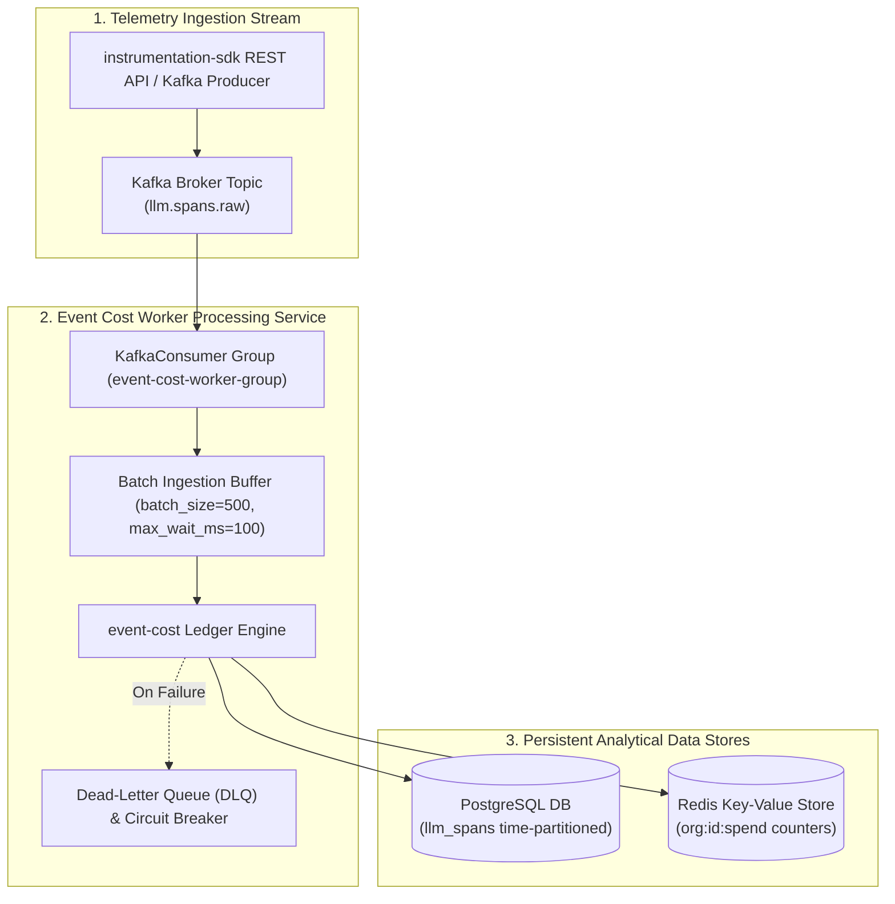
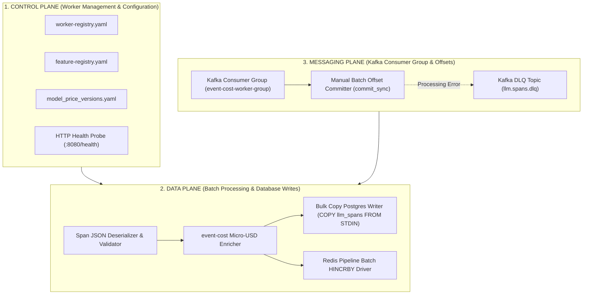

# ADR 0001: Asynchronous Kafka Event Cost Worker Processing and Persistence Pipeline

| Field | Value |
| --- | --- |
| **ADR ID** | `ADR-PYTHON-EVENT-COST-WORKER-0001` |
| **Title** | Asynchronous Kafka Event Cost Worker Processing and Persistence Pipeline |
| **Status** | **Accepted** |
| **Date** | 2026-08-25 |
| **Scope** | Asynchronous Worker (`event-cost-worker`), Kafka Consumer (`llm.spans.raw`), Database Writer (`PostgreSQL` / `pgvector`) |

---

## 1. Context & Problem Statement

High-volume production environments process thousands of LLM spans per second. Synchronous database writes during span ingestion introduce severe latency overhead to client application LLM calls. 

`event-cost-worker` decouples telemetry ingestion from database persistence by:
1. Consuming span events asynchronously from Kafka topic `llm.spans.raw` in batch groups.
2. Evaluating micro-USD costs via `event-cost` ledger integrations.
3. Persisting batch records into time-partitioned PostgreSQL database tables (`llm_spans`) and Redis spend counters.

---

## 2. High-Level Design (HLD)

### 2.1 High-Level Architecture Topology



### 2.2 Three-Plane Architectural Blueprint (Control, Data & Messaging)



---

## 3. Low-Level Design (LLD)

### 3.1 Sequence Diagram: Kafka Batch Ingestion & Database Commit

```mermaid
sequenceDiagram
    autonumber
    actor Kafka as Kafka Broker (llm.spans.raw)
    participant Worker as event-cost-worker Daemon
    participant CostEngine as event-cost Engine
    participant Postgres as PostgreSQL (llm_spans)
    participant Redis as Redis Cache

    loop Background Consumption Loop
        Kafka->>Worker: Poll batch of messages (e.g. 500 span records)
        activate Worker
        
        Worker->>Worker: Deserialize JSON & validate schema

        loop Per Span in Batch
            Worker->>CostEngine: calculate_cost(model, provider, prompt_tokens, comp_tokens)
            CostEngine-->>Worker: cost_usd_micro
        end

        par Bulk Insert Postgres
            Worker->>Postgres: BEGIN TRANSACTION; execute_values(INSERT INTO llm_spans...); COMMIT;
            Postgres-->>Worker: Batch Insert OK
        and Bulk Update Redis Counters
            Worker->>Redis: PIPELINE; HINCRBY org:spends...; EXEC;
            Redis-->>Worker: Redis Pipeline OK
        end

        Worker->>Kafka: Commit Kafka Offsets (commit_sync)
        deactivate Worker
    end
```

### 3.2 Key Worker Call Contract (`src/event_cost_worker/worker.py`)

```python
import logging
from typing import List, Dict, Any
from event_cost import CostLedger
from src.database.repository import PostgresSpanRepository

logger = logging.getLogger("event_cost_worker")

class EventCostWorker:
    def __init__(self, kafka_consumer, postgres_repo: PostgresSpanRepository, ledger: CostLedger):
        self.consumer = kafka_consumer
        self.repo = postgres_repo
        self.ledger = ledger

    def process_batch(self, messages: List[Dict[str, Any]]) -> None:
        enriched_spans = []
        for msg in messages:
            try:
                cost_micro = self.ledger.record(
                    model=msg["model"],
                    provider=msg["provider"],
                    prompt_tokens=msg["prompt_tokens"],
                    completion_tokens=msg["completion_tokens"],
                    org_id=msg.get("org_id", "default_org")
                )
                msg["cost_usd_micro"] = cost_micro
                enriched_spans.append(msg)
            except Exception as e:
                logger.error(f"Error enriching span {msg.get('span_id')}: {e}")

        if enriched_spans:
            self.repo.bulk_insert_spans(enriched_spans)
```

---

## 4. End-to-End Call Stack Topology

```text
└── [Daemon Startup] event_cost_worker/src/event_cost_worker/main.py :: start_worker()
    ├── 1. Read configuration from environment & port-registry (.port-registry)
    ├── 2. Initialize PostgresSpanRepository (db connection pool)
    ├── 3. Initialize CostLedger(backend=RedisBackend())
    │
    └── 4. [Kafka Loop] event_cost_worker/src/event_cost_worker/worker.py :: run_consumer_loop()
        ├── 5. consumer.poll(timeout_ms=100, max_records=500)
        │
        ├── 6. process_kafka_span_batch(records)
        │   ├── 7. event_cost/src/event_cost/ledger.py :: CostLedger.record(span_input)
        │   │   └── Calculate micro-USD & update Redis counters
        │   │
        │   └── 8. event_cost_worker/src/database/repository.py :: bulk_insert_spans(enriched_spans)
        │       └── Postgres execute_values("INSERT INTO llm_spans (trace_id, span_id, cost_usd_micro...)")
        │
        └── 9. consumer.commit_sync() -> Acknowledge Kafka message batch
```

---

## 5. Decision Rationale & Consequences

### Positive Consequences
- **Asynchronous Execution**: Ingestion latency is $0\text{ms}$ on client application LLM calls since database writes run out-of-band in worker daemons.
- **Bulk Insert Throughput**: Batching 500 spans per database transaction increases write throughput by over 400% compared to single-row inserts.
- **Kafka Offset Safety**: `commit_sync()` is only executed after PostgreSQL and Redis writes succeed, guaranteeing at-least-once processing semantics.
