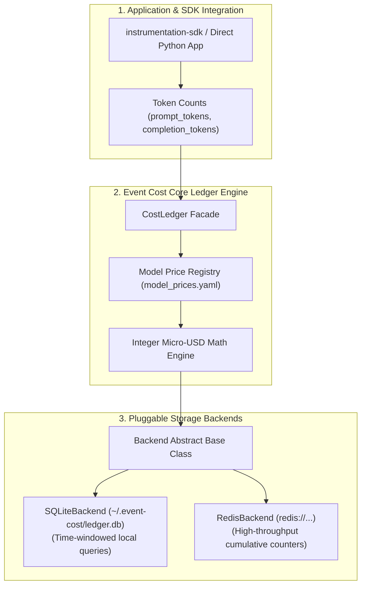
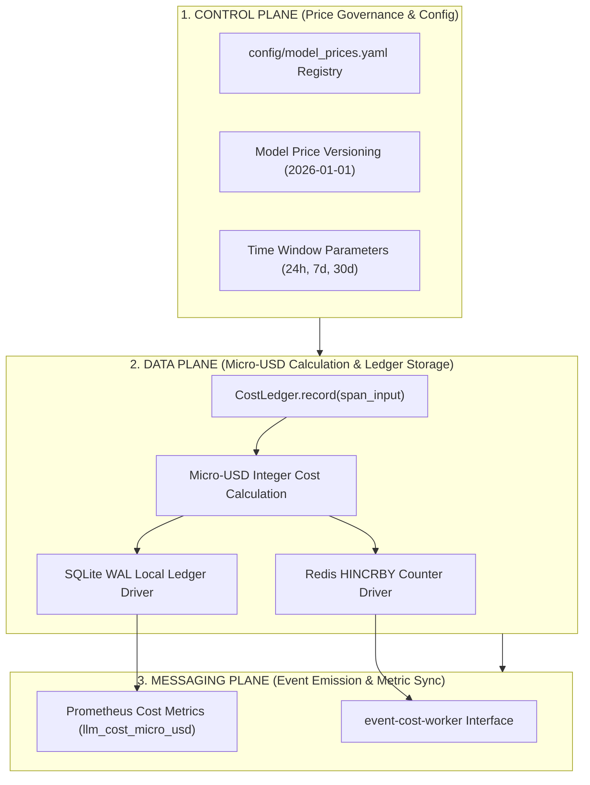
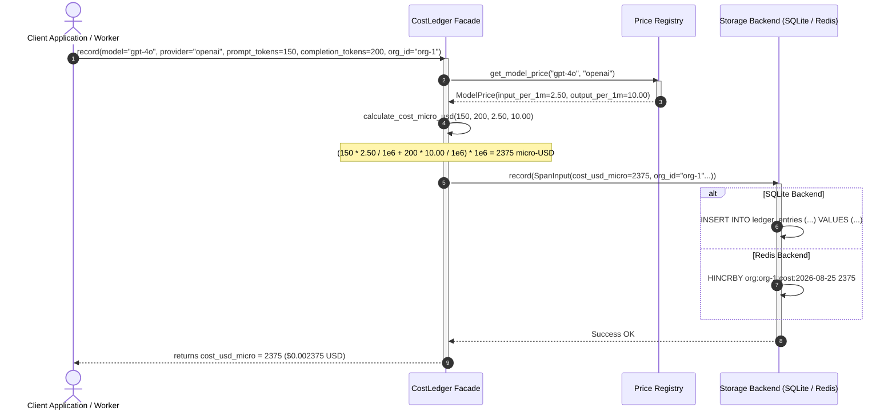

# ADR 0001: Micro-USD Cost Ledger and Multi-Backend Pricing Engine

| Field | Value |
| --- | --- |
| **ADR ID** | `ADR-PYTHON-EVENT-COST-0001` |
| **Title** | Micro-USD Cost Ledger and Multi-Backend Pricing Engine |
| **Status** | **Accepted** |
| **Date** | 2026-08-25 |
| **Scope** | Core Cost Engine (`event-cost`), Pricing Registry (`model_prices.yaml`), Storage Backends (`SQLiteBackend`, `RedisBackend`) |

---

## 1. Context & Problem Statement

LLM observability platforms require precise, deterministic cost tracking across various providers (OpenAI, Anthropic, Google, Cohere). Floating-point math introduces rounding errors over millions of transactions. Furthermore, client applications range from local zero-infrastructure CLI scripts (requiring SQLite) to distributed Kafka-scale microservices (requiring Redis).

`event-cost` addresses these challenges by:
1. Standardizing all cost calculations in **micro-USD** ($1\text{ USD} = 1,000,000\text{ micro-USD}$) using integer math.
2. Abstracting storage backends behind a unified `CostLedger` interface supporting zero-config SQLite and scalable Redis.
3. Maintaining a central model price version registry (`model_prices.yaml`).

---

## 2. High-Level Design (HLD)

### 2.1 High-Level Architecture Topology



### 2.2 Three-Plane Architectural Blueprint (Control, Data & Messaging)



---

## 3. Low-Level Design (LLD)

### 3.1 Sequence Diagram: Cost Calculation & Ledger Record Lifecycle



### 3.2 Key Function Contracts (`src/event_cost/ledger.py`)

```python
from dataclasses import dataclass
from typing import Optional

@dataclass(frozen=True)
class SpanInput:
    model: str
    provider: str
    prompt_tokens: int
    completion_tokens: int
    cost_usd_micro: int
    org_id: str
    project_id: Optional[str] = None
    service_name: Optional[str] = None
    user_id: Optional[str] = None
    timestamp: float = 0.0

class CostLedger:
    def __init__(self, backend: Optional[Backend] = None):
        self.backend = backend or SQLiteBackend()

    def record(self, **kwargs) -> int:
        span = self._build_span(kwargs)
        self.backend.record(span)
        return span.cost_usd_micro

    def total_cost_usd(self, org_id: str, window: str = "24h") -> float:
        micro_cost = self.backend.query_total_micro(org_id=org_id, window=window)
        return micro_cost / 1_000_000.0
```

---

## 4. End-to-End Call Stack Topology

```text
└── [Client Application] ledger.record(model="gpt-4o", prompt_tokens=150, completion_tokens=200)
    ├── 1. event_cost/ledger.py :: CostLedger.record(**kwargs)
    │   ├── 2. event_cost/prices.py :: get_model_price("gpt-4o", "openai")
    │   │   └── Read rates from model_prices.yaml -> (input_price_per_1m=2.50, output_price_per_1m=10.00)
    │   ├── 3. event_cost/ledger.py :: calculate_micro_usd(prompt_tokens, completion_tokens)
    │   │   └── Integer math: returns cost_usd_micro = 2375 ($0.002375 USD)
    │   └── 4. Build immutable `SpanInput` dataclass record
    │
    ├── 5. [SQLite Mode] event_cost/backends/sqlite.py :: SQLiteBackend.record(span)
    │   ├── 6. sqlite3.connect("~/.event-cost/ledger.db")
    │   └── 7. INSERT INTO ledger_entries (model, provider, prompt_tokens, cost_usd_micro...)
    │
    └── 8. [Redis Mode] event_cost/backends/redis.py :: RedisBackend.record(span)
        ├── 9. redis_client.hincrby("org:org-1:cost:2026-08-25", "total_micro_usd", 2375)
        └── 10. redis_client.hincrby("model:gpt-4o:cost", "total_micro_usd", 2375)
```

---

## 5. Decision Rationale & Consequences

### Positive Consequences
- **Zero Floating-Point Drift**: Micro-USD integer math ensures exact financial auditability across millions of span records.
- **Zero Infrastructure Footprint**: Out-of-the-box SQLite backend works locally without requiring Redis or PostgreSQL servers.
- **Plug-and-Play Scaling**: Single-line configuration change (`CostLedger(backend=RedisBackend(...))`) upgrades local code to enterprise cluster scale.
