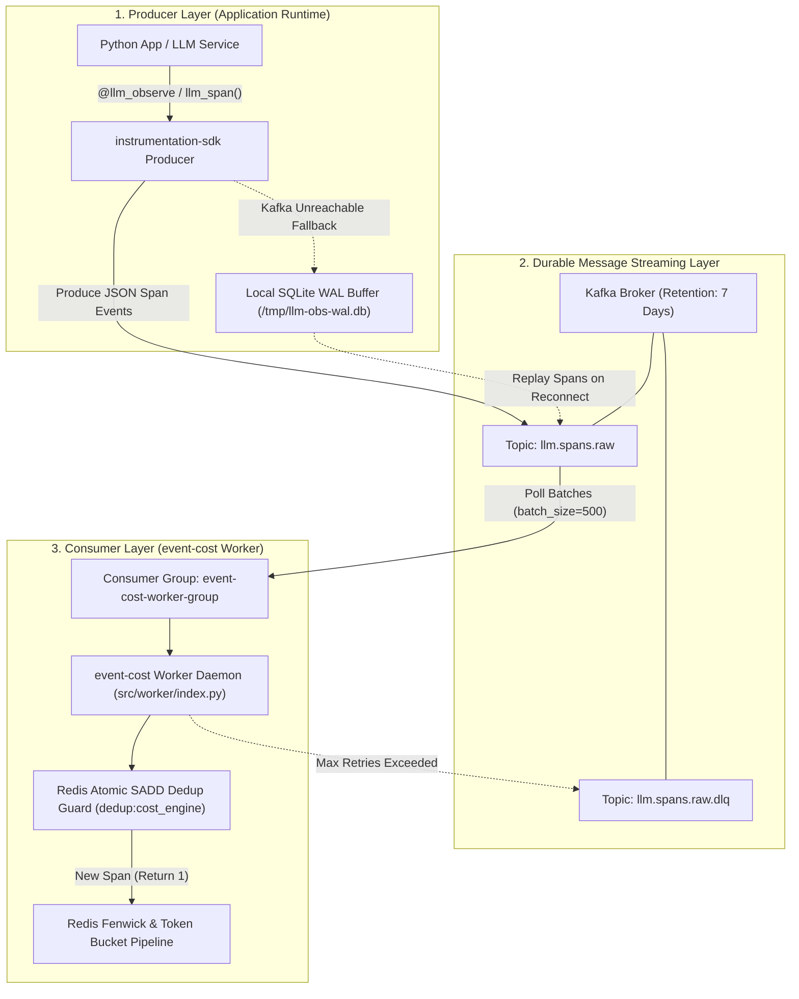
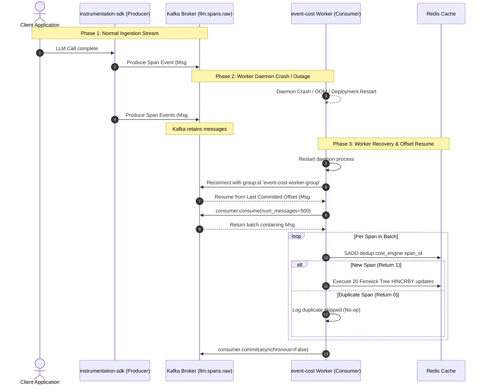

# ADR 0005: Fault-Tolerant Asynchronous Messaging Topology and Failure Recovery Architecture

| Field | Value |
| --- | --- |
| **ADR ID** | `ADR-PYTHON-EVENT-COST-0005` |
| **Title** | Fault-Tolerant Asynchronous Messaging Topology and Failure Recovery Architecture |
| **Status** | **Accepted** |
| **Date** | 2026-08-26 |
| **Scope** | Kafka Consumer Topology (`event_cost.worker`), Producer SDK (`instrumentation-sdk`), Fault-Tolerance & Crash Recovery (`Kafka`, `Redis`, `SQLite WAL`) |

---

## 1. Context & Problem Statement

High-throughput distributed systems inevitably experience component outages. When client applications emit LLM telemetry via `instrumentation-sdk`, the ingestion engine must guarantee:
1. **Zero Data Loss**: Telemetry span events must never be lost during worker daemon crashes, network partitions, or Kafka broker restarts.
2. **Zero-Latency Application Impact**: Application LLM calls must remain unblocked regardless of worker health or backlog size.
3. **Strict Idempotency**: Re-delivered Kafka messages during consumer recovery must never result in duplicate financial billing or double-counted token usage.
4. **At-Least-Once Delivery**: Kafka offsets must be committed only after downstream persistence has been confirmed.

This ADR defines the fault-tolerant messaging architecture, consumer group topology, crash recovery protocols, and multi-tier failure matrix.

---

## 2. High-Level Design (HLD)

### 2.1 High-Level Producer-Consumer Topology



---

## 3. Low-Level Design (LLD)

### 3.1 Failure & Recovery Sequence Diagram



---

## 4. Multi-Tier Failure Recovery Matrix

| Outage Scenario | System Behavior | Data Protection Guarantee | Recovery Mechanism |
|---|---|---|---|
| **Worker Crash / Outage** | Kafka retains all incoming messages in `llm.spans.raw` topic on disk log (default 7-day retention). | **Zero Data Loss** | On restart, worker reconnects to `event-cost-worker-group` and resumes polling from the last committed offset. |
| **Worker Crash During Batch Processing** | Offsets are not yet committed because `enable.auto.commit = False`. | **Zero Data Loss** | On worker restart, Kafka re-delivers the batch. The Redis `dedup:cost_engine` set prevents double-counting. |
| **Kafka Broker Outage** | `instrumentation-sdk` fails to publish to Kafka. | **Zero Application Latency / Zero Data Loss** | SDK buffers spans locally in SQLite WAL (`/tmp/llm-obs-wal.db`) and replays them when Kafka connectivity is restored. |
| **Transient Redis Connection Error** | Worker execution raises a network exception during Redis pipeline update. | **At-Least-Once Delivery** | `with_retry` decorator executes 3 retries with exponential backoff (100ms, 200ms, 400ms) before DLQ routing. |
| **Corrupt Payload / Malformed JSON** | Worker fails JSON deserialization. | **Dead-Letter Queue (DLQ) Isolation** | Raw message bytes are routed to `llm.spans.raw.dlq` topic and offset is committed to unblock queue processing. |

---

## 5. Key Technical Implementations

### 5.1 Manual Offset Commit (`src/worker/index.py`)
Auto-commit is explicitly disabled in the worker configuration:

```python
consumer = Consumer({
    "bootstrap.servers": config.kafka_bootstrap_servers,
    "group.id": config.kafka_consumer_group,
    "auto.offset.reset": "earliest",
    "enable.auto.commit": False,  # Manual commit enforcement
})

# ... Batch processing ...
process_batch(spans, fenwick, bucket, ewma, price_lookup, dedup, metrics)

# Commit offsets ONLY after Redis writes succeed
consumer.commit(asynchronous=False)
```

### 5.2 Atomic Redis Deduplication Lua Guard
To handle re-delivered messages during worker recovery:

```lua
-- DEDUP_CHECK_LUA
local key = KEYS[1]       -- "dedup:cost_engine"
local span_id = ARGV[1]   -- Span UUID
local ttl = tonumber(ARGV[2]) -- 3600 seconds
local added = redis.call('SADD', key, span_id)
if added == 1 then
    redis.call('EXPIRE', key, ttl)
    return 1 -- New span -> proceed to aggregate
end
return 0 -- Duplicate span -> skip
```

---

## 6. End-to-End Call Stack Topology

```text
└── [Worker Lifecycle] src/worker/index.py :: main()
    ├── 1. Initialize confluent_kafka.Consumer(enable.auto.commit=False)
    ├── 2. Subscribe to topic 'llm.spans.raw' (group.id='event-cost-worker-group')
    │
    └── 3. [Polling Loop] _run_consumer_loop()
        ├── 4. Fetch batch: consumer.consume(num_messages=500, timeout=1.0)
        ├── 5. Extract OTel traceparent headers & deserialize JSON payload
        ├── 6. Deduplicate: Redis SADD dedup:cost_engine {span_id}
        ├── 7. Pipeline 20 Fenwick tree updates + Token bucket deductions
        │
        ├── [On Success] consumer.commit(asynchronous=False)
        └── [On Failure] Retry 3x (100ms, 200ms, 400ms) -> Route to DLQ topic 'llm.spans.raw.dlq'
```

---

## 7. Decision Rationale & Consequences

### Positive Consequences
- **High Availability**: Application telemetry emission remains $100\%$ decoupled from worker operational status.
- **Strict Idempotency**: Redis atomic deduplication set guarantees exact financial totals even under repeated consumer crashes.
- **Zero Head-of-Line Blocking**: Unprocessable payloads are safely isolated in DLQ topics without stalling stream ingestion.
