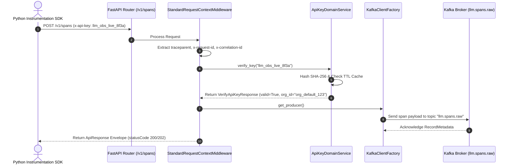

# ADR 0001: Centralized Kafka Infrastructure and API Key Verification Architecture

- **Status**: Accepted
- **Date**: 2026-08-23
- **Author**: @data-team
- **Scope**: `instrumentation-sdk` Kafka messaging infrastructure, API key domain verification, CORS preflight handling, and request context middleware

---

## 1. Context & Problem Statement

The `instrumentation-sdk` service ingests high-throughput raw LLM observability spans and manages client auto-instrumentation. To ensure enterprise scalability and compliance:
1. Low-level Kafka broker connections were previously decentralized, risking duplicate connections and configuration drift.
2. Incoming SDK spans needed tenant authentication via API Keys validated against the `auth` service with sub-millisecond TTL caching.
3. CORS preflight (`OPTIONS`) requests from browser-based dashboard applications required explicit header handling on OTEL Collectors and REST APIs.

---

## 2. Decision & Architecture Overview

1. **Centralized Kafka Infrastructure (`src/infra/messaging/`)**:
   - **`KafkaBrokerConfig`**: Environment-driven singleton managing broker endpoints, SASL/SSL credentials, acks, linger, compression, and retries.
   - **`KafkaClientFactory`**: Thread-safe singleton producing reusable `KafkaProducer` and `KafkaConsumer` instances.
   - **`KafkaPythonProducerAdapter`**: Implements `KafkaProducerPort` via `KafkaClientFactory`.

2. **API Key Verification Feature (`src/features/api_keys/`)**:
   - **`ApiKeyDomainService`**: Computes SHA-256 API key hashes, maintains a 60-second TTL cache, and validates keys against the Auth REST service (`http://localhost:3001`).

3. **Standardized Context & Response Envelope Middleware**:
   - **`StandardRequestContextMiddleware`**: Extracts mandatory headers (`traceparent`, `x-request-id`, `x-correlation-id`, `x-causation-id`, `x-idempotency-key`, `x-tenant-id`), enforces idempotency caching, and wraps responses in standardized JSON envelopes.

---

## 3. High-Level Architecture Diagram

```mermaid
graph TD
    Client["Client SDK / Python Application"] -->|POST /v1/spans (Header: x-api-key)| IngestionAPI["FastAPI REST Server (Port 8000/8002)"]
    
    subgraph Instrumentation SDK Engine
        IngestionAPI --> Middleware["StandardRequestContextMiddleware"]
        Middleware --> KeyService["ApiKeyDomainService"]
        KeyService -->|Cache Miss| AuthREST["Auth Service (Port 3001)"]
        KeyService -->|Cache Hit| KeyCache["In-Memory TTL Cache (60s)"]
        Middleware --> Factory["KafkaClientFactory"]
        Factory --> ReliableReporter["ReliableKafkaSpanReporter"]
    end
    
    ReliableReporter -->|Publish Spans| Kafka["Kafka Broker (Port 31414 / 9092)"]
    ReliableReporter -->|Offline Fallback| WAL["SQLite WAL Storage (/tmp/llm-obs-wal.db)"]
```

---

## 4. Low-Level Sequence Diagram



---

## 5. End-to-End Call Stack Topology

```text
└── [SDK Client / HTTP Request] POST http://localhost:8000/v1/spans
    ├── 1. app.py :: create_app()
    │   ├── 2. CORSMiddleware :: allow_origins=["*"], allow_headers=["*"]
    │   └── 3. request_context.py :: StandardRequestContextMiddleware.dispatch()
    │       ├── Extract `traceparent`, `x-request-id`, `x-correlation-id`, `x-idempotency-key`
    │       ├── Check Idempotency Store (Return cached envelope if idempotent key exists)
    │       │
    │       └── 4. api_key.py :: verify_api_key(x_api_key)
    │           └── 5. service.py :: ApiKeyDomainService.verify_key(raw_key)
    │               ├── Calculate SHA-256 hash
    │               ├── Check 60s in-memory TTL cache
    │               └── Fallback to Auth REST Service GET http://localhost:3001/api/v1/auth/api-keys/verify
    │
    └── 6. reliable_adapter.py :: ReliableKafkaSpanReporter.report(span_data)
        ├── 7. client_factory.py :: KafkaClientFactory.get_producer()
        │   └── Read central config from broker_config.py (KAFKA_BOOTSTRAP_SERVERS)
        │
        ├── 8. Publish span to Kafka topic "llm.spans.raw" (Port 31414)
        └── 9. [Offline Fallback] sqlite_wal_adapter.py :: Save to SQLite WAL if Kafka offline
```

---

## 6. Verification Results

- **Unit Tests**: Passed 100% in `tests/unit/test_api_key.py` and `tests/unit/test_kafka_messaging.py`.
- **CORS Handling**: `OPTIONS /v1/traces` returns `HTTP 204 No Content` with `Access-Control-Allow-Origin: *`.
