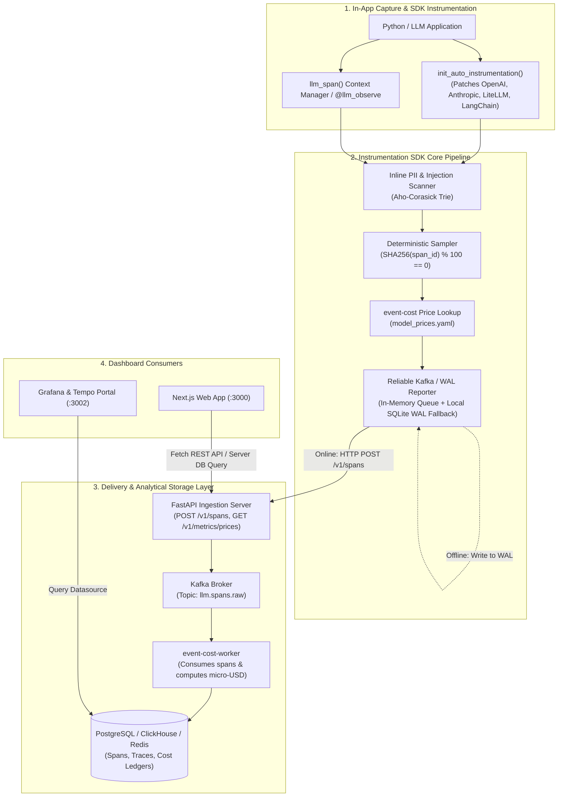
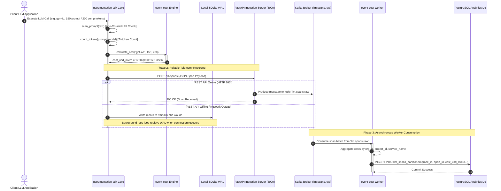

# ADR 0002: Telemetry Ingestion Pipeline and Event Cost Engine Integration

| Field | Value |
| --- | --- |
| **ADR ID** | `ADR-PYTHON-SDK-0002` |
| **Title** | Telemetry Ingestion Pipeline and Event Cost Engine Integration |
| **Status** | **Accepted** |
| **Date** | 2026-08-25 |
| **Scope** | Telemetry SDK (`instrumentation-sdk`), Cost Engine (`event-cost`), Worker (`event-cost-worker`) |

---

## 1. Context & Problem Statement

The Python Instrumentation SDK (`instrumentation-sdk`) captures real-time LLM telemetry (prompt/completion tokens, latency, TTFT, PII flags, and model parameters). To support downstream billing, budget tracking, and real-time dashboard analytics (e.g. in Next.js `web-app`), `instrumentation-sdk` must interface seamlessly with:
- **`event-cost`**: The standalone micro-USD cost engine and pricing registry.
- **`event-cost-worker`**: The high-throughput asynchronous Kafka streaming worker.
- **PostgreSQL / ClickHouse**: The persistent analytical data store.

This ADR defines the High-Level Design (HLD) and Low-Level Design (LLD) for span ingestion, cost computation, offline WAL resilience, and REST API retrieval endpoints.

---

## 2. High-Level Design (HLD)

### 2.1 High-Level Architecture Topology



### 2.2 Core Responsibilities

| Subsystem Component | Primary Responsibility | Data Input | Data Output |
|---|---|---|---|
| **`instrumentation-sdk`** | Capture LLM telemetry, scan PII, compute tokens & TTFT | Client LLM API calls | `LLMSpanContext` / JSON Span Payload |
| **`event-cost`** | Evaluate exact micro-USD costs from pricing tables | Model, Provider, Tokens | Cost in micro-USD (`cost_usd_micro`) |
| **`ReliableReporter`** | Enqueue spans, fallback to local SQLite WAL on network drop | JSON Span Payload | HTTP Post / Kafka Event / SQLite WAL Record |
| **`event-cost-worker`** | Process Kafka span streams & persist to PostgreSQL/ClickHouse | `llm.spans.raw` Kafka topic | Partitioned database records & cost ledgers |

---

## 3. Low-Level Design (LLD)

### 3.1 Sequence Diagram: Span Ingestion & Cost Processing Lifecycle



### 3.2 Key Function Signatures & Data Contracts

#### Span Ingestion Request Schema (`api/rest/v1/schemas/spans.py`)
```python
from pydantic import BaseModel
from typing import Optional, Dict, Any, List

class SpanIngestRequest(BaseModel):
    trace_id: str
    span_id: str
    parent_span_id: Optional[str] = None
    service_name: str
    model: str
    provider: str
    prompt_tokens: int
    completion_tokens: int
    cost_usd_micro: int
    duration_ms: float
    ttft_ms: Optional[float] = None
    pii_detected: bool = False
    injection_attempt: bool = False
    metadata: Optional[Dict[str, Any]] = None
```

#### Cost Calculation Contract (`event_cost/service.py`)
```python
def calculate_cost(
    model: str,
    provider: str,
    prompt_tokens: int,
    completion_tokens: int
) -> int:
    """
    Calculates LLM execution cost in micro-USD (1 USD = 1,000,000 micro-USD).
    """
    price_config = get_model_price(model=model, provider=provider)
    input_cost = (prompt_tokens / 1_000_000.0) * price_config.input_price_per_1m
    output_cost = (completion_tokens / 1_000_000.0) * price_config.output_price_per_1m
    return int(round((input_cost + output_cost) * 1_000_000))
```

---

## 4. Decision Rationale & Consequences

### Positive Consequences
- **Zero Latency Impact on User App**: LLM span capture and cost calculations occur asynchronously in non-blocking background tasks (`asyncio.create_task`) or reliable WAL buffers.
- **Offline Resilience**: If the ingestion API or database goes down, client applications continue running without interruption, buffering spans safely in SQLite WAL storage until connections recover.
- **Unified Price Registry**: `model_prices.yaml` serves as the single source of truth for both `instrumentation-sdk` and `event-cost`, supporting hot-reloading via `POST /v1/metrics/prices/reload`.

### Negative Consequences
- Operating Kafka and worker containers requires additional infrastructure orchestration in production.
