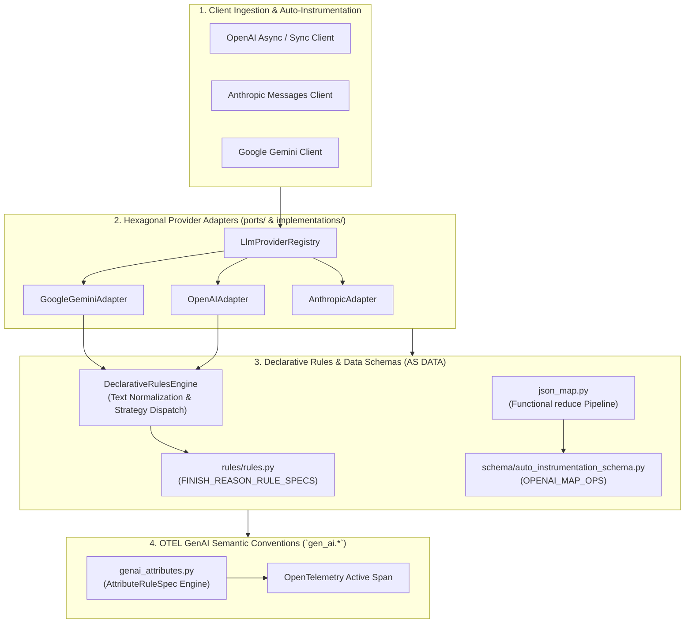

# ADR 0003: Declarative Rules Engine and OpenTelemetry GenAI Semantic Conventions

| Field | Value |
| --- | --- |
| **ADR ID** | `ADR-PYTHON-SDK-0003` |
| **Title** | Declarative Rules Engine and OpenTelemetry GenAI Semantic Conventions |
| **Status** | **Accepted** |
| **Date** | 2026-08-26 |
| **Scope** | Declarative Rules Engine, Hexagonal Adapters (`src/infra/adapters/llm/`), OpenTelemetry GenAI Conventions (`gen_ai.*`) |

---

## 1. Context & Problem Statement

Prior implementations relied on hardcoded `if/elif/else` branching statements in provider response mappers and unstandardized span attribute keys. This created architectural debt:
1. Adding or updating provider finish reasons required imperative code modifications.
2. Unstandardized telemetry attributes caused compatibility failures with third-party OpenTelemetry tools.

---

## 2. Decision & Architecture Overview

1. **Declarative Rules Engine (`src/shared/rules_engine/declarative_evaluator.py`)**:
   - Replaced imperative `if/else` ladders with `DeclarativeRulesEngine` powered by strategy dispatches (`MATCH_STRATEGIES`).
   - Standardized text normalization (`normalize_text`) to seamlessly handle `UPPERCASE`, `lowercase`, `camelCase`, `PascalCase`, `kebab-case`, and whitespace variations.

2. **Declarative Rule & Schema Definitions AS DATA**:
   - Externalized rule definitions into [`src/infra/adapters/llm/rules/rules.py`](file:///home/btpl-lap-22/live/llm-observability-platform/packages/python/instrumentation-sdk/src/infra/adapters/llm/rules/rules.py).
   - Externalized JSON transformation pipelines into [`src/features/auto_instrumentation/schema/auto_instrumentation_schema.py`](file:///home/btpl-lap-22/live/llm-observability-platform/packages/python/instrumentation-sdk/src/features/auto_instrumentation/schema/auto_instrumentation_schema.py).

3. **OpenTelemetry GenAI Semantic Conventions (`gen_ai.*`)**:
   - Standardized attribute injection in [`src/shared/messaging/tracing/genai_attributes.py`](file:///home/btpl-lap-22/live/llm-observability-platform/packages/python/instrumentation-sdk/src/shared/messaging/tracing/genai_attributes.py) conforming strictly to `open-telemetry/semantic-conventions-genai` (`gen_ai.system`, `gen_ai.provider.name`, `gen_ai.request.model`, `gen_ai.usage.input_tokens`, `gen_ai.usage.output_tokens`, `gen_ai.usage.cost_micro_usd`, `gen_ai.conversation.id`).

---

## 3. High-Level Architecture Diagram

---

## 4. Verification Results

- **Unit & Integration Tests**: 100% passed in `test_declarative_rules_engine.py`, `test_gemini_adapter.py`, `test_openai_patching.py`, `test_anthropic_patching.py`, and `test_langchain_patching.py`.
