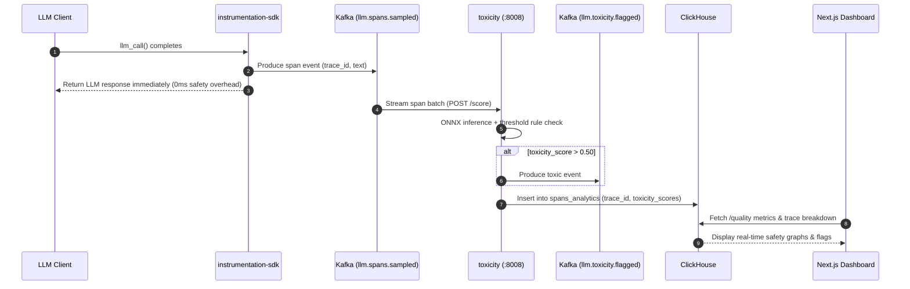

# ADR 0004: End-to-End Integration Architecture with Instrumentation SDK and Next.js Frontend

| Field | Value |
| --- | --- |
| **ADR ID** | `ADR-PYTHON-TOXICITY-0004` |
| **Title** | End-to-End Integration Architecture: Toxicity Service with Python Instrumentation SDK and Next.js Frontend |
| **Status** | **Accepted** |
| **Date** | 2026-08-26 |
| **Scope** | `packages/python/toxicity`, `packages/python/instrumentation-sdk`, `packages/node/web-app` (Frontend Dashboard) |

---

## 1. Context & Problem Statement

The platform requires a clear architectural contract explaining how toxicity scoring integrates end-to-end across the lifecycle of an LLM generation:
1. **Client Capture Stage (`instrumentation-sdk`)**: How does an application instrumenting OpenAI / Anthropic / LiteLLM calls trigger toxicity analysis or pass span traces without incurring synchronous inference latency?
2. **Ingestion & Processing Stage (`llmobs-kafka` & `toxicity`)**: How are raw / sampled spans evaluated, flagged, and linked to OpenTelemetry distributed trace graphs?
3. **Visualization & Governance Stage (`web-app`)**: How does the Next.js Frontend query, display, and alert on toxicity scores, category breakdowns (`severe_toxicity`, `insult`, `threat`), and flagged spans in `/traces` and `/quality` views?

---

## 2. High-Level Design (HLD)

### 2.1 Macro Integration Topology

```mermaid
flowchart TD
    subgraph ClientApp["1. APPLICATION LAYER"]
        AppCode["User Application / LLM Service"]
        SDK["packages/python/instrumentation-sdk\n(Auto/Manual Instrumentation)"]
        AppCode -->|Generates Completion| SDK
    end

    subgraph MessagingIngress["2. INGESTION & PIPELINE PLANE"]
        OtelCol["llmobs-otel-collector :4317/:4318"]
        KafkaBroker["llmobs-kafka :9092\nTopic: llm.spans.sampled"]
        KafkaAlerts["Kafka Topic: llm.toxicity.flagged"]
    end

    subgraph SafetyInference["3. SAFETY INFERENCE PLANE"]
        ToxicitySvc["packages/python/toxicity (:8008)\n(FastAPI + ONNX Runtime CPU)"]
    end

    subgraph StorageAnalytics["4. ANALYTICS & STORAGE PLANE"]
        TempoTraces["llmobs-tempo (Trace Waterfall DB)"]
        ClickHouseDB["llmobs-clickhouse (Columnar Analytics)\nTable: spans_raw / quality_scores"]
        AlloyDB["llmobs-alloydb (Relational Alerts & Rules)"]
    end

    subgraph FrontendPortal["5. NEXT.JS FRONTEND (packages/node/web-app)"]
        NextServer["Next.js Server Actions / API Routes"]
        TraceWaterfallView["/traces/[traceId] Waterfall Visualizer"]
        QualityDashboard["/quality Toxicity & Safety Dashboard"]
        AlertBanner["Global Safety Notification Toast"]
    end

    %% Flow connections
    SDK -->|A. Async OTel Spans| OtelCol
    SDK -->|B. Publish Event| KafkaBroker
    OtelCol --> TempoTraces

    %% Pipeline triggering
    KafkaBroker -->|C. Batch Stream Spans| ToxicitySvc
    SDK -.->|D. Direct Synchronous Scoring (Optional)| ToxicitySvc
    
    %% Toxicity actions
    ToxicitySvc -->|E. Record OTel Span Context| OtelCol
    ToxicitySvc -->|F. Emit if Flagged (> 0.50)| KafkaAlerts
    ToxicitySvc -->|G. Persist Evaluated Scores| ClickHouseDB

    KafkaAlerts --> AlloyDB

    %% Frontend queries
    NextServer -->|Query Trace Waterfall| TempoTraces
    NextServer -->|Query Aggregated Metrics| ClickHouseDB
    NextServer -->|Query Active Alerts| AlloyDB

    NextServer --> TraceWaterfallView
    NextServer --> QualityDashboard
    NextServer --> AlertBanner
```

---

## 3. End-to-End Workflow & Integration Patterns

### 3.1 Pattern A: Asynchronous Kafka Pipeline (Recommended Production Path)

In high-throughput environments, inference is decoupled from the user-facing latency path:
1. **SDK Capture**: The `instrumentation-sdk` captures the LLM prompt and response, creating an OTel span and publishing the span to Kafka topic `llm.spans.sampled`.
2. **Evaluation Consumer**: An asynchronous consumer worker feeds response text into `toxicity` via `POST /score` passing `trace_id` and `span_id`.
3. **Dual-Pass Evaluation**: If the response is $> 510$ tokens, the toxicity service scores both head and tail tokens and takes the maximum score per label.
4. **Flagging & Telemetry**:
   - If `toxicity > 0.50`, emits a message to `llm.toxicity.flagged`.
   - Spans are pushed to OpenTelemetry with attributes (`output.score`, `output.flagged`, `output.strategy`).
5. **Persistence**: The evaluation result is stored in ClickHouse indexed by `trace_id` and `span_id`.



---

### 3.2 Pattern B: Synchronous Inline Guardrail (Pre/Post Response Filter)

When an application requires synchronous blocking if toxicity is detected:
1. Application calls `instrumentation-sdk` with guardrail mode enabled:
   ```python
   from instrumentation_sdk.features.toxicity_guard import evaluate_toxicity

   result = evaluate_toxicity(text=completion.text, trace_id=current_trace_id)
   if result.flagged:
       raise SafetyViolationException("Output violates safety policy")
   ```
2. The SDK makes an HTTP `POST http://toxicity:8008/score` request with `traceparent` header forwarding.
3. If flagged, the caller can sanitize or redact the response before rendering to the user.

---

## 4. Frontend Integration (`packages/node/web-app`)

### 4.1 Trace Waterfall Enrichment (`/traces/[traceId]`)

When a user inspects a distributed trace in the Next.js UI:
1. **Server Route (`/api/traces/[id]`)**: Queries Grafana Tempo for the trace tree and ClickHouse for enriched safety attributes.
2. **Toxicity Badge Component**:
   - If `flagged === true`: Renders a high-visibility badge `<Badge variant="destructive">TOXIC_RESPONSE</Badge>`.
   - Displays a tooltip with the 6-label radar matrix:
     - `toxicity`
     - `severe_toxicity`
     - `obscene`
     - `threat`
     - `insult`
     - `identity_hate`
   - Shows the evaluation strategy used (`single_pass` or `max_of_two_passes`).

### 4.2 Quality & Safety Dashboard (`/quality`)

1. **Metrics Aggregation**: ClickHouse provides time-bucketed aggregations:
   ```sql
   SELECT
       toStartOfHour(timestamp) AS hour,
       countIf(toxicity > 0.50) AS toxic_count,
       quantile(0.95)(toxicity) AS p95_toxicity,
       avg(threat) AS avg_threat
   FROM spans_analytics
   WHERE org_id = {orgId} AND timestamp >= now() - INTERVAL 7 DAY
   GROUP BY hour
   ORDER BY hour ASC;
   ```
2. **Visual Components**:
   - **Toxicity Rate Trend Chart**: Line graph displaying total evaluated generations vs. percentage flagged.
   - **Category Distribution Heatmap**: Identifies if toxicity spikes are driven by profanity (`obscene`) or targeted attacks (`identity_hate`).
   - **Recent Flagged Feed**: Table showing flagged prompts/responses with quick-links to the full trace waterfall.

---

## 5. Failure Modes & Mitigations

| Failure Mode | Impact | Mitigation Strategy |
|---|---|---|
| **Toxicity Service Unavailable** | Async pipeline backlog or synchronous timeout | In Pattern A, messages queue safely in Kafka; in Pattern B, circuit breaker opens and logs warning without dropping user traffic. |
| **High Traffic Spikes** | Latency increases on `/score` | Service is stateless and horizontally scalable via container replicas behind Traefik. ONNX inference runs on multi-core CPU. |
| **Missing Trace Context** | Inability to link toxicity scores to UI traces | Service accepts trace ID via JSON body or standard W3C `traceparent` HTTP header. Default root span is generated if omitted. |

---

## 6. Consequences

### Positive
- Zero runtime overhead on user completion paths when using the asynchronous Kafka pipeline (Pattern A).
- Seamless trace correlation in Tempo using standard OpenTelemetry spans (`toxicity.score`).
- Clean, schema-driven data flow from Python backend stores (ClickHouse/AlloyDB) into React/Next.js dashboard components.

### Negative
- Asynchronous pipeline introduces an eventual consistency window (~1–3 seconds) before toxicity scores appear on the dashboard.
- High-volume applications require provisioning dedicated CPU workers for ONNX inference.
