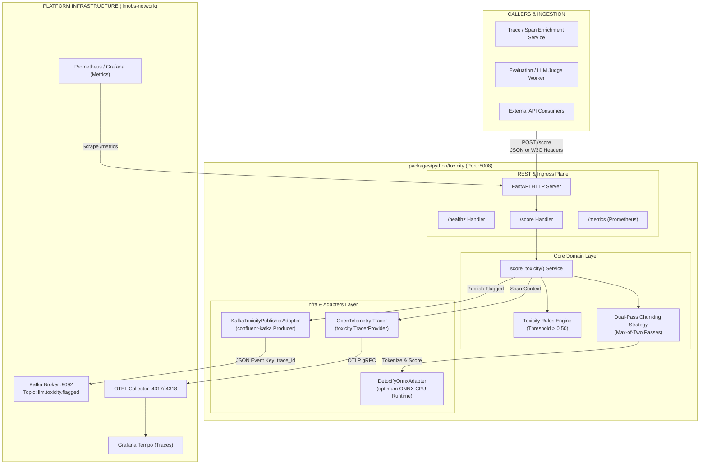
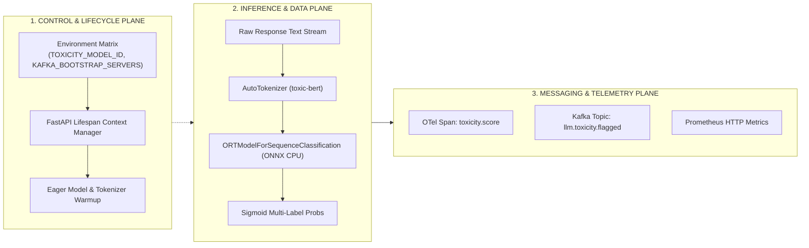
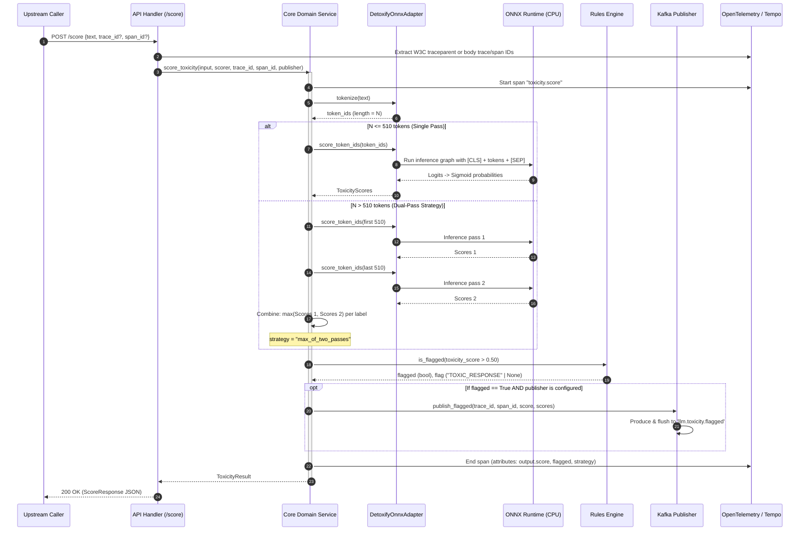

# Toxicity Service — High-Level Design (HLD) & Low-Level Design (LLD)

| Field | Value |
|---|---|
| **Package** | `packages/python/toxicity` |
| **Version** | `0.2.0` |
| **Architecture Pattern** | Hexagonal Architecture (Ports & Adapters) + Clean Domain-Driven Design |
| **Status** | Production-Ready (Merged Single Package) |

---

## 1. High-Level Design (HLD)

### 1.1 System Context & Macro Topology

The **Toxicity Service** is the multi-label NLP safety classification engine in the LLM Observability Platform. It classifies generated texts across 6 toxicity categories (`toxicity`, `severe_toxicity`, `obscene`, `threat`, `insult`, `identity_hate`) using an ONNX-optimized `unitary/toxic-bert` model on CPU.

It serves two operational modalities:
1. **Stateless Scoring Engine (Worker Mode)**: Synchronous high-throughput REST API called by trace enrichment engines and evaluation pipelines.
2. **Safety Event Publisher (Orchestrator Mode)**: Automatically emits flagged toxic payloads to Kafka (`llm.toxicity.flagged`) when toxicity threshold is breached.



---

### 1.2 Multi-Plane Architectural Topology



---

### 1.3 End-to-End Sequence Diagram



---

## 2. Low-Level Design (LLD)

### 2.1 Hexagonal Layer Boundaries & File Inventory

```
packages/python/toxicity/
├── src/
│   ├── core/domain/                     # PURE DOMAIN LAYER (Zero 3rd-party framework deps)
│   │   ├── ports/
│   │   │   ├── toxicity_scorer_port.py    # Inbound / Outbound Scorer Protocol
│   │   │   └── toxicity_publisher_port.py # Outbound Event Publisher Protocol
│   │   ├── rules.py                       # Business rules, thresholds, flag constants
│   │   ├── service.py                     # Primary domain orchestration service
│   │   └── types.py                       # Domain value objects & dataclasses
│   ├── infra/adapters/                  # INFRASTRUCTURE LAYER
│   │   ├── detoxify_onnx_adapter.py       # ONNX Runtime model adapter & warmup
│   │   └── kafka_publisher_adapter.py     # Confluent-Kafka producer adapter
│   ├── api/rest/v1/                     # INGRESS / INTERACTION LAYER
│   │   ├── app.py                         # FastAPI application factory & lifespan
│   │   ├── router.py                      # Router aggregator
│   │   └── handlers/
│   │       ├── health.py                  # Liveness & readiness probes
│   │       └── score.py                   # Toxicity evaluation handler
│   └── shared/tracing/                  # CROSS-CUTTING CONCERNS
│       └── tracer.py                      # OpenTelemetry tracing helper
```

---

### 2.2 Domain Data Contracts & Types (`core/domain/types.py`)

```python
@dataclass(frozen=True)
class ToxicityInput:
    text: str

@dataclass(frozen=True)
class ToxicityScores:
    toxicity: float          # General toxicity probability [0.0, 1.0]
    severe_toxicity: float   # Highly aggressive / hateful content
    obscene: float           # Vulgarity / profanity
    threat: float            # Physical harm or intimidation
    insult: float            # Disparaging or derogatory language
    identity_hate: float     # Hate speech targeted at protected groups

@dataclass(frozen=True)
class ToxicityResult:
    scores: ToxicityScores
    long_response_strategy: str | None = None  # None or "max_of_two_passes"
    score: float | None = None                 # Primary score (same as scores.toxicity)
    flagged: bool = False                      # True if score > 0.50
    flag: str | None = None                    # "TOXIC_RESPONSE" or None
    skipped: bool = False                      # True if pipeline failure caught gracefully
    skip_reason: str | None = None             # "pipeline_failure" or None
```

---

### 2.3 Port Protocols (`core/domain/ports/`)

#### Scorer Port:
```python
class ToxicityScorerPort(Protocol):
    def tokenize(self, text: str) -> list[int]:
        """Convert raw input text into model-specific integer token IDs."""
        ...

    def score_token_ids(self, token_ids: list[int]) -> ToxicityScores:
        """Run forward model inference against token sequence and return multi-label probabilities."""
        ...
```

#### Publisher Port:
```python
class ToxicityPublisherPort(Protocol):
    def publish_flagged(
        self, trace_id: str, span_id: str, score: float, scores: ToxicityScores
    ) -> None:
        """Publish flagged toxic span event to message broker."""
        ...
```

---

### 2.4 Mathematical Dual-Pass Formulation

For an arbitrary token sequence $T = [t_1, t_2, \dots, t_N]$:

$$\text{Scores}(T) = 
\begin{cases} 
f_{\text{ONNX}}(T) & \text{if } N \le 510 \\
\max\Big(f_{\text{ONNX}}(T[1:510]),\; f_{\text{ONNX}}(T[N-509:N])\Big) & \text{if } N > 510 
\end{cases}$$

Where:
- $f_{\text{ONNX}}(S) = \sigma(\mathbf{W} \cdot \text{Encoder}([CLS] \oplus S \oplus [SEP]) + \mathbf{b})$
- $\max(\mathbf{u}, \mathbf{v})_i = \max(u_i, v_i)$ element-wise $\forall i \in \{1, \dots, 6\}$

This guarantees that toxic prefixes or toxic suffixes in long generations are never masked by safe intermediate text.

---

### 2.5 Failure Modes & Circuit Breakers

| Failure Scenario | Component | Detection | Mitigation & Behavior |
|---|---|---|---|
| **Tokenizer / Model Crash** | `DetoxifyOnnxAdapter` | Unhandled `Exception` in inference | Caught by `service.py`; records exception on OTel span; returns `skipped=True, skip_reason="pipeline_failure"`; API returns `200 OK` with neutral scores to prevent cascading upstream failures. |
| **Kafka Broker Down** | `KafkaToxicityPublisherAdapter` | `KafkaException` or timeout on `flush()` | Publisher is non-blocking with local buffer; errors are logged without breaking `/score` HTTP response. |
| **Cold Container Latency** | `FastAPI Lifespan` | Slow first request | Eager `warmup()` runs dummy inference on container start before health check reports ready. |
| **Missing Kafka Configuration** | `app.py` | `KAFKA_BOOTSTRAP_SERVERS` is empty/unset | Adapter initializes with `bootstrap_servers=None` and behaves as a silent no-op (Worker Mode). |

---

### 2.6 Observability & Metric Telemetry

- **OpenTelemetry Span**: `toxicity.score`
  - Attributes: `input.length`, `output.score`, `output.flagged`, `output.strategy`, `skipped`, `skip_reason`.
  - Context Propagation: Extracts W3C `traceparent` or custom header/body IDs.
- **Prometheus Metrics** (`/metrics` endpoint via `prometheus-client`):
  - HTTP request duration, status codes, request count.
